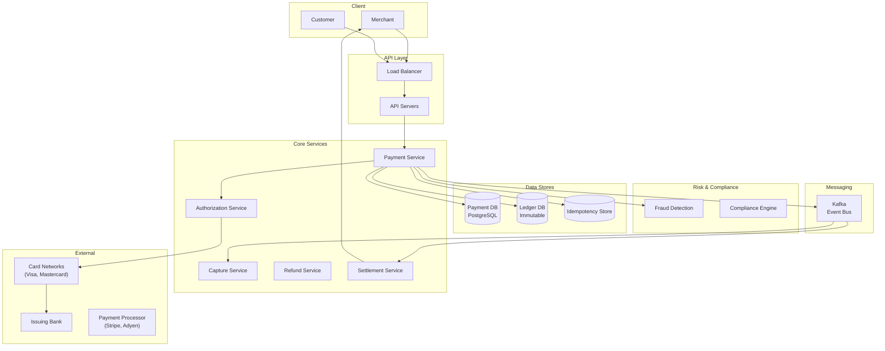
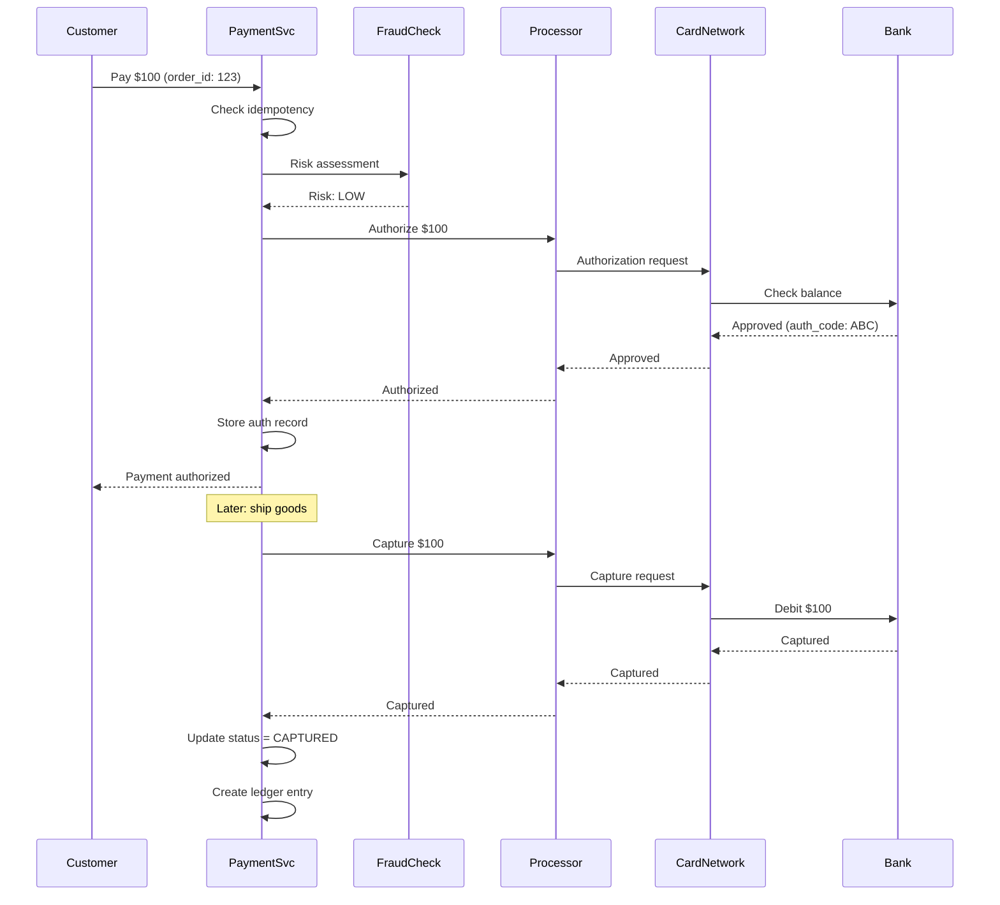
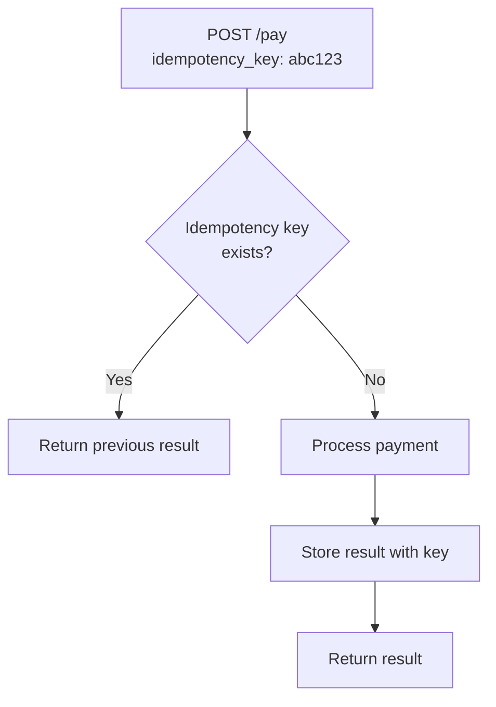
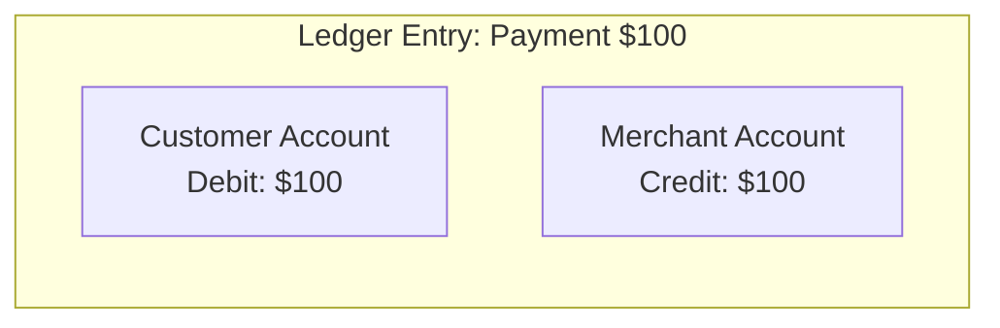
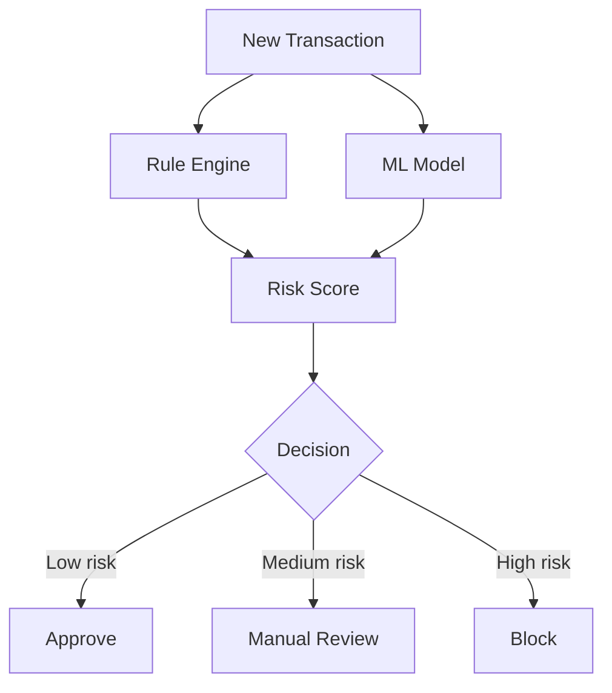
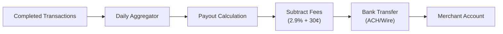
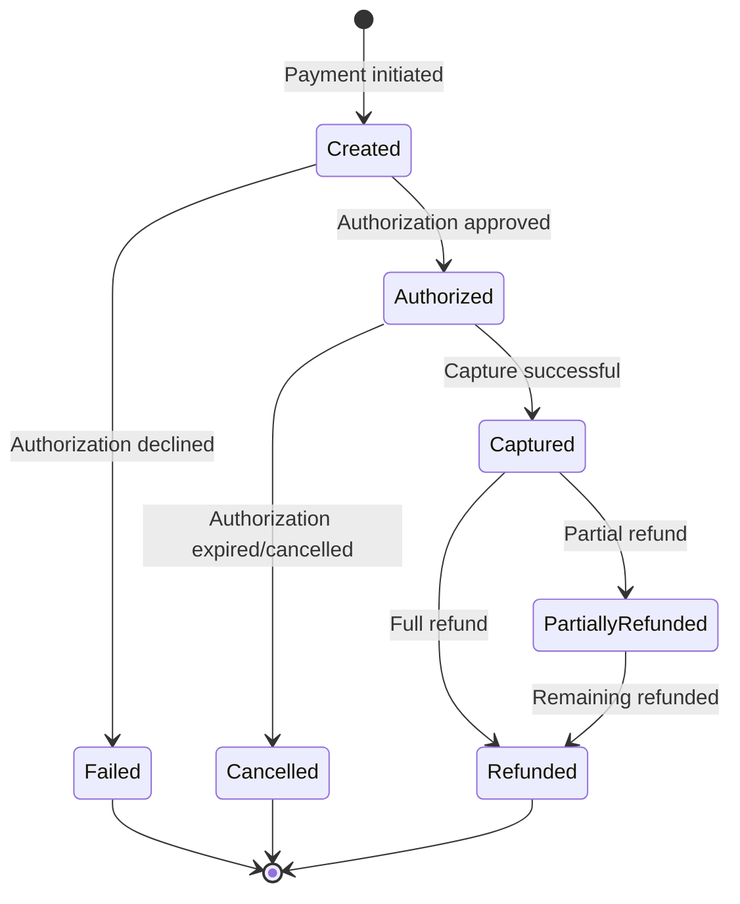

# Design a Payment System

## Overview

A payment system processes financial transactions between buyers and sellers. It must guarantee exactly-once processing, handle idempotency, support multiple payment methods, and maintain strict consistency. Payment systems like Stripe, PayPal, and Square handle billions of dollars in transactions annually.

## Requirements

### Functional
- Accept payments (credit card, debit card, bank transfer, digital wallets)
- Process refunds
- Support multiple currencies
- Merchant payouts (settlement)
- Transaction history and receipts
- Fraud detection
- PCI DSS compliance

### Non-Functional
- **Scale**: 100K+ transactions/second (peak), billions/year
- **Latency**: Payment authorization < 2 seconds
- **Consistency**: Exactly-once processing (no double charges, no lost payments)
- **Availability**: 99.999% (financial system)
- **Security**: PCI DSS Level 1 compliance, encryption at rest and in transit
- **Auditability**: Complete transaction log for every state change

## Architecture



## Deep Dive: Payment Flow

### Two-Step Payment (Auth + Capture)



**Why two-step?**
- **Authorization**: Verifies the customer has funds and reserves the amount
- **Capture**: Actually transfers the money (after goods are shipped)
- Allows merchants to capture less than authorized (partial capture)
- Authorization expires if not captured (typically 7-30 days)

## Deep Dive: Idempotency

**Critical requirement**: If the customer clicks "Pay" twice (or the request is retried), they should not be charged twice.



**Implementation:**
```python
def process_payment(request, idempotency_key):
    # Check if we've seen this key before
    existing = idempotency_store.get(idempotency_key)
    if existing:
        return existing.result  # Return cached result
    
    # Process payment
    result = charge_customer(request)
    
    # Store result
    idempotency_store.set(idempotency_key, result, ttl=24h)
    
    return result
```

**Idempotency key**: A unique identifier (UUID) generated by the client for each payment attempt.

## Deep Dive: Double-Entry Ledger

Every financial system uses double-entry bookkeeping:



**Ledger entry:**
```json
{
    "transaction_id": "txn_abc123",
    "entries": [
        {"account": "customer_123", "debit": 100.00, "currency": "USD"},
        {"account": "merchant_456", "credit": 100.00, "currency": "USD"}
    ],
    "timestamp": "2024-01-15T10:30:00Z",
    "type": "PAYMENT",
    "status": "COMPLETED"
}
```

**Ledger rules:**
- **Immutable**: Entries can never be modified or deleted
- **Balanced**: Total debits must equal total credits
- **Append-only**: New entries for corrections (reversals, refunds)

## Deep Dive: Fraud Detection



**Fraud signals:**
- Velocity checks (too many transactions in short time)
- Geographic anomalies (card used in two countries simultaneously)
- Device fingerprinting
- Amount anomalies (unusually large transaction)
- Behavioral patterns (different from user's normal behavior)

## Deep Dive: Settlement

Settlement is the process of transferring funds from the payment system to the merchant.



**Settlement flow:**
1. Aggregate all captured transactions for the merchant per day
2. Calculate fees (percentage + fixed)
3. Initiate bank transfer (ACH for US, SEPA for Europe)
4. Merchant receives funds in 1-3 business days

## Deep Dive: State Machine



## Scalability

| Component | Strategy |
|-----------|---------|
| API servers | Horizontal, stateless |
| Payment DB | PostgreSQL with read replicas, sharded by merchant_id |
| Ledger | Append-only, partitioned by time |
| Idempotency | Redis with TTL |
| Fraud detection | Real-time ML (low latency) + batch rules |
| Settlement | Batch processing (daily) |
| Event bus | Kafka for async processing |

## Trade-Offs

| Decision | Benefit | Cost |
|----------|---------|------|
| Two-step auth+capture | Flexibility, prevents overselling | More complex flow |
| Idempotency keys | No double charges | Storage overhead |
| Double-entry ledger | Auditability, correctness | More complex writes |
| Async settlement | Decouples payment from payout | Delayed merchant funds |
| PostgreSQL over NoSQL | Strong consistency, ACID | Lower write throughput |

## Interview Tips

1. **Start with idempotency** — "The most critical requirement is that customers are never double-charged"
2. **Explain auth + capture** — two-step payment for flexibility
3. **Discuss the ledger** — double-entry, immutable, append-only
4. **Mention fraud detection** — rule engine + ML model, real-time scoring
5. **Talk about PCI DSS** — tokenization, encryption, never store raw card numbers
6. **Don't forget settlement** — daily aggregation, fee calculation, bank transfer
7. **Discuss state machine** — created → authorized → captured → settled

## Key Takeaways

- Payment systems use two-step processing: authorization (verify funds) + capture (transfer funds).
- Idempotency is critical: unique keys per payment attempt prevent double charges.
- Double-entry ledger: immutable, balanced (debits = credits), append-only for corrections.
- Fraud detection: real-time rule engine + ML model for risk scoring.
- Settlement: daily aggregation of captured transactions, minus fees, transferred to merchant.
- PostgreSQL for strong consistency; Kafka for async event processing.
- PCI DSS compliance: tokenization, encryption, never store raw card data.

## Cross-References

- [Notification System](./notifications.md)
- [Consistency Patterns](./consistency-patterns.md)
- [Availability Patterns](./availability-patterns.md)
- [Stock Exchange](./stock-exchange.md)
- [Real-World: Uber](./real-world/uber.md)
- [DBMS Transactions](../../dbms/transactions/acid.md)
- [DBMS Distributed](../../dbms/transactions/distributed.md)
- [Cloud AWS](../../cloud/aws/README.md)
