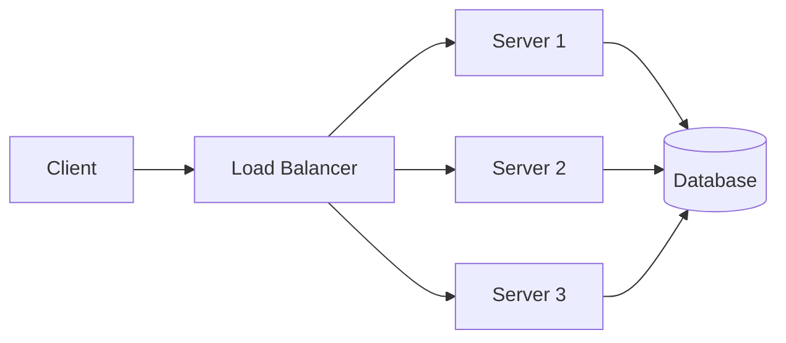

# Performance vs Scalability

## Overview

Performance and scalability are two fundamental concepts in system design that are often confused. Understanding the difference is critical for making correct architectural decisions and for answering system design interview questions clearly.

**Performance** is about how fast a single request is handled. **Scalability** is about how the system behaves as load increases.

## Key Definitions

### Performance
- Measured by **latency** (time per request) and **throughput** (requests per second)
- A service is **performant** if it responds quickly under a given load
- Focus: speed of individual operations

### Scalability
- Measured by how performance changes as resources or load increase
- A service is **scalable** if adding resources proportionally increases capacity
- Focus: behavior under growing load

## The Core Distinction

> If you have a **performance** problem, your system is slow for a single user.
> If you have a **scalability** problem, your system is fast for a single user but slow under heavy load.

This distinction from Martin Abbott and Michael Fisher's *Scalability Rules* is one of the most cited principles in system design.

## Performance vs Scalability at a Glance

| Aspect | Performance | Scalability |
|--------|-------------|-------------|
| Question | How fast is one request? | How does speed hold up under load? |
| Metric | Latency (p50, p99), throughput | Throughput per node, latency at N users |
| Bottleneck | CPU, I/O, algorithm complexity | Coordination overhead, contention, hotspots |
| Fix | Optimize code, caching, indexing | Horizontal scaling, sharding, async processing |

## When to Optimize Which

### Prioritize Performance When:
- User-facing latency SLAs are being violated
- A single operation is unacceptably slow (e.g., a database query taking 5s)
- You're optimizing a critical path (checkout, search)

### Prioritize Scalability When:
- You expect traffic to grow 10x–100x
- Current architecture has a single bottleneck (e.g., one database)
- You need to serve multiple regions

## Scaling Strategies

### Vertical Scaling (Scale Up)
- Upgrade CPU, RAM, SSD on existing machines
- Pros: Simple, no code changes
- Cons: Hardware limits, single point of failure, cost curve is exponential

### Horizontal Scaling (Scale Out)
- Add more machines behind a load balancer
- Pros: Theoretically unlimited, fault-tolerant
- Cons: Requires stateless services, distributed coordination, consistency challenges

## Common Anti-Patterns

1. **Premature optimization** — optimizing before you know the bottleneck
2. **Scaling the wrong layer** — adding app servers when the DB is the bottleneck
3. **Ignoring tail latency** — p99 is great, but p99.9 matters for large-scale systems
4. **Stateful horizontal scaling** — sessions in local memory break with multiple servers

## Trade-Offs

| Decision | Performance Gain | Scalability Cost |
|----------|-----------------|-----------------|
| In-memory caching | Huge latency reduction | Cache invalidation complexity |
| Database replication | Read throughput up | Write consistency challenges |
| Async processing | Request latency down | Eventual consistency, debugging harder |
| Microservices | Independent scaling | Network overhead, distributed tracing |

## Interview Tips

1. **Start with the distinction** — explicitly state whether the problem is about performance or scalability (usually both, but prioritize correctly)
2. **Quantify** — "The system needs to handle 10M DAU with <200ms p99 latency"
3. **Identify the bottleneck** — is it CPU-bound, I/O-bound, or network-bound?
4. **Scale the bottleneck first** — don't add app servers if the database is the constraint
5. **Mention trade-offs** — every scaling decision has a cost (consistency, complexity, cost)

## Key Takeaways

- Performance = speed of one request. Scalability = speed under load.
- Vertical scaling is simpler but has a ceiling. Horizontal scaling is complex but limitless.
- Always profile before optimizing. Measure, don't guess.
- Most real-world systems need both: fast individual requests that stay fast as traffic grows.

## Cross-References

- [Latency vs Throughput](./latency-vs-throughput.md)
- [Latency Numbers](./latency-numbers.md)
- [Load Balancing](./hld/load-balancing-design.md)
- [Scalability](./hld/scalability.md)
- [Cloud Overview](../../cloud/overview.md)

