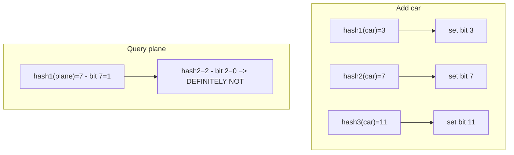
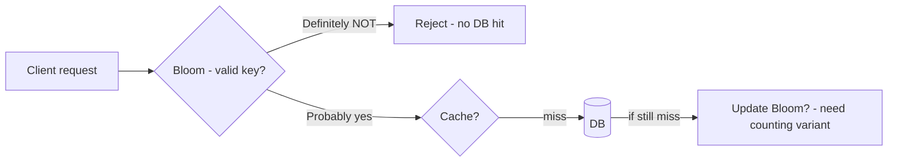
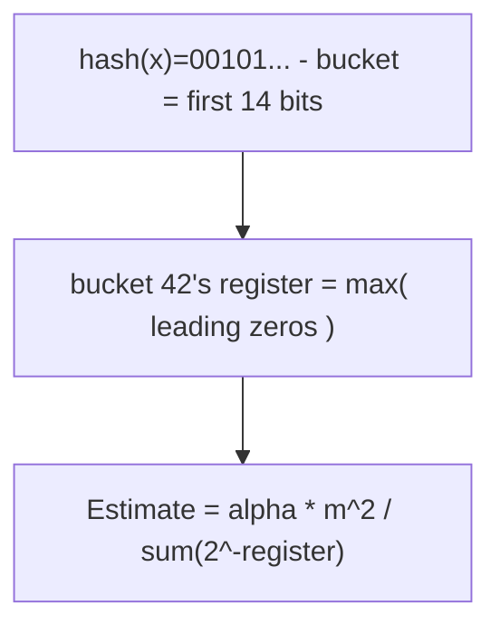
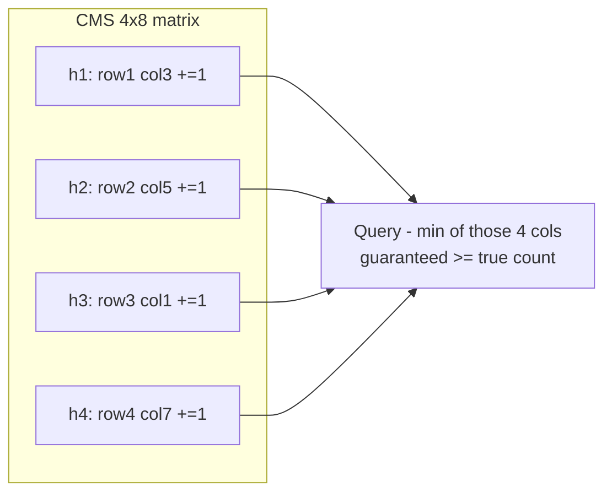
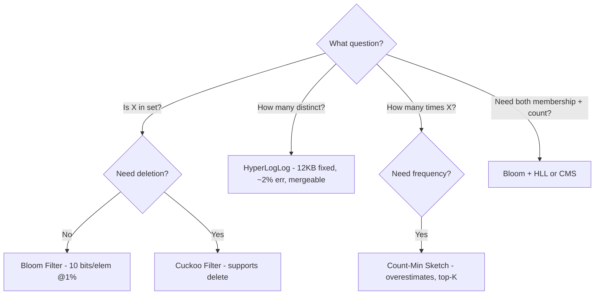

# Probabilistic Data Structures — Bloom Filter, HyperLogLog, Count-Min Sketch

## Overview

In system design interviews you often face: "How to check if URL was crawled among 10B URLs without 80GB RAM?" or "How to count unique visitors with 12KB?" Exact data structures (HashSet, HashMap) are **O(n) space**. **Probabilistic data structures** trade exactness for **10-100x memory savings** with **mathematically bounded error**. They never lie in one direction and are mergeable, parallelizable.

Three workhorses you must know:

| Question | Structure | Error type | Memory typical | Used in |
|----------|-----------|------------|----------------|---------|
| **Is X in set?** | Bloom Filter | False positives only, no false negatives | ~10 bits/elem @1% FPR | Cassandra, Bigtable, Chrome safe-browsing |
| **How many distinct X?** | HyperLogLog | ~2% relative error | 12 KB fixed regardless of n | Redis PFADD, BigQuery, Spark |
| **How many times X appeared?** | Count-Min Sketch | Overestimates only, never under | O(1/ε log 1/δ) counters | Flink, network heavy hitters, ad-tech |

> For exact membership you'd use hash set (8+ bytes per element + overhead). For 1B elements with 1% false positive, Bloom needs 1.2 GB vs 8+ GB HashSet.

## Bloom Filter

### Idea

Bit array `m` bits, all 0, plus `k` hash functions `h1..hk` uniformly mapping to `[0,m)`.

- **Add(x)**: for each `hi(x)` set bit to 1
- **Query(x)**: if all `hi(x)` bits are 1 → **probably yes** (may be false positive), if any bit 0 → **definitely not** (no false negatives ever)



### False Positive Rate — Sizing

Optimal `k = (m/n) ln 2`, false positive rate `p = (1 - e^{-kn/m})^k`.

For target `p`, bits per element:

| Target p | Bits/elem | k |
|----------|-----------|---|
| 1% | 9.6 | 7 |
| 0.1% | 14.4 | 10 |
| 0.01% | 19.2 | 14 |

Example: 1B URLs, 1% FPR → `1e9 * 9.6 bits = 1.2 GB`. HashSet with 1B strings (~50 bytes each) → >50 GB + overhead.

Implementation:

```python
# Minimal self-contained Bloom (no deps)
import math, mmh3  # use murmur3, xxhash non-crypto fast
class Bloom:
    def __init__(self, n, p=0.01):
        self.m = int(-n * math.log(p) / (math.log(2)**2))
        self.k = max(1, int((self.m/n) * math.log(2)))
        self.bits = bytearray((self.m+7)//8)
    def _hashes(self, x):
        # double hashing trick
        h1 = mmh3.hash(x, 0) % self.m
        h2 = mmh3.hash(x, 42) % self.m
        for i in range(self.k):
            yield (h1 + i*h2) % self.m
    def add(self, x):
        for h in self._hashes(x): self.bits[h//8] |= 1 << (h % 8)
    def __contains__(self, x):
        return all(self.bits[h//8] & (1 << (h % 8)) for h in self._hashes(x))
```

Production: use Guava `BloomFilter`, Redis `BF.ADD`, Cassandra's per-SSTable bloom.

### When To Use — Interview Pattern

Whenever you need to **avoid expensive lookup for non-existent keys**:



Use cases:

- **DB query optimization**: Cassandra per SSTable Bloom — skip SSTable if bloom says key not present → 90%+ disk I/O saved
- **Cache penetration prevention**: Bloom of all valid keys rejects random key attacks that would flood DB
- **Web crawler dedup**: 10B URLs visited check — HashSet 500GB, Bloom 12GB @1% FPR
- **Chrome Safe Browsing**: 30M malicious URLs in Bloom locally, only on positive hit query server (privacy + latency)
- **CDN**: check if object in edge cache without querying edge

Pitfall: Bloom **doesn't support deletion** (bits shared). Need **Counting Bloom** (counters) or **Cuckoo Filter** (supports delete, slightly more space, no false negatives but limited false positive, better locality).

## HyperLogLog — Distinct Counting

### Problem

Count unique visitors, unique IPs, `COUNT(DISTINCT col)` without `O(n)` memory. Exact needs HashSet.

Observation: hash uniformly. Probability hash starts with `k` leading zeros = `1/2^k`. If you see max 20 leading zeros, you've probably seen ~2^20 distinct values.

HLL improves accuracy by **m=16384 registers**, each storing max leading zeros for its bucket (based on first bits of hash). Estimate = harmonic mean + bias correction.



Properties:

- **12 KB fixed** regardless of n (with p=14 → 2^14=16384 registers * 6 bits)
- **~0.81% standard error** with 16384 registers (`1.04 / sqrt(m)`)
- **Mergeable**: HLLs merge via `max(register)` per bucket — `PFMERGE` for daily → weekly unique
- **Redis**: `PFADD hll 1.2.3.4`, `PFCOUNT hll` → estimate

Example: Google BigQuery `APPROX_COUNT_DISTINCT(col)` uses HLL internally for 100M rows scan without shuffling all distinct values.

## Count-Min Sketch — Frequency Estimation

### Problem

Stream: millions events/sec (search queries, IPs). Want **how many times X appeared**, heavy hitters (top-K). HashMap `O(n)` counters.

CMS: `d x w` matrix of counters, `d` pairwise independent hashes.

- **Add(x, c)**: for each row `i`, `matrix[i][h_i(x)] += c`
- **Query(x)**: `min(matrix[i][h_i(x)] for i in rows)` — overestimates, never underestimates, because other keys colliding increase counter, never decrease.



Error bound: with `w = e/ε`, `d = ln(1/δ)`, estimate ≤ true + ε*N with probability ≥1-δ. Example: ε=0.001 (0.1% of total stream), δ=0.01 (99% confidence) → w=2720, d=5 → 13.6k counters × 8 bytes = ~109KB regardless of stream length.

Use cases:

- **Heavy hitters / Top-K**: maintain min-heap of CMS counts to find trending searches, DDoS src IPs
- **Network analytics**: per-flow packet counts for 10M flows without 10M counters
- **Join selectivity**: DB optimizer estimates frequency without scanning
- **Flink/Spark streaming**: windowed frequency with mergeable sketches (cell-wise add)

CMS + Bloom complementary: Bloom answers "is it present?" then CMS answers "how many times?".

## Decision Framework — Interview Ready



**Cost analysis talking point**:

- For 1B 64-bit IDs, HashSet 8GB (8 bytes per id + overhead 2x) ~16GB RAM → $200/month. Bloom 1.2GB @1% FPR → $15/month. False positive cost: 1% * QPS * DB lookup cost. If DB lookup $0.001 and QPS 1000, FP cost = 10 *0.001=$0.01/s . Trade-off clearly favors Bloom.

## Production Implementations

| System | Structure | Config |
|--------|-----------|--------|
| **Cassandra** | Bloom per SSTable | `bloom_filter_fp_chance=0.01` |
| **Redis** | Bloom via `BF.*`, HLL via `PFADD/PFCOUNT` | `PFADD key elem`, `BF.RESERVE key 0.01 1000000` |
| **BigTable / HBase** | Bloom for block skipping | Row vs RowCol bloom |
| **Chrome** | Bloom for Safe Browsing | 30M URLs, 1% FPR local |
| **Spark** | `BloomFilter` in `spark-sketch` | `df.stat.bloomFilter(col, expectedNum, fpp)` |
| **Flink** | Count-Min Sketch for heavy hitters | `DataStream.keyBy().countWindow().aggregate(CMS)` |

## Interview Q&A

**Q: Why no false negatives in Bloom?**
If you added element, you set k bits to 1. Query checks those k bits — they must be 1 (unless overwritten, which never happens). So if query says not present (any bit 0), you definitely never added it.

**Q: Bloom filter size for 10B items, 0.1% FPR?**
`m = -n ln p / (ln2)^2 = -1e10 * ln 0.001 /0.480 = ~14.4e10 bits = 18 GB`. Wait p=0.001: bits per elem 14.4, so 14.4*1e10/8=18GB. HashSet would be >500GB. So still 28x saving.

**Q: How to handle deletion in Bloom?**
Use Counting Bloom (4-bit counters per cell instead of 1 bit) → add increments, delete decrements, but 4x memory and still may overflow. Or use Cuckoo Filter — stores fingerprint in cuckoo hash table, supports delete, better space for <3% FPR, but fails when full.

**Q: When to choose HLL over exact distinct?**
When exact distinct would require shuffle of all distinct keys across network (expensive) and approximate 2% error is acceptable (analytics dashboards, unique visitor reporting). For billing, use exact.

**Q: CMS never underestimates — why?**
Because counters only increment on collisions, never decrement (except custom). So min across rows includes at least true count plus possible extra from other keys colliding same cell. Minimum reduces collision impact but still ≥ true.

**Q: Can you combine Bloom + CMS + HLL?**
Yes — typical pipeline: Bloom to filter non-existent keys (prevent cache penetration), CMS to count frequency and find heavy hitters, HLL to count distinct users affected. Example: trending search — Bloom checks if query is valid (not random), CMS tracks frequency, HLL tracks unique users searching it.

## Common Pitfalls

- Using crypto hash (SHA-256, 500ns) vs non-crypto (Murmur3, xxHash, 20ns) — Bloom needs fast hash, cryptographic property not needed
- Underestimating n — FPR degrades exponentially after capacity exceeds design. Always overestimate expected elements by 20%
- Not monitoring saturation — Bloom with 50% bits set has high FPR; add metric for fill rate, rebuild when >40%
- Forgetting mergeability — HLL and CMS are mergeable (max or sum), Bloom merge via OR — enables parallel building and time-window rollup

## Cross-References

- [Cache Coherence](../../arch/memory-hierarchy/coherence.md) / [Caching Strategy](./hld/caching-strategy.md) — negative cache pattern
- [Redis](../../backend/messaging/redis.md) — PFADD, BF.ADD in production
- [Kafka](../../backend/messaging/kafka.md) — heavy hitters for stream processing
- [Database Internals](../../dbms/internals/lsm-trees.md) — SSTable bloom in LSM
- [Scalability](./hld/scalability.md) — memory vs CPU trade-offs

## References

- Cormode, Muthukrishnan — "An Improved Data Stream Summary: The Count-Min Sketch and its Applications" [Rutgers]
- Flajolet et al. — HyperLogLog: the analysis of a near-optimal cardinality estimation algorithm (2007) [INRIA]
- Bloom Filters — System Design Interview Guide: Why & When to Use, Space Savings 90-95% [layrs.me][TECHINTERVIEW.ORG]
- Probabilistic Data Structures: Theory Behind Bloom, HLL, CMS, Python examples [Java Code Geeks][DZONE]
- Redis Bloom & HyperLogLog docs: https://redis.io/docs/latest/commands/pfadd/ and BF.ADD
