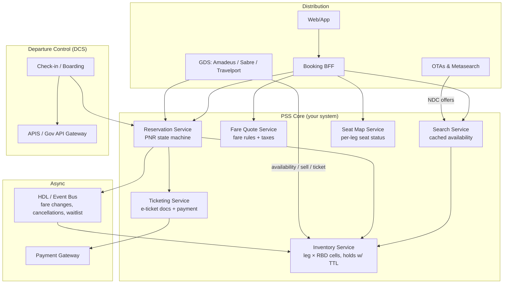
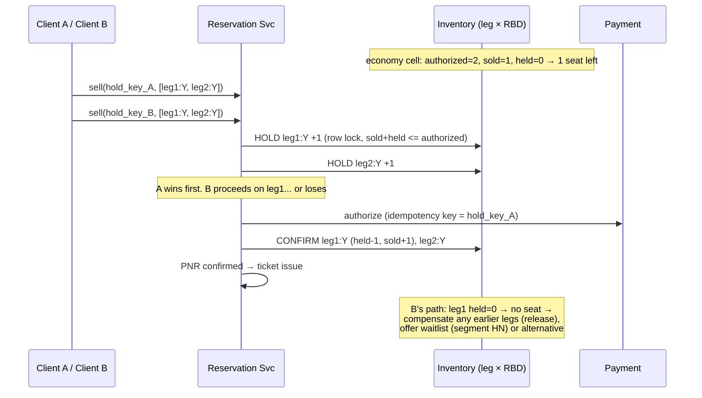

# Design an Airline Reservation System

## Problem Statement

Design the booking backbone of an airline: search flights, quote fares, hold seats, create bookings, ticket them, and get the passenger onto the aircraft — while guaranteeing that **the same seat is never sold twice** under fully concurrent global traffic, and while integrating with legacy Passenger Service Systems (PSS), Global Distribution Systems (GDS: Amadeus, Sabre, Travelport), and airport departure control systems.

The honest framing interviewers reward: an airline reservation system is **small data with brutal coordination**. Total booking data for even a top-20 carrier is under a terabyte a year — the difficulty is not scale of storage but (a) concurrency correctness on scarce inventory, (b) the multi-leg atomicity problem, and (c) high-latency external dependencies (GDS, payment, government APIs) that you do not control.

Related designs: [Payment System](./payment-system.md) (authorization/capture and idempotency on the payment leg), [Ride-Hailing](./ride-hailing.md) (matching + state machines on a different seat inventory), and the [Banking Ledger](../banking-ledger.md) (the discipline for the money-movement side of ticketing).

---

## Functional Requirements

1. **Search**: find flights by origin/destination/date across a sellable horizon (~330 days), with availability by cabin and fare family.
2. **Fare quote**: price an itinerary deterministically (base fare + taxes + surcharges per passenger type) and store it.
3. **Hold & book**: create a Passenger Name Record (PNR), reserve inventory on every segment, optionally assign seats, hold for a limited time.
4. **Ticket**: convert payment + held PNR into legally binding e-ticket documents.
5. **Post-booking**: modifications, cancellations, refunds, rebooking on disruption (IRROPS), waitlist promotion.
6. **Seat map**: browse and assign seats per leg (paid and free seats), with per-leg concurrency.
7. **Check-in & departure control**: check-in at T-24h, boarding passes, bag drop, APIS (advance passenger information) transmission to governments.
8. **Distribution**: expose inventory to GDS/OTA channels, or consume them if you are the OTA.

## Non-Functional Requirements

| Requirement | Target | Why |
|---|---|---|
| Booking consistency | Zero oversell beyond *planned* overbooking limits | Involuntary denied boarding is a regulated, compensated incident |
| Search latency | < 500 ms p99 | Search drives conversion; it is 99%+ of traffic |
| Booking-path latency | 1–10 s tolerated | External GDS/fare/PSS hops dominate; users accept it |
| Ticket issuance | Exactly-once | An e-ticket number is a legal financial document |
| Availability (booking) | 99.99% | Every minute down is direct revenue loss |
| Availability (check-in) | 99.99% under 20–50× daily spikes | T-24h opening creates synchronized bursts |
| Auditability | Years, immutable | Regulatory + dispute resolution |

---

## Capacity Estimation

Take a large carrier: **40M passengers/year**.

```
Passengers:          40M/year → 40M / 365 ≈ 110K passengers/day
PNRs:                avg 1.8 passengers per PNR → ~61K PNRs/day
Flight legs:         500 aircraft × 2.2 legs/day ≈ 1,100 legs/day (use 1,200)
Sellable horizon:    330 days → 1,200 × 330 ≈ 400K active legs

Inventory matrix:    400K legs × ~12 booking classes (RBDs) ≈ 4.8M active cells
                     → TINY. Fits in one well-partitioned OLTP cluster.
                     The problem is coordination, not volume.

Search:              search-to-book ratio ~1,000:1 → 61M searches/day
                     61M / 86,400 ≈ 705 QPS avg; diurnal peak 3× ≈ 2,100 QPS
Availability reads:  one search fans out to ~2 O&Ds × ~20 candidate legs
                     → 2,100 × 40 ≈ 84K leg-cell reads/sec at peak (cacheable)

Holds:               ~30% of bookings hold before ticketing → ~18K holds/day;
                     peak ~2 creates/sec — but concentrated on hot legs
                     (last economy seat, promo business class)

Tickets:             ~110K e-ticket documents/day (one per passenger coupon set)

Check-in burst:      morning bank covers ~25% of day's departures
                     → 27K passengers within 2h ≈ 4 check-ins/sec avg,
                     minute-scale peaks ~5× → ~20 QPS; each check-in triggers
                     5–10 internal calls + slow APIS submission (0.5–2 s)

Storage:             PNRs: 61K/day × 2 KB ≈ 120 MB/day
                     Tickets: 110K/day × 0.5 KB ≈ 55 MB/day
                     Fare-quote logs (1% of searches): ~0.6 GB/day
                     → under 1 GB/day of OLTP data. Bank-grade correctness,
                     boutique-scale data.
```

The two surprises to surface explicitly in an interview: the **inventory is 4.8M small cells** (not billions of rows), and the **hottest concurrency is per-leg**, i.e., contention is *skewed* — one viral fare on one flight makes one inventory cell the most contended row in the company while the rest idles.

---

## High-Level Architecture



The critical reality: **if you are the airline, the GDS is both a customer and a dependency.** Availability pushed to Amadeus/Sabre is read by travel agents and OTAs worldwide; a sell through that channel arrives with 200 ms–2 s round-trips, EDIFACT-era semantics, and asynchronous ticketing. Treat it as a first-class, flaky, slow external system with circuit breakers — not as an internal service.

---

## Data Model

### The core distinction: PNR ≠ Segment ≠ Ticket

This is the single biggest conceptual differentiator in interviews. Three different objects, three lifecycles:

| Object | What it is | Lifetime | State examples |
|---|---|---|---|
| **PNR** | The booking record: passengers + itinerary + contacts + SSRs + price quote | From hold until fully consumed/refunded | Optional → Confirmed → Canceled |
| **Segment** | One flight leg inside a PNR, with its own status | Per leg | HK (confirmed), HN (waitlisted), UC/UN (unable), NOSHOW |
| **Ticket** | The e-ticket document (13-digit number) — the *financial instrument* | Issued after payment; refundable/reissuable | Open → Issued → Used → Refunded |

A PNR can exist with no ticket (an unticketed hold with a **ticketing time limit** — literally a TTL). A PNR can have segments in *mixed states* (leg 1 confirmed, leg 3 waitlisted). One PNR can carry multiple tickets (split fare families), and a ticket is reissued on voluntary changes. If a candidate says "a flight booking is a row in a `bookings` table," they have missed the domain.

### Schema sketch

```sql
CREATE TABLE flight_legs (
  leg_id      BIGINT PRIMARY KEY,
  flight_no   CHAR(6) NOT NULL,
  dep_arpt    CHAR(3) NOT NULL, arr_arpt CHAR(3) NOT NULL,
  sched_dep   TIMESTAMPTZ NOT NULL, sched_arr TIMESTAMPTZ NOT NULL,
  aircraft_cfg SMALLINT NOT NULL           -- seat map config id
);

-- The time-series inventory matrix: one cell per (leg, booking class)
CREATE TABLE inventory_cells (
  leg_id       BIGINT NOT NULL,
  rbd          CHAR(1) NOT NULL,            -- Y, B, M, H, J, F ...
  authorized   SMALLINT NOT NULL,           -- MAY exceed physical seats (overbooking)
  sold         SMALLINT NOT NULL DEFAULT 0,
  held         SMALLINT NOT NULL DEFAULT 0, -- active TTL holds
  PRIMARY KEY (leg_id, rbd)
);

CREATE TABLE holds (
  hold_id      UUID PRIMARY KEY,
  idem_key     TEXT UNIQUE NOT NULL,        -- client-supplied, replay-safe
  pnr_id       BIGINT,
  legs_rbd     JSONB NOT NULL,              -- [(leg_id, rbd, qty), ...]
  expires_at   TIMESTAMPTZ NOT NULL
);

CREATE TABLE pnrs (...);                    -- passengers, contacts, SSRs
CREATE TABLE pnr_segments (
  pnr_id  BIGINT, leg_id BIGINT, rbd CHAR(1),
  status  CHAR(2) NOT NULL,                 -- HK / HN / UC
  PRIMARY KEY (pnr_id, leg_id)
);
CREATE TABLE tickets (
  et_number  CHAR(13) PRIMARY KEY,          -- e-ticket document number
  pnr_id     BIGINT NOT NULL,
  coupon_set JSONB NOT NULL,                -- per-segment fare basis codes
  status     TEXT NOT NULL,
  UNIQUE (pnr_id, pax_id)                   -- issuance exactly-once per passenger
);
```

### Fare basis and priceable units

A **fare basis code** (e.g., `QLX7AVFR`) encodes booking class, fare family, and rule applicability. The quote service composes fare *components* per leg and groups them into **priceable units** — round-trip excursion fares must be priced as a unit and cannot be split (half a round-trip fare is a nonsense object). The priced quote is stored as a **TST** (transitional stored ticket) attached to the PNR, and revalidated at ticketing ("price guard"): if the fare moved up within the hold window the airline generally honors the quote; the inventory *and the price* are both time-limited commitments.

---

## Deep Dive 1: The Hard Problem — No Double-Booking Under Concurrent Holds

### The booking flow is a saga, not a transaction



One economy seat on leg 2 of a multi-leg itinerary is contended by two users. Options:

**1. Two-phase commit across legs.** A coordinator asks each leg's inventory shard to *prepare* (lock the cell), then commits all. This gives an atomic multi-leg hold, and legacy shared-everything PSSs (built on IBM TPF) effectively behaved this way — one giant machine, one global serialization point. Costs: coordinator blocking on failure, 2×RTT latency on every booking, and shards that cannot release locks when a peer dies. **You rarely need it.**

**2. Saga with TTL holds (the industry answer).** Reserve legs sequentially with an idempotent `hold_key`; on failure, *compensate* the legs already held (release). The user-visible outcome is still all-or-nothing, because the failure window is short and holds expire. The key insight that makes a saga sufficient where a ledger needs atomicity: **an inventory hold moves no money**, so a hold that must be unwound is safe — unlike a debit. Compensation is cheap and idempotent (`held − 1` guarded at `≥ 0`).

**3. Lock ordering to kill deadlocks.** A multi-leg hold locks several `(leg_id, rbd)` rows in one transaction. Two itineraries in opposite orders deadlock. Fix is mechanical: **sort all cells by `leg_id` and lock in that order**, keep hold transactions short (< 10 ms), and let the conditional-update guard (`sold + held <= authorized`) do the real work.

**4. Hot-leg contention.** A viral fare makes one cell the hottest row in the system. Single-row conditional updates sustain a few thousand ops/sec in a tuned OLTP engine — far more than a single flight can realistically absorb — so the correct move is *not* to shard cleverly but to **serialize per cell deliberately** and put a fast-fail "sold out" path in front (a pre-check counter in cache that turns hopeless requests away in O(1)). This mirrors queue-serialization of hot inventory in e-commerce (see [Order Management](./order-management.md)).

### Waitlists

When the cell is full, the sell can still succeed as a **waitlisted segment** (`HN` status). A cancellation event on that leg triggers queue-serialized promotion. This is one of the cleanest examples of queue-as-inventory: the waitlist is a FIFO per leg, processed exactly-once per freed seat.

### Why airlines historically overbook

No-show rates run 2–10% and passengers misconnect. Selling 180 physical seats as 190 authorized is *planned* oversell — revenue management sets `authorized` per cell via bid-price controls, and the residual risk is handled at the gate with voluntary-denied-boarding auctions and regulated involuntary compensation. The system-design point: **the inventory's truth is `authorized`, not physical capacity**, and "zero oversell" is the wrong requirement — "no oversell beyond `authorized`" is the correct invariant. If your design treats the seat count as sacrosanct, you have modeled a theater, not an airline.

---

## Deep Dive 2: Caching Fares vs Never Caching Inventory Decisions

Split the read path by *decision quality*:

- **Search-tier availability is cacheable.** The list of flights shown after a search can be seconds-to-minutes stale; it feeds ranking, not commitment. Key by (origin, destination, date, cabin) with a short TTL and event-driven invalidation on sell-outs.
- **Fare quotes are cacheable, briefly.** Quote composition (fare rules + taxes) is CPU-heavy; cache by (O&D, dates, cabin, pax profile, currency) with TTLs of seconds to minutes, invalidated by fare-filing events. The quote presented to the user is a *candidate price*, revalidated at sell time.
- **Inventory decisions are never cached.** The sell/hold path must read the authoritative cell (or a single-writer in-memory cell manager backed by it). A cached "1 seat left" that survives 30 seconds is 30 seconds of guaranteed oversell. The rule: **cached counts drive browsing; authoritative counts drive selling.** This is the airline version of the checkout/write-path rule in [Database Design](../hld/database-design.md).

Seat maps are the subtle third case: the seat *template* per aircraft config is immutable and aggressively cacheable; seat *status* changes with every booking — cache status for rendering, but the assignment decision hits the authoritative store under a per-leg constraint (two passengers must not both take 14A; the seat map has the same concurrency shape as the inventory cell, at finer granularity).

---

## Deep Dive 3: Idempotency of Booking + Payment

Everything in the booking path is retried by clients, GDS gateways, and queues:

1. **Sell/hold**: client-generated `idem_key` with a database unique constraint on `holds.idem_key`. Replays return the original hold; the guard `sold + held ≤ authorized` is enforced *in the UPDATE*, not in a prior SELECT (a pre-check races — the same pattern as ledger idempotency in [Banking Ledger](../banking-ledger.md)).
2. **Payment authorization**: idempotency key = hold key, so a retry after a gateway timeout cannot double-authorize. Authorized-not-captured is the normal state; capture happens at ticketing (see [Payment System](./payment-system.md) for the auth/capture split).
3. **Ticket issuance must be exactly-once**: the e-ticket number is a legal document. Allocate issuance under the `UNIQUE (pnr_id, pax_id)` constraint; on timeout, the retry *queries before re-issuing* (check-under-lock, then insert). Duplicate issuance is not a bug report; it is a refund and an audit event.
4. **The limbo case**: payment captured but ticketing failed (GDS outage). Never silently refund; enqueue an auto-retry job with alarms, keep the PNR in `payment_received/ticket_pending`, and reconcile against the gateway's settlement file daily. This payment↔ticket reconciliation is the operational heart of the system.

---

## Deep Dive 4: Check-in Burst Load and Departure Control

Check-in opens T-24h for every flight, so *all yesterday's-equivalent departures spike simultaneously*, on top of daily booking traffic. QPS is modest (~20/sec at the morning bank) but:

- Each check-in fans out to PNR read, seat-map write, boarding-pass render (PDF/wallet pass), bag-drop, and **APIS transmission to government APIs** that run 0.5–2 s and rate-limit you.
- The spike is 20–50× the DCS service's idle baseline — it is a burst-profile problem, not a throughput problem: pre-warm, queue APIS submissions per flight with batching, make check-in idempotent (double-tap on "check in" must not duplicate), and shed auto-assigned seats before manual seat selections.
- Seat-map contention at check-in is *per flight*: one popular A380 opening at T-24h sees hundreds of seat selections within minutes on a single leg's seat-status store.

---

## Deep Dive 5: Selling Your Own Flights vs Being an OTA on the GDS

| Aspect | Airline (own PSS) | OTA (aggregating GDS) |
|---|---|---|
| Inventory authority | You own the cells | Federated reads over N GDSs, none authoritative to you |
| Sell latency | Local, ms-scale | 200 ms–2 s per GDS round-trip |
| Caching | Cache search/quote, never sell on cache | Caching is *mandatory* (you would drown the GDSs otherwise) |
| Atomicity | One saga across your legs | A hold spans **two systems**: your cart + the airline PSS via the GDS; the GDS can confirm availability then fail the sell |
| Ticketing | Direct | Placed on a GDS **queue** and ticketed asynchronously |
| Failure surface | Internal | Availability/sell/ticket can each fail independently; money held meanwhile → refund flows |

OTAs survive this with: aggressive offer caching (NDC's offer/order model was designed precisely to make cached offers resolvable asynchronously), pre-negotiated seat allotments from consolidators (sell from *your* allotment first, fall through to the GDS), and honest UX ("price confirmed, ticketing within 2h") backed by the same TTL-hold saga internally.

---

## Trade-offs

| Decision | Alternative | Why |
|---|---|---|
| Saga + TTL holds across legs | 2PC across inventory shards | Holds move no money, so compensation is safe; 2PC blocks on coordinator failure and doubles latency on every booking |
| Per-cell serialization, fast-fail sold-out path | Sharding the hot cell | One cell's realistic arrival rate is far below a row-lock's capacity; sharding inventories splits correctness to save throughput you don't need |
| Cache search + quote, never sell decisions | Cache availability end-to-end | Stale availability at sell time = guaranteed oversell; revalidation at sell is cheap |
| `authorized` > physical (overbooking) | Never oversell | No-shows are systematic; gate-level VDB auctions are the designed residual handler, not a failure |
| GDS as async, circuit-broken dependency | Treat GDS as internal service | GDS latency is 200 ms–2 s and it *will* hang; fallback behavior must be explicit (see [Avoiding fallback in distributed systems](https://aws.amazon.com/builders-library/avoiding-fallback-in-distributed-systems/)) |

---

## What Distinguishes a Strong Answer

**Junior answers typically:**
- Model a flight as **one row** with a `seats_left` counter — a guaranteed hotspot that also ignores booking classes entirely (there is no such thing as "an economy seat" in revenue management, only RBD cells with authorized limits).
- Treat the **fare as static** — miss that price is a function of booking-class availability, changes between quote and ticket, and is itself stored with TTL semantics.
- Ignore **seat-map concurrency** (two passengers taking 14A) and check-in bursts altogether.

**Mid-level answers add** TTL holds and a saga, but forget lock ordering (deadlocks on multi-leg holds), idempotency keys (double holds on retry), and the ticketing deadline as a system-enforced TTL rather than a cron afterthought.

**Senior answers:**
- Separate the four latencies: search (500 ms, cached), quote (revalidated), sell (authoritative, ms), ticket (async, exactly-once).
- Frame overbooking as `authorized` limits and denied-boarding regulation — inventory truth vs physical truth.
- Treat the GDS as the dominant latency and failure term, with circuit breakers and queue-based ticketing.
- Design the payment↔ticket **limbo state** explicitly with reconciliation, not hope.

---

## Key Takeaways

- PNR, segment, and e-ticket are three objects with three lifecycles; the ticket is the only legal financial document and must be issued exactly-once.
- Inventory is a small time-series matrix of (leg × booking class) cells — coordination and skew, not volume, is the challenge.
- Multi-leg holds are a saga with TTL and compensating releases, with `leg_id`-ordered locking; 2PC buys atomicity you do not need for money-free holds.
- Overbooking means `authorized > physical` by design; the invariant is "never sell beyond authorized."
- Cache search results and fare quotes; never make inventory or seat decisions from cached counts.
- The GDS/DCS layer dominates latency and failure modes; check-in bursts are a 20–50× daily spike on slow external government APIs.

## Cross-References

- [Payment System](./payment-system.md) — auth/capture split, idempotency keys on the payment leg.
- [Ride-Hailing](./ride-hailing.md) — matching and trip state machines; a different seat inventory.
- [Banking Ledger](../banking-ledger.md) — idempotent writes and check-under-lock patterns reused for ticketing.
- [Database Design](../hld/database-design.md) — where cached reads end and authoritative writes begin.
- [Rate Limiter](../rate-limiter.md) — protecting search endpoints from scraping (fare data is the product).

## References

- Wikipedia, "[Passenger service system](https://en.wikipedia.org/wiki/Passenger_service_system)" — decomposition of a PSS into inventory, reservation, and departure-control components.
- Wikipedia, "[Computer reservations system](https://en.wikipedia.org/wiki/Computer_reservations_system)" — history of SABRE/TPF-style shared-everything reservation platforms and GDS evolution.
- IATA, "[Airline Distribution](https://www.iata.org/en/programs/airline-distribution/)" and "[NDC](https://www.iata.org/en/programs/airline-distribution/ndc/)" — the offer/order model modernizing GDS distribution.
- Sabre, "[CreatePassengerNameRecord API](https://developer.sabre.com/rest-api/create-passenger-name-record/2.3.0)" — the canonical GDS PNR-creation contract, including itinerary/segment handling.
- Amadeus, "[Airline IT solutions](https://amadeus.com/en/industries/airlines)" — Altéa PSS suite (inventory, reservation, departure control) as a reference commercial architecture.
- AWS Builders' Library, "[Avoiding fallback in distributed systems](https://aws.amazon.com/builders-library/avoiding-fallback-in-distributed-systems/)" — why degraded behavior under GDS-style dependency failure must be explicit design, not accident.
