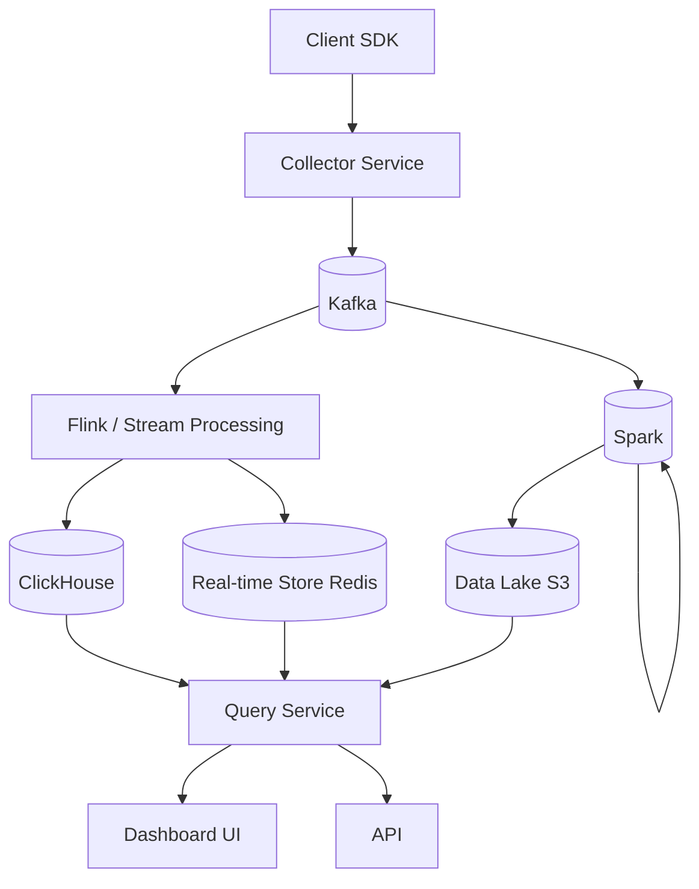

# System Design: Analytics Platform

## Problem Statement

Design an analytics platform that ingests events from web/mobile applications, processes them in real-time and batch, and provides dashboards and querying capabilities.

---

## Functional Requirements

1. Ingest events (page views, clicks, transactions, errors) from client applications
2. Real-time processing for live dashboards (seconds latency)
3. Batch processing for historical analysis and ML features
4. Query interface for ad-hoc analysis (SQL-like)
5. Dashboards with metrics, funnels, and cohort analysis
6. Data retention and partitioning
7. Access control per team/project

## Non-Functional Requirements

| Requirement | Target |
------------|--------|
| Ingestion throughput | 1M events/second |
| Query latency | < 5 seconds for dashboard queries |
| Data freshness | < 10 seconds for real-time |
| Retention | 2 years raw, 5 years aggregated |
| Availability | 99.9% |

---

## High-Level Architecture



---

## Key Deep Dives

### Event Ingestion

**Client SDK:**
- Batches events locally (max 50 events or 10 second flush)
- Sends to collector via HTTP POST or gRPC
- Handles offline buffering and retry with exponential backoff
- Auto-includes metadata: session ID, device info, timestamp, SDK version

**Collector Service:**
- Stateless, horizontally scalable
- Validates events against schema (JSON Schema or Protocol Buffers)
- Writes to Kafka with event type as partition key
- Returns 202 Accepted immediately

### Schema Registry

Events evolve over time. Use a schema registry (Avro or Protobuf):

- Backward compatibility: new optional fields, no removed fields
- Schema evolution with versioning
- Each team registers their event schemas

### Storage Layer Design

| Layer | Technology | Purpose | Retention |
-------|-----------|---------|----------|
| Hot | Redis + ClickHouse | Real-time dashboards | 7 days |
| Warm | ClickHouse (partitioned) | Interactive queries | 2 years |
| Cold | S3 (Parquet) | Batch analysis, ML | 5+ years |

### Real-Time Aggregation with Flink

Flink processes Kafka streams and maintains rolling aggregations:

- **Page views by URL** (1-minute tumbling windows)
- **Error rate by service** (5-minute sliding windows)
- **Active users** (session windows)
- **Funnel conversion rates** (custom event sequences)

Results written to Redis (hot) and ClickHouse (warm).

### Query Engine

- **ClickHouse** for analytical queries (columnar storage, vectorized execution)
- **Presto/Trino** for cross-source queries (ClickHouse + S3)
- Query timeout enforcement (max 60 seconds)
- Result caching for repeated dashboard queries

---

## Data Model

### Raw Event Schema (Protobuf)

```
message Event {
  string event_id = 1;
  string event_type = 2;  // page_view, click, purchase
  string user_id = 3;
  string session_id = 4;
  map<string, string> properties = 5;
  int64 timestamp = 6;
  map<string, string> context = 7;  // device, OS, app_version
}
```

### ClickHouse Table (Ordered by time)

```sql
CREATE TABLE events (
    timestamp DateTime,
    event_type LowCardinality(String),
    user_id UUID,
    session_id UUID,
    properties String  -- JSON
) ENGINE = MergeTree()
PARTITION BY toYYYYMM(timestamp)
ORDER BY (event_type, timestamp, user_id)
TTL timestamp + INTERVAL 2 YEAR;
```

---

## Scalability Discussion

- **Ingestion scaling:** Kafka partitions scale horizontally; collector is stateless
- **Storage scaling:** ClickHouse scales via sharding and replication; S3 is virtually unlimited
- **Query scaling:** ClickHouse distributed queries across shards; materialized views pre-aggregate

---

## Trade-offs

| Decision | Alternative | Trade-off |
----------|-----------|------------|
| ClickHouse | Elasticsearch | CH is faster for analytics; ES better for search |
| Protobuf | JSON | Protobuf is smaller and faster; JSON is more flexible |
| Flink | Spark Streaming | Flink has lower latency; Spark has simpler API |
| Materialized views | Query-time aggregation | MVs are faster to query; slower to ingest |

---

## Interview Questions

1. **How would you implement funnel analysis?** Track user sessions with ordered events. Use Flink to compute conversion rates between funnel steps in real-time. Store intermediate results in ClickHouse for historical funnels.

2. **How do you handle data quality?** Schema validation at ingestion, null checks, duplicate detection (event_id deduplication in Flink), data quality dashboards monitoring completeness and freshness.

3. **How do you handle GDPR data deletion?** Mark user data for deletion, anonymize in real-time stores, delete from data lake on next batch run. Implement a "right to be forgotten" pipeline.

---

## References

- [ClickHouse Documentation](https://clickhouse.com/docs/)
- [Apache Flink Documentation](https://flink.apache.org/docs/)
- [Snowflake Architecture](https://www.snowflake.com/)