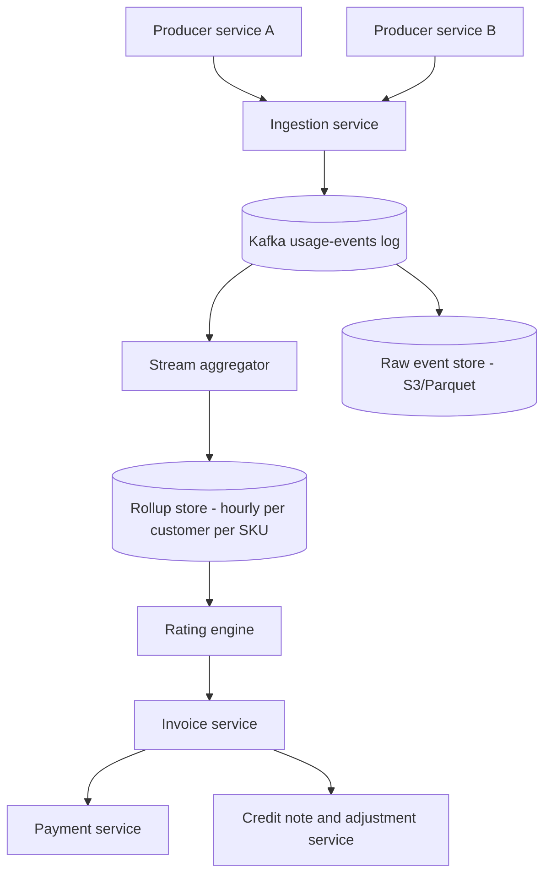

# Design a Usage Metering and Billing System

## Problem Statement

Design the system that turns raw product usage — API calls, storage GB-hours, seats, compute-seconds — into a correct monthly invoice and an eventual bank transfer. This is a usage metering and billing platform: the kind of infrastructure behind Stripe Billing, Metronome, Orb, Zuora, and every cloud provider's bill.

The framing that separates strong candidates from the rest: a billing system is **one system with two accuracy tiers**. Dashboards can tolerate 0.5% drift and 30-second staleness; invoices are financial documents where a single cent of systematic error compounds across millions of customers into restated revenue, customer disputes, and audit findings. Every architectural decision below — exactly-once ingestion, append-only corrections, draft-then-finalize invoicing, double-entry ledgers — exists to serve the strict tier while keeping the loose tier cheap.

Related designs: [Analytics Platform](./analytics-platform.md) (the generic event-ingestion architecture this page specializes for money), [Payment System](./payment-system.md) (collection and dunning on the outbound side), [Order Management](./order-management.md) (why billing is split from orders), and the [Banking Ledger](../banking-ledger.md) (the money-movement discipline the invoice finalizes into).

---

## Functional Requirements

1. **Usage event ingestion**: accept usage events from product systems — API-call counters, storage bytes × hours, provisioned seats, compute-seconds — from many producer services, at high write volume.
2. **Aggregation windows**: roll usage up hourly (dashboards), daily (finance reporting), and per billing period (invoicing), per customer, per SKU/price.
3. **Pricing models**: flat rate, per-unit, tiered (graduated and volume), package (per 1,000 units), pre-paid credits with burndown, subscription + overage. Stripe's [pricing-models taxonomy](https://docs.stripe.com/products-prices/pricing-models) is the reference: *flat rate, per-seat, tiered ("the unit cost changes with quantity (volume-based pricing) or usage (graduated pricing)"), and usage-based ("fixed fee and overage, pay as you go, and credit burndown")*.
4. **Invoicing**: produce a draft invoice during the billing period, finalize it at period end, and hand it to payments. Finalized invoices are immutable; corrections happen via credit notes and adjustments, never by editing.
5. **Corrections and credits**: late usage, bad data, and goodwill credits must be first-class, auditable operations.
6. **Real-time usage visibility**: customers and internal teams see "usage this month so far" with seconds of latency.
7. **Audit trail**: every number on any historical invoice must be traceable to the raw events that produced it, for years.

## Non-Functional Requirements

| Requirement | Target | Why |
|---|---|---|
| Ingestion durability | Zero acknowledged events lost | A dropped event is un-billed revenue |
| Ingestion throughput | 100K events/s sustained, multi-million burst | Metronome advertises [110,000 events/s without pre-aggregation](https://docs.metronome.com/guides/events/high-volume-ingestion/); Orb's hosted rollups target ["north of 500,000 events per second"](https://docs.withorb.com/events-and-metrics/high-throughput-ingestion) |
| Duplicate suppression | Per-event idempotency within a grace period | Retries are ubiquitous; double-billing is a trust-destroying bug |
| Invoice accuracy | Exact — every line item reproducible from raw events | Financial guarantee, audit obligation |
| Dashboard accuracy | ~99%+, seconds of staleness | Approximation is acceptable here, by design |
| Invoice finalization | Deterministic, cutoff-enforced | The billing period must close the same way every time |
| Auditability | 7 years, append-only | Revenue recognition (ASC 606) and tax law |

---

## Capacity Estimation

Take a large usage-based SaaS platform:

```
Customers:            1M
Annual event volume:  500B events/year
                      500B / 365 ≈ 1.37B events/day
                      1.37B / 86,400 ≈ 15,900 events/s average
Diurnal peak:         3× average ≈ 48,000 events/s
Per-customer burst:   a hot API customer peaks at ~50 events/s;
                      top 1% of customers contribute ~80% of events
                      (skew, not uniformity — one whale launching a
                      product can add 10K events/s alone)
Design headroom:      provision 100K events/s ingest
                      (matches Metronome's published 110K/s ceiling)

Event size:           ~1 KB raw (event_id, customer_id, SKU, quantity,
                      event_time, source service, properties)
Raw annual volume:    500B × 1 KB ≈ 500 TB/year
Raw hot retention:    90 days ≈ 125 TB

Rollups (hourly, per customer × SKU):
                      1M customers × ~5 active SKUs × 8,760 hours
                      ≈ 44B rollup rows/year × ~64 B compressed
                      ≈ 2.8 TB/year  → ~180× smaller than raw

Monthly invoice query: read pre-aggregated daily counters for one
                      customer ≈ 30 rows × SKUs — O(few hundred) rows,
                      not a scan of 40B raw events.
```

Two consequences worth stating in an interview. First, **the rollup layer is where the scale lives**: raw events are an append-only firehose (500 TB/year), but every question anyone actually asks — usage so far, invoice line items, finance reports — is answered from aggregates two to three orders of magnitude smaller. Second, **skew dominates partitioning**: customer_id hash-partitioning spreads load, but a single customer at 50K events/s still lands on one partition, so hot-customer mitigation (micro-batching, sub-key salting) must be designed for, not discovered.

---

## The Usage Event Pipeline



### Ingestion: at-least-once delivery, effectively-once processing

Producers are distributed, networked, and will retry — so the transport reality is at-least-once delivery ([Exactly-Once Processing](../../../backend/patterns/exactly-once.md)). The metering pipeline's job is to make the *aggregate* correct under duplicates, which means every event carries a producer-assigned unique ID — the **dedup key** (Stripe calls it `identifier` on meter events; Metronome's ingest API calls it `transaction_id`). Consumers use an insert-if-absent dedup table keyed on that ID, or a windowed idempotent producer ([Idempotency](../../../backend/patterns/idempotency.md)), so a redelivered event is dropped instead of double-counted.

Dedup windows are bounded, and that is a deliberate, documented trade-off. Stripe's docs describe the semantics precisely: the identifier gets *"uniqueness within a rolling period of at least 24 hours. The enforcement of uniqueness primarily addresses issues arising from accidental retries or other problems occurring within extremely brief time intervals"* ([Meter events API](https://docs.stripe.com/api/billing/meter-event)). Orb phrases the same guarantee as *"per-event idempotency through the API to guarantee that duplicates are never processed within the account grace period"* ([Ingest events](https://docs.withorb.com/events-and-metrics/event-ingestion)). The design lesson: dedup is a *time-bounded* guarantee, so the raw event log must be retained longer than the dedup window — late manual corrections reconcile anything older.

### Event schema and versioning

Events evolve: new SKUs add properties, fields get renamed. Treat the event schema as a public API:

- **Explicit schema version per event**; consumers accept the last N versions.
- Additive evolution only within a major version (new optional fields); breaking changes mint a new SKU/event-type rather than silently reinterpreting old data.
- **Never re-derive old semantics from new code** — see the backfill section below for why this rule is what makes historical reprocessing possible at all.

### The log, not the database, is the buffer

Ingestion writes to a Kafka-style partitioned log partitioned by `customer_id` (per-customer ordering for rollups), with the same log archived to object storage (Parquet) as the raw system of record. This mirrors the generic collector → log → stream/batch design in [Analytics Platform](./analytics-platform.md) — the billing-specific deltas are the dedup keys, the per-customer partitioning, and the fact that neither layer may ever sample or down-drop traffic the way telemetry pipelines routinely do.

### Stream aggregation into rollups

A stream processor maintains **hourly per-customer-per-SKU rollups**: `(customer_id, sku, window_start) → (count, sum(quantity), sum(quantity × duration))`. The discipline that makes rollups safe for billing:

- **Idempotent writes**: the consumer tracks source (partition, offset) ranges per window; replaying a range re-computes the same rollup. Where the rollup store is a database, the dedup insert (event ID seen?) and the counter increment must be one transaction — the same pattern as the payment service's dedup table.
- **Decomposable aggregates only** at the hourly tier: SUM, COUNT, MAX-with-identity. Store sum *and* count so AVG can be computed from pairs; never store averages that cannot be merged across windows (the incremental-view-maintenance decomposability problem — see [Materialized View Maintenance](../../../dbms/advanced/incremental-view-maintenance.md); rollups are streaming IVM where the base table never stops changing).
- **Event time, not processing time**: buckets are keyed on the event's business timestamp. Orb's docs make the rule explicit: *"Orb always honors the `timestamp` property of the event, which represents when the action took place for billing purposes"* ([Backfill and amend events](https://docs.withorb.com/events-and-metrics/reporting-errors)).

### Late events and corrections: append adjustments, never mutate aggregates

Usage data arrives late: producer lag, retried batches, offline sources syncing hours later. Two mechanisms, and they are different:

1. **Grace-period lateness** is handled by *recomputation within an open window*: rollups for the current billing period remain open for a bounded grace period after period end. Orb's default is 12 hours: *"your system can report events to the Orb API up to 12 hours after the `timestamp`, which is called the grace period for event reporting... a pending invoice might still be subject to changes for 12 hours after the end of the period and will not be finalized until the grace period has passed."*
2. **Corrections after finalization** are *new ledger entries*, never edits: a credit note for over-billing, an adjustment line for under-billing. Orb's diff-based engine formalizes this: on any backdated change it computes expected state, diffs it against actual, and applies — *"draft invoices are deleted; issued invoices are voided or refunded... The original invoice remains unchanged for audit purposes. The credit note records the adjustment"* ([Diff-based billing engine](https://docs.withorb.com/architecture/billing-architecture)).

The anti-pattern to name out loud in an interview: `UPDATE usage_monthly SET qty = qty - 100`. Mutating an aggregate destroys the audit trail, breaks reconciliation (the rollup no longer equals the sum of its raw events), and cannot answer "what did this invoice say and why" three years later. Adjustments-as-entries keep the invariant **rollup = deterministic function of (raw events + correction entries)**.

---

## The Money Path

### Rating: from rollups to charges

Rating applies price to usage: for each (customer, SKU, billing period), take the rollup totals and evaluate the pricing function — per-unit, graduated tiers, volume tiers, package multiples (per 1,000), or prepaid-credit burndown where usage draws down a credit ledger priced at grant time. Rating must be a **pure, replayable function** of (rollups + price configuration *as of the billing period*): price-book changes take effect on period boundaries, and the invoice stores the price version it used. Rating is cheap (a few hundred rollup rows per invoice) but high-fan-out — month-end re-rates every subscription in the same hours, so it is scheduled and rate-limited like any batch job, not triggered ad hoc.

### Invoicing: draft → finalize, then immutable

The invoice lifecycle is a state machine with a hard wall in it — Stripe's documented lifecycle is exactly this shape: *"A newly created invoice has `draft` status. Stripe finalizes an invoice when it's ready to be paid by changing its status to `open`. You can no longer change most details of a finalized invoice"* ([How invoicing works](https://docs.stripe.com/invoicing/overview)) — then `open → paid | void | uncollectible`.

- **Draft** (during the period + grace window): recomputed freely as usage arrives; this is where late events and cutoff policy live.
- **Finalize** (period end + grace period): the draft's line items are frozen, numbers are written to the ledger, a PDF is generated, and the payment attempt is kicked off. Finalization is the instant the approximation becomes a financial fact.
- **Post-finalize corrections**: credit notes / adjustment invoices, referencing the finalized invoice, never mutating it.

### The billing ledger: double-entry all the way down

The invoice is a *document*; the ledger is the *money truth*. Finalizing an invoice posts entries: debit accounts-receivable / credit revenue (and tax liabilities, credit balances, prepaid-credit draws). Every balance — customer credit balance, revenue by month, credits outstanding — is a derived view over append-only postings, with the sum-zero double-entry invariant. This is precisely the [Banking Ledger](../banking-ledger.md) design applied to billing; reusing it means reconciliation jobs can prove `Σ entries = 0` and `AR balance = Σ(unpaid invoices)` continuously. Stripe's own API mirrors this: balance transactions *"represent funds moving through your Stripe account... for every type of transaction that enters or leaves your Stripe account balance"* — one append-only stream behind every balance you can query.

### Payment retry and dunning basics

Collection is [Payment System](./payment-system.md) territory — authorization/capture, idempotent charges, gateway circuit breakers — with two billing-specific additions. First, **dunning**: failed subscription payments drive a retry schedule over days (card timeouts, insufficient funds), paired with customer notifications; Stripe's revenue-recovery stack (Smart Retries, card-updater integration, dunning emails) exists because *"retrying failed payments is one of the most effective ways to recover revenue"* ([Revenue recovery](https://docs.stripe.com/billing/revenue-recovery)). Second, **limbo-state policy**: an invoice that exhausts retries moves to `uncollectible` with a defined write-off path — the ledger records it; it must never silently dangle.

---

## Correctness: Two Accuracy Tiers, One System

**Why "approximate" is fine for dashboards but not invoices.** The real-time tier answers "how much have I used this month" from the hot rollup store (seconds-stale, occasionally missing late events) — vendors are explicit that real-time visibility and invoice-time reconciliation are different products: Stripe's basic meters *"only reconcil[e] usage at invoice time"*, which is why Metronome's real-time pipeline is the recommended upgrade for usage visibility ([Basic usage-based billing](https://docs.stripe.com/billing/subscriptions/usage-based)). Stripe also notes that *"Stripe processes meter events asynchronously, so aggregated usage in meter event summaries and on upcoming invoices might not immediately reflect recently received meter events"* ([Record usage](https://docs.stripe.com/billing/subscriptions/usage-based/recording-usage)) — an honest latency admission that is acceptable *only* because the draft period has not closed. The strict tier answers "what do you owe" and gets its accuracy from the cutoff discipline: nothing is a financial fact until the period + grace window closes and the draft is finalized.

**Audit trail.** The invariant that makes disputes solvable: every line item on every invoice is reproducible by re-running rating over the retained raw events with the recorded price version. Concretely: raw events (S3, immutably retained) + dedup/correction entries + price-book versions ⇒ rollups ⇒ line items, each arrow deterministic and re-executable.

**Dispute investigation workflow.** A customer disputes a $40K overage charge. The investigator must be able to: (1) pull the finalized invoice and its line items with the price version used; (2) drill from a line item to the rollup window(s) behind it; (3) sample raw events for those windows (deduped, dedup-key visible) to show real client traffic; (4) see any corrections applied since, as entries with author and reason. If any of those hops requires a data scientist and a Spark job, the audit trail is broken — design the drill-down API as a first-class product surface.

**Deterministic backfills and reprocessing.** Re-rating a segment after a pricing error, or re-aggregating a window after a bug, must be deterministic: replay the recorded event stream through the current (pinned-version) transform and rating code into a shadow table, diff, then flip atomically. Orb's backfill API is the production-shaped version of this: create a backfill (optionally *replace* events in a timeframe), close it to reflect the results, and revert it — with the ground rule *"Orb never overwrites or permanently deletes ingested usage data"*; superseded events are *"marked as archived; they can still be queried via Orb's APIs but Orb will not use them for any billing functionality."*

**What breaks on schema change.** A re-aggregation can only reproduce history if the event transform is pinned: if a new event version renames `bytes` → `bytes_transferred` with different semantics (e.g., now compressed), the backfill must decide, per event version, which semantic to apply. This is why schema versions ride on every event and why breaking changes mint new event types: **deterministic replay is a property you buy with schema discipline years in advance**, not one you can retrofit for the incident you are having today.

---

## Failure Handling

**Metering outage: buffer client-side, drop, or fail the producer?** Each choice prices revenue differently:

- *Client-side buffer* (producer queues to disk, retries later): preserves revenue; requires bounded buffers and backpressure, and pushes a correctness obligation onto every producer. This is the default for first-party producers of billable events.
- *Drop and reconcile*: acceptable only if drops are counted (a dropped-event counter is itself a durable event) and reconciled by estimation or replay; silently dropping billable events is a revenue leak you cannot see.
- *Fail the product request* when metering fails (blocking the API call that generates usage): maximally correct, maximally coupled — a metering-layer outage becomes a product outage. Some regulated metering products choose this; most SaaS chooses buffering.

**Pipeline lag and the invoice cutoff policy.** If the aggregator falls behind, the dangerous moment is finalization: finalizing with a lagging pipeline under-bills. The policy answer is the grace period (Orb's 12 hours; configurable) plus a *pipeline-lag alarm on the cutoff path*: "hours of input lag > grace period remaining" must page a human, because the alternative is invoices that are quietly wrong at scale. Under sustained lag the correct move is to delay finalization (billing periods can end late; they cannot end wrong).

**Duplicate deliveries.** Handled by dedup keys within the grace window (above); beyond it, duplicates surface as rollup-vs-raw count drift, caught by continuous reconciliation: `count(raw events) == count(dedup-applied events)`, and `Σ rollups == Σ raw` per closed window. Any reconciliation delta on a *closed* period is a P1 financial incident.

---

## What Distinguishes a Strong Answer

**Junior answers typically:**
- Treat billing as "an analytics pipeline with a bill at the end": no dedup keys, no cutoff policy, one accuracy tier for dashboards and invoices alike.
- **Mutate aggregates on correction** (`UPDATE ... SET qty = qty - N`), which destroys auditability and reconciliation in one line.
- Store only raw events and compute invoices by scanning them at month-end — works at 1M events, dies at 500B, and still lacks a cutoff story.

**Mid-level answers add** the rollup layer, idempotent writes, and draft/finalize, but miss: the grace-period contract between lateness and finalization; credits as ledger entries; the price-version pinning that makes re-rating deterministic.

**Senior answers:**
- Split the accuracy tiers explicitly and let each drive different SLAs: seconds-stale dashboards, cutoff-frozen invoices.
- Make corrections first-class append-only entries and reuse double-entry ledger discipline for balances.
- Show the audit path end-to-end (invoice → line → rollup → raw event) and describe the dispute workflow as a product.
- Size the pipeline with real numbers, put skew in the partitioning story, and have an explicit outage policy (buffer/estimate/fail) for the producers.

---

## Key Takeaways

- One system, two accuracy tiers: dashboards are approximate and seconds-stale; invoices are exact and cutoff-frozen. The grace period between period end and finalization is the contract between them.
- Transport is at-least-once; correctness comes from producer-assigned dedup keys and time-bounded idempotency windows, with raw retention longer than the dedup window.
- Rollups (hourly per customer × SKU) are streaming incremental view maintenance: decomposable aggregates only, idempotent writes, event-time bucketing — and they are where the 180× storage reduction lives.
- Late events are recomputed inside open windows; post-finalize corrections are new ledger entries (credit notes/adjustments). Never mutate an aggregate or a finalized invoice.
- The invoice is a document; the double-entry ledger is the money truth. Finalized invoices are immutable and every line item is reproducible from raw events with a pinned price version.
- Metering outages are a revenue-pricing decision — buffer, drop-and-reconcile, or fail the product — and pipeline lag near the cutoff must alarm, because finalizing wrong is worse than finalizing late.

## Cross-References

- [Analytics Platform](./analytics-platform.md) — the generic event-ingestion architecture this page specializes for money.
- [Payment System](./payment-system.md) — collection, gateways, and the auth/capture machinery the invoice hands off to.
- [Order Management](./order-management.md) — why billing is deliberately split from orders and inventory.
- [Banking Ledger](../banking-ledger.md) — double-entry discipline, idempotent postings, reconciliation invariants.
- [Exactly-Once Processing](../../../backend/patterns/exactly-once.md) — why exactly-once is at-least-once + idempotent processing.
- [Idempotency](../../../backend/patterns/idempotency.md) — dedup keys and idempotency-key patterns for the ingestion API.
- [Materialized View Maintenance](../../../dbms/advanced/incremental-view-maintenance.md) — the aggregate-decomposability theory behind safe rollups.

## References

- Stripe Docs, "[Recurring pricing models](https://docs.stripe.com/products-prices/pricing-models)" — the flat-rate / per-seat / tiered (volume vs graduated) / usage-based taxonomy quoted in the requirements.
- Stripe Docs, "[Basic usage-based billing](https://docs.stripe.com/billing/subscriptions/usage-based)" — Metronome vs Billing Meters positioning; "Billing Meters only reconciles usage at invoice time."
- Stripe Docs, "[Record usage for billing](https://docs.stripe.com/billing/subscriptions/usage-based/recording-usage)" — asynchronous meter-event processing and invoice-time aggregation.
- Stripe Docs, "[Meter Events API](https://docs.stripe.com/api/billing/meter-event)" — `identifier` semantics: "uniqueness within a rolling period of at least 24 hours."
- Stripe Docs, "[How invoicing works](https://docs.stripe.com/invoicing/overview)" — draft → open → paid/void/uncollectible lifecycle; immutability of finalized invoices.
- Stripe Docs, "[Revenue recovery](https://docs.stripe.com/billing/revenue-recovery)" — Smart Retries and dunning feature set.
- Stripe Docs, "[Balance Transactions API](https://docs.stripe.com/api/balance_transactions)" — append-only funds-movement stream behind balances.
- Orb Docs, "[Diff-based billing engine](https://docs.withorb.com/architecture/billing-architecture)" — expected-vs-actual diff, atomic application, credit notes for issued invoices.
- Orb Docs, "[Ingest events](https://docs.withorb.com/events-and-metrics/event-ingestion)" — per-event idempotency within the account grace period, 500-event batches.
- Orb Docs, "[Backfill and amend events](https://docs.withorb.com/events-and-metrics/reporting-errors)" — 12-hour grace period, event-`timestamp` authority, audit-safe archived-not-deleted amendments.
- Orb Docs, "[Hosted rollups](https://docs.withorb.com/events-and-metrics/high-throughput-ingestion)" — 500K events/s+ rollup architecture, bucket-as-queue, partial rollup emission.
- Metronome Docs, "[Usage events at scale](https://docs.metronome.com/guides/events/high-volume-ingestion/)" — 110,000 events/s ingest, `transaction_id` idempotency, billions of events/day.
