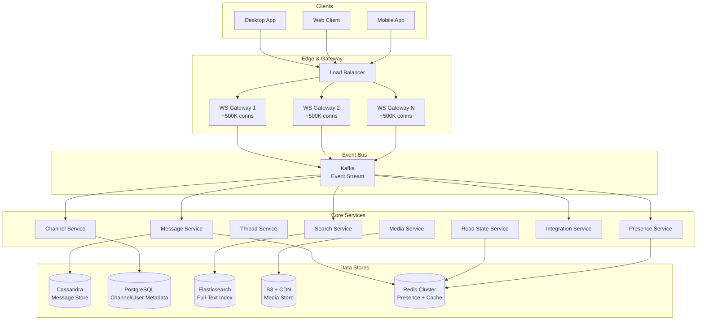
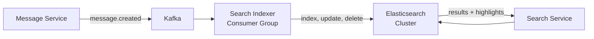

# Real-Time Chat System Case Study

## Overview

This case study examines the design of a Slack-style team communication platform supporting persistent channels, direct messages, threads, rich media, and presence — all with sub-200ms message delivery. Unlike consumer messaging (WhatsApp), a team chat system must support message search, compliance archiving, integrations (webhooks/bots), and channel-level permissions. The architecture must handle 50M+ concurrent WebSocket connections while maintaining strict message ordering guarantees.

## Key Requirements

### Functional
- Persistent channels (public and private) with configurable membership
- Direct messages and group DMs
- Threaded conversations within channels
- Message search across all channels (full-text)
- File sharing (up to 1 GB), inline media previews
- Integrations: webhooks, slash commands, bot frameworks
- Read state tracking per channel and per thread
- Message editing and deletion with history retention
- Compliance: message export and audit logging

### Non-Functional
| Requirement | Target |
|-------------|--------|
| Message delivery latency (online) | < 200ms end-to-end |
| Concurrent WebSocket connections | 50M |
| Message throughput | 100K messages/sec |
| Message durability | Zero loss (WAL + replication) |
| Search latency | < 500ms across 10B messages |
| Availability | 99.99% |

### Capacity Estimation

```
Users: 50M total, 10M DAU
Messages: 10M DAU × 50 messages/day = 500M messages/day
Peak: 100K messages/sec

Storage per message: ~200 bytes (text + metadata)
Daily text storage: 500M × 200B = ~100 GB/day
Media storage: 500M × 5% × 5MB = ~125 TB/day (object storage)
Yearly text: ~36 TB

Connections: 50M concurrent WebSocket connections
Per-server capacity: 500K connections (Erlang/Go)
Servers needed: 100+ gateway nodes

Search index: 500M messages/day × 200B = 100 GB/day added to index
Total index after 1 year: ~36 TB
```

## High-Level Architecture



## Deep Dive: WebSocket Gateway Architecture

The gateway layer is the most resource-intensive component, managing 50M+ persistent bidirectional connections. Each gateway instance handles ~500K connections using an event-driven architecture (Erlang/OTP or Go with epoll).

**Connection lifecycle:**
```
1. Client authenticates via REST → receives session token + gateway endpoint
2. Client opens WebSocket to assigned gateway
3. Gateway registers session: user_id → gateway_id mapping in Redis
4. Heartbeat every 30s (ping/pong); 90s timeout triggers reconnection
5. On disconnect: client reconnects → gateway assigns to any available node
6. Gateway fetches missed messages since last ack sequence number
```

**Message routing:**
When a user sends a message to channel `#engineering`:
1. Gateway receives WebSocket message → validates auth token
2. Gateway publishes to Kafka topic `channel-messages` (partitioned by channel_id)
3. Message Service consumes, assigns sequence number, persists to Cassandra
4. Message Service publishes `message.created` event on Kafka
5. All gateways subscribed to `message.created` check if any of their connected users are in the channel
6. Matching gateways push the message to connected clients

**Gateway discovery:** A Redis-backed mapping table stores `user_id → gateway_id`. This is updated on every connection, disconnection, and reconnection, enabling any gateway to route messages to the correct gateway for delivery.

## Deep Dive: Message Storage and Ordering

Messages use a **per-channel sequence number** for strict ordering. Cassandra is chosen for its write-heavy optimization and linear scalability.

```sql
-- Cassandra table (per-channel partitioning)
CREATE TABLE channel_messages (
    channel_id    uuid,
    sequence       bigint,
    message_id    timeuuid,
    sender_id     uuid,
    content       text,
    edited_at     timestamp,
    deleted       boolean,
    thread_id     uuid,        -- NULL for top-level, set for replies
    created_at    timestamp,
    PRIMARY KEY (channel_id, sequence)
) WITH CLUSTERING ORDER BY (sequence ASC);

-- Secondary index for threads
CREATE TABLE thread_messages (
    thread_id     uuid,
    sequence      bigint,
    message_id    timeuuid,
    sender_id     uuid,
    content       text,
    created_at    timestamp,
    PRIMARY KEY (thread_id, sequence)
);
```

**Sequence number generation:** Each channel has a dedicated sequence generator using a Redis `INCR` command (atomic, single-threaded per channel). For high-traffic channels, sequence generation is the bottleneck; sharding by `channel_id` ensures independent scaling.

**Read state tracking:** A per-user, per-channel watermark tracks the last read sequence number. This is stored in Redis for fast access and periodically flushed to PostgreSQL for persistence.

```
Redis key: read_state:{user_id}:{channel_id}
Value: last_read_sequence (bigint)

Cursor-based pagination:
GET /channels/{id}/messages?cursor=42&limit=50
→ Returns messages with sequence > 42, ordered by sequence ASC
```

## Deep Dive: Message Search Architecture

Full-text search across billions of messages requires an inverted index. Elasticsearch is the natural choice, fed by a Kafka consumer that indexes every message within seconds of creation.



**Index design:**
```json
{
  "mappings": {
    "properties": {
      "channel_id":   { "type": "keyword" },
      "sender_id":    { "type": "keyword" },
      "content":      { "type": "text", "analyzer": "english" },
      "created_at":   { "type": "date" },
      "attachments":  { "type": "nested" }
    }
  },
  "settings": {
    "number_of_shards": 32,
    "number_of_replicas": 2,
    "index.lifecycle.name": "messages-ilm"
  }
}
```

**Search query with permissions:**
Every search is scoped to channels the user has access to. This is enforced by building a filter from the user's channel membership list (cached in Redis, refreshed on channel join/leave).

```
GET /search?q=deployment+error&channel=C123&limit=20
→ Elasticsearch query:
{
  "query": {
    "bool": {
      "must": { "match": { "content": "deployment error" } },
      "filter": { "terms": { "channel_id": [user_accessible_channels] } }
    }
  }
}
```

## API Design

```
WebSocket Events:
  → { "type": "message", "channel_id": "C123", "text": "deployed!" }
  ← { "type": "message.created", "channel_id": "C123", "message": {...} }
  → { "type": "typing", "channel_id": "C123" }
  ← { "type": "reaction_added", "message_id": "M456", "emoji": "👍" }

REST APIs:
  GET    /api/channels                     — List user's channels
  POST   /api/channels                     — Create channel
  GET    /api/channels/{id}/messages        — Fetch messages (cursor-based)
  POST   /api/channels/{id}/messages        — Send message (fallback)
  POST   /api/channels/{id}/messages/{mid}/reactions — Add reaction
  GET    /api/search?q=...&channel=C123    — Full-text search
  POST   /api/files/upload                 — Upload file (pre-signed URL)
```

## Scalability

| Component | Strategy |
|-----------|---------|
| WebSocket Gateway | 100+ nodes, 500K connections each, event-driven |
| Message Service | Stateless consumers, partitioned by channel_id |
| Cassandra | 256-node cluster, per-channel partitioning |
| Redis | Clustered, sharded for presence + read state |
| Elasticsearch | 32 shards × 2 replicas, ILM for rollover |
| Kafka | 128 partitions for channel-messages topic |

## Trade-Offs

| Decision | Benefit | Cost |
|----------|---------|------|
| WebSocket (not SSE) | Bidirectional, low latency | Stateful gateway, connection management |
| Cassandra for messages | Linear write scalability, no hot partitions | No cross-partition queries, eventual consistency |
| Per-channel sequence numbers | Strict ordering without global coordination | Sequence generation bottleneck per channel |
| Elasticsearch for search | Sub-second full-text search | Extra indexing pipeline, storage duplication |
| Redis for presence | Sub-millisecond online/offline detection | Redis memory cost, TTL-based staleness |

## Interview Tips

1. **Start with concurrency** — "50M concurrent WebSocket connections is the defining constraint"
2. **Explain the gateway pattern** — event-driven servers with Redis-backed session routing
3. **Discuss ordering** — per-channel sequence numbers avoid global coordination overhead
4. **Highlight the difference from consumer chat** — search, compliance, channels, threads, integrations
5. **Mention cursor-based pagination** — avoids offset-based pagination problems at scale

## Key Takeaways

- Team chat systems differ from consumer messaging in search, compliance, and channel-based access control.
- WebSocket gateways manage 500K concurrent connections per node using event-driven architectures.
- Per-channel sequence numbers provide strict ordering without global coordination.
- Cassandra's per-channel partitioning enables linear write scalability for message storage.
- Elasticsearch enables sub-second full-text search with permission-aware filtering.
- Redis serves as the backbone for presence tracking and read state watermarks.

## Cross-References

- [How WhatsApp Works](./whatsapp.md) — Consumer messaging with E2EE
- [Chat System Design](../chat.md) — Interview-format overview
- [Notification System](../notifications.md) — Push notification patterns
- [WebSockets](../../../web-development/websockets.md) — Protocol details
