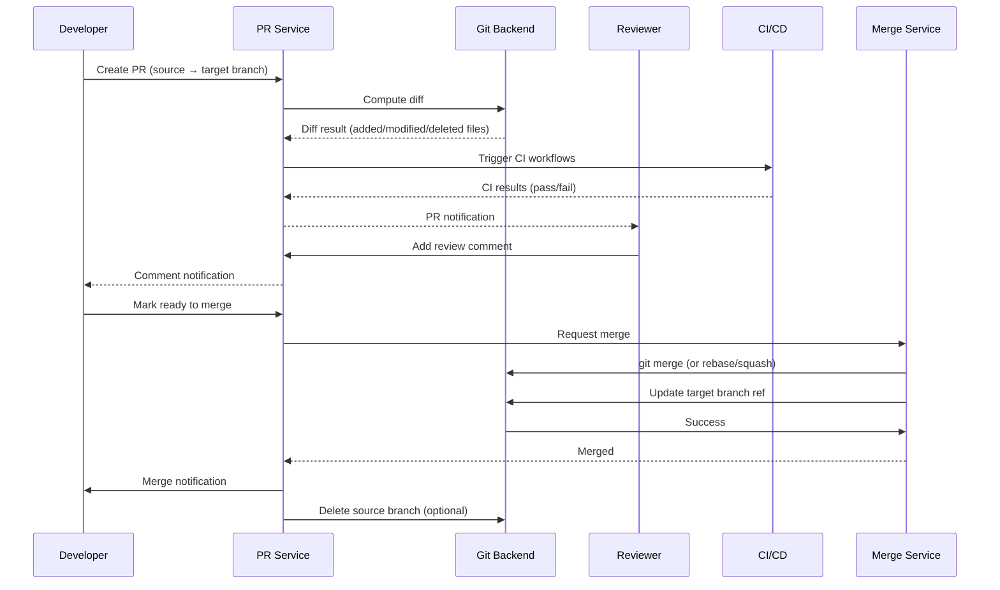
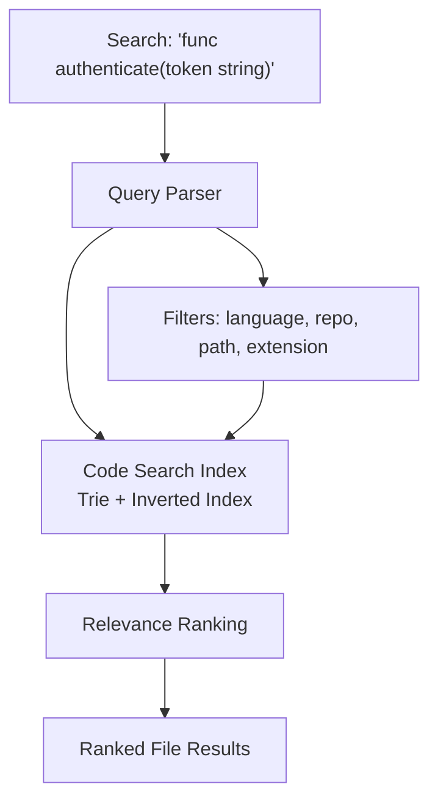

# Code Hosting Platform (GitHub-like)

## Overview

GitHub is the world's largest code hosting platform with 100M+ developers and 420M+ repositories. It provides Git repository hosting, code browsing, pull requests, issues, code review, CI/CD (GitHub Actions), wikis, package registries, and project management tools. Core design challenges include managing 420M+ Git repositories (each potentially terabytes), computing pull request diffs and merges, running millions of CI/CD workflows per day, and indexing code for search across billions of files.

## Key Requirements

### Functional
- Git repository hosting (push, pull, clone, fork)
- Code browsing (file tree, blame/history, diff view)
- Pull requests: creation, diff computation, code review (comments, approvals), merge
- Issue tracking: creation, assignment, labels, milestones, projects
- CI/CD pipelines (GitHub Actions): trigger on push/PR, run workflows, display results
- Code search across all public repositories
- Wikis and documentation hosting
- Notifications (email, in-app, push) for PRs, issues, mentions, reviews
- Authentication (SSH keys, personal access tokens, OAuth)

### Non-Functional
| Requirement | Target |
|------------|--------|
| Scale | 100M+ developers, 420M+ repositories |
| Git operations | 10M+ pushes/day |
| CI/CD runs | 10M+ workflow runs/day |
| Search | 42B+ indexed lines of code |
| Latency | Git push < 5s, PR diff < 10s, code search < 1s |
| Availability | 99.99% |
| Storage | Petabytes of Git object data |

### Capacity Estimation

```
Repositories: 420M (100M public, 320M private)
Average repo size: 50MB (objects) → ~21 PB total
Pushes per day: 10M
Average push size: 1MB → 10 TB/day new objects
Pull request diff: avg 5 files × 200 lines → 10KB → 10MB/day for 1M PRs/day
CI/CD workflow runs: 10M/day
Code search index: 42B lines → ~2 TB
Notifications: 50M/day

Storage growth: 10 TB/day (new Git objects) → ~3.6 PB/year
```

## High-Level Architecture

```mermaid
graph TB
    subgraph "Clients"
        GitClient[Git CLI / IDE]
        Web[Web Browser]
        API[API Clients]
    end

    subgraph "Edge"
        LB[Load Balancer]
        CDN[CDN / Raw Content]
        GW[API Gateway]
    end

    subgraph "Git Operations"
        GitRouter[Git Router<br/>git-upload-pack / git-receive-pack]
        GitBackend[Git Backend<br/>Object Store]
        HookSvc[Hook Service]
    end

    subgraph "Core Services"
        RepoSvc[Repository Service]
        PRSvc[Pull Request Service]
        IssueSvc[Issue Service]
        SearchSvc[Code Search Service]
        CISvc[CI/CD Service]
        NotifSvc[Notification Service]
        ReviewSvc[Code Review Service]
        WikiSvc[Wiki Service]
        AuthSvc[Auth Service]
    end

    subgraph "Data Stores"
        ObjectStore[(Git Object Store<br/>Sharded Filesystem)]
        RepoDB[(Repo Metadata<br/>MySQL)]
        PRDB[(PR / Issue Store<br/>MySQL)]
        SearchIdx[(Code Search Index<br/>Custom / Elasticsearch)]
        NotifDB[(Notification Store<br/>PostgreSQL)]
    end

    subgraph "CI/CD"
        RunnerPool[Runner Orchestrator]
        Runners[CI Runners<br/>(K8s / VMs)]
    end

    subgraph "Messaging"
        Kafka[Kafka Event Bus]
    end

    GitClient --> GitRouter
    Web --> LB
    API --> GW
    LB --> GW
    GW --> RepoSvc
    GW --> PRSvc
    GW --> IssueSvc
    GW --> SearchSvc
    GW --> CISvc
    GitRouter --> GitBackend
    GitBackend --> ObjectStore
    GitRouter --> HookSvc
    HookSvc --> Kafka
    RepoSvc --> RepoDB
    PRSvc --> PRDB
    IssueSvc --> PRDB
    SearchSvc --> SearchIdx
    CISvc --> RunnerPool
    RunnerPool --> Runners
    Kafka --> NotifSvc
    Kafka --> CISvc
    Kafka --> SearchIdx
```

## Deep Dive: Git Repository Storage

Git repositories contain objects (blobs, trees, commits) stored in a content-addressable store. At GitHub's scale, this is one of the largest storage challenges.

```mermaid
graph TB
    Push["git push"] --> GitRouter
    GitRouter --> ReceivePack["git-receive-pack"]
    ReceivePack --> Lock[Lock Repository<br/>Distributed Lock]
    Lock --> WriteObjects[Write Objects<br/>(loose → pack)]
    WriteObjects --> UpdateRef[Update Refs<br/>(branch pointers)]
    UpdateRef --> Hook[Post-Receive Hook]
    Hook --> Kafka[Kafka]
    Kafka --> NotifSvc[Notification Service]
    Kafka --> CISvc[CI/CD Service]
    Kafka --> SearchIdx[Search Indexer]
```

**Storage strategy:**
- Repositories are stored on sharded filesystems (each shard is a storage server cluster)
- Sharding key: `repository_id % N` (consistent hashing for rebalancing)
- Each repo is a bare Git repository (no working directory)
- **Pack files**: Loose objects are periodically repacked into compressed pack files for efficiency
- **Forks share storage**: Forked repositories share Git objects with the parent via a "fork network" (object deduplication)

**Git protocol:**
- `git-upload-pack` — handles `git fetch`/`git clone` (reads from repo)
- `git-receive-pack` — handles `git push` (writes to repo, triggers hooks)

## Deep Dive: Pull Request System



**Merge strategies:**
- **Merge commit**: Preserves full history (default for most repos)
- **Squash and merge**: Single commit on target (cleaner history)
- **Rebase and merge**: Linear history, no merge commits

**Large PR diffs:** For PRs with 100+ changed files or 10K+ changed lines, diff computation is done asynchronously and the PR page shows a loading indicator.

## Deep Dive: Code Search

Searching across 42B+ lines of code across 100M+ public repositories.



**Indexing strategy:**
- Every public repository is indexed (private repos are indexed per-organization)
- Files are split into lines; each line is indexed with its file path, repository, and language
- The index supports: substring search, regex search, and symbol search (for languages with semantic analysis)
- GitHub uses a custom index built on top of a trie-based structure for fast prefix search
- Indexing is near-real-time for pushes (within minutes)

## Deep Dive: CI/CD (GitHub Actions)

```mermaid
graph LR
    Trigger["Push / PR event"] --> Queue[Workflow Queue<br/>Kafka]
    Queue --> Schedule[Runner Orchestrator]
    Schedule --> Runner[Runner<br/>(Docker/VM)]
    Runner --> Execute[Execute Steps<br/>(checkout, build, test)]
    Execute --> Report[Report Status<br/>back to PR]
```

**Runner architecture:**
- **GitHub-hosted runners**: Managed VMs in Azure, auto-scaled per demand
- **Self-hosted runners**: User-provided machines for specialized environments
- Workflow YAML files define the pipeline: triggers, jobs, steps, environment
- Each job runs in an isolated VM or container
- Runner picks up work from a queue, executes the workflow, and reports status back via API

## API Design

| Endpoint | Method | Description |
|----------|--------|-------------|
| `/repos/{owner}/{repo}` | GET | Get repository metadata |
| `/repos/{owner}/{repo}/contents/{path}` | GET | Get file/directory contents |
| `/repos/{owner}/{repo}/pulls` | POST | Create a pull request |
| `/repos/{owner}/{repo}/pulls/{number}` | GET | Get PR details and diff |
| `/repos/{owner}/{repo}/pulls/{number}/reviews` | POST | Submit a code review |
| `/repos/{owner}/{repo}/issues` | POST | Create an issue |
| `/repos/{owner}/{repo}/issues/{number}/comments` | POST | Add issue comment |
| `/search/code?q={query}` | GET | Search code across repositories |
| `/repos/{owner}/{repo}/actions/runs` | GET | List CI/CD workflow runs |

## Data Model

```sql
CREATE TABLE repositories (
    repo_id      BIGSERIAL PRIMARY KEY,
    owner_id     BIGINT NOT NULL,
    name         VARCHAR(100) NOT NULL,
    description  TEXT,
    is_public    BOOLEAN DEFAULT FALSE,
    language     VARCHAR(50),
    fork_source  BIGINT,  -- parent repo_id if forked
    star_count   INT DEFAULT 0,
    created_at   TIMESTAMPTZ DEFAULT NOW(),
    UNIQUE (owner_id, name)
);

CREATE TABLE pull_requests (
    pr_id        BIGSERIAL PRIMARY KEY,
    repo_id      BIGINT NOT NULL,
    number       INT NOT NULL,
    author_id    BIGINT NOT NULL,
    title        VARCHAR(300) NOT NULL,
    source_branch VARCHAR(100) NOT NULL,
    target_branch VARCHAR(100) NOT NULL,
    status       ENUM('open','closed','merged') DEFAULT 'open',
    merge_sha    VARCHAR(40),
    created_at   TIMESTAMPTZ DEFAULT NOW(),
    merged_at    TIMESTAMPTZ,
    UNIQUE (repo_id, number)
);

CREATE TABLE issues (
    issue_id     BIGSERIAL PRIMARY KEY,
    repo_id      BIGINT NOT NULL,
    number       INT NOT NULL,
    author_id    BIGINT NOT NULL,
    title        VARCHAR(300) NOT NULL,
    body         TEXT,
    status       ENUM('open','closed') DEFAULT 'open',
    assignee_id  BIGINT,
    milestone_id BIGINT,
    created_at   TIMESTAMPTZ DEFAULT NOW(),
    UNIQUE (repo_id, number)
);
```

## Scalability

| Component | Strategy |
|-----------|----------|
| Git Object Store | Sharded filesystem, pack files, fork object sharing |
| Repository Metadata | MySQL sharded by repo_id, read replicas |
| PR/Issue Store | MySQL sharded by repo_id |
| Code Search | Custom trie-based index, sharded by repository |
| CI/CD Runners | Auto-scaling VM pool (Azure), queue-based dispatch |
| Notifications | Kafka → async workers → email/in-app/push |

## Trade-Offs

| Decision | Benefit | Cost |
|----------|---------|------|
| Fork object sharing | Massive storage savings | Complex garbage collection |
| Sharded filesystem | Scales to petabytes | Rebalancing is complex |
| Async diff computation | Non-blocking for large PRs | User sees loading indicator |
| Custom search index | Fast code search across 42B lines | Operational complexity vs ES |
| VM runners for CI | Full isolation, any environment | Slow startup (~20s) vs containers |

## Interview Tips

1. **Lead with Git storage** — "420M repositories with petabytes of Git objects is the core challenge."
2. **Explain fork deduplication** — forks share objects with the parent, saving massive storage.
3. **Discuss the PR pipeline** — diff computation, code review, CI, and merge as a state machine.
4. **Mention code search** — trie-based index for fast substring/regex search across billions of lines.
5. **Cover CI/CD** — queue-based runner dispatch with auto-scaling VMs.
6. **Don't forget Git protocol** — `git-upload-pack` and `git-receive-pack` handle the actual data transfer.

## Interview Questions

1. How would you store and manage 420M+ Git repositories at petabyte scale?
2. Design the pull request system — diff computation, code review, merge strategies.
3. How does GitHub implement code search across billions of lines of code?
4. Design the CI/CD pipeline — how do you schedule and run millions of workflows per day?
5. How would you implement fork object deduplication?
6. Design the notification system — how do you route PR/issue/mention notifications efficiently?
7. How would you handle a Git push that updates 10K+ files in a single commit?
8. Design the authentication system — SSH keys, tokens, and OAuth for Git operations.
9. How would you implement syntax highlighting and code intelligence (Go to Definition)?
10. Design the GitHub Actions workflow engine — YAML parsing, dependency graph, and execution.

## Key Takeaways

- Git object storage is sharded across filesystem clusters with pack file compression and fork object deduplication.
- Pull requests involve diff computation, code review, CI/CD, and merge as a multi-step state machine.
- Code search uses a custom trie-based index for fast substring/regex search across 42B+ lines.
- CI/CD runners are dispatched via a queue to auto-scaling VMs or user-provided self-hosted runners.
- Kafka connects Git operations (post-receive hooks) to notifications, CI triggers, and search indexing.

## Cross-References

- [Collaborative Editor](./collaborative-editor.md) — Real-time code editing
- [Notification System](./notification-system.md) — PR and issue notifications
- [Distributed Lock](./distributed-lock.md) — Repository locking during pushes
- [Analytics Platform](./analytics-platform.md) — Repository and developer analytics

## References

- GitHub Engineering Blog: "How GitHub Stores Your Git Objects"
- GitHub Engineering: "Scaling GitHub's Code Search Infrastructure"
- GitHub Docs: "About GitHub Actions"
- Git Internals: "Git Object Model" (Pro Git Book, Ch. 10)
