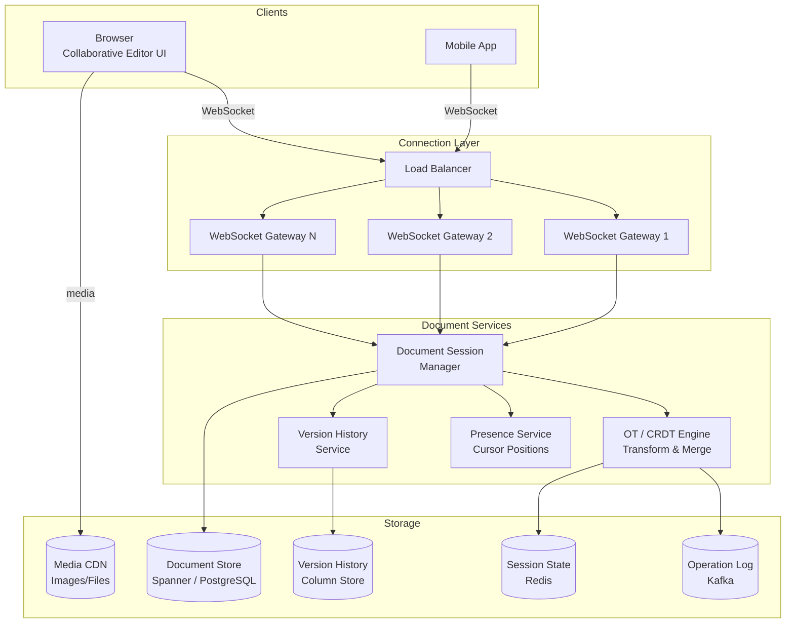
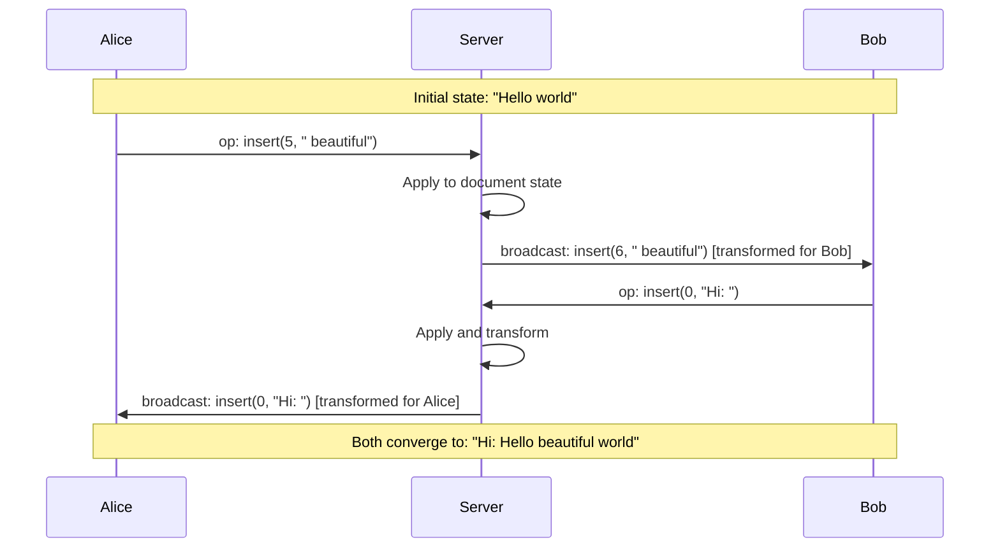

# Collaborative Editor Case Study: Google Docs

## Overview

Google Docs enables real-time collaborative editing where multiple users can simultaneously edit the same document with sub-100ms latency per keystroke. The core technical challenge is **conflict resolution** — when two users edit the same paragraph at the same time, the system must merge both changes without data loss or corruption. This case study examines two competing approaches (Operational Transformation vs. Conflict-Free Replicated Data Types), the real-time synchronization protocol, persistence strategies, and the architecture required to support millions of concurrent editing sessions.

## Key Requirements

### Functional
- Real-time text editing with cursor position tracking
- Multiple users editing simultaneously with conflict-free merging
- Support for rich text formatting (bold, italic, headings, lists, images)
- Presence indicators showing where each collaborator's cursor is
- Version history with diff view and rollback capability
- Offline editing with sync on reconnect
- Comment threads anchored to specific text ranges
- Access control (view, comment, edit permissions)

### Non-Functional
| Requirement | Target |
|-------------|--------|
| Keystroke sync latency | < 100ms between collaborators |
| Concurrent editors per document | 100+ simultaneous |
| Concurrent editing sessions | 10M sessions at peak |
| Document size limit | 1M characters (~2 MB text) |
| Availability | 99.99% |
| Data loss tolerance | Zero (every keystroke persisted) |

### Capacity Estimation

```
Concurrent sessions: 10M
Documents: 5B total, 100M active (edited in last 24h)
Average document size: 50 KB
Total active document storage: 100M × 50KB = ~5 TB

Keystrokes per session: ~2/second per active user
Total keystroke throughput: 10M × 2 = 20M operations/sec
Operation size: ~100 bytes (operation type + position + content)
Operation bandwidth: 20M × 100B = ~2 GB/sec

Presence updates: 10M sessions × 1 cursor update/second = 10M/sec
Cursor update size: ~50 bytes
Presence bandwidth: 10M × 50B = ~500 MB/sec

Per-document operations (for version history):
  100M active docs × 2 ops/sec × 86400 = ~17B operations/day
  Storage: 17B × 100B = ~1.7 TB/day
```

## High-Level Architecture



## Deep Dive: OT vs. CRDT — Conflict Resolution Approaches

The two dominant approaches for collaborative editing conflict resolution are Operational Transformation (OT) and Conflict-Free Replicated Data Types (CRDTs).

### Operational Transformation (Google Docs Approach)

OT transforms operations against each other to ensure convergence. When two concurrent operations conflict, they are transformed to produce equivalent non-conflicting operations.

```
Client A inserts "X" at position 3:  insert(3, "X")
Client B inserts "Y" at position 3:  insert(3, "Y")

Both operations happen concurrently on the same base state: "abcdef"

Server receives A's operation first → applies to state → "abcXdef"
Server receives B's operation → must TRANSFORM against A's insert
  transform(B, A) → insert(4, "Y")  (position shifted right by 1)
  Apply to state → "abcXYdef"

Result: both insertions are preserved in correct order.
```

**OT Server Algorithm:**
```
State: document_state, operation_history[]
On receive(op, client_id):
  1. Transform op against all ops in history since client's last known state
  2. Apply transformed op to document_state
  3. Append op to operation_history
  4. Broadcast transformed op to all other clients
  5. Each client transforms their pending ops against received ops
```

**OT Pros and Cons:**

| Aspect | Evaluation |
|--------|-----------|
| Convergence | Guaranteed with correct transformation functions |
| Centralization | Requires a central server (single transformation authority) |
| Complexity | Transformation functions are O(N) where N is operation types; hard to get right |
| History dependence | Must know full operation history for correct transformation |
| Google Docs | Uses OT with a central server managing the authoritative state |

### CRDT (Modern Alternative — used by Figma, Notion)

CRDTs use mathematically proven data structures that automatically merge without conflicts. No transformation step is needed.

```
RGA (Replicated Growable Array) — a sequence CRDT for text:

Each character is stored with:
  - A unique Lamport timestamp (node_id + counter)
  - An origin (reference to the character it was inserted after)

Character: { id: (server_1, 42), content: "X", origin: (server_2, 15) }

Merge is deterministic: sort all characters by (timestamp, node_id)
  → Converge to the same state regardless of arrival order

Example:
  State: [a, b, c]  (characters have unique IDs)
  Client A inserts X after b: [a, b, X, c]
  Client B inserts Y after b: [a, b, Y, c]
  Merge: [a, b, X, c] ∪ [a, b, Y, c] → [a, b, X, Y, c]  (deterministic sort)
```

**CRDT vs OT Comparison:**

| Aspect | OT | CRDT |
|--------|----|------|
| Server requirement | Central server required | Can work peer-to-peer (offline-first) |
| Latency | Round-trip to server | Can apply locally, sync later |
| Memory overhead | Operation history required | Metadata per character (2-3× overhead) |
| Complexity | Transformation functions | Data structure design |
| Convergence | Proven for specific operations | Mathematically guaranteed |
| Production use | Google Docs, Zoho | Figma, Notion, Apple Notes |
| Character limit | High (no per-char metadata) | Lower (metadata per character) |

## Deep Dive: Real-Time Synchronization Protocol

The synchronization protocol manages the flow of operations between clients and the server.



**Client-side protocol:**
```
Client state:
  - document_version: last acknowledged operation sequence number
  - pending_ops: operations sent but not yet acknowledged
  - local_state: document state with pending ops applied optimistically

On keystroke:
  1. Create operation (insert/delete/format at position)
  2. Apply operation to local state optimistically
  3. Send operation to server (with client_id, version)
  4. Update cursor position locally

On receive(op_from_server):
  1. Transform all pending_ops against received op
  2. Apply received op to local state
  3. Re-apply transformed pending_ops to local state
  4. Send ACK to server
```

**Server-side protocol:**
```
Per-document session state (in-memory):
  - document_state: current authoritative document
  - operation_log: ordered list of all operations
  - clients: map of client_id → { version, pending_acks }

On operation received:
  1. Validate operation (bounds check, permission check)
  2. Transform against all ops since client's version
  3. Apply to document_state
  4. Append to operation_log
  5. Persist to operation log (Kafka, for durability)
  6. Broadcast to all other connected clients
  7. ACK to sender
```

## Deep Dive: Persistence and Version History

Every operation is persisted to create a complete, replayable version history.

### Operation Log (Append-Only)

```sql
-- Operation log (append-only, partitioned by document_id)
CREATE TABLE document_operations (
    doc_id         UUID NOT NULL,
    sequence       BIGINT NOT NULL,
    operation_type VARCHAR(20) NOT NULL,  -- insert, delete, format
    position       INT NOT NULL,
    content        TEXT,                    -- for insert
    length         INT,                     -- for delete
    format_attrs   JSONB,                   -- for format
    author_id      UUID NOT NULL,
    timestamp      TIMESTAMPTZ DEFAULT NOW(),
    PRIMARY KEY (doc_id, sequence)
) PARTITION BY HASH (doc_id);
```

### Document Snapshot (Periodic)

Full document snapshots are taken every 100 operations to speed up document loading:

```
Snapshot strategy:
  - Snapshot taken every 100 operations or 5 minutes (whichever first)
  - Snapshot stored as full document state (JSON or binary format)
  - To load document: read latest snapshot + replay operations since snapshot

Snapshot table:
  doc_id | snapshot_sequence | document_state | created_at

Document load:
  1. Read latest snapshot for doc_id
  2. Read operations where sequence > snapshot_sequence
  3. Replay operations on snapshot
  4. Return loaded document + current operation log position
```

### Version History and Diff

For the "See changes" feature (like Google Docs' version history), the system stores named versions at specific points in time:

```
Named versions: (user-initiated "Named this version")
  - Store snapshot at named point
  - Diff between any two versions computed by replaying operations between them

Diff computation:
  version_A → version_B: replay ops from A.sequence to B.sequence
  Generate colored diff output (additions in green, deletions in red)
```

## Data Model

```
Document entity:
  {
    doc_id: UUID,
    title: string,
    content: snapshot (full text at last snapshot point),
    current_sequence: bigint,
    owner_id: UUID,
    permissions: [{ user_id, role: "editor"|"commenter"|"viewer" }],
    created_at: timestamp,
    updated_at: timestamp
  }

Operation:
  {
    doc_id: UUID,
    sequence: bigint,
    type: "insert" | "delete" | "format",
    position: int,
    content: string (for insert),
    length: int (for delete),
    attributes: { bold: true, italic: false } (for format),
    author_id: UUID,
    lamport_timestamp: int
  }
```

## Scalability

| Component | Strategy |
|-----------|---------|
| WebSocket Gateways | Horizontal, 500 sessions per instance, ~20K instances for 10M sessions |
| Document Sessions | In-memory state per active document, ~100MB per session |
| OT Engine | Per-document, single-threaded (preserves operation ordering) |
| Operation Log | Kafka (append-only, 3 brokers, 64 partitions by doc_id) |
| Document Store | Spanner (globally consistent) or sharded PostgreSQL |
| Version History | Columnar store for efficient range scans |
| Session Affinity | Route all clients for same doc to same gateway |

## Trade-Offs

| Decision | Benefit | Cost |
|----------|---------|------|
| OT (not CRDT) | Lower memory per character | Central server required |
| Central authoritative state | Simple conflict resolution | Single point of coordination per doc |
| WebSocket (not polling) | Sub-100ms sync latency | Stateful connection management |
| Operation log (not full snapshots) | Minimal storage per edit | Replay time for document loading |
| Periodic snapshots | Fast document load | Extra storage for snapshots |

## Interview Tips

1. **Lead with the conflict problem** — "When two users edit the same text simultaneously, how do we merge without data loss?"
2. **Explain OT** — transform concurrent operations against each other to converge
3. **Compare with CRDT** — CRDTs are mathematically conflict-free but have higher memory overhead
4. **Discuss the protocol** — optimistic local application + server authority + transform on receive
5. **Mention persistence** — append-only operation log + periodic snapshots for fast loading
6. **Highlight version history** — replay operations between snapshots to compute diffs
7. **Estimate throughput** — 10M sessions × 2 ops/sec = 20M operations/sec through the system

## Key Takeaways

- Collaborative editing's core challenge is conflict resolution when multiple users edit simultaneously.
- OT transforms concurrent operations against each other; CRDTs use mathematically proven merge operations.
- Google Docs uses OT with a central authoritative server; Figma/Notion use CRDTs for offline-first support.
- Real-time sync uses optimistic local updates + server authority + transform on receive.
- Persistence uses an append-only operation log (Kafka) + periodic snapshots for fast document loading.
- 10M concurrent sessions × 2 ops/sec = 20M operations/sec throughput requirement.

## Cross-References

- [CRDT Fundamentals](../../../distributed/fundamentals/crdts.md) — CRDT theory and data structures
- [Consensus Patterns](../../../distributed/consensus/raft.md) — Raft consensus for server coordination
- [WebSockets](../../../web-development/websockets.md) — Real-time bidirectional protocol
- [Chat System](../chat.md) — Real-time connection management patterns
