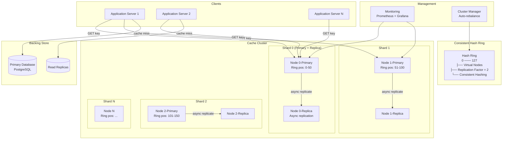
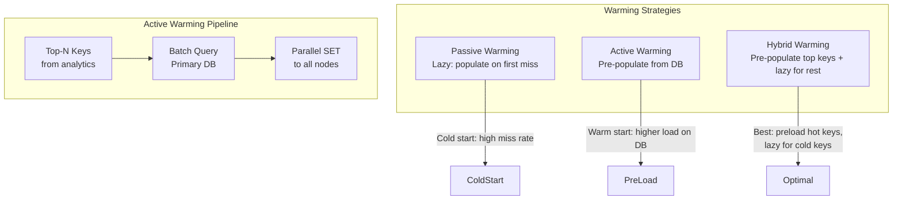

# Distributed Cache System Case Study

## Overview

A distributed cache provides sub-millisecond data access for read-heavy workloads by storing frequently accessed data across a cluster of in-memory nodes. This case study examines building a Redis/Memcached-style distributed cache from scratch — covering consistent hashing for data distribution, replication strategies for fault tolerance, eviction policies for memory management, cache warming for cold starts, and invalidation strategies for consistency with the backing database. Understanding these internals is critical for system design interviews and for operating caches at scale.

## Key Requirements

### Functional
- Get/Put/Delete operations on key-value pairs with TTL support
- Maximum key size: 1 KB, maximum value size: 1 MB
- Configurable eviction policies (LRU, LFU, FIFO, random)
- Cache invalidation (explicit, TTL-based, write-through)
- Distributed replication for fault tolerance
- Horizontal scaling via consistent hashing
- Cache warming on node addition or after restart
- Monitoring: hit rate, memory usage, eviction count, latency per operation

### Non-Functional
| Requirement | Target |
|-------------|--------|
| Read latency (p99) | < 1ms (single hop) |
| Write latency (p99) | < 2ms (with replication) |
| Throughput | 10M operations/sec per cluster |
| Cluster size | 64-256 nodes |
| Memory per node | 64 GB |
| Availability | Survive any single node failure |
| Consistency | Eventual consistency (read-your-writes on same node) |

### Capacity Estimation

```
Total data to cache: 5 TB (hot working set)
Nodes: 128 nodes × 64 GB = 8.2 TB total memory
Replication factor: 2 → effective capacity: ~4.1 TB
Utilization target: 70% → usable: ~2.9 TB (fits 5 TB with eviction)

Operations per second:
  Read QPS: 8M/sec
  Write QPS: 2M/sec
  Total: 10M ops/sec
  Per node: 10M / 128 = ~78K ops/sec (comfortable for single-threaded event loop)

Network: 10M ops × 1KB average = 10 GB/s cluster bandwidth
  Requires 10 Gbps inter-node network with headroom

Data model:
  Average key size: 100 bytes
  Average value size: 500 bytes
  Average entry: ~700 bytes + overhead (~200 bytes) = ~900 bytes
  Entries per node at 70%: 64GB × 0.7 / 900B = ~50M entries per node
```

## High-Level Architecture



## Deep Dive: Consistent Hashing

Consistent hashing maps keys to nodes using a hash ring, minimizing data movement when nodes are added or removed.

### Ring Construction with Virtual Nodes

```
Hash space: 0 to 2^32 - 1 (4 billion slots)

Physical nodes: 128
Virtual nodes per physical node: 150
Total virtual nodes: 128 × 150 = 19,200

For each physical node:
  For i in 0..149:
    vnode_id = hash(node_ip + ":" + i)
    Place vnode_id on the ring

Key assignment:
  key_hash = hash(key)  // e.g., Murmur3 hash
  Find first vnode on ring with vnode_id >= key_hash (clockwise)
  Assign key to that vnode's physical node

Replication:
  For replication_factor = 2:
    primary_node = clockwise_next(key_hash)
    replica_node = clockwise_next(primary_node.position)
    Store key on both nodes
```

### Handling Node Addition/Removal

```
Node added:
  Only keys in the affected range move
  With 128 nodes + 150 vnodes each = 19,200 vnodes
  Adding 1 node (150 new vnodes) moves ~150/19,200 = 0.78% of keys
  At 50M entries per node: ~390K keys migrate

Node removed (failure):
  Affected keys' replicas become primary for those keys
  No data loss (replication factor = 2)
  Cluster manager detects failure → triggers rebalance
  Rebalance adds virtual nodes for replacement node
```

**Comparison of distribution strategies:**

| Strategy | Key Movement on Scale Change | Distribution Evenness | Complexity |
|----------|------------------------------|----------------------|------------|
| Modulo (hash % N) | All keys move | Perfect | Very low |
| Consistent hash (no virtual nodes) | ~1/N keys move | Poor (small N) | Low |
| Consistent hash (virtual nodes) | ~1/(N×V) keys move | Near-perfect | Medium |
| Rendezvous hash | Minimal keys move | Near-perfect | Medium |

## Deep Dive: Replication and Failure Handling

### Replication Strategies

| Strategy | Write Latency | Read Latency | Consistency | Failure Tolerance |
|----------|---------------|--------------|-------------|-------------------|
| Synchronous (primary + 1 replica) | ~2ms | ~1ms (read from primary) | Strong (read-your-writes) | 1 node |
| Asynchronous (write-behind) | ~1ms | ~1ms (read from primary) | Eventual (milliseconds lag) | 1 node |
| Leaderless (quorum-based) | ~2ms (quorum) | ~2ms (quorum) | Tunable (R + W > N) | N/2 nodes |

**Chosen: Asynchronous replication** — The primary acknowledges writes immediately and replicates to the replica in the background. This provides ~1ms write latency with eventual consistency (typically < 10ms replication lag).

```
Write path:
1. Client → Primary node: SET key value
2. Primary writes to local memory
3. Primary ACKs client (fast path, ~1ms)
4. Primary sends (key, value, timestamp) to replica via TCP
5. Replica writes to local memory

Read path:
1. Client → Primary node: GET key
2. Primary reads from local memory
3. Return value (~0.5ms)

If primary fails:
1. Cluster manager detects (health check timeout, 5 seconds)
2. Replica is promoted to primary
3. New replica is provisioned from another node's data
4. Virtual node assignments are updated on the ring
```

### Conflict Resolution

Since replication is asynchronous, conflicts can arise during failover:
- **Last-write-wins (LWW)**: Each write includes a hybrid logical timestamp (HLC). On conflict, the write with the later timestamp wins.
- **Application-defined**: For complex values, the application can provide a conflict resolution function.

## Deep Dive: Eviction Policies

When memory reaches the configured threshold (e.g., 70% of node capacity), the cache must evict entries to make room for new writes.

### Policy Comparison

| Policy | Description | Hit Rate | Memory Overhead | CPU Overhead |
|--------|-------------|----------|------------------|--------------|
| LRU (Least Recently Used) | Evict least recently accessed | Good | O(1) with doubly-linked list | O(1) per access |
| LFU (Least Frequently Used) | Evict least frequently accessed | Best | O(1) with counter + decay | O(1) per access |
| FIFO (First In First Out) | Evict oldest insertion | Poor | O(1) queue | Minimal |
| Random | Evict random entry | Fair | None | O(1) |
| ARC (Adaptive Replacement) | Adaptively mixes LRU and LFU | Very good | O(1) dual lists | O(1) per access |

**Recommended: Approximate LRU with sampling (Redis's approach)**

Redis does not maintain a full LRU linked list (too much memory overhead for 50M entries). Instead, it uses **random sampling**:

```
On memory pressure:
  Sample 5 random keys
  Evict the one with the oldest access time

On every access:
  Update the key's access timestamp (LFU counter increment)

This is O(1) per access and achieves ~95% of true LRU hit rate
at a fraction of the memory overhead.
```

**LFU with aging (Redis 4.0+):**
```
Each key has an 8-bit logarithmic counter:
  counter = log(1 + counter × lfu_decay_factor)
  lfu_decay_factor is configurable (default: 1, halve every 10 minutes)

This prevents stale popular keys from dominating forever.
```

## Deep Dive: Cache Warming and Invalidation

### Cache Warming

On cluster startup, node addition, or after failover, the cache is empty (cold). Cache warming pre-populates hot data:



**Active warming implementation:**
1. Analytics service identifies top 100K keys by access frequency (from access logs)
2. Batch query backing database for these keys
3. Parallel SET operations to warm each node with its assigned keys
4. Warming completes in ~30 seconds for 100K keys across 128 nodes

### Invalidation Strategies

| Strategy | When to Use | Implementation |
|----------|-------------|----------------|
| TTL (time-based) | Stale data acceptable | SET key value EX 300 |
| Write-through | Strong consistency needed | On DB write → cache DELETE key |
| Write-behind (write-back) | Write-heavy, tolerate stale | On DB write → cache UPDATE key async |
| Cache-aside | Most common pattern | App checks cache first → falls back to DB → populates cache |
| Pub/sub invalidation | Multi-cache, multi-region | DB publishes invalidation → all caches listen → DELETE key |

**Chosen: Cache-aside with pub/sub invalidation for cross-region:**
```
Local cache (same region): Cache-aside with write-through on DB mutations
Remote cache (other regions): Pub/sub invalidation via Kafka
  → DB write triggers event on Kafka
  → All region caches consume and invalidate the key
  → Remote cache repopulates on next access (cache-aside)
```

## Scalability

| Component | Strategy |
|-----------|---------|
| Nodes | Horizontal: add nodes → minimal key movement (virtual nodes) |
| Memory | 128 nodes × 64 GB = 8.2 TB, replication factor 2 → 4.1 TB effective |
| Network | 10 Gbps interconnect, consistent hashing minimizes cross-rack traffic |
| Monitoring | Prometheus metrics per node: hit rate, latency, memory, evictions |
| Rebalancing | Automatic via cluster manager on node join/fail |

## Trade-Offs

| Decision | Benefit | Cost |
|----------|---------|------|
| Async replication | Sub-1ms write latency | Eventual consistency (< 10ms lag) |
| Virtual nodes (150/node) | Even distribution, minimal rebalancing | More ring entries to maintain |
| Approximate LRU (sampling) | Low memory overhead | Slightly lower hit rate than true LRU |
| Cache-aside pattern | Simple, no write amplification to cache | Stale reads between DB write and cache invalidation |
| Pub/sub invalidation | Cross-region consistency | Extra Kafka dependency |

## Interview Tips

1. **Lead with the problem** — "We need sub-millisecond access for 10M ops/sec with 5 TB of hot data"
2. **Explain consistent hashing** — hash ring with virtual nodes for even distribution and minimal rebalancing
3. **Discuss replication** — async replication for low write latency, LWW for conflict resolution
4. **Compare eviction policies** — LRU vs LFU vs ARC, explain Redis's approximate LRU with sampling
5. **Mention cache warming** — active warming of top-N keys for fast cold start
6. **Don't forget invalidation** — cache-aside + pub/sub for cross-region consistency

## Key Takeaways

- Consistent hashing with virtual nodes (150/node) provides near-perfect distribution and minimal key movement on scaling.
- Async replication achieves ~1ms write latency with < 10ms replication lag.
- Approximate LRU with random sampling (Redis approach) achieves 95% of true LRU at a fraction of memory overhead.
- Cache-aside pattern is the most common; pub/sub invalidation adds cross-region consistency.
- 128 nodes × 64 GB with replication factor 2 = 4.1 TB effective cache capacity for 5 TB working set.

## Cross-References

- [Redis Patterns and Internals](../../../redis/patterns-and-internals.md) — Redis-specific implementation details
- [Caching Strategy](../hld/caching-strategy.md) — Interview-format caching patterns
- [Consistent Hashing](../../../distributed/partitioning/consistent-hashing.md) — Hashing deep dive
- [Capacity Planning](../hld/capacity-planning.md) — Estimation techniques
