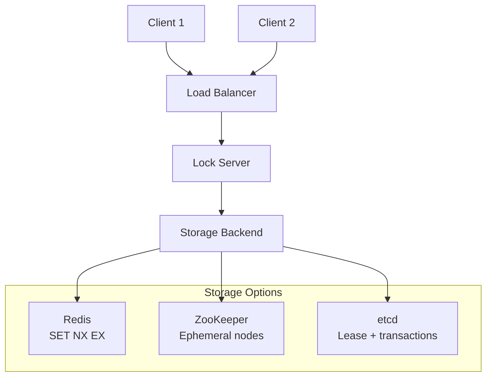
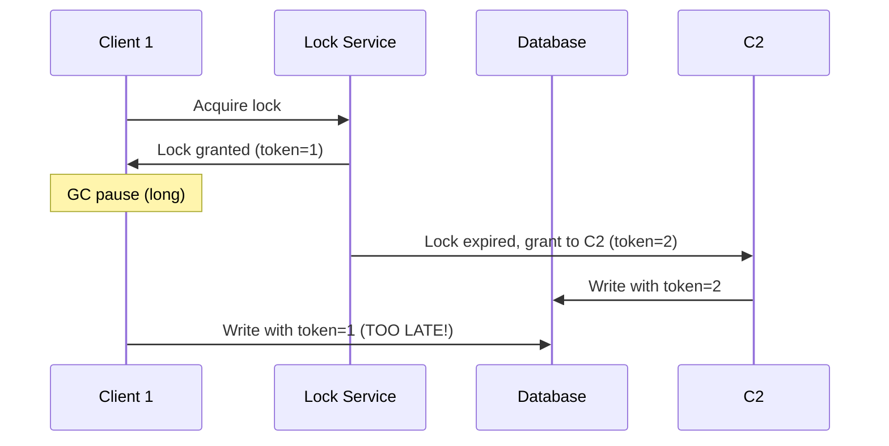
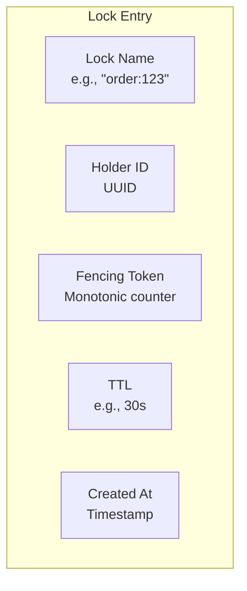
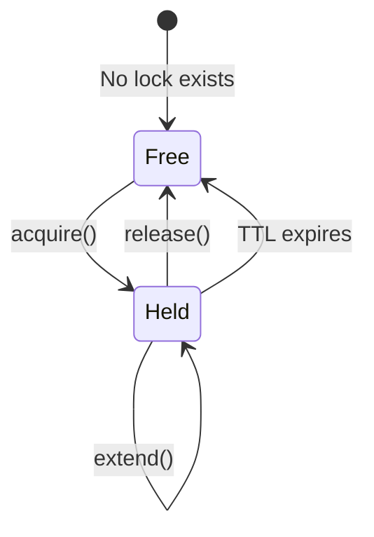

# Design a Distributed Lock Manager

## Requirements

### Functional Requirements
- Acquire a lock with a name and TTL
- Release a lock (only by the holder)
- Extend lock TTL
- Try-lock with timeout

### Non-Functional Requirements
- **High availability**: Lock service must be available
- **Fault tolerance**: Locks expire if holder crashes
- **Low latency**: < 10ms for lock operations
- **Consistency**: At most one holder per lock (safety)

## High-Level Design



## Implementation Approaches

### Approach 1: Redis-based (Simple)

```python
import redis
import uuid

class RedisLock:
    def __init__(self, redis_client, name, ttl=30):
        self.redis = redis_client
        self.name = f"lock:{name}"
        self.ttl = ttl
        self.token = str(uuid.uuid4())
    
    def acquire(self, timeout=10):
        end = time.time() + timeout
        while time.time() < end:
            if self.redis.set(self.name, self.token, nx=True, ex=self.ttl):
                return True
            time.sleep(0.01)
        return False
    
    def release(self):
        # Lua script for atomic check-and-delete
        lua = """
        if redis.call("get", KEYS[1]) == ARGV[1] then
            return redis.call("del", KEYS[1])
        else
            return 0
        end
        """
        self.redis.eval(lua, 1, self.name, self.token)
    
    def extend(self, ttl=None):
        ttl = ttl or self.ttl
        lua = """
        if redis.call("get", KEYS[1]) == ARGV[1] then
            return redis.call("expire", KEYS[1], ARGV[2])
        else
            return 0
        end
        """
        self.redis.eval(lua, 1, self.name, self.token, ttl)
```

**Pros**: Simple, fast, widely used
**Cons**: Single Redis instance is SPOF, Redis Cluster has edge cases

### Approach 2: Redlock (Distributed Redis)

```python
class Redlock:
    def __init__(self, redis_instances, name, ttl=30):
        self.instances = redis_instances
        self.name = name
        self.ttl = ttl
        self.token = str(uuid.uuid4())
        self.quorum = len(redis_instances) // 2 + 1
    
    def acquire(self, timeout=10):
        start = time.time()
        end = start + timeout
        while time.time() < end:
            acquired = 0
            for instance in self.instances:
                try:
                    if instance.set(self.name, self.token, nx=True, ex=self.ttl):
                        acquired += 1
                except redis.ConnectionError:
                    pass
            
            if acquired >= self.quorum:
                elapsed = time.time() - start
                if elapsed < self.ttl:
                    return True
                # Lock expired during acquisition, release all
                self.release()
            
            time.sleep(0.01)
        return False
```

**Pros**: No single point of failure
**Cons**: Complex, Martin Kleppmann's critique (clock skew, GC pauses)

### Approach 3: etcd-based (Recommended)

```go
// etcd uses leases and transactions
func acquireLock(cli *clientv3.Client, name string, ttl int64) (clientv3.LeaseID, error) {
    // Create lease
    resp, _ := cli.Grant(context.Background(), ttl)
    leaseID := resp.ID
    
    // Try to create key with lease
    txn := clientv3.New(cli)
    txn.If(clientv3.Compare(clientv3.Version(name), "=", 0)).
        Then(clientv3.OpPut(name, "locked", clientv3.WithLease(leaseID))).
        Else(clientv3.OpGet(name))
    
    tresp, err := txn.Commit()
    if err != nil {
        return 0, err
    }
    if !tresp.Succeeded {
        return 0, errors.New("lock already held")
    }
    
    // Keep lease alive
    keepAlive, _ := cli.KeepAlive(context.Background(), leaseID)
    go func() {
        for range keepAlive {} // Renew lease
    }()
    
    return leaseID, nil
}
```

**Pros**: Linearizable, built-in TTL, used by Kubernetes
**Cons**: More complex than Redis

## Redlock Controversy

### Martin Kleppmann's Critique

1. **Clock skew**: Nodes may have different clocks
2. **GC pauses**: Process may pause longer than lock TTL
3. **Network delays**: Messages may be delayed

### Antirez's Response

1. Clock drift is bounded in practice
2. GC pauses affect any distributed system
3. Redlock is safe for most use cases

### Recommendation

| Use Case | Recommendation |
|----------|---------------|
| Efficiency (prevent duplicate work) | Redis single instance |
| Correctness (prevent data corruption) | etcd/ZooKeeper |
| High-value transactions | Database advisory locks |

## Fencing Tokens

### Problem



### Solution: Fencing Tokens

```python
# Lock service returns monotonically increasing token
token = lock.acquire()  # Returns token=1

# Database rejects writes with older tokens
db.write(data, fencing_token=token)

# Database-side check
def write(data, fencing_token):
    if fencing_token < last_seen_token:
        raise Error("Stale fencing token")
    last_seen_token = fencing_token
    # Perform write
```

## Implementation Details

### Lock Structure



### Lock Lifecycle



### Watch Mechanism

```python
# Watch for lock release (etcd)
def wait_for_lock(cli, name):
    # Create a lease-based lock
    # Watch for key deletion
    watch_ch = cli.watch(name)
    for event in watch_ch:
        if event.type == WatchEventType.DELETE:
            # Lock released, try to acquire
            if try_acquire(cli, name):
                return True
```

## Failure Scenarios

| Scenario | Impact | Mitigation |
|----------|--------|------------|
| Lock holder crashes | Lock held until TTL | TTL auto-expiry |
| Lock service crashes | Cannot acquire new locks | Replicated storage (etcd cluster) |
| Network partition | Split-brain risk | Quorum-based systems |
| Clock skew | Premature expiry | NTP, bounded clock drift |
| GC pause | Lock appears held | Fencing tokens |

## Production Considerations

### 1. Lock Granularity

```python
# Too coarse: locks entire table
lock = acquire("database:users")

# Better: locks specific resource
lock = acquire("user:123")

# Best: locks specific operation
lock = acquire("user:123:update")
```

### 2. Lock Timeout Tuning

```python
# Too short: operations may not complete
lock = acquire("resource", ttl=1)

# Too long: slow recovery from crashes
lock = acquire("resource", ttl=300)

# Good: match operation duration + buffer
lock = acquire("resource", ttl=30)
```

### 3. Retry Strategy

```python
def acquire_with_retry(lock, max_retries=3, base_delay=0.1):
    for attempt in range(max_retries):
        if lock.acquire(timeout=base_delay * (2 ** attempt)):
            return True
    return False
```

## Interview Questions

### Q1: Redis single lock vs Redlock vs etcd?

- **Redis single**: Fast, simple, but SPOF. Good for efficiency.
- **Redlock**: Distributed, but controversial (clock issues). OK for most cases.
- **etcd**: Linearizable, used by K8s. Best for correctness.

### Q2: How to prevent split-brain with distributed locks?

Use quorum-based systems (etcd, ZooKeeper). Require majority agreement before granting lock. Fencing tokens prevent stale holders from affecting data.

### Q3: What happens when lock holder crashes?

The lock has a TTL. After expiry, it's automatically released. The trade-off: longer TTL = slower recovery, shorter TTL = risk of premature expiry.

### Q4: When to use distributed locks vs database transactions?

- **Distributed locks**: Coordination across services, leader election, rate limiting
- **Database transactions**: Data consistency within a database, ACID guarantees
- **Advisory locks**: Database-native coordination (PostgreSQL `pg_advisory_lock`)

### Q5: How to implement leader election with distributed locks?

```python
while True:
    if lock.acquire(ttl=30):
        try:
            # I am the leader
            do_leader_work()
        finally:
            lock.release()
    else:
        # I am a follower
        do_follower_work()
    time.sleep(10)
```

## Related Topics

- [Consensus Algorithms](../../../distributed/consensus/) — Raft, Paxos
- [Redis](../../../backend/messaging/redis.md) — Redis internals
- [Distributed Systems](../../../distributed/) — CAP, consistency
- [System Design](../framework.md) — Design methodology
