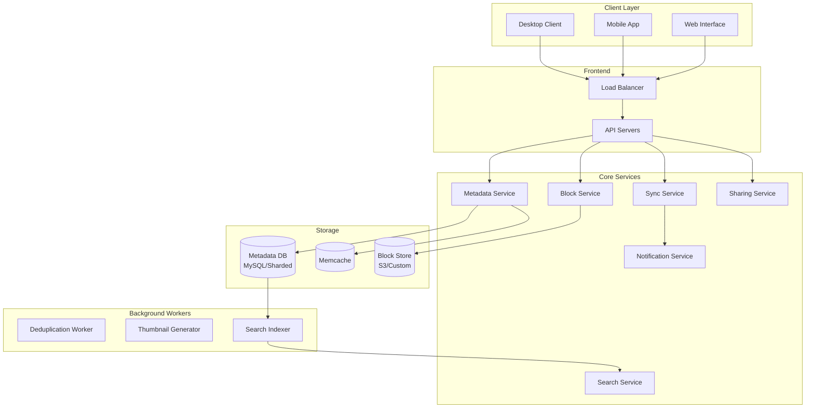
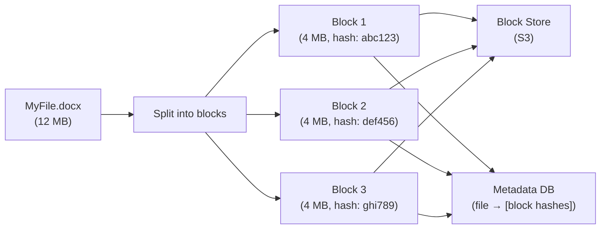
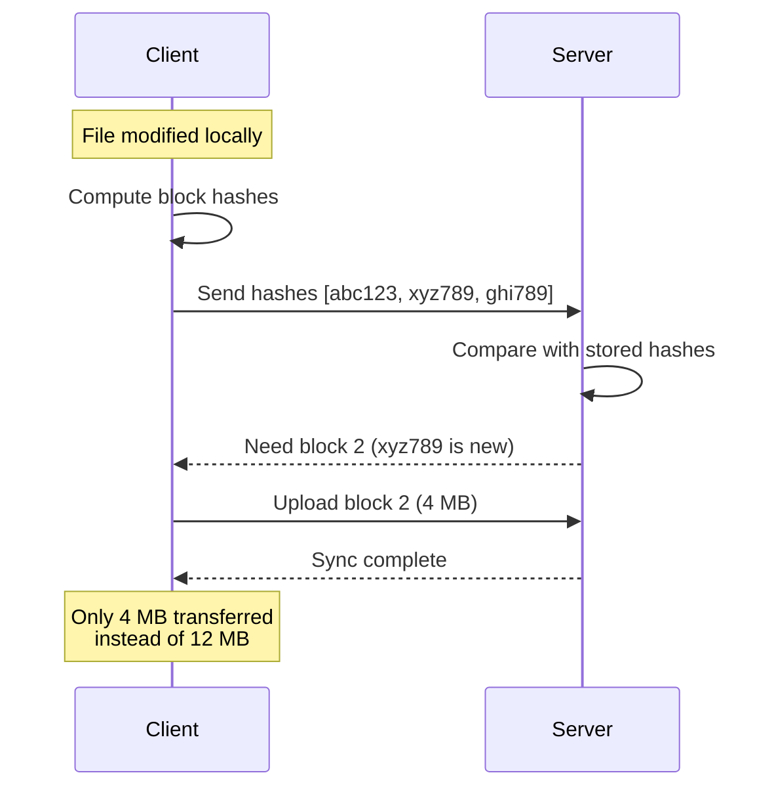
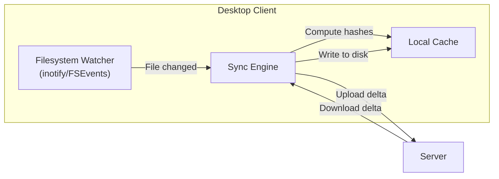
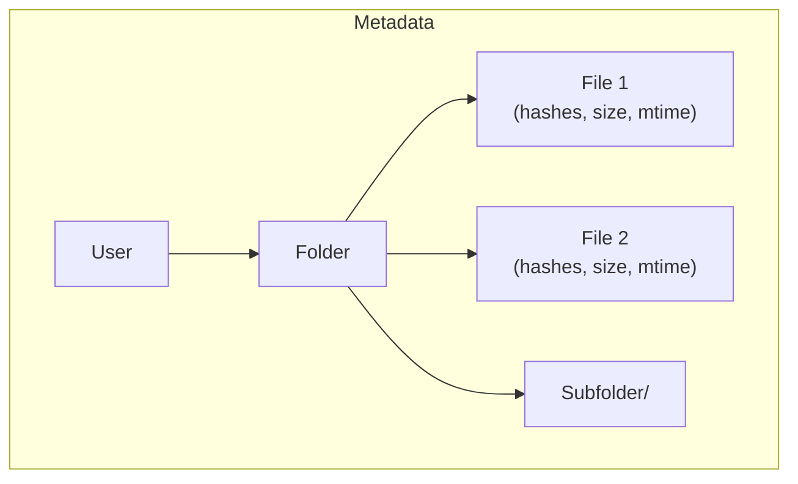
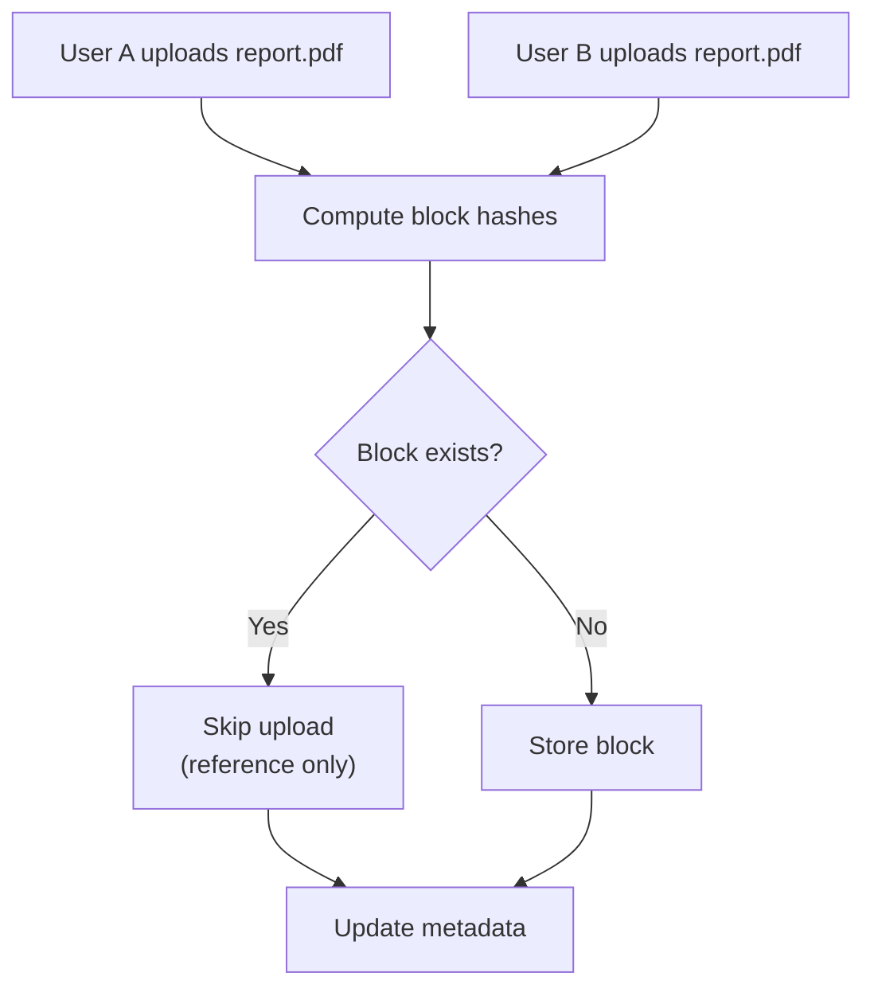
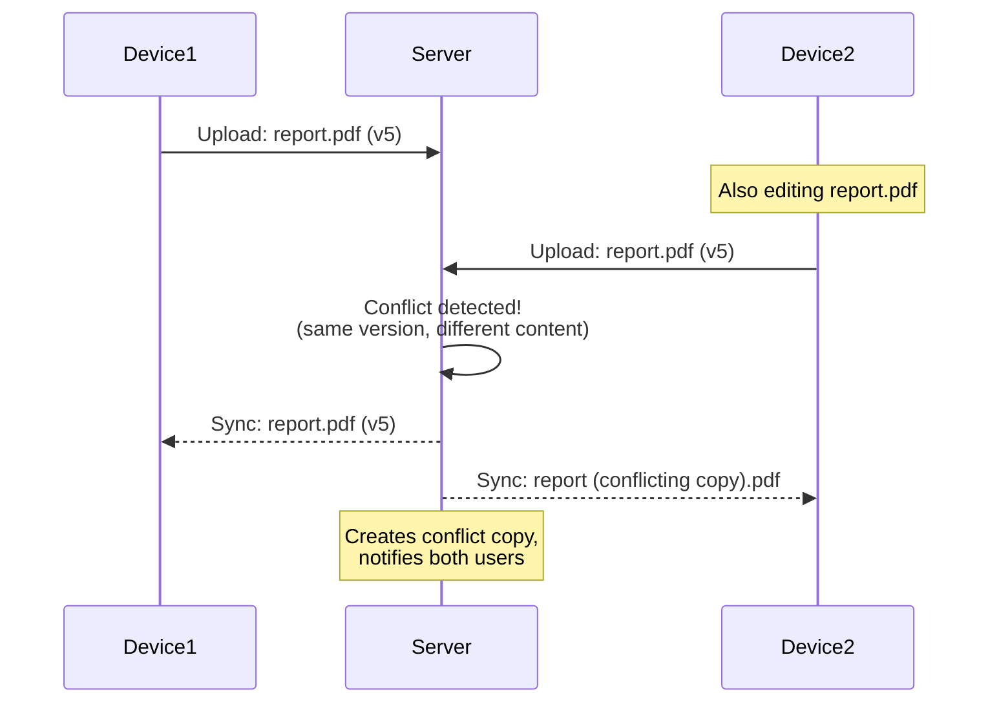
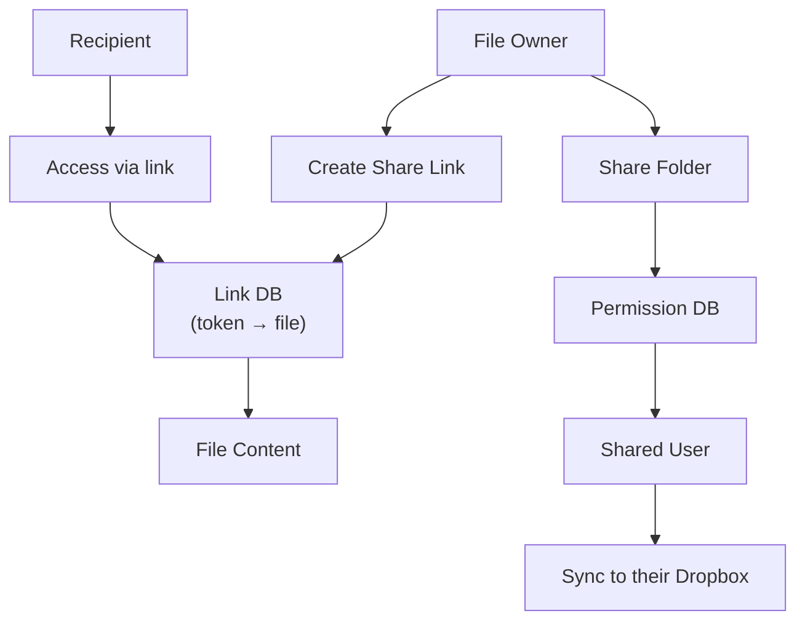

# How Dropbox Works

## Overview

Dropbox is a cloud storage and file synchronization service with 700+ million registered users and 15+ million paying subscribers. It synchronizes files across multiple devices in near real-time, handling conflict resolution, deduplication, and efficient delta sync. The core challenge is keeping files consistent across devices while minimizing bandwidth and storage.

## Key Requirements

### Functional
- Upload and download files (any type, up to 50 GB)
- Sync files across multiple devices in near real-time
- Share files and folders with other users
- File versioning (recover previous versions)
- Offline access (sync when reconnected)
- Search across files
- Paper (collaborative documents)

### Non-Functional
- **Scale**: 700M+ registered users, 15M+ paying, 500B+ files stored
- **Sync latency**: Changes visible on other devices within seconds
- **Reliability**: Zero data loss (files must never be corrupted or lost)
- **Bandwidth**: Minimize upload/download (delta sync, deduplication)
- **Storage**: Exabytes of data (deduplicated)
- **Availability**: 99.99%

## High-Level Architecture



## Deep Dive: File Sync Architecture

### The Block-Based Storage Model

Dropbox splits files into **4 MB blocks** for efficient storage and sync:



**Why blocks?**
- **Deduplication**: If two users upload the same file, blocks are stored once
- **Delta sync**: Only changed blocks are transferred
- **Parallel upload**: Multiple blocks can be uploaded simultaneously
- **Resumable uploads**: If upload fails, only remaining blocks need retry

### Delta Sync (Incremental Sync)

When a file changes, Dropbox only syncs the changed blocks:



**How delta sync works:**
1. Client detects file change (filesystem watcher)
2. Client computes hash of each 4 MB block
3. Client sends block hashes to server
4. Server compares with stored hashes
5. Server requests only the changed/new blocks
6. Client uploads only those blocks
7. Server updates metadata

### File Watching (Desktop Client)



**Platform-specific watchers:**
- **Linux**: inotify
- **macOS**: FSEvents
- **Windows**: ReadDirectoryChangesW

## Deep Dive: Metadata Service

The metadata service tracks all file information without storing actual file content.



**Metadata per file:**
```json
{
    "file_id": "uuid",
    "path": "/Documents/report.pdf",
    "size": 12582912,
    "blocks": ["abc123", "def456", "ghi789"],
    "mtime": "2024-01-15T10:30:00Z",
    "version": 5,
    "creator": "user_123",
    "shared_with": ["user_456", "user_789"]
}
```

**Sharding strategy:**
- Metadata DB is sharded by `user_id`
- Each user's files are on the same shard (enables efficient folder listings)
- MySQL with read replicas for each shard

## Deep Dive: Deduplication

Dropbox deduplicates at the block level:



**Deduplication stats:**
- Dropbox reported that deduplication saved ~90% of upload bandwidth
- Content-addressable storage: blocks are identified by their SHA-256 hash
- Two users uploading the same file → blocks stored once, metadata stored per user

## Deep Dive: Conflict Resolution

When the same file is edited on two devices simultaneously:



**Conflict resolution strategy:**
1. **Last-writer-wins** for non-conflicting changes
2. **Conflict copies** when same file edited simultaneously on different devices
3. User is notified and can manually merge
4. Dropbox Paper uses **CRDTs** for real-time collaboration (no conflicts)

## Deep Dive: Sharing



**Sharing types:**
- **Share link**: Anyone with the link can view/download
- **Shared folder**: Both users see the folder in their Dropbox (synced)
- **Paper collaboration**: Real-time collaborative editing

## Scalability

| Component | Strategy |
|-----------|---------|
| File storage | Block-based, deduplicated, S3 + custom block store |
| Metadata | MySQL sharded by user_id |
| Sync | Delta sync (only changed blocks) |
| Caching | Memcache for hot metadata |
| Search | Elasticsearch index |
| Notifications | WebSocket for real-time sync notifications |
| CDN | For shared link downloads |

## Trade-Offs

| Decision | Benefit | Cost |
|----------|---------|------|
| 4 MB blocks | Good dedup + delta sync | Overhead for small files |
| Block-level dedup | ~90% bandwidth savings | Hash computation overhead |
| Conflict copies | Never loses data | User must manually resolve |
| Filesystem watcher | Real-time sync | Platform-specific, can miss events |
| MySQL sharding | Strong consistency | Migration complexity |
| S3 for blocks | Durable, scalable | Higher cost than custom storage |

## Interview Tips

1. **Start with the sync problem** — "The core challenge is keeping files consistent across devices with minimal bandwidth"
2. **Explain block-based storage** — 4 MB blocks enable dedup and delta sync
3. **Discuss delta sync** — only changed blocks are transferred (hash comparison)
4. **Mention deduplication** — ~90% bandwidth savings, content-addressable storage
5. **Talk about conflict resolution** — conflict copies, not silent overwrites
6. **Don't forget metadata vs content separation** — metadata in MySQL, blocks in S3
7. **Mention filesystem watchers** — inotify/FSEvents for real-time change detection

## Key Takeaways

- Dropbox splits files into 4 MB blocks for efficient deduplication and delta sync.
- Delta sync: client sends block hashes, server requests only changed blocks (~90% bandwidth savings).
- Content-addressable storage: blocks identified by SHA-256 hash, enabling global deduplication.
- Metadata (file paths, block lists) stored in MySQL sharded by user_id; blocks stored in S3.
- Conflict resolution: create conflict copies rather than silently overwriting.
- Filesystem watchers (inotify/FSEvents) enable real-time change detection on desktop.
- Dropbox Paper uses CRDTs for real-time collaboration without conflicts.

## Cross-References

- [Distributed File System](../dfs.md)
- [Object Storage](../../../storage/object-storage.md)
- [Consistency Patterns](../consistency-patterns.md)
- [Key-Value Store](../kv-store.md)

