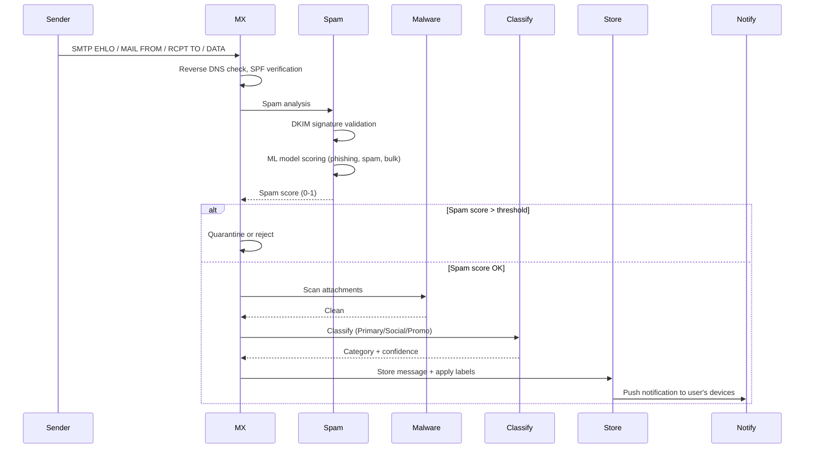
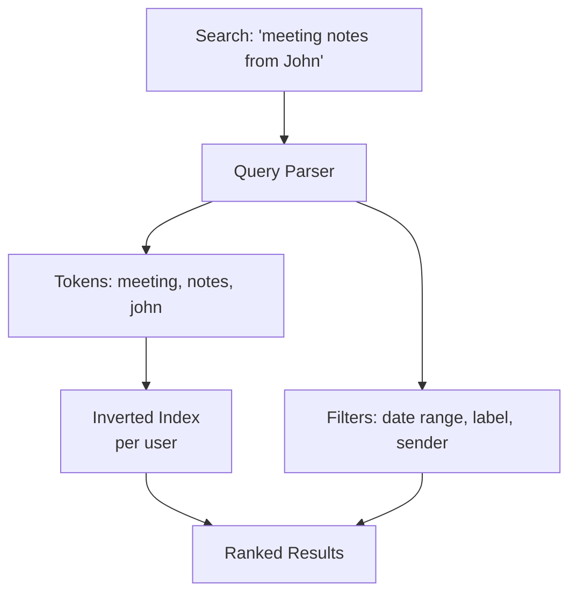

# Email System Design (Gmail-like)

## Overview

Email is one of the oldest and most critical communication systems, processing 333B+ emails daily worldwide. A modern email provider like Gmail serves 1.8B+ users with features including spam filtering, full-text search across billions of messages, conversation threading, labels/folders, attachments, and push notifications. The core design challenges include handling massive storage, near-real-time delivery, sophisticated spam detection, and search across decades of message history.

## Key Requirements

### Functional
- Send and receive email (SMTP for sending, IMAP/POP3 for receiving)
- Spam filtering and malware scanning
- Full-text search across all messages (subject, body, attachments)
- Conversation threading (grouping related messages)
- Labels, folders, and categories (Primary, Social, Promotions)
- Attachments (up to 25MB inline, larger via Drive integration)
- Push notifications for new mail
- Scheduled send, undo send, and read receipts
- Filters and auto-forwarding rules

### Non-Functional
| Requirement | Target |
|------------|--------|
| Scale | 1.8B+ users, 333B emails/day worldwide |
| Delivery latency | < 5 seconds (P95) |
| Search latency | < 500ms across user's full history |
| Spam catch rate | > 99.9% |
| Availability | 99.99% |
| Storage per user | 15 GB free, unlimited paid |

### Capacity Estimation

```
Daily active users: 1.2B
Emails received per user per day: 50 (avg, including spam)
Total emails/day: 60B
Inbound QPS: 60B / 86400 ≈ 700K/sec (avg), 2M/sec (peak)

Storage (messages): 60B/day × 5KB (avg) = ~300 GB/day → ~110 TB/year
Storage (attachments): 60B × 0.1 (10% have attachment) × 500KB = ~3 TB/day → ~1 PB/year
Per-user storage: 15GB × 1.8B users = ~27 PB (allocated)

Search index size: ~2x message storage = ~220 TB/year growth

Spam filtering: 2M/sec requires ML inference at massive throughput
```

## High-Level Architecture

```mermaid
graph TB
    subgraph "External"
        Sender[Sender MTA]
        DNS[MX Records / DNS]
        Client[Email Client<br/>IMAP/SMTP/Web]
    end

    subgraph "Inbound Pipeline"
        MX["MX Servers<br/>(SMTP listeners)"]
        SpamFilter[Spam Filter<br/>(ML + Rules)]
        MalwareScan[Malware Scanner]
        Classifier[Category Classifier<br/>Primary/Social/Promo]
        IngestSvc[Ingest Service]
    end

    subgraph "Core Services"
        MsgStoreSvc[Message Store Service]
        ThreadSvc[Threading Service]
        SearchSvc[Search Service]
        LabelSvc[Label Service]
        NotifSvc[Notification Service]
        FilterSvc[Filter / Rules Service]
        AttachmentSvc[Attachment Service]
    end

    subgraph "Data Stores"
        MsgDB[(Message Store<br/>Sharded Bigtable/Cassandra)]
        SearchIdx[(Search Index<br/>Custom/Bleve)]
        UserDB[(User DB<br/>Spanner/MySQL)]
        AttachStore[(Attachment Store<br/>Object Storage)]
        SpamDB[(Spam Models<br/>Feature Store)]
    end

    subgraph "Outbound"
        Outbound[Outbound MTA]
    end

    Sender --> DNS
    DNS --> MX
    MX --> SpamFilter
    SpamFilter --> MalwareScan
    MalwareScan --> Classifier
    Classifier --> IngestSvc
    IngestSvc --> MsgStoreSvc
    IngestSvc --> ThreadSvc
    IngestSvc --> SearchSvc
    IngestSvc --> NotifSvc
    IngestSvc --> FilterSvc
    MsgStoreSvc --> MsgDB
    SearchSvc --> SearchIdx
    ThreadSvc --> MsgDB
    FilterSvc --> LabelSvc
    LabelSvc --> MsgDB
    AttachmentSvc --> AttachStore
    SpamFilter --> SpamDB
    Client -->|"IMAP/SMTP"| MsgStoreSvc
    Client -->|"Web"| SearchSvc
    MsgStoreSvc --> Outbound
    Outbound --> Sender
```

## Deep Dive: Inbound Email Pipeline

Every incoming email passes through a multi-stage pipeline before reaching the inbox.



**Spam detection layers (defense in depth):**
1. **Network-level**: SPF (does the sending IP belong to the domain?), DKIM (is the email cryptographically signed?), DMARC (policy enforcement)
2. **Reputation-based**: Sender domain and IP reputation from historical data
3. **ML model**: Neural network trained on hundreds of features (content, headers, sender behavior, engagement patterns)
4. **User feedback**: "Mark as spam" signals fed back into the model

## Deep Dive: Conversation Threading

Email clients group related messages into conversations (threads) using the **References** and **In-Reply-To** headers.

```
Message Headers:
Message-ID: <userA-12345@example.com>
In-Reply-To: <userB-67890@example.com>
References: <userB-67890@example.com> <userA-12345@example.com>

Thread:
  [UserB] Let's discuss the project plan
    [UserA] RE: Let's discuss (In-Reply-To: userB-67890)
      [UserB] RE: RE: (In-Reply-To: userA-12345)
```

**Threading algorithm:**
1. Parse `Message-ID`, `In-Reply-To`, and `References` headers
2. Build a graph of message relationships
3. Group messages into threads (handles missing headers via subject matching as fallback)
4. Sort within thread by date

## Deep Dive: Full-Text Search

Searching across billions of messages per user's lifetime requires an inverted index.



**Search architecture:**
- Each user's messages are indexed in a sharded search cluster
- Indexing is near-real-time (new messages searchable within seconds)
- Search supports: Boolean operators (`AND`, `OR`, `NOT`), date ranges, sender/recipient filters, attachment type filters, label filters
- Ranking: relevance (TF-IDF/BM25) + recency boost + user engagement signals

## API Design

| Protocol | Endpoint | Description |
|----------|----------|-------------|
| SMTP | `MAIL FROM` / `RCPT TO` / `DATA` | Send email |
| IMAP | `SELECT inbox` / `FETCH 1:*` | Retrieve messages |
| IMAP | `SEARCH SUBJECT "meeting"` | Search messages |
| IMAP | `STORE +FLAGS (\Seen)` | Mark as read |
| REST | `POST /api/send` | Send via web API |
| REST | `GET /api/messages?label=inbox` | List messages |
| REST | `POST /api/messages/{id}/trash` | Move to trash |
| REST | `GET /api/search?q=meeting` | Full-text search |

## Data Model

```sql
CREATE TABLE users (
    user_id     BIGSERIAL PRIMARY KEY,
    email       VARCHAR(255) UNIQUE NOT NULL,
    storage_used BIGINT DEFAULT 0,
    storage_quota BIGINT DEFAULT 16106127360,  -- 15 GB
    created_at  TIMESTAMPTZ DEFAULT NOW()
);

CREATE TABLE messages (
    message_id  VARCHAR(100) PRIMARY KEY,  -- RFC 2822 Message-ID
    user_id     BIGINT NOT NULL,
    thread_id   VARCHAR(50),
    from_addr   VARCHAR(255) NOT NULL,
    to_addrs    TEXT[],
    cc_addrs    TEXT[],
    subject     VARCHAR(1000),
    body_text   TEXT,
    body_html   TEXT,
    in_reply_to VARCHAR(100),
    references  TEXT[],
    spam_score  FLOAT,
    category    ENUM('inbox','social','promotions','spam','trash'),
    labels      TEXT[],
    has_attachment BOOLEAN DEFAULT FALSE,
    received_at TIMESTAMPTZ DEFAULT NOW()
) PARTITION BY RANGE (received_at);
```

## Scalability

| Component | Strategy |
|-----------|----------|
| Message Store | Sharded by user_id, time-partitioned, columnar storage for efficiency |
| Search Index | Sharded by user_id, per-user index segments |
| Spam Filter | ML model inference at 2M/sec (GPU/TPU), rules engine for known patterns |
| Attachments | Object storage (S3/GCS) with deduplication for identical files |
| Inbound MTAs | Horizontal scaling, DNS round-robin across MX servers |
| Threading | Computed at write time, stored as thread_id |

## Trade-Offs

| Decision | Benefit | Cost |
|----------|---------|------|
| Per-user index shards | Fast search, data isolation | High index count (billions of shards) |
| Category ML classifier | Automated inbox organization | Misclassification frustration |
| Spam ML model | 99.9%+ catch rate | False positives (legitimate mail in spam) |
| IMAP/POP3 protocols | Universal compatibility | Protocol limitations (no push) |
| Time-partitioned storage | Efficient range queries, easy archiving | Cross-partition queries are complex |

## Interview Tips

1. **Lead with the inbound pipeline** — "Email starts with SMTP and passes through spam, malware, and classification stages."
2. **Explain spam filtering in depth** — SPF/DKIM/DMARC + ML model + user feedback loop.
3. **Discuss threading** — use Message-ID, In-Reply-To, and References headers.
4. **Address search** — per-user inverted index with near-real-time indexing.
5. **Mention the scale** — 333B emails/day, 2M/sec inbound QPS, per-user 15GB storage.
6. **Compare with chat** — email is store-and-forward (async), chat is push (real-time).

## Interview Questions

1. Walk through the complete lifecycle of an email from send to delivery.
2. How would you design a spam filter that achieves 99.9%+ accuracy at 2M messages/sec?
3. How does email conversation threading work, and how would you implement it at scale?
4. Design a full-text search system for billions of emails across 1.8B users.
5. How does DKIM/SPF/DMARC work together to prevent email spoofing?
6. How would you implement the "Undo Send" feature within a 30-second window?
7. Design the attachment storage system — how do you handle deduplication and malware scanning?
8. How would you implement email filters (auto-forward, auto-label, auto-archive)?
9. Design a system to detect and prevent phishing emails.
10. How would you migrate a user's mailbox (100GB, 5M messages) between data centers?

## Key Takeaways

- Email passes through a multi-stage inbound pipeline: MX → spam filter → malware scanner → classifier → store.
- Spam filtering uses defense in depth: SPF/DKIM/DMARC + reputation + ML + user feedback.
- Conversation threading leverages Message-ID, In-Reply-To, and References headers to build message graphs.
- Full-text search uses per-user inverted indexes with near-real-time indexing via Kafka.
- Time-partitioned storage enables efficient archiving and range queries on message history.

## Cross-References

- [Notification System](./notification-system.md) — Push notifications for new mail
- [Search Autocomplete](./search-autocomplete.md) — Search infrastructure patterns
- [Slack](./slack.md) — Real-time messaging vs async email
- [Chat System](./chat-system.md) — Comparison: async vs real-time messaging

## References

- RFC 5321: Simple Mail Transfer Protocol (SMTP)
- RFC 3501: Internet Message Access Protocol (IMAP)
- Google Safety Center: "How Gmail's Spam Filtering Works"
- RFC 6376: DomainKeys Identified Mail (DKIM) Signatures
