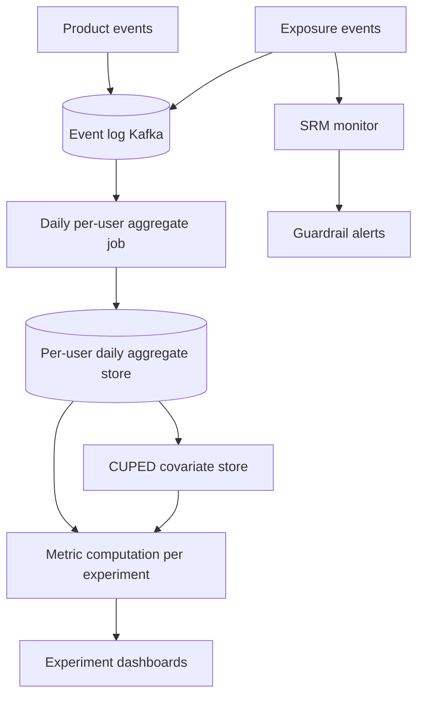

# Design an Experimentation Platform (A/B Testing Infrastructure)

## Problem Statement

Design the platform that lets hundreds of product teams run controlled experiments concurrently on shared traffic: assign users to variants consistently, log who saw what, compute metrics within minutes-to-hours, and ship or roll back with automated guardrails. This is the infrastructure behind Google's overlapping experiment system, LinkedIn's experimentation platform, and commercial products like Statsig and LaunchDarkly.

Scope discipline: this page covers the **infrastructure** — assignment, bucketing, exposure logging, the metrics pipeline, ship/rollback mechanics. The statistical machinery (test selection, power, confidence intervals, bandits) lives in [A/B Testing Design for ML](../../../ml/system-design/ab-testing.md); this page links to it at every statistical fork and covers only what infrastructure must guarantee so the statistics are even *possible* — because most platform failures are data-plumbing failures (flapping assignment, missing exposures, sample ratio mismatch), not statistics failures.

Google framed the demand as three goals in the opening of its platform paper: *"how to run more experiments, how to run experiments that produce better decisions, and how to run them faster"* — more, better, faster ([Overlapping Experiment Infrastructure, KDD 2010](https://research.google.com/pubs/archive/36500.pdf)). Every component below exists to buy one of those three without sacrificing the other two.

Related designs: [Analytics Platform](./analytics-platform.md) (the general event-ingestion architecture the metrics pipeline reuses), [News Feed](./news-feed.md) (the canonical high-stakes ranking experiment: every metric moves with the feed), and [Consistent Hashing](../../../distributed/partitioning/consistent-hashing.md) (the hashing mechanics the assignment layer is built on).

---

## Functional Requirements

1. **Concurrent experiments without interference**: hundreds of teams run experiments at once; a user may be in many experiments, but interfering experiments must never share a user.
2. **Sticky assignment**: a user sees the same variant for the lifetime of the experiment, across devices, sessions, and SDK restarts.
3. **Traffic allocation and ramping**: start at 1–5%, ramp toward 100% as confidence grows, without re-randomizing users who are already assigned.
4. **Exposure logging**: record which units were actually assigned each variant — the denominator of every metric.
5. **Real-time metrics pipeline**: per-user aggregates and experiment dashboards fed continuously; launch decisions supported within hours, not weeks.
6. **Ship/rollback**: flip an experiment to its control (or its "launch layer" value) in seconds under automated guardrail aborts.
7. **Governance**: mutual-exclusion contracts between teams, metric definitions as code, and an audit trail of who ran what on whom.

## Non-Functional Requirements

| Requirement | Target | Why |
|---|---|---|
| Assignment latency | < 10 ms p99, served from in-process SDK / edge cache | Assignment sits on every request path; it must be faster than the feature it gates |
| Assignment availability | Fail-open to default/control | A platform outage must never be a product outage |
| Assignment determinism | 100% — same inputs, same variant, forever | Recomputation happens constantly (cache eviction, new SDK instances); any nondeterminism is assignment flapping |
| Exposure log completeness | ≥ 99.9% of real assignments logged | Missing exposures bias every metric (see SRM) |
| Metrics freshness | Per-user daily aggregates by T+1; real-time counters within minutes | Launch decisions tolerate hours; bot/SRM alarms need minutes |
| Scale | 100M DAU, 500 concurrent experiments, thousands of exposures/s per experiment | See capacity arithmetic below |

---

## The Assignment Layer

### Unit of randomization

Decide what one "unit" is: a **logged-in user** (stable, cross-device, the default for social/serious products), a **device/cookie ID** (anonymous traffic; resets when cookies clear), or a **session** (only for layout experiments where carryover is irrelevant — session-level assignment breaks per-user metrics). LinkedIn's platform paper catalogs the failure modes of getting this and related choices wrong at scale — data quality, not algorithms, dominates ([Xu et al., KDD 2015](https://dl.acm.org/doi/10.1145/2783258.2788602)). The infra rule: pick one primary unit per surface, always log which unit was used, and never mix units within one experiment's metrics (mixing user-assigned and session-assigned traffic into one funnel is a classic SRM generator).

### Salted-hash bucketing

The assignment function is a hash, not a random draw:

```text
bucket = (murmur3( experiment_salt + ":" + unit_id ) mod 10000)
variant = lookup(bucket → variant ranges)
```

- **Salted**: the salt is (at least) the experiment/layer ID. An *unsalted* `hash(unit_id) % 100` assigns the *same users* to the *same bucket numbers* in every experiment — so all experiments on the page split traffic identically and inherit correlated assignment (the same "lucky" and "unlucky" user sets everywhere). Salting decorrelates experiments.
- **Large fixed bucket space** (10,000 buckets ≈ 0.01% granularity): allocation percentages map to bucket *ranges*, so ramping 5% → 10% extends the range and provably keeps the original 5% users in-treatment. If instead you recompute `hash % allocation_pct`, every ramp re-buckets the whole population — half your "treatment" users flip to control on day 2, which contaminates both arms.
- **Versioned, stable hash**: language built-ins (`hash()` in Python, Java's `hashCode`) are not stable across processes, versions, and SDK languages; a fleet rolling a new runtime must not silently re-assign users. Use a pinned, cross-language hash (murmur3/xxhash) with the version in the salt. The mechanics and the re-bucketing costs of mod-based sharding are the same ones from [Consistent Hashing](../../../distributed/partitioning/consistent-hashing.md) — the assignment layer is a consistent-hash ring of 10,000 virtual buckets over one key space.
- **Bucket collisions across experiments**: two salted hashes *will* overlap bucket ranges — that is fine *across* layers (orthogonal by design) and fatal *within* a layer. The namespace manager (below) is what guarantees disjoint ranges within a layer.

### Mutual exclusion vs layered/orthogonal architecture

The naive answers both fail at scale. **One global layer** — every query in at most one experiment — was Google's original system, and they found it *"not sufficiently scalable: we cannot run enough experiments fast enough."* **Full factorial** (every user in every experiment) requires independence of all parameters and drowns in interaction effects. Google's overlapping experiment infrastructure splits the difference with two concepts, verified from the paper: *"A domain is a segmentation of traffic. A layer corresponds to a subset of the system parameters... Each request would be in at most N experiments simultaneously (one experiment per layer). Each experiment can only modify parameters associated with its layer."* Domains contain layers; layers contain experiments — and can contain nested domains, so a team can carve guaranteed-clean traffic out of a shared layer for a sensitive test.

The practical contract: **experiments that can conflict (same parameter, same surface) share a layer and are mutually exclusive; experiments on independent parameters sit in different layers and overlap orthogonally.** Statsig's docs describe the same primitive: layers *"allow you to create experiments that are mutually exclusive. Each layer has a logical representation of all your users... Users assigned to one experiment in a layer can't be in another experiment in the same layer"* ([Layers](https://docs.statsig.com/experiments/layers-overview)) — with parameters defined at the layer level so iterating an experiment doesn't require code changes. Layer selection is itself a hash: `hash(layer_salt + unit_id) mod 10000` picks which experiment's sub-range the unit falls in.

### The assignment service: deterministic compute, cached

Assignment must be **stateless, deterministic, and cacheable** — an idempotent function of (config version, salt, unit_id):

- **SDK-first evaluation**: configs are pushed to client/server SDKs; bucketing happens in-process against the local snapshot. The service call happens only on config fetch (cacheable, CDN-friendly — this is the read-heavy caching design from [Caching Strategy](../hld/caching-strategy.md), with immutable versioned config bundles as the cached object).
- **Assignment cache**: server-side callers memoize `(config_version, unit_id) → variant` (Redis, short TTL) to absorb hot units and retry storms. The cache is an optimization only — the source of truth is the deterministic recompute, which is why recompute must be deterministic: a cache miss must yield the same variant the cache had, or eviction becomes reassignment.
- **Cold-start recompute**: new SDK instance, cache flush, fleet expansion → recompute from the same salt + config version ⇒ same assignment. Any runtime randomness (e.g., `random()` in the path) is a design bug that produces flapping.
- **Config versioning**: assignment results are pinned to a config version; log the version with every exposure so late-arriving exposure events can be interpreted correctly.

---

## Exposure Logging

Exposure events — "unit X was assigned variant V of experiment E at time T (config version W)" — are the **denominator of every metric**. Metrics are per-user averages; the user set comes from exposures. Skip them and every metric silently degrades to "users who emitted some event" — a self-selected subset that differs across variants.

Three infra points worth making in an interview:

1. **Assignment ≠ exposure.** Assignment is computed at config-fetch time; exposure is logged at the moment the feature actually *evaluates* for the user (the experiment's code path runs). A user assigned to a homepage experiment who never visits the homepage is not exposed and should not dilute the analysis.
2. **Trigger sets and counter-factuals.** Google's paper formalizes this: an experiment may divert traffic broadly but only *trigger* (act) on a subset, and *"it is important to log both the factual (when the experiment triggered) and the counter-factual (when the experiment would have triggered)... since including the unchanged requests dilutes the measured impact of the experiment"* ([KDD 2010](https://research.google.com/pubs/archive/36500.pdf)). The counter-factual is logged in control — the infrastructure must give both arms an identical trigger definition, which is what "trigger-day analysis" (restricting both arms to users first triggered N days ago) builds on.
3. **Exposure latency vs assignment latency.** Assignment is on the hot path (< 10 ms, in-process); exposure logging is fire-and-forget over the event pipeline (seconds-to-minutes). Never let exposure logging sit on the assignment path — but never make it lossy either: exposures are near-critical data, at-least-once delivered, deduplicated on (experiment, unit, day) at the consumer.

---

## Metrics Pipeline



This is the [Analytics Platform](./analytics-platform.md) architecture with experiment-specific contracts:

- **Event → per-user daily aggregates**: a scheduled job folds the event log into `(user_id, day) → {metric_name: value}` rows (pages viewed, orders placed, revenue, session length). All experiment analysis then runs on aggregates — 100M user-days, not billions of raw events — which is what makes "500 concurrent experiments × 20 metrics" computationally tractable (see capacity section).
- **Metric definitions as code**: a metric is a versioned definition (filters, window, aggregation, validity conditions), not a dashboard query someone rewrote last month. Definitions get code review and tests; the platform computes the same metric identically across all experiments, and old definitions remain reproducible for old experiments.
- **OEC and guardrails**: every experiment declares an **overall evaluation criterion** (the metric the experiment is optimizing) plus **guardrail metrics** (latency p99, crash rate, unsubscribes, revenue) that auto-abort. Guardrails are infra: they are computed on every ramp step regardless of the team's attention.
- **CUPED, one paragraph**: variance, not bias, is what makes experiments slow — you need quadruple the traffic to detect half the effect. CUPED ([Deng et al., WSDM 2013](https://dl.acm.org/doi/10.1145/2433396.2433413)) reduces variance by regressing the metric on *pre-experiment* data for the same units and analyzing the residual — the platform therefore stores per-user pre-period covariates (the `CUPED covariate store` above) alongside aggregates, and applies the correction uniformly across arms. The statistics of why this is valid live on the [A/B Testing for ML](../../../ml/system-design/ab-testing.md) page; the infra point is that CUPED is *cheap at scale only if pre-experiment aggregates were retained* — a pipeline design decision, not a modeling one.
- **Sample-ratio mismatch (SRM): the invariant that catches broken assignment.** If the experiment is configured 50/50 but exposures arrive 50.5/49.5 at scale, no analysis is trustworthy — the arms are not what you think they are. Statsig's definition: *"SRM, or sample ratio mismatch, is a problem with experiments characterized by too many units in some groups and too few in others"*, and the reason it matters is that it is *"usually non-random: the extra or missing traffic is not identical to the original traffic"* ([Managing SRM](https://docs.statsig.com/experiments/monitoring/srm)). SRM detection is a chi-square goodness-of-fit test against the configured allocation — pure infrastructure, run continuously, paging before any human looks at a metric. The infra failure modes it catches: a client crashes after assignment but before the exposure log flushes; a conditional dependency filters one arm's exposures; a bulk backfill truncates one variant's log; assignment flapping; a dead SDK version logging exposures with a stale config version.

---

## Ship and Rollback

- **Ramp schedule**: 1% → 5% → 25% → 50% → 100%, with soak time at each step and bucket-range extension (never re-bucketing) at every widening. The launch decision at each step is the OEC + guardrails on a fixed window of post-ramp data.
- **Automated guardrail aborts**: regression on any guardrail metric beyond its threshold auto-halts the ramp (and can auto-rollback to control). Guardrail evaluation uses the same aggregate store; the abort is a config push, so rollback latency = config propagation (seconds-to-minutes), not a deploy.
- **The sequential-testing trap, one line**: peeking at a fixed-horizon p-value every day and stopping when p < 0.05 inflates false positives several-fold — platforms either commit to a fixed horizon per ramp step or implement a proper sequential test (Statsig documents exactly this framing: fixed-horizon requires analyzing *"only after the dataset is complete"*, while sequential testing *"lets you look at results and make valid early decisions"* — [Sequential Testing](https://docs.statsig.com/experiments/advanced-setup/sequential-testing)).
- **Long-term holdouts**: a small (1–5%) slice of users is held back from a *set* of features for a quarter or more, measuring aggregate impact of everything shipped — because individual experiments each measure short-term effects and systematically miss cumulative degradation. Statsig's holdouts work exactly this way: *"A holdout keeps a group of users back from a set of features for measurement... A global holdout captures the aggregate impact of all features developed after the holdout began"* ([Holdouts](https://docs.statsig.com/experiments/holdouts-introduction)). The infra obligation: holdout membership is a layer with a very long TTL, and every experiment's config must respect it (a feature that accidentally launches into the holdout destroys its validity).

---

## Capacity Arithmetic

Design point: **100M DAU, 500 concurrent experiments**.

```
Assignment (config fetch path):
  Config fetches:      100M users × ~10 fetches/day (login, app foreground,
                       bot-driven server calls) ≈ 1B/day ≈ 12K/s avg
  Diurnal peak:        3× ≈ 35K/s — served ≥ 95% from CDN / SDK snapshots;
                       origin only serves cache misses + version upgrades
  Config bundle:       ~50–200 KB (all experiments for a surface), immutable,
                       versioned, CDN-cacheable ⇒ origin QPS is a cache-miss
                       problem, not an assignment-compute problem
  Bucketing compute:   murmur3 ≈ ~1 µs/assignment in-process ⇒ free at the edge

Exposure events:
  Experiments seen per user per day: 500 concurrent × ~10% avg allocation
                       ≈ 50 assignments, of which ~20 actually evaluate
                       ⇒ 100M × 20 = 2B exposures/day ≈ 23K/s avg
  Payload ~300 B ⇒ ~600 GB/day raw — trivial for an event log;
  the hard part is completeness, not volume

Metrics pipeline:
  Product events:      100M × ~50 events/day = 5B events/day ≈ 58K/s avg
  Per-user daily agg:  100M rows/day × ~200 B ≈ 20 GB/day — small,
                       but it must be complete and deduplicated
  Metric compute:      500 experiments × 20 metrics × daily = 10K
                       metric-series over aggregates; CUPED adds one
                       covariate join per metric ⇒ hours of batch compute,
                       parallelizable per experiment
  Real-time counters:  only headline guardrails (crash rate, error rate)
                       get the streaming tier; everything else is T+1
```

Two scale lessons to say out loud. **The assignment layer is embarrassingly parallel** — pure deterministic hashing — so its capacity question is really a config-distribution caching question. **The metrics pipeline is the expensive tier** — but only because of completeness and correction (dedup, SRM, covariates), never because of raw compute; a platform that "saves money" by sampling exposures has broken its denominators.

---

## Failure Modes

- **Assignment flapping** (user sees variant B, then A): caused by unsalted/unstable hashes, allocation changes that re-bucket, or nondeterministic recompute. Breaks the experiment (contamination across arms) and user trust simultaneously; the fix is the deterministic salted-range design above plus **flap detection** — log assignment *changes* per (unit, experiment) as a first-class alarm.
- **Sticky-hash collisions across experiments**: two experiments in the *same layer* whose bucket ranges overlap → users in both → interference exactly where it was promised to be impossible. The namespace manager must allocate disjoint ranges per layer transactionally and reject overlapping configs at publish time.
- **Metrics pipeline lag**: T+2 aggregates stall launch velocity; worse, *partial* day data presented as final causes premature kills/launches. Mitigations: freshness SLOs on the aggregate job, "data complete through T-1" watermarking on every dashboard, real-time tier only for guardrails.
- **Bot/crawler traffic polluting assignments**: bots get assigned, never convert meaningfully, and skew both arms — and filtering them after the fact changes denominators. Statsig's production stance is instructive: *"Statsig filters known bots out of your exposures data"* for analysis, while *"by design, Statsig doesn't block bots from receiving your feature flags and experiments"* ([Bot Traffic](https://docs.statsig.com/experiments/monitoring/bots)) — serve flags to everyone, filter exposures from analytics, and keep the bot list versioned so historical numbers can be recomputed.
- **SRM as the catching net**: all of the above (flapping, dead clients, filtered dependencies, truncating pipelines) eventually show up as a sample-ratio alarm. The platform's most valuable alert is not "metric moved" but "this experiment's population is not what its config says" — SRM alerting is mandatory on every experiment from minute one.

---

## What Distinguishes a Strong Answer

**Junior answers typically:**
- **Forget stickiness**: draw `random()` or an unversioned `hash(user_id) % 2` per request — assignment flaps, arms contaminate, and the experiment is quietly dead.
- **Forget exclusivity layering**: put every experiment in one global namespace (runs starve) or none (conflicting experiments overlap); no mutual-exclusion contract with the teams that share parameters.
- **Compute metrics without exposure logging**: divide event counts by "all users in the config" or "users who emitted the event" — both are wrong denominators, and neither supports SRM detection.

**Mid-level answers add** salted bucketing, exposures, and a metrics job, but miss the subtle ones: ramping must extend bucket ranges rather than re-bucket; cold-start recompute must be deterministic; SRM is an infra invariant to alarm on, not a statistics footnote; guardrail aborts need the same pipeline SLA as the OEC.

**Senior answers:**
- Present assignment as stateless deterministic compute over versioned configs, with the cache as pure optimization — and derive flapping prevention, CDN capacity, and fail-open behavior from that framing.
- Use Google's domain/layer vocabulary for the mutual-exclusion design and say *why* one-layer and full-factorial both fail.
- Treat exposures as the denominator asset of the platform: completeness SLOs, counter-factual logging for trigger analysis, bot filtering with recomputable history.
- Size the system from the config-fetch and exposure numbers, not the raw event numbers — and know that the metrics pipeline's cost is correctness work, not arithmetic.

---

## Key Takeaways

- Assignment must be sticky, deterministic, and salted: `hash(experiment_salt + unit_id) mod 10000` over bucket ranges, so ramping extends ranges instead of re-bucketing users.
- Mutual exclusion is a *contract*: experiments that share parameters share a layer and never share a user (one experiment per layer — Google's domains/layers design); independent parameters overlap orthogonally across layers.
- Exposure events are the denominator of every metric — logged at feature-evaluation time, with counter-factual logging in control for trigger analysis, and completeness treated as an SLO.
- SRM is the platform's core invariant: a continuous chi-square check that exposures match configured allocation catches broken assignment, dead clients, and truncated pipelines before any metric is read.
- The metrics pipeline runs on per-user daily aggregates with metric definitions as code; CUPED-style variance reduction is an infra feature (retain pre-experiment covariates), and the statistical machinery it serves lives on the A/B-testing-for-ML page.
- Ship/rollback is a config push with bucket-range-preserving ramps, automated guardrail aborts, sequential-test-aware readouts, and long-term holdouts for cumulative impact.

## Cross-References

- [A/B Testing Design for ML](../../../ml/system-design/ab-testing.md) — the statistical machinery (test selection, power, bandits) this platform serves.
- [Analytics Platform](./analytics-platform.md) — the generic event-ingestion and aggregation architecture the metrics pipeline specializes.
- [News Feed](./news-feed.md) — ranking experiments where exposure latency and metric dilution dominate.
- [Consistent Hashing](../../../distributed/partitioning/consistent-hashing.md) — hashing and re-bucketing mechanics behind the bucket space.
- [Caching Strategy](../hld/caching-strategy.md) — the read-heavy, immutable-versioned config distribution design.

## References

- D. Tang, A. Agarwal, D. O'Brien, M. Meyer, "[Overlapping Experiment Infrastructure: More, Better, Faster Experimentation](https://research.google.com/pubs/archive/36500.pdf)", KDD 2010 — domains/layers architecture, one-experiment-per-layer, traffic diversion and trigger/counter-factual logging. DOI: [10.1145/1835804.1835810](https://doi.org/10.1145/1835804.1835810) (Crossref/Handle-verified).
- A. Deng, Y. Li, R. Kohavi, T. Zhang, "[Improving the Sensitivity of Online Controlled Experiments by Utilizing Pre-Experiment Data](https://dl.acm.org/doi/10.1145/2433396.2433413)", WSDM 2013 — the CUPED paper. DOI: 10.1145/2433396.2433413 (Crossref/Handle-verified).
- R. Kohavi, A. Deng, B. Frasca, R. Longbotham, T. Walker, Y. Xu, "[Trustworthy Online Controlled Experiments: Five Puzzling Outcomes Explained](https://dl.acm.org/doi/10.1145/2339530.2339653)", KDD 2012 — data-quality traps in real experiments (Simpson's paradox, SRM-style effects). DOI: 10.1145/2339530.2339653 (Crossref/Handle-verified).
- Y. Xu, N. Chen, A. Fernandez, O. Sinno, A. Bhasin, "[From Infrastructure to Culture: A/B Testing Challenges in Large Scale Social Networks](https://dl.acm.org/doi/10.1145/2783258.2788602)", KDD 2015 — LinkedIn's experimentation platform at scale. DOI: 10.1145/2783258.2788602 (Crossref/Handle-verified).
- Statsig Docs, "[Managing SRM](https://docs.statsig.com/experiments/monitoring/srm)" — SRM definition, non-randomness argument, common causes and detection.
- Statsig Docs, "[Layers](https://docs.statsig.com/experiments/layers-overview)" — mutual exclusion within layers, layer-level shared parameters.
- Statsig Docs, "[Bot Traffic](https://docs.statsig.com/experiments/monitoring/bots)" — filtering bot exposures from analysis while still serving configs.
- Statsig Docs, "[Holdouts](https://docs.statsig.com/experiments/holdouts-introduction)" — global/selected holdouts measuring aggregate shipped impact.
- Statsig Docs, "[Sequential Testing](https://docs.statsig.com/experiments/advanced-setup/sequential-testing)" — fixed-horizon vs sequential readouts.
