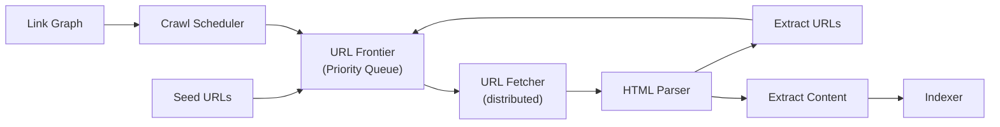
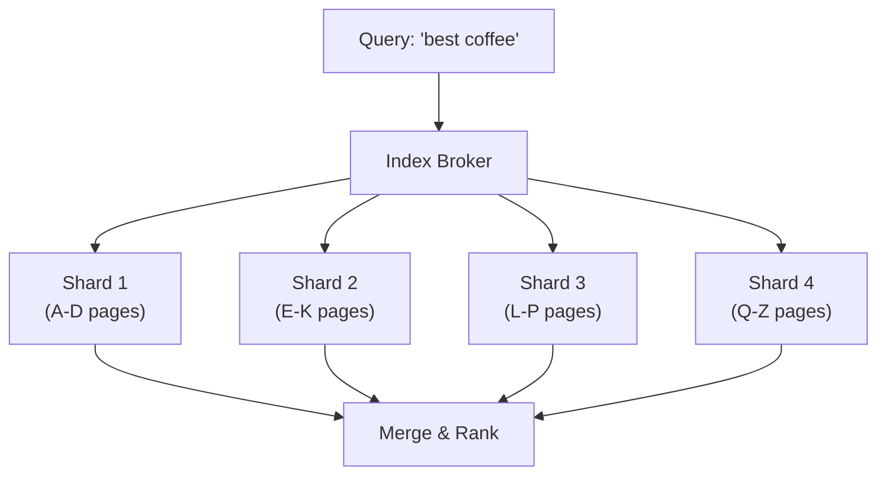
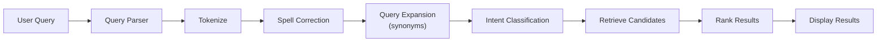
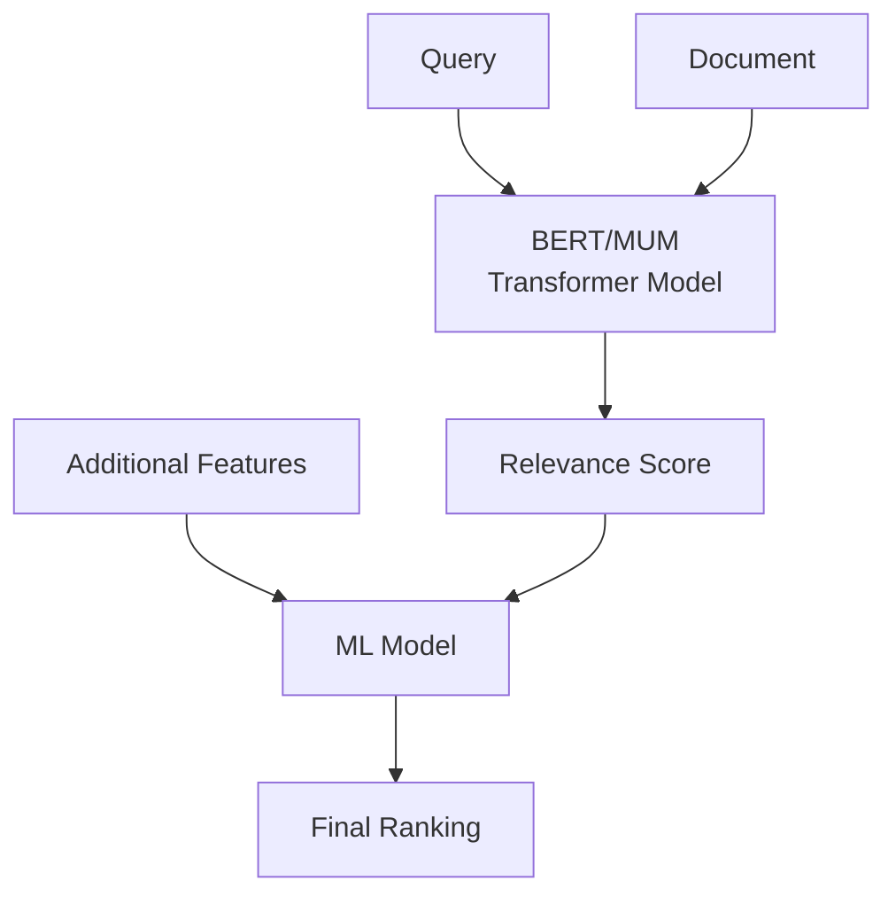
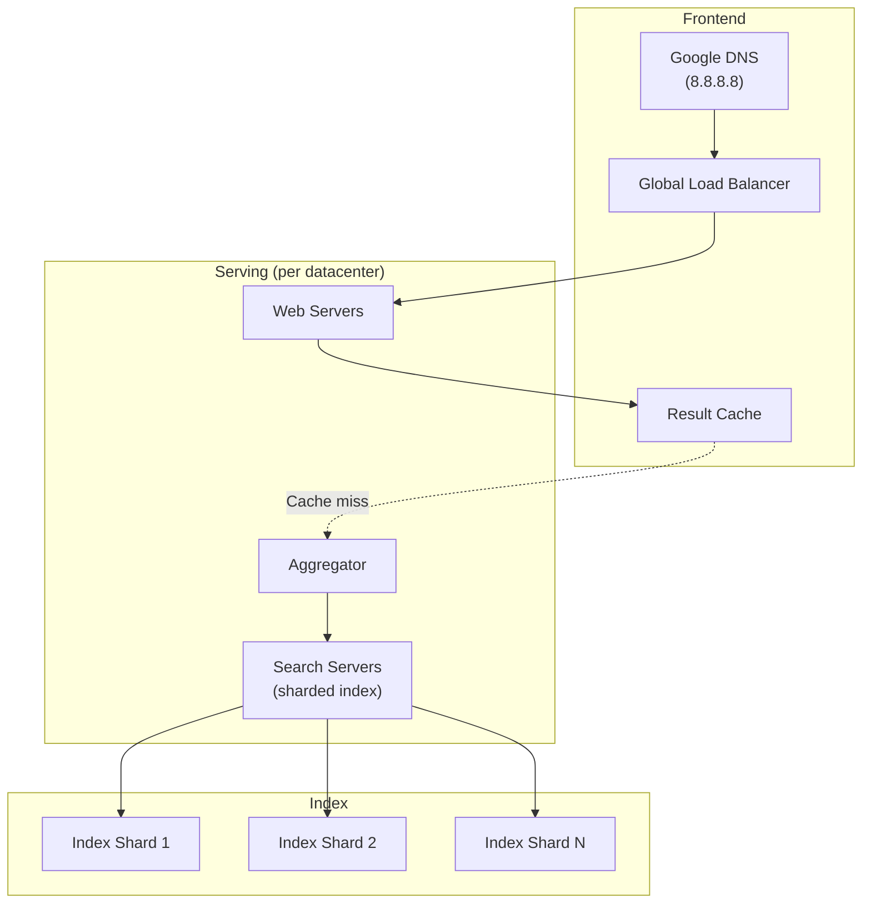

# How Google Search Works

## Overview

Google Search processes 8.5+ billion searches per day across hundreds of billions of web pages. It must return relevant results in under 200ms while continuously crawling and indexing the entire web. This is one of the most complex distributed systems ever built.

## Key Requirements

### Functional
- Crawl and index the entire web (hundreds of billions of pages)
- Full-text search with relevance ranking
- Support for various query types (web, images, news, maps, videos)
- Autocomplete suggestions
- Spell correction and query understanding
- Featured snippets and knowledge panels
- Personalized results based on location and search history

### Non-Functional
- **Scale**: 8.5+ billion searches/day, hundreds of billions of indexed pages
- **Latency**: Results in < 200ms (including ranking)
- **Freshness**: Index updated continuously (minutes for important pages)
- **Relevance**: Continuous improvement via ML and user feedback
- **Availability**: 99.999%

## High-Level Architecture

```mermaid
graph TB
    subgraph "User Layer"
        Browser[Browser]
        App[Mobile App]
    end

    subgraph "Frontend"
        DNS[Google DNS]
        LB[Load Balancer]
        WebServer[Web Server]
    end

    subgraph "Query Processing"
        QP[Query Parser]
        SpellCheck[Spell Checker]
        QueryExpand[Query Expansion]
        IntentClassifier[Intent Classifier]
    end

    subgraph "Index Serving"
        WebIdx["Web Index<br/>(Sharded)"]
        ImageIdx[Image Index]
        NewsIdx[News Index]
    end

    subgraph "Ranking"
        InitialRank[Initial Retrieval<br/>(BM25)]
        MLRank[ML Ranking<br/>(BERT/MUM)]
        Personalize[Personalization]
    end

    subgraph "Crawling"
        Crawler[Web Crawler<br/>(Googlebot)]
        Scheduler[Crawl Scheduler]
        Parser[Page Parser]
    end

    subgraph "Indexing"
        InvertedIdx[Inverted Index Builder]
        DocStore[(Document Store)]
        LinkGraph[Link Graph]
    end

    Browser --> DNS
    App --> DNS
    DNS --> LB
    LB --> WebServer
    WebServer --> QP
    QP --> SpellCheck
    QP --> QueryExpand
    QP --> IntentClassifier
    IntentClassifier --> InitialRank
    InitialRank --> WebIdx
    WebIdx --> MLRank
    MLRank --> Personalize
    Personalize --> WebServer

    Crawler --> Scheduler
    Crawler --> Parser
    Parser --> InvertedIdx
    InvertedIdx --> WebIdx
    Crawler --> DocStore
    Crawler --> LinkGraph
```

## Deep Dive: Crawling (Googlebot)

Google's crawler (Googlebot) continuously discovers and fetches web pages.



**Crawl Pipeline:**
1. **URL Discovery**: From sitemaps, links on known pages, submitted URLs
2. **URL Frontier**: Priority queue ordered by page importance (PageRank), freshness, change frequency
3. **Fetching**: Distributed fetchers download pages (respects robots.txt)
4. **Parsing**: Extract text, links, metadata, structured data
5. **Canonicalization**: Handle duplicate content (www vs non-www, HTTP vs HTTPS)

**Key challenges:**
- Politeness: Don't overload servers (rate limiting per domain)
- Freshness: Re-crawl important pages frequently (news sites every few minutes)
- Deduplication: Detect near-duplicate pages (SimHash, MinHash)
- JavaScript rendering: Execute JS to render SPAs (headless Chromium)

## Deep Dive: Indexing

### Inverted Index

The core data structure for search — maps each word to the documents containing it.

```mermaid
graph LR
    subgraph "Forward Index"
        Doc1["Doc 1: 'the cat sat'"]
        Doc2["Doc 2: 'the dog ran'"]
        Doc3["Doc 3: 'the cat ran'"]
    end

    subgraph "Inverted Index"
        the["the"] --> "[Doc1, Doc2, Doc3]"
        cat["cat"] --> "[Doc1, Doc3]"
        sat["sat"] --> "[Doc1]"
        dog["dog"] --> "[Doc2]"
        ran["ran"] --> "[Doc2, Doc3]"
    end
```

**Inverted index entry:**
```
word → [
    {doc_id: 1, positions: [1, 5], frequency: 2},
    {doc_id: 3, positions: [2], frequency: 1},
    ...
]
```

### Index Sharding



**Sharding strategies:**
- **Document-based**: Each shard contains a subset of documents (Google's primary approach)
- **Term-based**: Each shard contains a subset of terms
- Each shard has **replicas** for redundancy and read throughput

### Document Storage

- **Document Store**: Stores the full text of each page (compressed)
- **Forward Index**: Maps doc_id → content (for snippet generation)
- **Metadata**: Page title, URL, last crawl date, language, PageRank

## Deep Dive: Query Processing



**Steps:**
1. **Tokenization**: "best coffee shops nyc" → ["best", "coffee", "shops", "nyc"]
2. **Spell correction**: "cofee shop" → "coffee shop"
3. **Query expansion**: Add synonyms ("coffee" → "café", "espresso")
4. **Intent classification**: Navigational, informational, transactional
5. **Stop word handling**: Remove common words (the, is, at)

## Deep Dive: Ranking

### Stage 1: Initial Retrieval (BM25)

Retrieve candidate documents using the inverted index with BM25 scoring:

```
BM25(D, Q) = Σ IDF(qi) × (f(qi, D) × (k1 + 1)) / (f(qi, D) + k1 × (1 - b + b × |D|/avgdl))
```

Where:
- IDF(qi) = inverse document frequency of term qi
- f(qi, D) = frequency of qi in document D
- |D| = document length
- avgdl = average document length
- k1, b = tuning parameters

### Stage 2: ML Ranking

Modern Google uses deep learning models:



**Evolution of Google's ranking:**
1. **PageRank** (1998): Link-based authority scoring
2. **BM25 + Features** (2000s): Text relevance + hundreds of features
3. **RankBrain** (2015): ML-based ranking using deep learning
4. **BERT** (2019): Understanding query context and intent
5. **MUM** (2021): Multimodal understanding (text, images, video)

### PageRank (Simplified)

PageRank assigns importance to pages based on incoming links:

```
PR(A) = (1-d) + d × Σ PR(Ti)/C(Ti)

Where:
- d = damping factor (0.85)
- Ti = pages linking to A
- C(Ti) = number of outbound links from Ti
```

**Intuition:** A page is important if important pages link to it.

## Deep Dive: Serving Infrastructure



**Serving flow:**
1. DNS resolves to nearest datacenter
2. Web server checks result cache (popular queries cached)
3. On cache miss, aggregator queries all index shards in parallel
4. Each shard returns top-K candidates with BM25 scores
5. Aggregator merges results and applies ML ranking
6. Results returned with snippets, knowledge panels, etc.

## Scalability

| Component | Strategy |
|-----------|---------|
| Crawling | Distributed across thousands of machines, rate-limited per domain |
| Index | Sharded by document ID across thousands of nodes |
| Serving | Multi-datacenter, result caching, CDN for static assets |
| Ranking | Pre-computed features, real-time ML inference |
| Storage | Custom distributed file system (Colossus), Bigtable |

## Trade-Offs

| Decision | Benefit | Cost |
|----------|---------|------|
| Inverted index | Fast text search | Large storage overhead |
| Document sharding | Parallel retrieval | Must merge results across shards |
| BM25 initial retrieval | Fast candidate filtering | Less accurate than full ML |
| Two-stage ranking | Speed (BM25) + accuracy (ML) | Complexity |
| Result caching | Ultra-fast for popular queries | Stale results risk |
| Continuous crawling | Fresh index | Massive infrastructure cost |

## Interview Tips

1. **Start with the scale** — 8.5B searches/day, hundreds of billions of pages
2. **Explain the inverted index** — the core data structure for search
3. **Discuss two-stage ranking** — BM25 for fast retrieval, ML for accurate ranking
4. **Mention PageRank** — even if simplified, it shows you understand link analysis
5. **Talk about crawling challenges** — politeness, freshness, deduplication, JS rendering
6. **Don't forget caching** — popular queries are cached for instant results
7. **Mention sharding** — index is partitioned across thousands of machines

## Key Takeaways

- Google Search indexes hundreds of billions of pages using an inverted index.
- Two-stage ranking: BM25 for fast candidate retrieval, deep learning (BERT/MUM) for accurate ranking.
- Crawling (Googlebot) is a distributed system that respects robots.txt and re-crawls based on page importance.
- The index is sharded by document ID across thousands of nodes in multiple datacenters.
- Result caching handles popular queries; cache misses trigger parallel queries to all shards.
- PageRank (link analysis) was foundational; modern ranking uses hundreds of ML features.
- Query processing includes spell correction, synonym expansion, and intent classification.

## Cross-References

- [Search Engine Design](../search.md)
- [Typeahead](../typeahead.md)
- [Web Crawler](../web-crawler.md)
- [Ads System](../ads.md)
- [Caching Strategy](../hld/caching-strategy.md)

