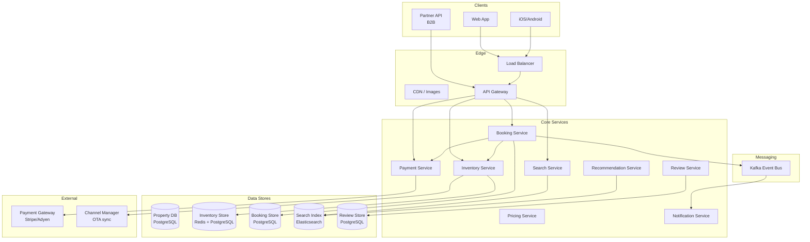
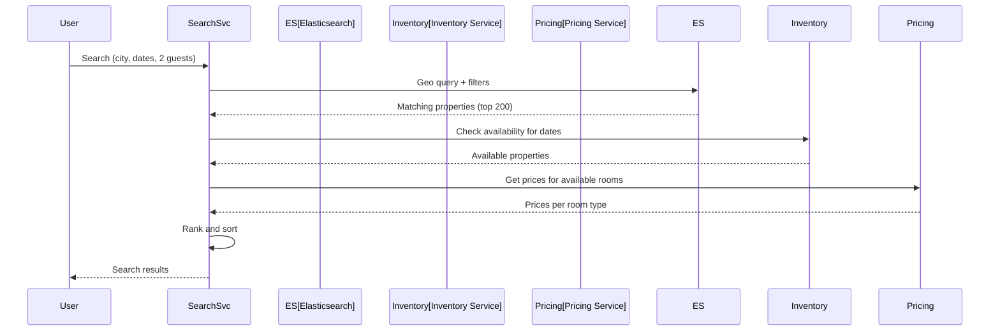
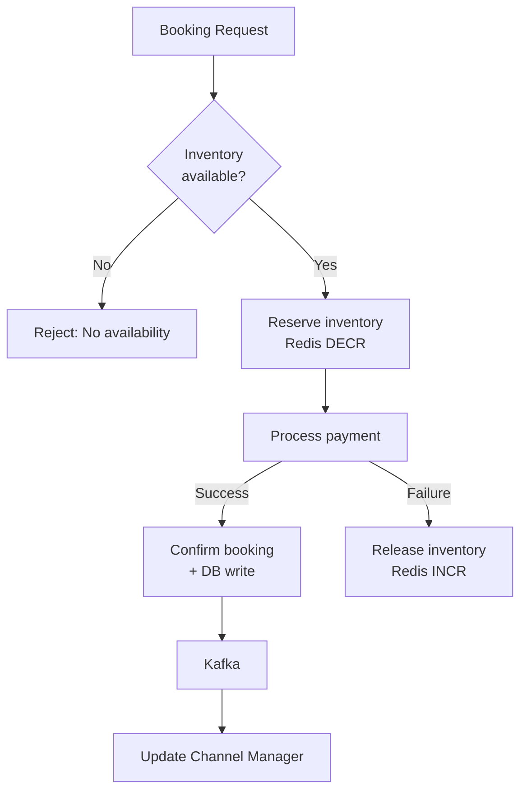
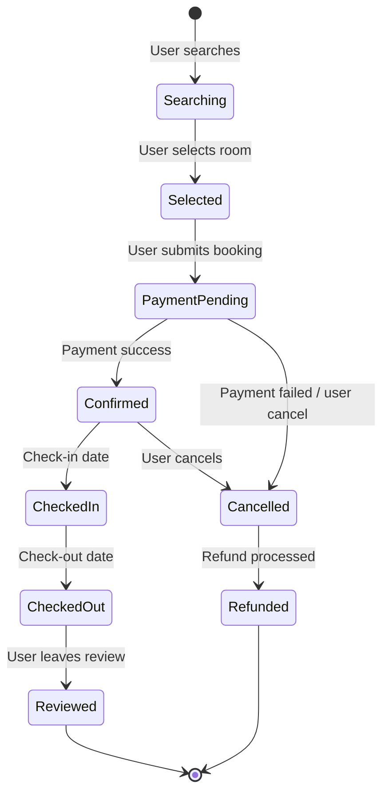

# Hotel Booking Platform

## Overview

A hotel booking platform (like Booking.com or Airbnb) connects travelers with accommodation providers. The platform lists millions of properties, supports real-time availability and pricing, handles reservations with strong consistency, processes payments, and manages reviews and recommendations. The core design challenges include maintaining real-time inventory consistency across thousands of OTA (Online Travel Agency) channels, handling concurrent booking attempts for the same room on the same dates, and providing fast geographic search with filters.

## Key Requirements

### Functional
- Search hotels by location, dates, guests, price, amenities, rating
- View hotel details: photos, amenities, room types, policies
- Check real-time availability and pricing for specific dates
- Make reservations (select room, enter guest details, payment)
- Payment processing (credit card, PayPal, wallets)
- Booking management (modify, cancel, refund)
- Reviews and ratings system
- Recommendations (similar hotels, frequently booked together)
- Multi-currency and multi-language support

### Non-Functional
| Requirement | Target |
|------------|--------|
| Scale | 500M+ monthly searches, 30M+ bookings/month |
| Search QPS | 50K+ searches/sec |
| Inventory consistency | No double bookings (strong consistency) |
| Latency | Search < 500ms, booking < 2s |
| Availability | 99.99% |
| Data freshness | Availability/pricing updated within seconds |

### Capacity Estimation

```
Monthly active users: 150M
Daily searches: 10M
Daily bookings: 1M
Properties listed: 5M
Room types per property: 5 (avg)
Booking QPS: 1M / 86400 ≈ 12/sec (avg), 100/sec (peak)

Storage (properties): 5M × 10KB = ~50 GB
Storage (bookings): 1M/day × 3KB × 365 = ~1.1 TB/year
Storage (reviews): 2M/day × 1KB × 365 = ~730 GB/year

Bandwidth (search): 50K/sec × 100KB (search results with images) = ~5 GB/s
```

## High-Level Architecture



## Deep Dive: Search and Availability

Hotel search is geo-based with complex filters: dates, guest count, price range, amenities, star rating, distance from landmarks.



**Search ranking factors:**
- Relevance (location match, filter match)
- Price competitiveness (cheaper options rank higher for price-sensitive queries)
- Review score and quantity
- Booking conversion rate (historical)
- Partner commission (sponsored listings)
- Availability and urgency (few rooms left)

**Geographic search:** Elasticsearch `geo_point` with `geo_distance` query. Properties within the search radius are retrieved, then filtered by date availability.

## Deep Dive: Inventory Management and Double Booking Prevention

Preventing double bookings when multiple users try to book the same room on the same dates is the most critical consistency requirement.



**Double booking prevention strategy:**
1. **Redis inventory cache** — for each `(property_id, room_type, date)`, maintain an available count in Redis
2. **Atomic decrement** — `DECR` is atomic; if the result is < 0, immediately `INCR` back and reject
3. **Database lock** — use `SELECT ... FOR UPDATE` on the inventory row in PostgreSQL for strong consistency
4. **Optimistic concurrency** — version-based: read inventory with version, write only if version hasn't changed
5. **Compensation** — if two bookings succeed (race condition), the later one is cancelled with an apology

**Channel Manager sync:** Hotels may be listed on multiple OTAs (Booking.com, Expedia, Airbnb). A Channel Manager synchronizes availability and pricing across all channels in near-real-time.

## Deep Dive: Booking State Machine



**Payment handling:**
- **Authorization at booking** — hold the amount on the credit card
- **Capture at check-in** — charge the card when the guest arrives
- **Refund on cancellation** — full or partial refund based on cancellation policy
- **No-show handling** — charge the full amount if the guest doesn't show

## API Design

| Endpoint | Method | Description |
|----------|--------|-------------|
| `/v1/hotels/search` | GET | Search hotels with geo + filters |
| `/v1/hotels/{id}` | GET | Get hotel details |
| `/v1/hotels/{id}/availability` | GET | Check availability for dates |
| `/v1/hotels/{id}/rooms` | GET | List room types with prices |
| `/v1/bookings` | POST | Create a booking |
| `/v1/bookings/{id}` | GET | Get booking details |
| `/v1/bookings/{id}/cancel` | POST | Cancel a booking |
| `/v1/hotels/{id}/reviews` | GET | Get hotel reviews |
| `/v1/hotels/{id}/reviews` | POST | Submit a review |
| `/v1/recommendations` | GET | Get personalized hotel recommendations |

## Data Model

```sql
CREATE TABLE properties (
    property_id  BIGSERIAL PRIMARY KEY,
    name         VARCHAR(300) NOT NULL,
    latitude     FLOAT NOT NULL,
    longitude    FLOAT NOT NULL,
    city         VARCHAR(100),
    country      VARCHAR(50),
    star_rating  SMALLINT,
    amenities    TEXT[],
    image_urls   TEXT[],
    created_at   TIMESTAMPTZ DEFAULT NOW()
);

CREATE TABLE room_types (
    room_id      BIGSERIAL PRIMARY KEY,
    property_id  BIGINT NOT NULL,
    name         VARCHAR(100) NOT NULL,
    max_guests   INT DEFAULT 2,
    base_price   DECIMAL(10,2) NOT NULL
);

CREATE TABLE inventory (
    property_id  BIGINT,
    room_id      BIGINT,
    date         DATE,
    total_rooms  INT NOT NULL,
    booked_rooms INT DEFAULT 0,
    price        DECIMAL(10,2),
    PRIMARY KEY (property_id, room_id, date)
);

CREATE TABLE bookings (
    booking_id   BIGSERIAL PRIMARY KEY,
    property_id  BIGINT NOT NULL,
    room_id      BIGINT NOT NULL,
    user_id      BIGINT NOT NULL,
    check_in     DATE NOT NULL,
    check_out    DATE NOT NULL,
    status       ENUM('pending','confirmed','checked_in','checked_out','cancelled') DEFAULT 'pending',
    total_price  DECIMAL(10,2) NOT NULL,
    created_at   TIMESTAMPTZ DEFAULT NOW()
);
```

## Scalability

| Component | Strategy |
|-----------|----------|
| Hotel Search | Elasticsearch with geo-point, sharded by region |
| Inventory Cache | Redis cluster, partitioned by property_id + date |
| Inventory DB | PostgreSQL, partitioned by date, `SELECT FOR UPDATE` for locking |
| Bookings | PostgreSQL, sharded by property_id |
| Images | S3 + CDN (CloudFront) |
| Channel Manager | Event-driven sync via Kafka to external OTAs |

## Trade-Offs

| Decision | Benefit | Cost |
|----------|---------|------|
| Redis for inventory | Fast availability checks, atomic decrement | Cache-DB consistency risk |
| `SELECT FOR UPDATE` | Strong consistency, no double bookings | Reduced concurrency, lock contention |
| Authorization at booking | Guarantee payment for hotel | Complex refund flow on cancellation |
| Elasticsearch for search | Geo queries + full-text + filters | Indexing lag for new properties |
| Channel Manager sync | Unified inventory across OTAs | Sync delays can cause overbooking |

## Interview Tips

1. **Lead with the double booking problem** — "The most critical challenge is preventing double bookings when multiple users compete for the same room."
2. **Explain the Redis + DB two-phase approach** — Redis for fast availability checks, DB for strong consistency.
3. **Discuss search** — geo-distance query with complex filters (dates, guests, amenities, price).
4. **Mention the Channel Manager** — hotels are listed on multiple OTAs; availability must be synchronized.
5. **Cover the booking state machine** — pending → confirmed → checked-in → checked-out → reviewed.
6. **Talk about pricing** — dynamic pricing based on demand, season, and competitor rates.

## Interview Questions

1. How would you prevent double bookings when multiple users try to reserve the same room simultaneously?
2. Design the hotel search system — geo queries, date availability, and ranking.
3. How would you handle inventory synchronization across multiple booking platforms (OTAs)?
4. Design the booking payment flow — authorization, capture, and refund.
5. How would you implement dynamic pricing for hotel rooms?
6. Design the review and rating system — how do you detect fake reviews?
7. How would you handle booking cancellations and refunds at scale?
8. Design a recommendation system for hotels based on user preferences and booking history.
9. How would you implement multi-currency support with real-time exchange rates?
10. Design the notification system — booking confirmation, cancellation, check-in reminders, review requests.

## Key Takeaways

- Double booking prevention uses a two-phase approach: Redis atomic decrement for fast checks, PostgreSQL `SELECT FOR UPDATE` for strong consistency.
- Hotel search uses Elasticsearch geo-point queries with complex filters and ML-based ranking.
- The Channel Manager synchronizes availability and pricing across multiple OTAs via event-driven updates.
- Booking lifecycle is a state machine: pending → confirmed → checked-in → checked-out → reviewed.
- Payment uses authorization-at-booking, capture-at-check-in, and refund-on-cancellation patterns.

## Cross-References

- [Payment System](./payment-system.md) — Authorization, capture, refund patterns
- [Search Autocomplete](./search-autocomplete.md) — Search infrastructure
- [Notification System](./notification-system.md) — Booking notifications
- [Distributed Lock](./distributed-lock.md) — Inventory locking strategies

## References

- Booking.com Engineering Blog: "How We Scale to 1.5M+ Room Nights Booked Daily"
- Airbnb Engineering: "Search and Pricing at Airbnb"
- Google Cloud: "Building a Hotel Booking System on Cloud Spanner"
