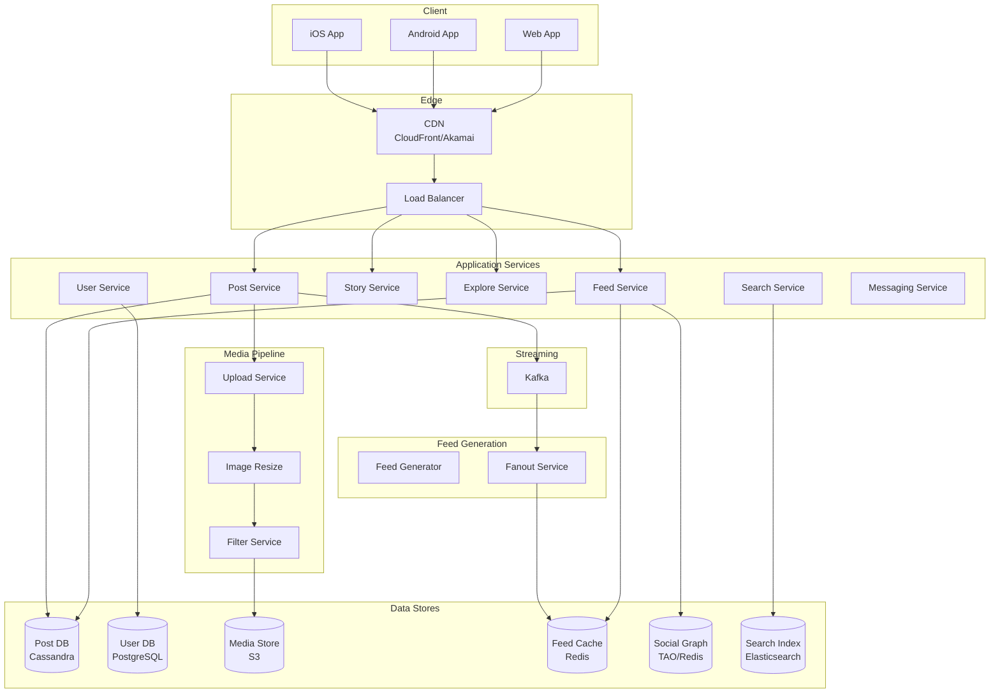
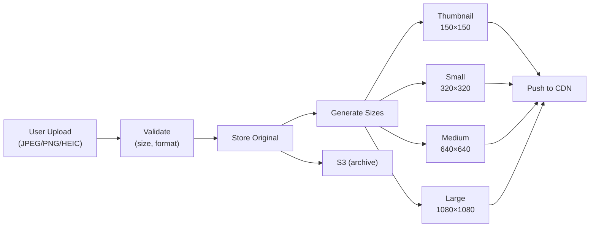
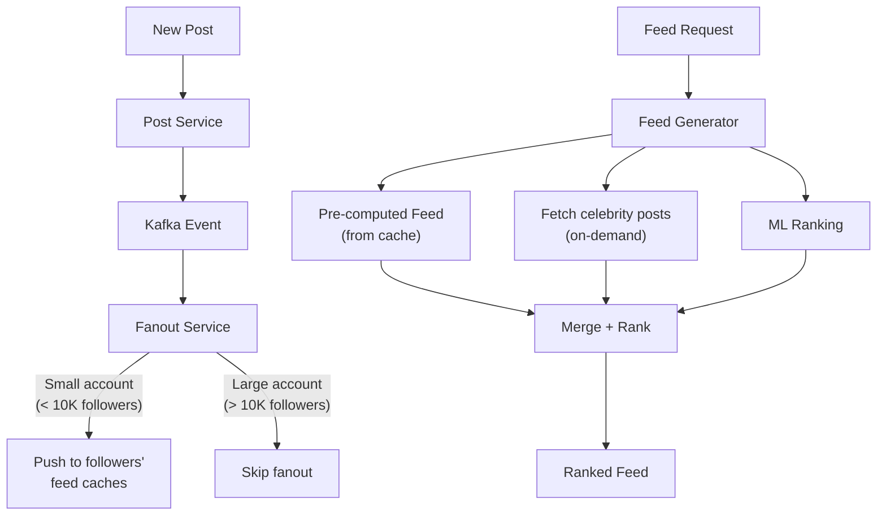
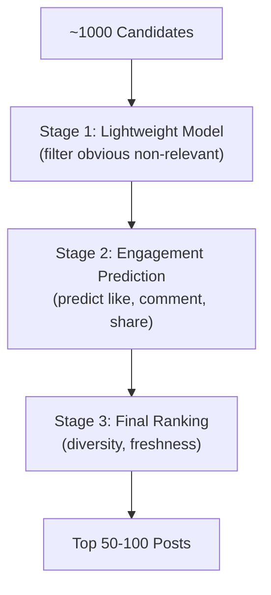
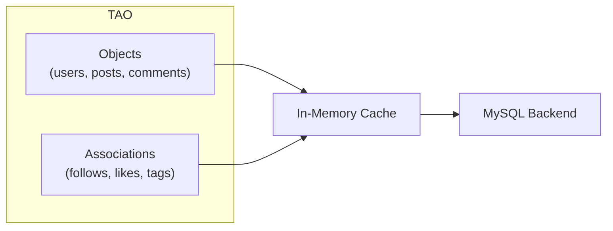
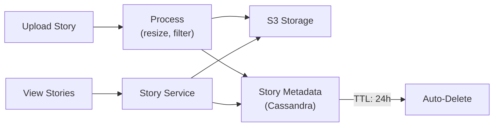
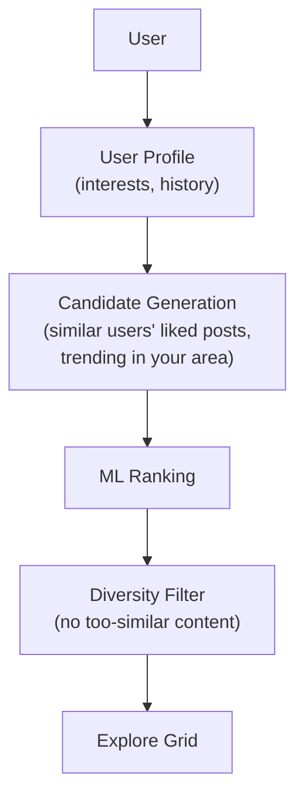

# How Instagram Works

## Overview

Instagram is a photo and video sharing platform with 2+ billion monthly active users. Users share 100+ million photos and videos daily, which must be stored, processed, and delivered to followers' feeds in near real-time. Instagram's architecture evolved from a small Django app to one of the largest deployments on AWS.

## Key Requirements

### Functional
- Upload photos and videos (with filters and editing)
- Follow users and view a personalized feed
- Stories (24-hour ephemeral content)
- Reels (short-form video)
- Direct messaging
- Explore page (discover new content)
- Search (users, hashtags, places)
- Shopping and commerce

### Non-Functional
- **Scale**: 2+ billion MAU, 500M+ DAU
- **Uploads**: 100+ million photos/videos per day
- **Feed reads**: Billions of feed requests per day
- **Latency**: Feed load < 200ms, image load < 100ms
- **Availability**: 99.99%
- **Storage**: Exabytes of media

## High-Level Architecture

## Deep Dive: Media Upload & Processing

### Image Processing Pipeline

**Image processing:**
1. Upload to server via resumable upload
2. Store original in S3
3. Generate multiple sizes (thumbnail, small, medium, large, original)
4. Apply compression (WebP for web, HEIC for iOS)
5. Push processed images to CDN edge locations
6. Background tasks: metadata extraction, EXIF stripping (privacy)

**Storage per image:**
- Original: ~3 MB
- Processed sizes: ~1.5 MB total (all sizes combined)
- 100M uploads/day × 4.5 MB = ~450 TB/day

### Video Processing
- Transcode to multiple resolutions (240p to 1080p)
- Generate thumbnails at key frames
- Create preview GIFs for feed
- Extract audio for Reels

## Deep Dive: Feed Generation

Instagram uses a **hybrid approach** similar to Twitter:

### Feed Ranking (ML-based)

Instagram's feed ranking uses a multi-stage ML pipeline:

**Ranking signals:**
- **Interest**: How likely the user will engage (based on past behavior)
- **Timeliness**: How recent the post is
- **Relationship**: How close the user is to the poster (DM frequency, profile visits)
- **Engagement**: Overall engagement rate of the post
- **Diversity**: Mix of content types, creators, topics

## Deep Dive: Social Graph

Instagram uses **TAO (The Associations and Objects)** — Facebook's social graph store:

**Key relationships:**
- `user A --follows--> user B`
- `user A --likes--> post P`
- `post P --belongs_to--> user A`
- `post P --tagged_with--> hashtag H`

## Deep Dive: Stories

Stories are ephemeral content that disappears after 24 hours.

**Key design decisions:**
- Stories are stored with a 24-hour TTL
- Story ring at top of feed is pre-fetched for fast loading
- Stories use a **tap-to-advance** model (not scroll)
- Pre-fetch the next 3 stories while user watches current one

## Deep Dive: Explore Page

The Explore page helps users discover new content from accounts they don't follow.

**How Explore works:**
1. Build user interest profile from likes, saves, watch time
2. Find posts liked by similar users (collaborative filtering)
3. Include trending posts in user's region
4. Rank by predicted engagement
5. Apply diversity filters (avoid showing 10 photos from same creator)

## Scalability

| Component | Strategy |
|-----------|---------|
| Media storage | S3 (exabytes), multi-region replication |
| Media delivery | Multi-CDN (CloudFront, Akamai, Fastly) |
| Feed cache | Redis cluster (partitioned by user_id) |
| Posts | Cassandra (partitioned by user_id) |
| Social graph | TAO (in-memory cache + MySQL) |
| Search | Elasticsearch |
| Real-time events | Kafka |
| Image processing | Async workers (Celery on AWS) |

## Trade-Offs

| Decision | Benefit | Cost |
|----------|---------|------|
| Multi-size image generation | Fast loading on all devices | Storage cost (4x per image) |
| Hybrid fanout | Fast feed reads for most users | Complexity of two paths |
| Cassandra for posts | High write throughput | Eventual consistency |
| Multi-CDN | Low latency globally | Operational complexity |
| ML-based feed ranking | Higher engagement | Filter bubble risk |
| 24h TTL for stories | Automatic cleanup | No persistence option |

## Interview Tips

1. **Start with the scale** — 2B MAU, 100M uploads/day, exabytes of storage
2. **Explain media processing** — multiple sizes, formats (WebP/HEIC), CDN distribution
3. **Discuss feed generation** — hybrid fanout (push for regular, pull for celebrities)
4. **Mention feed ranking** — ML-based, multi-stage, signals like interest/timeliness/relationship
5. **Talk about the social graph** — TAO for fast relationship queries
6. **Don't forget Stories** — ephemeral content, 24h TTL, pre-fetching
7. **Discuss Explore** — collaborative filtering + trending + diversity

## Key Takeaways

- Instagram stores exabytes of media across S3 with multi-CDN delivery.
- Each image is processed into multiple sizes and formats (WebP, HEIC) for optimal delivery.
- Feed generation uses hybrid fanout: push for regular users, on-demand merge for celebrities.
- Feed ranking is ML-based with signals for interest, timeliness, relationship, and diversity.
- Social graph uses TAO (in-memory cache + MySQL) for fast relationship queries.
- Stories use 24-hour TTL with pre-fetching for smooth playback.
- Explore page uses collaborative filtering to help users discover new content.
