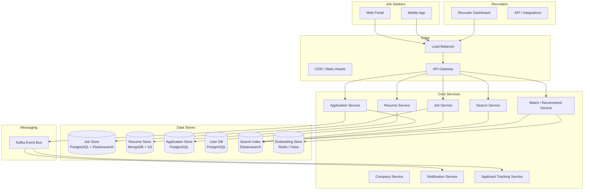
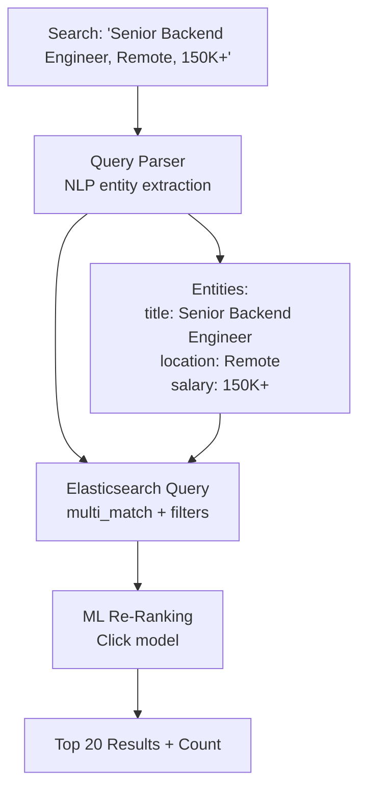
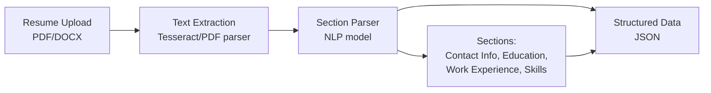

# Job Portal: Job Search & Application Platform

## Overview

A job portal (like Indeed, Naukri, or Lever) connects job seekers with employers. The platform hosts millions of job listings, supports advanced search with filters (location, salary, experience, remote), manages the full application lifecycle (search → apply → interview → offer), provides resume/CV management, and offers recruiter tools for candidate sourcing. Core challenges include real-time job search over millions of listings, resume parsing, applicant tracking, and matching algorithms.

## Key Requirements

### Functional
- Job search with advanced filters (title, location, salary, experience, remote, company size)
- Job posting and management for employers
- Resume/CV upload, parsing, and management
- Application submission and tracking
- Recruiter dashboard: search candidates, manage pipeline, schedule interviews
- Job recommendations for seekers, candidate recommendations for recruiters
- Email notifications for new matching jobs, application updates
- Company pages with reviews and salary data

### Non-Functional
| Requirement | Target |
|------------|--------|
| Scale | 300M+ job seekers, 30M+ job listings |
| Search QPS | 50K+ job searches/sec |
| Latency | Search < 300ms, apply < 500ms |
| Availability | 99.99% |
| Consistency | Strong for applications, eventual for search index |

### Capacity Estimation

```
Daily active job seekers: 50M
Daily active recruiters: 5M
Job searches per day: 200M
Applications per day: 10M
New job postings per day: 500K
Resume uploads per day: 1M

Storage (jobs): 500K/day × 3KB × 365 = ~550 GB/year
Storage (resumes): 1M/day × 200KB = ~200 GB/day → ~73 TB/year
Storage (applications): 10M/day × 2KB = ~20 GB/day → ~7.3 TB/year

Search index: ~2x job storage = ~1.1 TB/year growth
```

## High-Level Architecture



## Deep Dive: Job Search

Job search is the highest-traffic operation and must return relevant results from millions of listings in < 300ms.



**Search pipeline:**
1. **Query understanding**: NLP extracts job title, location, salary, skills from natural language
2. **Elasticsearch query**: `multi_match` on title, description, company name + `term` filters on location, salary range, experience level
3. **Re-ranking**: An ML model (trained on past apply/click signals) re-ranks the top 100 ES results
4. **Sponsored jobs**: Inject promoted listings (paid by recruiters) at positions 1, 3, 5
5. **Pagination**: Cursor-based pagination for infinite scroll

**Key Elasticsearch mappings:**
- `title`: `text` with n-gram analyzer (partial title matches)
- `description`: `text` with standard analyzer
- `location`: `geo_point` for radius-based search
- `salary_min`, `salary_max`: `integer` for range filters
- `posted_at`: `date` for recency sorting
- `company_id`: `keyword` for exact match

## Deep Dive: Resume Parsing



**Resume parsing pipeline:**
1. **Text extraction**: Parse PDF/DOCX to plain text
2. **Section classification**: NLP model classifies text blocks into sections (education, experience, skills, projects)
3. **Entity extraction**: Extract structured fields — job titles, companies, dates, degree, skills, GPA
4. **Skill normalization**: Map raw skill text to a standardized skill taxonomy (e.g., "JS" → "JavaScript")
5. **Generate embeddings**: Create vector embeddings for semantic matching with job descriptions

## Deep Dive: Matching Engine

The matching engine connects job seekers with relevant jobs and recruiters with relevant candidates.

**Two-sided matching:**
- **Job → Seeker**: When a new job is posted, find matching seekers (used for push notifications)
- **Seeker → Job**: When a seeker searches, find matching jobs (used in search results)

**Matching features:**
- Skill overlap (Jaccard similarity of skill sets)
- Experience level match
- Location proximity or remote preference
- Salary expectation alignment
- Past interaction signals (apply history, saved jobs)
- Semantic similarity using embeddings (Faiss for nearest-neighbor search)

## API Design

| Endpoint | Method | Description |
|----------|--------|-------------|
| `/v1/jobs/search` | GET | Search jobs with filters and pagination |
| `/v1/jobs/{id}` | GET | Get job details |
| `/v1/jobs` | POST | Create a job posting (recruiter) |
| `/v1/jobs/{id}/apply` | POST | Submit an application |
| `/v1/resumes` | POST | Upload and parse a resume |
| `/v1/resumes/{id}` | GET | Get parsed resume data |
| `/v1/applications` | GET | List user's applications with status |
| `/v1/recruiter/candidates/search` | GET | Search candidate resumes |
| `/v1/recommendations/jobs` | GET | Get personalized job recommendations |
| `/v1/companies/{id}` | GET | Get company profile, reviews, salaries |

## Data Model

```sql
CREATE TABLE jobs (
    job_id       BIGSERIAL PRIMARY KEY,
    company_id   BIGINT NOT NULL,
    recruiter_id BIGINT NOT NULL,
    title        VARCHAR(200) NOT NULL,
    description  TEXT NOT NULL,
    location     VARCHAR(200),
    latitude     FLOAT,
    longitude    FLOAT,
    salary_min   INT,
    salary_max   INT,
    experience_min INT,
    experience_max INT,
    is_remote    BOOLEAN DEFAULT FALSE,
    status       ENUM('active','paused','closed','expired') DEFAULT 'active',
    posted_at    TIMESTAMPTZ DEFAULT NOW(),
    expires_at   TIMESTAMPTZ
);

CREATE TABLE applications (
    application_id BIGSERIAL PRIMARY KEY,
    job_id         BIGINT NOT NULL,
    seeker_id      BIGINT NOT NULL,
    resume_id      BIGINT,
    cover_letter   TEXT,
    status         ENUM('applied','screening','interview','offer','rejected','hired'),
    applied_at     TIMESTAMPTZ DEFAULT NOW(),
    UNIQUE (job_id, seeker_id)
);

CREATE TABLE resumes (
    resume_id    BIGSERIAL PRIMARY KEY,
    seeker_id    BIGINT NOT NULL,
    file_url     TEXT,
    parsed_data  JSONB,  -- structured fields from parsing
    skills       TEXT[],
    experience_years INT,
    created_at   TIMESTAMPTZ DEFAULT NOW()
);
```

## Scalability

| Component | Strategy |
|-----------|----------|
| Job Search | Elasticsearch cluster, sharded by geography, refreshed near-real-time |
| Job Store | PostgreSQL with read replicas, time-partitioned |
| Resumes | MongoDB for parsed data, S3 for original files |
| Applications | PostgreSQL, sharded by job_id |
| Matching | Faiss index for vector similarity, batch-computed recommendations |
| Resume Parsing | Async worker queue (Kafka), NLP model inference |

## Trade-Offs

| Decision | Benefit | Cost |
|----------|---------|------|
| Elasticsearch for search | Powerful full-text + geo + filter queries | Indexing lag (~seconds) |
| NLP resume parsing | Structured data from unstructured resumes | Parsing accuracy < 100% |
| Sponsored job injection | Revenue from recruiters | User experience degradation if overdone |
| Async resume parsing | Non-blocking upload experience | Delay before resume is searchable |
| Faiss for matching | Fast semantic similarity at scale | Embedding quality depends on training data |

## Interview Tips

1. **Lead with the search problem** — "Job search is the highest-traffic operation: 50K+ QPS over millions of listings."
2. **Explain the search pipeline** — NLP query understanding → Elasticsearch → ML re-ranking → sponsored injection.
3. **Discuss resume parsing** — text extraction, section classification, entity extraction, skill normalization.
4. **Mention two-sided matching** — jobs→seekers and seekers→jobs, using both rule-based and ML approaches.
5. **Address the ATS (Applicant Tracking System)** — a pipeline: applied → screening → interview → offer → hire.
6. **Talk about search filters** — geo-point for location, range for salary, keyword for skills.

## Interview Questions

1. Design the job search system — how do you return relevant results from millions of listings in < 300ms?
2. How would you implement resume parsing — extract structured data from unstructured PDFs/DOCX files?
3. Design the two-sided matching engine (jobs↔seekers).
4. How would you handle 10M applications per day and the associated read load from recruiters?
5. Design the applicant tracking system — manage the full hiring pipeline.
6. How would you implement personalized job recommendations?
7. Design the recruiter dashboard — search candidates, manage pipeline, schedule interviews.
8. How would you handle job scraping from company websites and deduplication?
9. Design the notification system — alert seekers about new matching jobs.
10. How would you detect and prevent fake job postings?

## Key Takeaways

- Job search uses NLP query understanding → Elasticsearch → ML re-ranking → sponsored injection for relevant results in < 300ms.
- Resume parsing extracts structured data (skills, experience, education) from unstructured documents using NLP.
- Two-sided matching connects seekers with jobs and recruiters with candidates using skill overlap and semantic embeddings.
- Elasticsearch handles full-text search with geo-point location filters and range filters on salary and experience.
- The applicant tracking system (ATS) manages the full pipeline: applied → screening → interview → offer → hire.

## Cross-References

- [LinkedIn](./linkedin.md) — Professional network with job marketplace
- [Search Autocomplete](./search-autocomplete.md) — Search query suggestions
- [Notification System](./notification-system.md) — Job alert notifications
- [Analytics Platform](./analytics-platform.md) — Recruiter analytics dashboards

## References

- Indeed Engineering Blog: "How We Built Our Job Search Engine"
- Rajaraman et al., "Data-Driven Approaches to Match Job Seekers and Jobs" (KDD)
- Elasticsearch Documentation: "Geo Queries and Aggregations"
