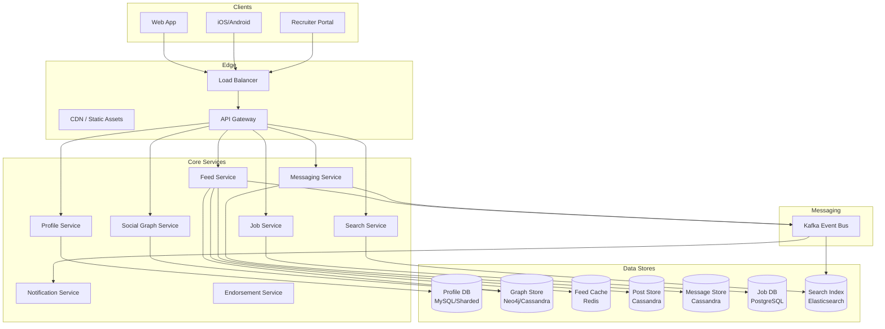
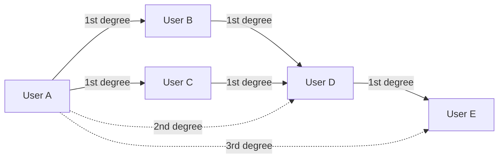
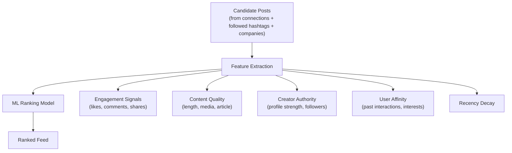
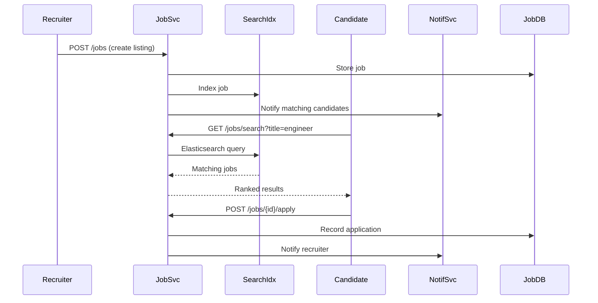

# LinkedIn: Professional Network Platform

## Overview

LinkedIn is the world's largest professional network with 900M+ members across 200+ countries. The platform enables user profiles, professional connections, a content feed, messaging, job postings, skill endorsements, and recruiter-driven talent discovery. The core design challenges include a massive social graph with degree-1/degree-2 connection queries, content ranking for professional relevance, real-time messaging, and a job marketplace that connects millions of applicants with employers.

## Key Requirements

### Functional
- User profiles (experience, education, skills, certifications)
- Connection management (send/accept/remove connections, degrees of separation)
- Content feed (posts, articles, reactions, comments)
- Messaging (1:1 and group conversations)
- Job postings, search, and application tracking
- Skill endorsements and recommendations
- People and content search
- Recruiter tools (candidate search, InMail, talent pipeline)

### Non-Functional
| Requirement | Target |
|------------|--------|
| Scale | 900M+ members, 58M+ companies |
| Read QPS | ~2M feed loads/sec |
| Write QPS | ~50K posts/sec |
| Latency | Feed load < 300ms, search < 200ms |
| Availability | 99.99% |
| Consistency | Strong for connections, eventual for feed |

### Capacity Estimation

```
Daily active users: 200M
Posts per day: 5M
Connections per user (avg): 500
Messages per day: 20M
Job postings: 100K active listings

Storage (profiles): 900M × 5KB = ~4.5 TB
Storage (connections): 900M × 500 × 8B (user_id pair) = ~3.6 TB
Storage (posts): 5M/day × 2KB × 365 = ~3.6 TB/year
Storage (messages): 20M/day × 1KB × 365 = ~7.3 TB/year

Bandwidth (feed reads): 2M/sec × 20KB (feed response) = ~40 GB/s
```

## High-Level Architecture



## Deep Dive: Professional Social Graph

LinkedIn's social graph differs from consumer networks — connections are bidirectional, verified, and limited (30K max). A key feature is **People You May Know (PYMK)**, which requires finding 2nd and 3rd-degree connections.



**PYMK Algorithm:**
1. Fetch all 1st-degree connections of the user
2. For each connection, fetch their 1st-degree connections
3. Score candidates by: mutual connections count, shared employer, shared school, shared skills, same location
4. Return top-N ranked candidates

**Graph storage:** Adjacency lists stored in Cassandra, partitioned by user_id. For small-degree users, the full list fits in one row. For celebrity users (Influencers, recruiters with 30K connections), the list is chunked.

## Deep Dive: Professional Feed Ranking

LinkedIn's feed is not chronological — it ranks by **professional relevance**.



**Key ranking signals:**
- **Dwell time** — how long users spend reading a post (strongest signal)
- **Engagement velocity** — engagement in the first hour predicts long-term performance
- **Professional relevance** — content from the user's industry, company, or skill domain gets a boost
- **Connection strength** — posts from close connections rank higher than distant ones

**Feed generation strategy:** Pre-compute feed for active users every 15 minutes (fanout-on-write for regular users). For less active users, generate on-the-fly (fanout-on-read).

## Deep Dive: Job Marketplace



**Job search ranking** uses a combination of: keyword match (Elasticsearch BM25), candidate-job fit (ML model trained on past applications), recruiter activity (recently active recruiters' posts rank higher), and location/salary preferences.

## API Design

| Endpoint | Method | Description |
|----------|--------|-------------|
| `/v1/profiles/{user_id}` | GET | Get user profile |
| `/v1/connections` | POST | Send connection request |
| `/v1/connections/{user_id}` | DELETE | Remove connection |
| `/v1/feed` | GET | Get personalized feed (cursor-paginated) |
| `/v1/posts` | POST | Create a post |
| `/v1/posts/{id}/reactions` | POST | Like/react to post |
| `/v1/messages/conversations` | GET | List conversations |
| `/v1/messages` | POST | Send message |
| `/v1/jobs/search` | GET | Search jobs (filters: title, location, company) |
| `/v1/jobs/{id}/apply` | POST | Apply to a job |
| `/v1/people/search` | GET | Search people by name, skill, company |
| `/v1/pymk` | GET | Get "People You May Know" suggestions |

## Data Model

```sql
CREATE TABLE profiles (
    user_id     BIGINT PRIMARY KEY,
    first_name  VARCHAR(100),
    last_name   VARCHAR(100),
    headline    VARCHAR(300),
    industry    VARCHAR(100),
    location    VARCHAR(200),
    summary     TEXT,
    created_at  TIMESTAMPTZ DEFAULT NOW()
);

CREATE TABLE connections (
    user_id_a  BIGINT,
    user_id_b  BIGINT,
    status     ENUM('pending', 'accepted', 'rejected'),
    created_at TIMESTAMPTZ DEFAULT NOW(),
    PRIMARY KEY (user_id_a, user_id_b)
);

CREATE TABLE jobs (
    job_id      BIGSERIAL PRIMARY KEY,
    company_id  BIGINT NOT NULL,
    title       VARCHAR(200) NOT NULL,
    description TEXT,
    location    VARCHAR(200),
    salary_min  INT,
    salary_max  INT,
    posted_at   TIMESTAMPTZ DEFAULT NOW(),
    expires_at  TIMESTAMPTZ
);

CREATE TABLE job_applications (
    application_id BIGSERIAL PRIMARY KEY,
    job_id         BIGINT NOT NULL,
    candidate_id   BIGINT NOT NULL,
    status         ENUM('applied','screening','interview','offer','rejected'),
    applied_at     TIMESTAMPTZ DEFAULT NOW()
);
```

## Scalability

| Component | Strategy |
|-----------|----------|
| Social Graph | Cassandra adjacency lists, partitioned by user_id |
| Feed Cache | Redis cluster, pre-computed for active users |
| Job Search | Elasticsearch cluster, sharded by geography |
| Messaging | Cassandra, partitioned by conversation_id |
| Profiles | MySQL sharded by user_id, cached in Redis |
| PYMK | Batch-computed nightly, cached, refreshed on demand |

## Trade-Offs

| Decision | Benefit | Cost |
|----------|---------|------|
| Bidirectional-only connections | Trust, professional context | Slower network growth vs Twitter |
| Feed pre-computation (fanout-on-write) | Fast reads | Write amplification for popular users |
| Cassandra for graph | Scales to billions of edges | No native graph traversals |
| Elasticsearch for job search | Powerful full-text + filters | Indexing lag (~seconds) |
| 30K connection limit | Prevents abuse, keeps PYMK fast | Frustrates power users |

## Interview Tips

1. **Lead with the professional graph** — "LinkedIn's core asset is the professional social graph with verified bidirectional connections."
2. **Explain PYMK** — this is the most distinctive feature; discuss 2nd/3rd-degree connection discovery and scoring.
3. **Feed ranking differs from Twitter** — professional relevance, dwell time, and connection strength matter more than recency.
4. **Job marketplace is a two-sided problem** — balance recruiter experience with candidate relevance.
5. **Mention the connection limit** — 30K max connections keeps graph operations bounded.
6. **Discuss messaging** — LinkedIn messaging uses a dedicated service with WebSocket for real-time delivery.

## Interview Questions

1. How would you implement "People You May Know" at scale?
2. How does LinkedIn's feed ranking differ from Facebook's or Twitter's?
3. How would you handle connection requests at 50K QPS?
4. Design the job recommendation engine — how do you match candidates to jobs?
5. How would you store and query the professional social graph efficiently?
6. How does LinkedIn handle recruiter InMail delivery and tracking?
7. What happens when a celebrity (30K connections) posts — how do you fanout?
8. How would you implement skill endorsement without abuse?
9. Design LinkedIn's search: how do you rank people, jobs, and content in unified results?
10. How would you migrate from a monolithic architecture to microservices for a platform this size?

## Key Takeaways

- LinkedIn's professional graph uses bidirectional, verified connections with a 30K limit per user.
- PYMK leverages 2nd/3rd-degree connections scored by shared attributes (employer, school, skills, location).
- Feed ranking prioritizes professional relevance, dwell time, and engagement velocity over pure recency.
- Job marketplace is a two-sided matching problem with ML-driven candidate-job fit scoring.
- Hybrid fanout: pre-computed feeds for active users, on-the-fly generation for inactive ones.

## Cross-References

- [Twitter](./twitter.md) — Comparison of feed fanout strategies
- [News Feed](./news-feed.md) — Feed generation patterns
- [Search Autocomplete](./search-autocomplete.md) — Search infrastructure
- [Notification System](./notification-system.md) — Job alert and message notifications

## References

- LinkedIn Engineering Blog: "The LinkedIn Feed"
- Ahuja et al., "PYMK: People You May Know at LinkedIn" (KDD)
- LinkedIn Engineering: "Scaling the LinkedIn Job Search"
