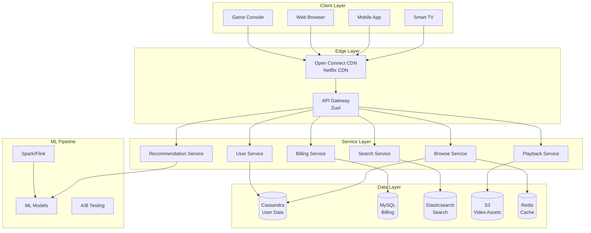
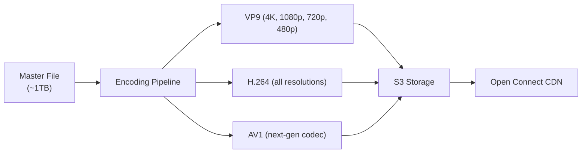
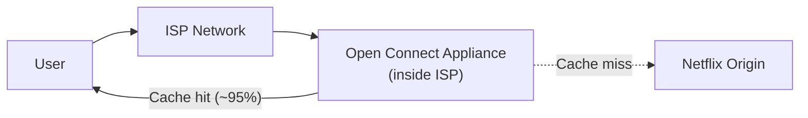
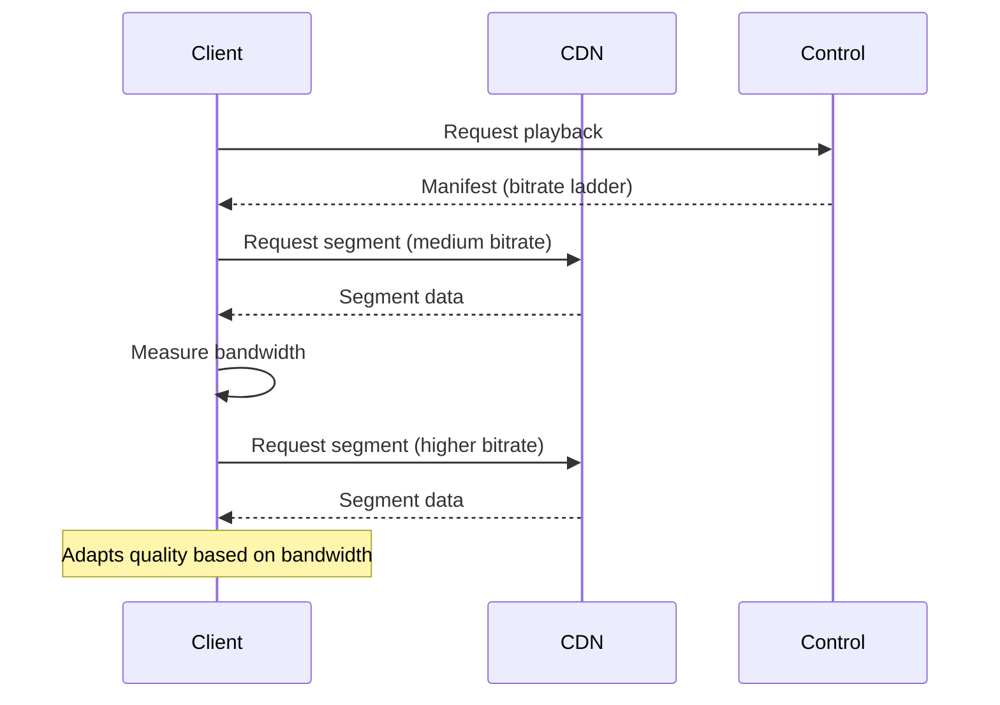
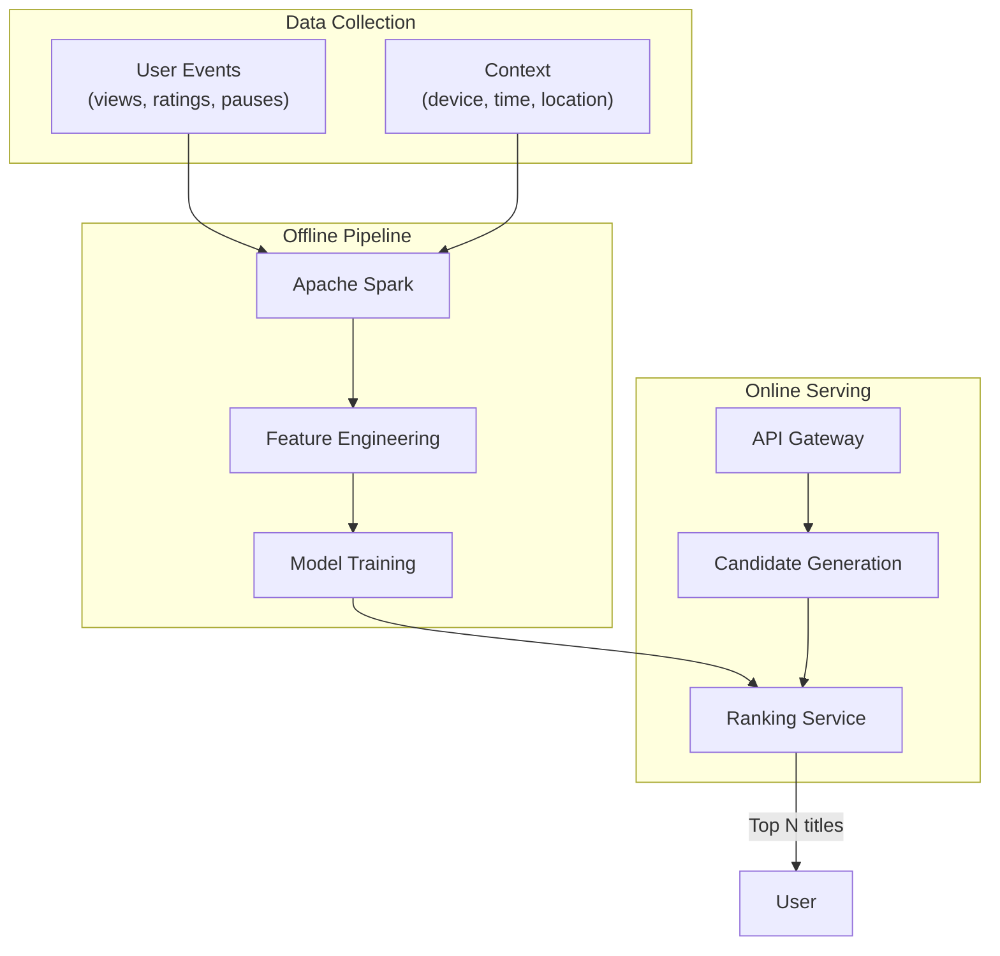

# How Netflix Works

## Overview

Netflix is the world's largest streaming service, serving 260+ million subscribers across 190+ countries. It delivers personalized video experiences at massive scale, handling peak traffic of 15%+ of global internet bandwidth. Netflix's architecture is a benchmark for scalability, resilience, and personalization.

## Key Requirements

### Functional
- Browse and search a catalog of thousands of titles
- Stream video on any device (TV, phone, tablet, browser)
- Personalized recommendations for every user
- User profiles with separate watch history and preferences
- Support for multiple audio tracks and subtitles
- Download for offline viewing

### Non-Functional
- **Scale**: 260M+ subscribers, 100M+ daily active users
- **Availability**: 99.99% (less than 52 minutes downtime/year)
- **Latency**: Video start in < 2 seconds, UI interactions < 100ms
- **Throughput**: Peak of 250+ million hours watched per day
- **Global**: Serve 190+ countries with localized content

## High-Level Architecture

## Deep Dive: Video Streaming Pipeline

### Content Ingestion & Encoding

1. Studios deliver master files (ProRes, DNxHD) to Netflix
2. Netflix encodes each title into **~1,200 different versions** (per codec, resolution, bitrate)
3. Encoding profiles are optimized per-title (cartoon vs live-action have different needs)
4. Uses per-title encoding to minimize bandwidth while maintaining quality

### Open Connect CDN

Netflix built its own CDN called **Open Connect**:
- **~17,000 servers** in **~1,000 locations** worldwide
- Placed inside ISPs (free of charge to the ISP)
- Serves ~95% of Netflix traffic directly from ISP's network
- Reduces backbone traffic and improves user experience

### Adaptive Bitrate Streaming

Netflix uses **ABR (Adaptive Bitrate)** streaming:
- Client monitors bandwidth and buffer health
- Dynamically switches between quality levels
- Uses **DASH** (Dynamic Adaptive Streaming over HTTP)
- Manifest file lists available bitrates and segment URLs

## Deep Dive: Recommendation System

Netflix's recommendation engine drives **~80% of content watched**.

### Architecture

### How Recommendations Work

1. **Candidate Generation**: Filter ~15,000 titles down to ~500 using collaborative filtering and content-based filtering
2. **Ranking**: ML models (deep neural networks) score each candidate
3. **Page Layout**: Determine where to place rows and how many items per row
4. **A/B Testing**: Every change is tested on a subset of users

### Personalization Features
- **Rows**: "Because you watched X", "Trending Now", "Top Picks"
- **Artwork**: Personalized thumbnail per user (different images for the same title)
- **Trailers**: Auto-play personalized previews
- **Search**: Ranked by personal relevance

## Deep Dive: Architecture Patterns

### Microservices at Scale
- **~1,000 microservices** running in production
- Each service owns its data (no shared databases)
- Services communicate via **REST** (synchronous) and **Kafka** (asynchronous)

### Resilience Engineering
- **Chaos Monkey**: Randomly terminates production instances
- **Chaos Kong**: Simulates entire region failures
- **Latency Monkey**: Injects artificial delays
- **FIT (Failure Injection Testing)**: Tests system resilience

### Data Storage Choices
| Use Case | Technology |
|----------|------------|
| User profiles, viewing history | Cassandra |
| Billing, account data | MySQL |
| Search index | Elasticsearch |
| Video metadata | Cassandra |
| Session data | Redis |
| Event streaming | Kafka |
| Data warehouse | Redshift, Iceberg |
| Video assets | S3 |

### Deployment & CI/CD
- **Spinnaker**: Continuous delivery platform (built by Netflix)
- **100+ production deployments per day**
- **Canary deployments**: New versions tested on small traffic before full rollout
- **Immutable infrastructure**: Servers are replaced, not updated

## Scalability

| Dimension | Strategy |
|-----------|----------|
| Video delivery | Open Connect CDN (ISP-local) |
| API traffic | Auto-scaling microservices on AWS |
| Data storage | Cassandra (multi-region, tunable consistency) |
| Recommendations | Pre-computed offline, served from cache |
| Search | Elasticsearch clusters per region |
| Encoding | Batch processing on AWS, parallel encoding |

## Trade-Offs

| Decision | Benefit | Cost |
|----------|---------|------|
| Custom CDN (Open Connect) | Low latency, ISP-local | Massive infrastructure investment |
| Cassandra over MySQL | Multi-region, high write throughput | Eventual consistency, no joins |
| Microservices | Independent scaling/deployment | Operational complexity |
| Per-title encoding | Optimal quality/bitrate | Higher encoding cost |
| A/B testing everything | Data-driven decisions | Slower feature rollout |

## Interview Tips

1. **Start with scale** — 260M subscribers, 100M DAU, 15% of internet bandwidth
2. **Explain the CDN strategy** — Open Connect inside ISPs is Netflix's biggest competitive advantage
3. **Discuss the recommendation system** — it drives 80% of views; candidate generation → ranking → layout
4. **Mention resilience** — Chaos Monkey, Chaos Kong, FIT testing
5. **Talk about adaptive streaming** — DASH, bitrate ladders, client-side adaptation
6. **Storage choices** — Cassandra for scale, MySQL for billing, ES for search
7. **Don't forget** — personalized artwork, per-title encoding, A/B testing culture

## Key Takeaways

- Netflix uses its own CDN (Open Connect) placed inside ISPs for low-latency video delivery.
- The recommendation system drives ~80% of views using collaborative filtering + deep learning.
- ~1,000 microservices communicate via REST and Kafka.
- Cassandra handles most data; MySQL for billing; Elasticsearch for search.
- Resilience is built-in: Chaos Monkey, Chaos Kong, and continuous failure injection.
- Per-title encoding and adaptive bitrate streaming optimize quality vs bandwidth.

## Cross-References

- [Video Streaming](../video-streaming.md)
- [Recommendation System](../../../ml/system-design/recommendation.md)
- [Availability Patterns](../availability-patterns.md)
- [CDN & Caching](../hld/caching-strategy.md)
