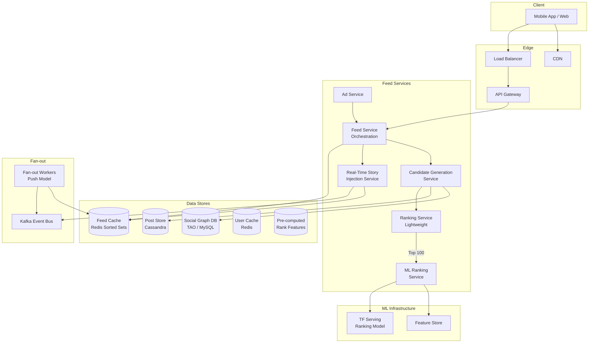
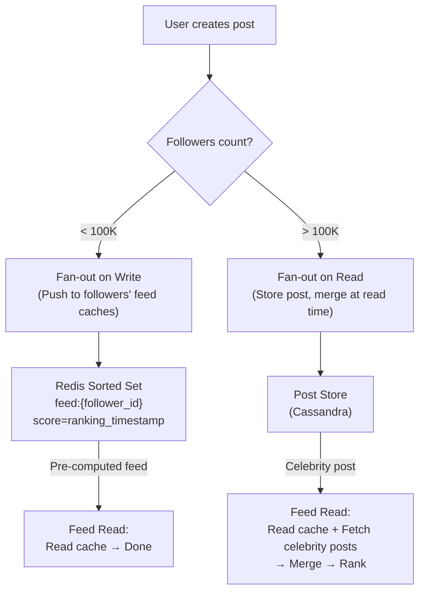

# News Feed Case Study: Facebook-Style

## Overview

Facebook's news feed is one of the most complex systems in production — it must rank and deliver a personalized feed to 2B+ users by selecting from trillions of candidate posts generated daily. This case study focuses on the feed generation pipeline: candidate retrieval from social graph edges, multi-stage ranking (candidate generation → lightweight scoring → heavy ML ranking), real-time story injection, and the hybrid fan-out architecture that balances write amplification against read latency.

## Key Requirements

### Functional
- Personalized feed ranking based on affinity, engagement prediction, and content type
- Support multiple story types: posts, photos, videos, stories, live streams, ads
- Real-time injection: new posts appear in feed within seconds
- Pagination: infinite scroll with cursor-based navigation
- Feed types: top stories (ranked) vs most recent (chronological)
- Story unseen markers and content freshness indicators
- Support for ad insertion with guaranteed impression counting

### Non-Functional
| Requirement | Target |
|-------------|--------|
| Feed generation latency | < 500ms p95 |
| Time to inject new post | < 3 seconds |
| Candidate pool per request | ~500-1000 posts |
| Throughput | 500K feed loads/sec at peak |
| Availability | 99.99% |
| Ranking model freshness | Updated every 15 minutes |

### Capacity Estimation

```
Users: 3B total, 1.5B DAU
Posts per day: 1B
Average friends per user: 300
Average feed loads per user per day: 10
Total feed loads/day: 15B
Peak feed loads: 500K/sec

Candidate generation per feed load:
  From friends: 300 users × 2 posts/day = ~600 candidate posts
  From followed pages: ~50 candidate posts
  From groups: ~100 candidate posts
  Total candidates: ~750 per feed load

Ranking computation per feed load:
  750 candidates × lightweight score (~1μs) = ~0.75ms
  Top 100 × heavy ML score (~5ms) = ~500ms → needs batching/prediction service

Feed cache storage:
  1.5B users × 50 post_ids per cached feed × 8 bytes = ~600 GB
```

## High-Level Architecture



## Deep Dive: Feed Generation Pipeline

Feed generation follows a three-stage pipeline: candidate retrieval, lightweight scoring, and heavy ML ranking.

### Stage 1: Candidate Generation

```
For each feed load request:
1. Fetch user's social graph edges:
   - Friend connections (bidirectional)
   - Followed pages/public figures
   - Group memberships
   - Followed hashtags

2. Retrieve recent posts from each edge:
   - Friends: last 24h posts (cached in Redis, key: posts:{user_id})
   - Pages: last 48h posts
   - Groups: last 24h posts (for active groups only)

3. Deduplicate across edges (avoid showing same post twice)

4. Apply hard filters:
   - Remove posts already seen by user
   - Remove posts from blocked/muted users
   - Remove expired content (stories > 24h)

Result: ~500-1000 candidate posts
```

### Stage 2: Lightweight Scoring (Predictive Model)

Candidates are scored using a lightweight model (~10 features) to reduce the set for expensive ML inference:

```
Score = w1 × affinity(user, author)          # Friendship closeness
      + w2 × recency_hours(post_age)         # How recent is the post
      + w3 × author_post_frequency          # How often author posts
      + w4 × user_content_type_pref        # User's historical engagement with this type
      + w5 × early_engagement_signal       # Likes/comments in first 10 minutes
      + w6 × negative_feedback_prob         # Probability user will hide/report

Affinity calculation:
  affinity(A, B) = α × direct_interactions(A,B)
                 + β × mutual_friends(A,B)
                 + γ × co-tagged_photos(A,B)
                 + δ × message_frequency(A,B)

Top 100 candidates pass to Stage 3.
```

### Stage 3: Heavy ML Ranking

The top 100 candidates are ranked using a deep neural network (typically a DSSM or transformer-based model) with hundreds of features:

```
Features per (user, post) pair:
  Post features: text embeddings, image embeddings, video duration,
                 content freshness, engagement velocity
  User features: demographic embeddings, device type, session context,
                 content preference history
  Cross features: user-post affinity score, social context,
                  historical click-through rate for similar content
  Context features: time of day, day of week, session duration,
                    feed position bias

Batch inference: TF Serving with GPU, ~100 predictions in ~200ms
Top 20 posts returned to user with interleaved ads.
```

## Deep Dive: Hybrid Fan-out Architecture

The system uses a hybrid push/pull model to balance write amplification against read latency.

### Classification of Users



**Write-path fan-out (push model):**
1. User posts → Post Service persists to Cassandra
2. Post Service publishes to Kafka topic `new-posts`
3. Fan-out workers consume and fetch poster's follower list
4. For each follower, add post_id to their Redis sorted set: `ZADD feed:{follower_id} {score} {post_id}`
5. Score combines posting timestamp + lightweight ranking signals

**Read-path merge (pull model):**
1. User opens feed → Feed Service reads pre-computed Redis sorted set (top 50)
2. Fetches recent posts from followed celebrities/pages (not in cache)
3. Merges both sets, runs ranking pipeline, returns top 20

**Why this works:**
- 99% of users have < 100K followers → push fan-out covers most of the graph
- The 1% celebrity tier generates < 5% of total posts but has > 50% of followers
- Write amplification: without hybrid, a celebrity with 100M followers generates 100M Redis writes per post

## Deep Dive: Pagination and Unseen Tracking

Pagination uses cursor-based navigation with seen/unseen watermarks:

```
GET /api/feed?cursor=eyJ0cyI6MTcwNDA2NzIwMH0&limit=20

Response:
{
  "stories": [...],
  "next_cursor": "eyJ0cyI6MTcwNDA2NzEwMH0",
  "unseen_count": 7,
  "new_stories_available": true
}

Unseen watermark:
  Redis key: feed_unseen_watermark:{user_id}
  Value: timestamp of last feed load

On feed load:
  1. Read watermark
  2. Fetch feed items (cached + real-time merge)
  3. Mark items with created_at > watermark as "unseen" (blue dot indicator)
  4. Update watermark to current time
  5. Client uses unseen_count for notification badge
```

## Scalability

| Component | Strategy |
|-----------|---------|
| Feed Service | Stateless, 200+ instances, partitioned by user_id |
| Candidate Generation | Parallel fetch from Redis + Cassandra |
| ML Ranking | GPU-backed TF Serving cluster, batch inference |
| Feed Cache | Redis cluster, 512 shards, ~600 GB total |
| Fan-out Workers | Kafka consumer group, 64 partitions, partitioned by poster_id |
| Social Graph | TAO (Facebook's graph API) or sharded MySQL with edge caching |
| Post Store | Cassandra, partitioned by post_id, time-series compaction |

## The EdgeRank Era to the ML Ranking Era

Interviewers use feed history as context, not trivia: every era of feed ranking is an answer to "which observable behavior are we optimizing, and what does that make people do?"

- **Chronological (pre-2009).** Order is recency. It optimizes freshness and explainability — users can model the ordering, and "new posts first" is trivially consistent. It breaks by being popularity-blind: a great post from a quiet friend dies in minutes under a high-volume account, and there is no inventory control at all.
- **Engagement-ranked (the "EdgeRank" era, early 2010s).** Order is predicted engagement — affinity × content weight × time decay in the developer-community description of it; the name was never an official Facebook term and no primary EdgeRank page was fetchable this session, so treat that formula as widely-known history rather than citable fact. What the era observably optimizes: reactions, comments, shares — session time. Facebook described its own signals era plainly: "Today we use signals like how many people react to, comment on or share posts to determine how high they appear in News Feed" [1].
- **ML ranking with multiple objectives (mid-2010s onward).** Thousands of features over a two-stage retrieval funnel — the published industrial template is Covington et al.'s YouTube system, "the classic two-stage information retrieval dichotomy" of a deep candidate-generation model followed by a separate deep ranking model [2]. Optimizes predicted value across competing objectives, not engagement alone.

**The engagement-bait downside is not hypothetical.** Optimizing an observable metric invites manufacturing it. Facebook's 2018 recalibration said so explicitly: "Using 'engagement-bait' to goad people into commenting on posts is not a meaningful interaction, and we will continue to demote these posts in News Feed" [1] — and the same post warned publishers that "Pages may see their reach, video watch time and referral traffic decrease." The systems lesson: any metric you rank on becomes the target of adversarial content strategy (Goodhart's law), so production objectives carry demotion signals (hides, reports, negative feedback) alongside positive engagement.

**The inventory funnel, computed from this page's capacity numbers.** 1.5B DAU × 10 feed loads/day = 15B loads/day; at ~750 candidates per load that is ~11.2 × 10¹² candidate evaluations/day; serving 20–50 posts per load yields 300–750B impressions/day. An average session therefore shows a user N ≈ 40–100 posts drawn from M ≈ 750–1,500 eligible candidates — a serve ratio around 5%. That scarcity *is* the product: "why didn't my followers see my post?" is a ranking outcome, not a bug, and every slot in the feed competes against every other candidate in the funnel.

## What Actually Breaks at Scale

**Celebrity fanout storms.** One post from a 100M-follower account is a 100M-write burst into per-user caches. At ~90 bytes of sorted-set overhead per entry that is ≈ 9 GB of cache entries for a *single post* (computed), and a fleet draining at 500K writes/sec needs ~3.3 minutes per post — while storms stack (several celebrities in an hour, retries, cache-flush catch-up). The fix is the hybrid above: do not fan out above a follower threshold; merge celebrity posts at read time. The underlying write-amplification math is worked end-to-end in [Notifications](../notifications.md) (e.g., 10M followers ≈ 10M queue messages ≈ 2 GB per event for notifications; feeds run the same math with a different payload shape), and the graph reads that precede any fanout are their own scale problem — the graph store serving this tier processes "a billion reads and millions of writes each second" [3].

**Ranking model deploy regressions.** A "better" model can raise time-spent while quietly raising hide rates, spam prevalence, or error gaps across user segments — the metric you optimize is not the set of metrics you must not break. Production launches ramp a small traffic slice with **guardrail metrics as automatic aborts** (negative feedback rate, spam reports, integrity metrics) alongside the objective metric; the platform machinery behind that — salted bucketing, layered experiments, SRM alarms, rollback — is covered in [Experimentation Platform](./experimentation-platform.md). Name the two failure patterns in interviews: offline gains that do not transfer online (training data reflects the *previous* ranker's positions), and the temptation to accept a launch on time-spent alone.

**Feed-cache invalidation lag shows deleted posts.** The tombstone/lazy-expiry design (see [the base design](../news-feed.md)) leaves a window where deleted content still appears: ids in fanout caches meet the tombstone only at hydration time, and any CDN- or edge-cached feed *response* outruns even that. Concrete failure: author deletes a post → followers keep seeing it for minutes from cached feed fragments. Mitigations: short TTL on feed responses plus purge-on-delete for cached fragments, a tombstone check *inside* hydration rather than only at the edge, and a priority deletion queue for safety-critical removals.

**Media store failures degrade the feed to text-only.** When the photo/video attachment store brownouts, the correct failure is a text-first feed — avatars fall back to initials, media boxes render placeholders, and ranking demotes candidates whose media fetch is unlikely to succeed — not a feed-wide 5xx. That is a designed degradation ladder, not an accident; the general strategies (return partial result, return stale cache, fail-open vs fail-closed) are covered in [Graceful Degradation](../../../backend/patterns/graceful-degradation.md).

**The infinite-scroll pagination break.** Ranking reshuffles between page fetches: the client's next-page request re-ranks a changed candidate set, producing visible duplicates and skips mid-scroll — the most-complained-about feed UX bug. Fix: freeze the session's ranked list as a stable snapshot (snapshot id, short TTL) and serve pages from it; new posts surface via a "new posts" pill at next refresh instead of splicing into the live scroll, with a cursor-of-seen-ids backstop that excludes already-viewed ids.

## Trade-Offs

| Decision | Benefit | Cost |
|----------|---------|------|
| Three-stage ranking | Sub-500ms latency despite 1000 candidates | Pipeline complexity |
| Hybrid fan-out | No write amplification for celebrities | Two code paths for feed reads |
| Pre-computed lightweight scores | Fast candidate filtering | Scores become stale between refreshes |
| Cursor-based pagination | No offset drift, O(1) fetch | Clients must store cursor state |
| Redis sorted sets for feed cache | O(log N) insertion, O(log N + M) range query | Memory-intensive for large feeds |

## Interview Tips

1. **Lead with the ranking problem** — "The core challenge is selecting 20 posts from 1000 candidates in under 500ms"
2. **Explain three-stage ranking** — candidate generation → lightweight scoring → heavy ML ranking
3. **Discuss the hybrid fanout** — push for regular users, pull for celebrities
4. **Mention the unseen watermark** — how Facebook implements the "new posts" indicator
5. **Talk about ad interleaving** — ads are ranked separately and merged into the feed

## Key Takeaways

- Facebook's feed uses a three-stage ranking pipeline: candidate generation → lightweight scoring → ML ranking.
- Hybrid fan-out prevents write amplification from celebrities while keeping reads fast for regular users.
- Redis sorted sets store pre-computed feed caches; celebrity posts are merged at read time.
- Unseen watermarks track which posts are new since the user's last visit.
- GPU-backed ML inference ranks top 100 candidates in ~200ms for sub-500ms total feed latency.

## References

1. Adam Mosseri, "News Feed FYI: Bringing People Closer Together," Facebook Newsroom (about.fb.com), January 11, 2018 — <https://about.fb.com/news/2018/01/news-feed-fyi-bringing-people-closer-together/> — fetched in full this session (HTTP 200); all quoted sentences (engagement signals, conversations/meaningful interactions, engagement-bait demotion, publisher reach decrease) are verbatim from that page.
2. Covington, P.; Adams, J.; Sargin, E. "Deep Neural Networks for YouTube Recommendations." *Proc. 10th ACM Conf. on Recommender Systems (RecSys)*, 2016. DOI: [10.1145/2959100.2959190](https://doi.org/10.1145/2959100.2959190) — Crossref-verified this session; the two-stage "information retrieval dichotomy" phrase quoted verbatim from the abstract as fetched at <https://research.google/pubs/deep-neural-networks-for-youtube-recommendations/> (HTTP 200) this session.
3. Bronson, N.; et al. "TAO: Facebook's Distributed Data Store for the Social Graph." *USENIX ATC*, 2013 — publication page fetched this session at <https://research.facebook.com/publications/tao-facebooks-distributed-data-store-for-the-social-graph/> (HTTP 200); quoted sentence verbatim. (The usenix.org session page returned 403 to automated fetch this session.)

*Note:* the "EdgeRank" formula (affinity × weight × decay) circulated in the developer community, not in Facebook documentation; no primary EdgeRank page was fetchable this session, so that history is deliberately presented without quotes or citation rather than cited from memory.

## Cross-References

- [How Twitter Works](./twitter.md) — Twitter's hybrid fanout approach
- [News Feed Design](../news-feed.md) — Interview-format overview
- [Social Graph](../social-graph.md) — Graph traversal and storage
- [Caching Strategy](../hld/caching-strategy.md) — Cache warming and invalidation
- [Notifications](../notifications.md) — the fanout-on-write / read / hybrid math (including celebrity write-amplification numbers) this page links to instead of re-deriving
- [Experimentation Platform](./experimentation-platform.md) — guardrail aborts, SRM alarms, and ramp/rollback machinery for ranking launches
- [Graceful Degradation](../../../backend/patterns/graceful-degradation.md) — the partial-result and stale-cache strategies behind text-only feed fallback
