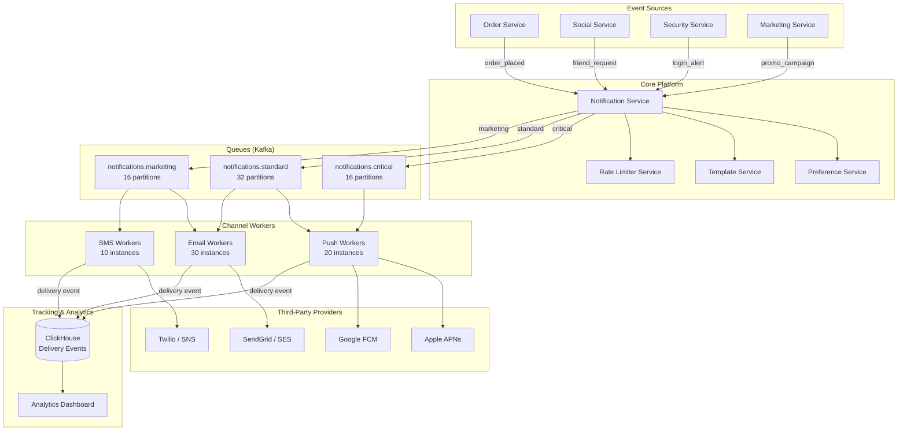
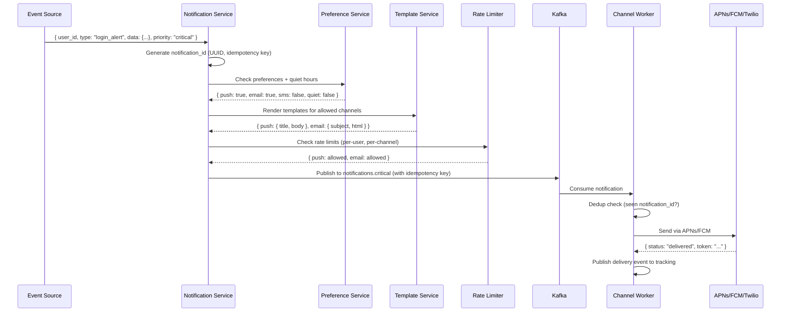

# Notification System Case Study

## Overview

A production notification system must deliver billions of notifications per day across push (iOS/Android), email, SMS, and in-app channels — each with different latency requirements, rate limits, and delivery guarantees. This case study examines a multi-channel notification platform supporting user preferences, quiet hours, template rendering, delivery tracking, and at-least-once semantics with idempotent deduplication. The system must gracefully degrade when third-party providers (APNs, Twilio, SendGrid) experience outages.

## Key Requirements

### Functional
- Multi-channel delivery: push notifications (APNs/FCM), email (SMTP/SendGrid), SMS (Twilio)
- User preferences: opt-in/out per channel and per notification category
- Quiet hours: suppress non-critical notifications during user-defined windows
- Template engine: multi-language, multi-channel templates with variable substitution
- Delivery tracking: sent → delivered → opened → clicked pipeline
- Rate limiting: per-user, per-channel, and global (provider rate limits)
- Priority queuing: critical notifications (security alerts) bypass rate limits
- Batch notifications: daily/weekly digest aggregation for low-priority categories

### Non-Functional
| Requirement | Target |
|-------------|--------|
| Throughput | 50M notifications/hour at peak |
| Latency (critical) | < 3 seconds end-to-end |
| Latency (marketing) | < 5 minutes |
| Delivery guarantee | At-least-once (with dedup) |
| Availability | 99.99% |
| Idempotency | Zero duplicate notifications to end users |

### Capacity Estimation

```
Notifications: 50M/hour peak = ~14K/sec average, ~50K/sec peak

Channel breakdown:
  Push:  60% → 8.4M/hour
  Email: 30% → 4.2M/hour
  SMS:   10% → 1.4M/hour

Per-user: average 20 notifications/day
Users: 500M total

Storage (delivery events): 50M/day × 200 bytes = ~10 GB/day
Analytics retention: 90 days = ~900 GB

Queue throughput: 50K events/sec
Kafka partitions needed: ~64 (at ~800 events/sec/partition)
```

## High-Level Architecture



## Deep Dive: Notification Processing Pipeline

Each notification flows through a multi-stage pipeline before reaching a user's device:



**Key design decisions in the pipeline:**

1. **Idempotency keys**: Every notification carries a `notification_id` generated by the source service. Workers check a Redis bloom filter before processing to prevent duplicates caused by Kafka retries.

2. **Preference evaluation**: Done synchronously in the Notification Service to avoid enqueueing notifications that will be silently dropped. This saves queue throughput.

3. **Quiet hours enforcement**: Calculated per user timezone. Critical notifications (`priority: critical`) bypass quiet hours. Standard notifications are queued for delivery after quiet hours end.

## Deep Dive: Per-Channel Delivery Workers

Each channel has dedicated worker pools with channel-specific retry and backoff strategies.

### Retry Strategy Comparison

| Channel | Max Retries | Backoff | DLQ Threshold | Notes |
|---------|-------------|--------|---------------|-------|
| Push | 3 | 1s, 5s, 30s | 3 failures | Device token may be invalid |
| Email | 5 | 1min, 5min, 30min, 2h, 6h | 5 failures | Temporary SMTP errors common |
| SMS | 3 | 1min, 10min, 1h | 3 failures | Provider rate limits |

**Push-specific handling:** When APNs/FCM returns an invalid device token, the worker marks the token as stale in the user profile. A separate cleanup job purges stale tokens weekly. Expired tokens that accumulate waste Kafka throughput.

**Email-specific handling:** Bounced emails (hard bounce) immediately mark the email address as invalid. Soft bounces (mailbox full, temporary) follow the retry schedule. All bounce events are tracked for analytics.

### Circuit Breaker Per Provider

```python
class ProviderCircuitBreaker:
    """Protects against third-party provider outages."""
    def __init__(self, provider, failure_threshold=5, recovery_timeout=60):
        self.provider = provider
        self.failure_count = 0
        self.state = "closed"  # closed, open, half-open

    def call(self, notification):
        if self.state == "open":
            raise CircuitOpenError(f"{self.provider} is down")
        try:
            result = self.provider.send(notification)
            self.failure_count = 0
            return result
        except ProviderError:
            self.failure_count += 1
            if self.failure_count >= self.failure_threshold:
                self.state = "open"
                # Schedule transition to half-open after recovery_timeout
            raise
```

When a provider circuit opens, notifications are routed to a fallback provider (e.g., APNs → FCM for iOS is not possible, so notifications are queued for retry after the circuit closes).

## Deep Dive: Template Engine and Localization

Templates are stored in a versioned template registry. Each template has channel-specific variants (push title/body, email subject/HTML/text, SMS text) and language variants.

```
Template: order_shipped
  Channels:
    push:
      en: { title: "Order Shipped!", body: "Your order #{{order_id}} is on its way. ETA: {{eta}}" }
      es: { title: "¡Orden Enviada!", body: "Tu orden #{{order_id}} está en camino. Llegada: {{eta}}" }
    email:
      en: { subject: "Your Order #{{order_id}} Has Shipped", template: "order_shipped_en.html" }
    sms:
      en: "Order #{{order_id}} shipped! Track: {{tracking_url}}"

Variables provided by event source:
  order_id, eta, tracking_url, customer_name, items_summary
```

The Template Service performs server-side rendering with sandboxed variable substitution (no code execution). Templates are cached in Redis after first render with the same variable set.

## Data Model

```sql
-- User notification preferences
CREATE TABLE user_notification_prefs (
    user_id        BIGINT PRIMARY KEY,
    push_enabled   BOOLEAN DEFAULT TRUE,
    email_enabled  BOOLEAN DEFAULT TRUE,
    sms_enabled    BOOLEAN DEFAULT FALSE,
    quiet_start    TIME,
    quiet_end      TIME,
    timezone       VARCHAR(50),
    categories     JSONB  -- { "marketing": { "push": false, "email": true } }
);

-- Notification audit log
CREATE TABLE notification_log (
    id             BIGSERIAL PRIMARY KEY,
    notification_id UUID NOT NULL,
    user_id        BIGINT NOT NULL,
    channel        VARCHAR(20) NOT NULL,
    status         VARCHAR(20) NOT NULL,  -- sent, delivered, failed, bounced
    provider_response JSONB,
    created_at     TIMESTAMPTZ DEFAULT NOW()
) PARTITION BY RANGE (created_at);
```

## Scalability

| Component | Strategy |
|-----------|---------|
| Notification Service | Stateless, horizontally scaled, 50+ instances |
| Kafka | 64 partitions across 8 brokers, 3-way replication |
| Push Workers | 20 instances, ~5K notifications/sec total |
| Email Workers | 30 instances, ~2K notifications/sec total |
| SMS Workers | 10 instances, ~500 notifications/sec total |
| Preference Service | Redis-cached preferences, PostgreSQL backing |
| ClickHouse | Delivery analytics, 90-day retention, daily partitions |

## Trade-Offs

| Decision | Benefit | Cost |
|----------|---------|------|
| Synchronous preference check | No wasted queue throughput | Slightly higher latency for sender |
| Per-channel Kafka topics | Independent scaling and failure isolation | More topics to manage |
| Circuit breaker per provider | Graceful degradation during outages | Queued notifications during provider downtime |
| At-least-once + idempotency | Zero message loss with no duplicates | Bloom filter memory cost |
| ClickHouse for analytics | Sub-second aggregation on billions of events | Separate from operational database |

## Interview Tips

1. **Start with the multi-channel challenge** — "Each channel has different rate limits, latency requirements, and failure modes"
2. **Explain the pipeline** — event → validate → template → rate limit → queue → deliver → track
3. **Discuss idempotency** — UUID-based idempotency keys with bloom filter dedup on workers
4. **Highlight circuit breakers** — protect against third-party provider outages gracefully
5. **Mention quiet hours and preferences** — user-level control over notification delivery

## Key Takeaways

- Multi-channel notification systems require per-channel worker pools with independent retry and backoff strategies.
- Synchronous preference filtering avoids wasting queue throughput on undeliverable notifications.
- Circuit breakers per provider enable graceful degradation during third-party outages.
- Idempotency keys (UUID) with bloom filter dedup ensure at-least-once delivery without user-visible duplicates.
- ClickHouse provides sub-second analytics on billions of delivery events.
- Template versioning and localization are critical for global platforms.

## Cross-References

- [Notification System Design](../notifications.md) — Interview-format version
- [Chat System](../chat.md) — Push notification delivery patterns
- [Rate Limiter](../rate-limiter.md) — Rate limiting algorithms
- [Messaging Systems](../hld/messaging-systems.md) — Kafka queue design patterns
