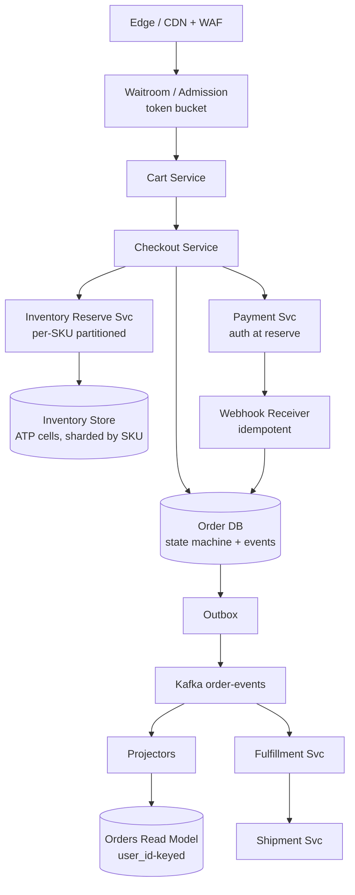
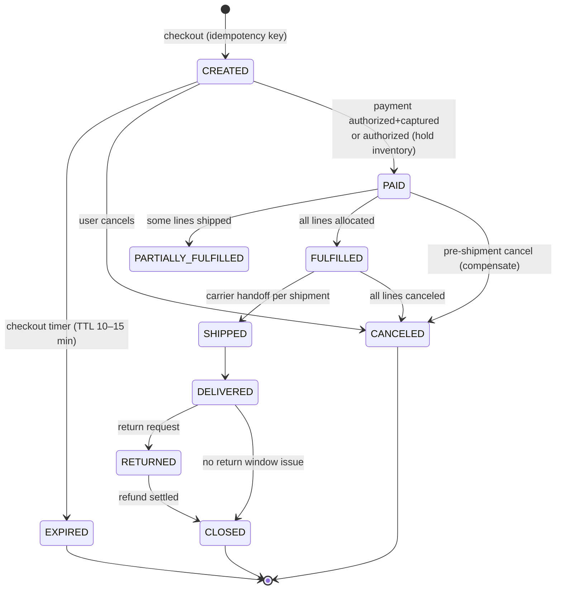
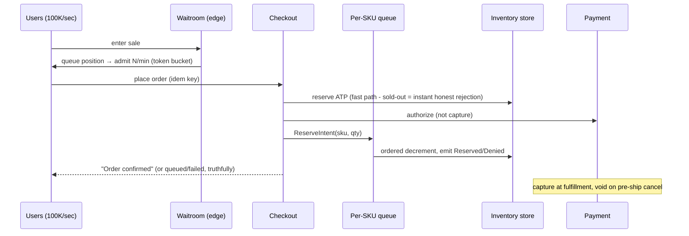

# Design an Order Management and Inventory System

## Problem Statement

Design an e-commerce **Order Management System (OMS)**: take an order from checkout to doorstep — order lifecycle state machine, inventory reservation with oversell prevention, split shipments and partial fulfillment, payment integration (authorization, capture, refunds), and the "my orders" read path. The system must survive flash sales, where 100× traffic arrives in one minute and the *worst possible failure is selling units that do not exist*.

Scope discipline: payment processing details (auth/capture mechanics, gateway failover, fraud) are covered in [Payment System](./payment-system.md); the double-entry accounting treatment of refunds and settlement lives in [Banking Ledger](../banking-ledger.md). This page owns **order state and inventory coordination** — and references those pages instead of duplicating them.

---

## Functional Requirements

1. **Checkout**: create an order from a cart, reserve inventory, take payment.
2. **Order lifecycle**: created → paid → fulfilled → shipped → delivered; canceled, expired (checkout timeout), returned.
3. **Inventory**: track on-hand stock, reserve against checkout, release on timeout/cancel, decrement on shipment, restock on return.
4. **Split shipment**: one order fulfilled from multiple warehouses as separate shipments; per-line and per-shipment status.
5. **Returns/refunds**: reverse fulfillment and payment as compensating flows.
6. **My orders**: customer order history with live per-line status.
7. **Flash sale mode**: bounded, fair admission of checkout traffic under 100× burst.

## Non-Functional Requirements

| Requirement | Target | Why |
|---|---|---|
| Inventory correctness | Zero oversell beyond configured tolerance | Refunding "we don't actually have it" destroys trust and costs money |
| Checkout latency | < 300 ms p99 in steady state; degraded-but-honest under flash load | Conversion is latency-sensitive until the queue |
| Order availability | 99.95% + graceful degradation | Browsing can degrade; checkout must not oversell |
| Order-write throughput | 100K checkouts/sec peak (flash sale) | Drives the per-SKU design below |
| Event durability | 100% — every transition is a durable event | Reconciliation, dispute resolution, analytics |

### Capacity Estimation

```
Baseline:            20M orders/day → 20M / 86,400 ≈ 230 orders/sec avg
                     diurnal peak ~5× → ~1,200 checkouts/sec

Flash sale:          1M orders in the first hour; first minute:
                     500K checkout attempts → ~8K/sec sustained,
                     100K/sec of cart/edit/browse traffic on top
                     (browse is cache+CDN; checkout is the bottleneck)

Hot SKUs:            top ~1,000 SKUs take ~80% of decrement volume
                     → per-SKU write skew, exactly like a hot ledger account

Order events:        20M orders/day × ~10 events × 1 KB ≈ 200 GB/day (events)
                     order row ~1 KB → 20 GB/day; 3-year retention ≈ 22 TB
                     → fine for sharded OLTP; events also feed a warehouse

Reads ("my orders"): each order viewed ~5×/day → 100M reads/day ≈ 1,200 QPS
                     avg, ~10× peak → served from a denormalized read model
```

The load profile to internalize: **steady state is trivial; the design problem is the flash-sale minute**, where per-SKU contention — not aggregate QPS — is the binding constraint.

---

## High-Level Design



---

## Deep Dive 1: The Order Lifecycle as an Owned State Machine



**Who owns transitions?** The order service owns the state machine, full stop. Fulfillment, shipping, and payment services *request* changes by emitting events (`ShipmentHandedToCarrier`, `PaymentCaptured`); the order service validates each event against a transition table (`(from_state, event) → to_state`) and applies it. Guards live in one place: a refund event cannot apply to a `CREATED` order; a second `PAID` event on the same order is a webhook replay, not a state change (idempotent consumers). This centralization is what makes the inevitable "wait, can an order go from SHIPPED back to PAID?" question boring.

**Event-sourced order vs CRUD?**

| | CRUD row + audit table | Event-sourced order |
|---|---|---|
| Current state | The row; audit is separate | Fold of events; row is a projection |
| Schema evolution | Easy (migrations) | Painful (old events forever) |
| "Why is this order in this state?" | Grep audit log | Replay events — precise |
| Rebuilding read models | Re-backfill by script | Replay by design |
| Team cost | Low | High (see [Data-Intensive Systems](../hld/data-intensive.md)) |

The pragmatic production answer is a **hybrid**: write the state-changing *event* and the updated *current-state row* in the same local transaction, publish via outbox. You get event-sourcing's audit and projection feeds without repaying its schema-evolution debt. Full event sourcing is justified only if you truly need temporal queries ("show this order's state as of Tuesday 14:02").

---

## Deep Dive 2: Inventory Semantics — On-Hand vs Reserved vs ATP

Three numbers, three different questions:

- **On-hand**: what physically sits in the warehouse (owned by warehouse management, lags reality by scanning events).
- **Reserved**: held by open carts/checkouts not yet fulfilled — money of the *future*.
- **Available-to-promise (ATP)**: `on_hand − reserved − safety_stock − soft commitments` (already-allocated-but-unshipped). **ATP is the only number checkout may decrement against.** Selling against on-hand guarantees oversell the moment any reservation exists; selling against on-hand − reserved without a safety buffer turns every warehouse scan error into a broken promise.

The reservation itself is one guarded atomic update — the condition lives in the WHERE clause, not in a prior SELECT (a pre-check races; the same DB-enforced-guard pattern as the ledger's overdraft check and the airline's cell guard):

```sql
-- Reserve 1 unit of SKU for order o-123, atomic, deadlock-safe per SKU
UPDATE inventory
SET reserved = reserved + 1
WHERE sku = :sku
  AND on_hand - reserved - safety_stock >= 1;   -- ATP guard
-- rows affected 0 → sold out (or backorder policy)
```

**Reservation with TTL**: every reservation carries `expires_at` (the checkout timer, 10–15 min). Three release mechanisms, used together:

1. **Lazy release** on read/recheck (expired reservation found → release).
2. **A reaper scan** (`expires_at < now()`, indexed) running every few seconds — bounded work, no scans of live inventory.
3. **Payment-webhook-driven release** when payment fails explicitly.

Crucially, release must be idempotent: the reaper and the payment-failure handler may both release the same reservation; `reserved = greatest(reserved - qty, 0)` with a reservation-record status flag (`HELD → RELEASED/CONSUMED`) prevents double-release from corrupting ATP in the other direction.

---

## Deep Dive 3: Oversell-Prevention Strategies and Their Throughput

This is the core interview deep dive. Four strategies, in increasing sophistication:

**1. Synchronous conditional UPDATE (DB serialization per SKU row).**
The SQL above, run synchronously in checkout. Correct, simple, transactional with order creation. The cost: **one hot SKU = one row lock = one serialization point.** A tuned OLTP engine sustains maybe 1–5K guarded updates/sec on a single hot row (row-lock churn + WAL); a flash sale on a single sneaker blows through that instantly, and multi-SKU carts that lock rows in different orders deadlock — fixable by sorting SKUs per transaction, but the hot-row ceiling remains. Right choice up to moderate scale; the *default* answer.

**2. Optimistic decrement (compare-and-swap with retry).**
`UPDATE ... SET reserved = reserved + 1, version = version + 1 WHERE sku = :sku AND version = :v`. Under 100-way contention on a hot SKU, ~99% of attempts retry; retry storms amplify load exactly when the system is least able to absorb it, tail latency explodes, and retries are unfair (no ordering). Optimistic concurrency is great for *low*-contention multi-row transactions and wrong for flash-sale hot rows.

**3. Queue-serialized per SKU.**
Checkout no longer decrements inline. It writes a `ReserveIntent(order_id, sku, qty)` to a partitioned log keyed by `sku` — every intent for SKU-X lands on one partition and one consumer applies decrements *in order* with no locks at all. The consumer emits `Reserved` / `Denied` events; checkout responds "processing," and the user sees confirmation on the next screen or via push (latency becomes honest: during a flash sale the queue depth *is* the truth, made visible — see [Backpressure](../backpressure.md)). Properties: deterministic, no deadlock, per-SKU throughput = one consumer's loop rate (tens of thousands/sec), and the log is a durable audit for free. Cost: asynchronous UX, and multi-SKU carts now need a small saga (all lines reserved → confirm; any denial → release the rest) — the same TTL-hold saga as airline legs, at cart granularity.

**4. Cell-split / bucketed stock.**
Pre-split a flash SKU's stock into N independent cells (rows or Redis keys, each `cell_k = stock/N`); decrements pick a random or least-loaded cell, so N cells give ~N× the admission rate without any serialization. This is the standard trick for single-SKU launch events. Costs: returns and corrections must be routed back to cells; cells go empty unevenly (a "sold out" check must sum cells or rebalance); and it is a *performance* layer on top of a durable truth, not a replacement for it.

A note from the field that impresses interviewers: [Shopify's inventory-reservation engineering write-up](https://shopify.engineering/scaling-inventory-reservations) describes replacing Redis with sharded MySQL for reservations — because reservations are money-adjacent state that must survive restarts, be reconcilable, and support queries, and a durable, transactional store at sharded scale beat a cache pretending to be a database. Flash-sale architectures that keep the *counter* in Redis and the *reservation* in a durable store are applying exactly this split.

### Why a single Redis `DECR` is not enough end-to-end (and what it does guarantee)

The stock answer "just `DECR` a Redis counter" needs precision, because it is half right:

- What `DECR` (or a check-then-decrement Lua script) **does guarantee**: O(1), atomic, extremely fast admission control — no two decrements can race, and a Lua `if stock >= n then DECR` never admits past zero. As an **edge gate** against a firehose of hopeless requests, it is excellent.
- What it **does not guarantee** end-to-end: (a) *durability pairing* — Redis is async-persistent; a crash between `DECR` and the durable order write yields a phantom decrement or, worse, a decrement whose order is gone (oversell on recovery); (b) *the saga* — release-on-timeout, capture-on-fulfillment, and refund-on-return are stateful flows that a counter cannot express; (c) *multi-SKU atomicity* — `DECR` per key is not atomic across a cart unless you Lua-script multi-key operations, which pins all of a cart's SKUs to one Redis shard; (d) *reconciliation* — returns, warehouse corrections, and fraud cancels mutate the durable truth, and a free-floating counter drifts. The counter is one gate in a saga whose system of record is the inventory store; divergence between the two is a *reconciliation problem* you must design for, not an edge case.

---

## Deep Dive 4: The Flash-Sale Pattern



The pieces, each protecting the next layer (see [Rate Limiter](../rate-limiter.md) for token-bucket mechanics):

1. **Virtual waitroom at the edge**: Cloudflare's [Waiting Room](https://blog.cloudflare.com/cloudflare-waiting-room/) is the reference design — users queue at the edge, admitted at a rate the origin can actually bear. The queue converts an invisible collapse into a visible line; fairness is approximate (it is not FIFO across continents, and that is acceptable).
2. **Fast-path sold-out check**: a cheap pre-decrement counter (the `DECR` gate above) rejects hopeless requests before they touch the DB — turning a 100K/sec stampede into a few K/sec of real work plus free rejections.
3. **Per-SKU partitioning of the decrement**: strategy 3 or 4 above for the hot SKUs.
4. **Auth-not-capture**: payment is authorized at reserve time and captured at fulfillment, so pre-shipment cancellations are voids, not refunds (payment-side depth: [Payment System](./payment-system.md)).
5. **The limbo reconciliation**: reservation expired (reaper released stock) but payment capture succeeded afterward — the classic race. Policy, decided in advance: *honor the order* (ship from safety stock or next replenishment) and alert, because a charged customer with no order is a guaranteed support incident; then fix ATP drift. The webhook handler must be idempotent and must be able to resurrect an EXPIRED order via an explicit, audited transition.

---

## Deep Dive 5: Split Shipment and Partial Fulfillment

An order is not a fulfillment unit. Model **order lines** as the atomic unit of promise:

- `order_lines (line_id, sku, qty, promised_date, status)` — each line independently `ALLOCATED → PICKED → SHIPPED → DELIVERED → RETURNED`.
- The fulfillment service splits lines into **shipments** per warehouse (`shipment_id`, subset of lines, carrier, tracking). An order with line 1 from DC-east and line 2 from DC-west has one order, two shipments, two tracking numbers, and two delivery events — the order state machine must aggregate per-line events (`PAID → PARTIALLY_FULFILLED → FULFILLED`).
- ATP is per warehouse location: the split decision is "who can promise each line soonest at acceptable cost," and a line with no single-source availability can itself be split across warehouses at quantity granularity (or backordered, which is a *product* decision the OMS must support, not hide).

This line-vs-order distinction is the order-side twin of the airline's PNR-vs-segment split: one customer-visible container, many independently-lifecycled fulfillment units.

---

## Deep Dive 6: Payment Integration and Idempotent Order Creation

- **Auth/capture split**: authorize at reservation (inventory is held, money is held), capture at fulfillment. Cancels before capture are voids; cancels after capture are refunds — the state machine tells you which compensation applies. Refund/return flows are compensating sagas: restock inventory, reverse the capture, emit `ReturnSettled`; the money-movement bookkeeping itself is a ledger concern (see [Banking Ledger](../banking-ledger.md)).
- **Idempotent order creation**: the client sends `idempotency_key = cart_id + revision` (or a UUID minted at checkout start). The order table has a unique constraint on it; a retry (double-click, network retry, app crash) returns the *original* order rather than creating a second one. Like every idempotency design worth the name, the uniqueness is enforced by the database under the transaction, not by a pre-check (see [Payment System](./payment-system.md) for the identical payment-side contract).
- **Webhook idempotency**: payment webhooks arrive at-least-once and out of order; handlers upsert on `(provider, event_id)` and let the order state machine reject stale transitions.

**Read model for "my orders"**: order events project into a denormalized `orders_by_user` store keyed `(user_id, created_at DESC)` with current per-line status — one query for the history page, no joins across fulfillment tables. It is eventually consistent (projection lag is seconds), which is fine *except* for the order the user just placed: guarantee **read-your-writes** by reading the primary for a short window after the user's own checkout, or by the client rendering the just-created order locally until the projection catches up. Mixed stale/fresh semantics without a policy is the failure mode (see [Data-Intensive Systems](../hld/data-intensive.md)).

---

## Failure Handling and Bottlenecks

| Concern | Mechanism |
|---|---|
| Checkout timer expiry | Reaper + lazy release; idempotent releases; ATP restored |
| Payment succeeded, reservation expired | Honor-the-order policy, explicit resurrect transition, ATP correction |
| Duplicate webhook / client retry | Unique constraints + state-machine transition guards |
| Hot SKU exceeds row capacity | Queue-serialized decrement or cell-split; never optimistic retry storms |
| Queue backlog growth | Visible queueing via waitroom; admission rate = consumer rate (backpressure made honest) |
| Warehouse rejects an allocation | Compensate: restock line, notify customer ([Notification System](./notification-system.md)), alternative-fulfillment policy |
| Inventory drift (scans, theft, returns) | Periodic cycle-count reconciliation against the event log; corrections are events too |

---

## Trade-offs

| Decision | Alternative | Trade-off |
|---|---|---|
| Hybrid event + state row | Pure event sourcing | Audit + projections without schema-evolution pain; loses temporal queries |
| Conditional UPDATE (sync) | Queue-serialized decrement | Sync is simple and transactional but caps per-SKU throughput; queue scales but makes checkout async |
| Redis counter as edge gate | DB for everything | O(1) rejection of hopeless load, but the durable store stays the system of record; needs drift reconciliation |
| Capture at fulfillment | Capture at checkout | Voids instead of refunds pre-ship; slightly higher unfulfilled-auth exposure |
| Waitroom admission | Let everyone in | Latency collapse hurts *everyone*; queueing trades peak conversion for system survival |

---

## What Distinguishes a Strong Answer

**Junior answers typically:** put one global lock or one `DECR` on stock and stop; model the order as a mutable row with a `status` string and no transition guard; reserve against on-hand; never mention the checkout timer or the payment-capture race.

**Mid-level answers add** TTL reservations and a state machine, but miss: idempotent release (double-release corrupts ATP in the *safe* direction but corrupts the other way on reserve), the honor-the-order policy for capture-after-expiry, per-line vs per-order fulfillment states, and the read-your-writes guarantee on the just-placed order.

**Senior answers:**
- Quantify the hot-SKU ceiling (single-row serialization ≈ a few K ops/sec) and *choose* between queue-serialization and cell-splitting with numbers.
- Explain precisely what Redis `DECR` guarantees (atomic admission) and what it cannot (durability pairing, saga, multi-SKU atomicity) — and where it belongs (edge gate, not system of record).
- Make backpressure a product feature: the waitroom, the honest "queued" status, capture-at-fulfillment.
- Treat reconciliation (drift, limbo states, duplicate webhooks) as a first-class subsystem with policies, not an afterthought.

---

## Key Takeaways

- ATP (`on_hand − reserved − safety`) is the only number checkout may decrement; the guard lives in the UPDATE's WHERE clause, enforced by the database.
- The order state machine is owned by one service; transitions are validated events published via outbox; a hybrid event+row model buys audit without full event-sourcing costs.
- Oversell prevention is a menu: sync conditional update (simple, hot-row-capped) → optimistic CAS (wrong for flash sales) → queue-serialized per SKU (scales, async UX) → cell-split stock (N× admission for launch events).
- A Redis `DECR` is an atomic edge gate, not an inventory system: durability, sagas, and reconciliation still live in the durable store.
- Flash sales are solved at the edge (waitroom + token admission), in the middle (fast-path sold-out), and at the core (per-SKU partitioning) — never by hoping the DB keeps up.
- Auth at reserve, capture at fulfillment; returns are compensating sagas; the capture-after-expiry limbo needs a pre-decided policy.

## Cross-References

- [Payment System](./payment-system.md) — auth/capture mechanics, gateway failover, idempotency on the payment leg.
- [Banking Ledger](../banking-ledger.md) — double-entry treatment of refunds, settlement, and reconciliations.
- [Notification System](./notification-system.md) — order status, shipping, and failure notifications.
- [Backpressure](../backpressure.md) — queue-serialized decrements as visible, honest load shedding.
- [Data-Intensive Systems](../hld/data-intensive.md) — event logs vs state, projections, and consistency of read models.

## References

- Shopify Engineering, "[Scaling inventory reservations](https://shopify.engineering/scaling-inventory-reservations)" — production rationale for durable, sharded reservation storage over Redis for money-adjacent inventory.
- Cloudflare, "[How Cloudflare's Waiting Room works](https://blog.cloudflare.com/cloudflare-waiting-room/)" — edge-based virtual waitroom design for admission control under surge.
- AWS Builders' Library, "[Avoiding fallback in distributed systems](https://aws.amazon.com/builders-library/avoiding-fallback-in-distributed-systems/)" — designing explicit degraded modes (relevant to flash-sale degraded checkout).
- AWS Builders' Library, "[Caching challenges and strategies](https://aws.amazon.com/builders-library/caching-challenges-and-strategies/)" — why hot-key caches undercount/overcount under contention; cache as accelerator, not truth.
- Martin Fowler, "[Event Sourcing](https://martinfowler.com/eaaDev/EventSourcing.html)" — the pattern behind event-derived order state and its costs.
