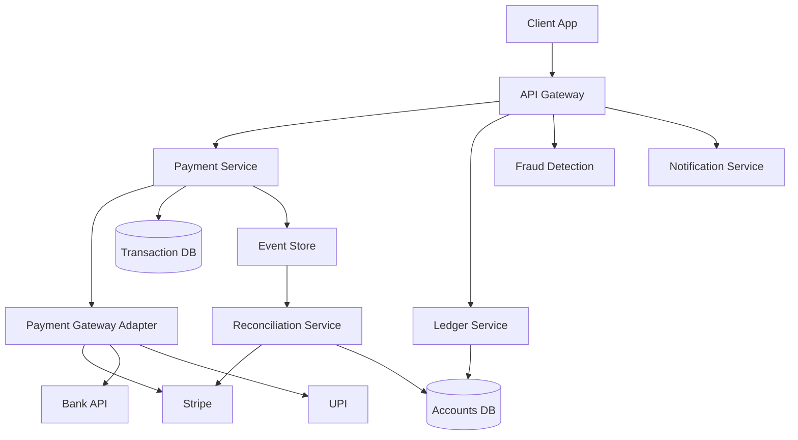
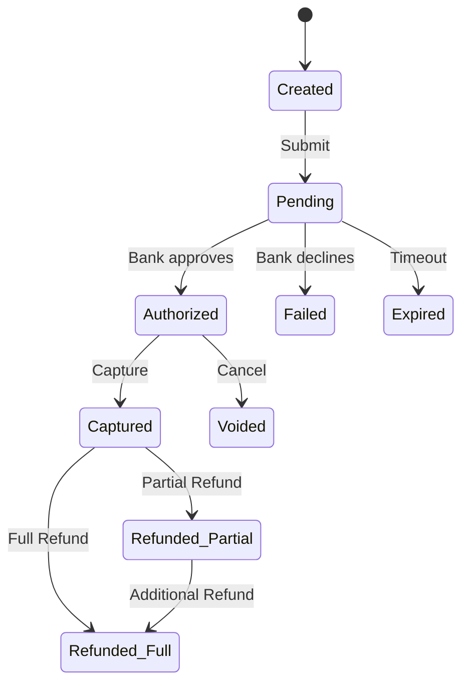

# System Design: Payment System

## Problem Statement

Design a payment processing system that handles online payments between buyers and sellers, supporting multiple payment methods (credit cards, UPI, bank transfers, wallets).

---

## Functional Requirements

1. Process payments (charge, refund, partial refund)
2. Support multiple payment methods
3. Handle recurring/subscription payments
4. Transaction history and statements
5. Fraud detection
6. Payment reconciliation
7. Webhook notifications for async events

## Non-Functional Requirements

| Requirement | Target |
------------|--------|
| Latency | < 500ms for synchronous payments |
| Availability | 99.99% (revenue-critical) |
| Consistency | Strong consistency |
| Throughput | 100K TPS |
| Security | PCI DSS compliant |

---

## High-Level Architecture



---

## Key Deep Dives

### Idempotency

Payment requests MUST be idempotent — a network retry must not cause a double charge.

**Implementation:** Client generates an `idempotency_key` (UUID). The payment service checks if this key was already processed.

```python
# Pseudocode
async def process_payment(idempotency_key, amount, method):
    existing = await db.get_payment(idempotency_key)
    if existing:
        return existing  # Return original result
    
    # Acquire distributed lock on idempotency_key
    async with lock(idempotency_key):
        # Double-check after lock acquisition
        existing = await db.get_payment(idempotency_key)
        if existing:
            return existing
        
        result = await charge(amount, method)
        await db.save(idempotency_key, result)
        return result
```

### Transaction State Machine



### Fraud Detection

Real-time fraud scoring runs on every transaction:

- **Rule-based:** Velocity checks (max N transactions/hour), amount limits, geo-mismatch
- **ML-based:** Model scores transaction 0-100 based on features (device fingerprint, behavior patterns, amount patterns)
- **Decision:** Auto-approve (< 30), manual review (30-70), auto-decline (> 70)

### Two-Phase Settlement

1. **Authorization:** Reserve funds (valid for 5-7 days). Money not yet moved.
2. **Capture:** Actually transfer funds. Can be delayed (e.g., until item ships).

This allows cancellation before capture, reducing refund complexity.

### Reconciliation

Daily reconciliation ensures system records match bank/gateway records:

1. Download settlement files from payment gateway
2. Compare with internal transaction records
3. Flag discrepancies (missing refunds, duplicate charges)
4. Generate reconciliation report
5. Auto-resolve or flag for manual review

---

## Data Model

| Table | Key Fields |
-------|-----------|
| transactions | id, idempotency_key, amount, currency, status, payment_method, created_at |
| payment_methods | id, user_id, type, last4, token, provider |
| ledger_entries | id, account_id, transaction_id, amount, balance_after |
| fraud_scores | transaction_id, score, rules_triggered, decision |
| reconciliation_reports | id, date, total_transactions, mismatches, status |

---

## Trade-offs

| Decision | Alternative | Trade-off |
----------|-----------|------------|
| Synchronous auth | Async | Sync gives instant feedback; async handles higher throughput |
| Event sourcing for ledger | Direct updates | Event sourcing provides audit trail; adds complexity |
| ML fraud detection | Rule-based only | ML catches novel fraud; rules are explainable |
| Single gateway | Multi-gateway | Single is simpler; multi provides failover |

---

## Interview Questions

1. **How do you handle a payment that's authorized but never captured?** Implement a cron job that expires authorizations after 7 days. Also implement a webhook listener since most gateways send notifications for expired auths.

2. **How do you ensure exactly-once payment processing?** Combine idempotency keys with distributed locks and a state machine. The state machine prevents invalid transitions (e.g., refunding a failed payment).

3. **What happens if the payment gateway is down?** Circuit breaker pattern with fallback to secondary gateway. Queue payments for retry. Return a "scheduled" status to the client.

---

## References

- [PCI DSS Documentation](https://www.pcisecuritystandards.org/)
- [Stripe API Design](https://stripe.com/docs/api)
- [Payment Services Directive (PSD2)](https://ec.europa.eu/info/law/payment-services-psd2-directive-en)