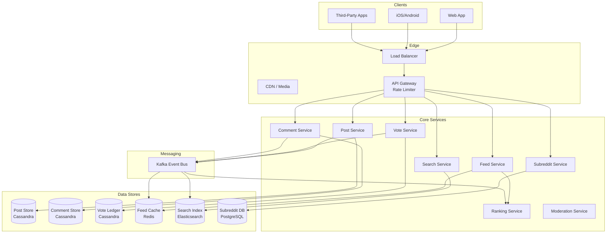
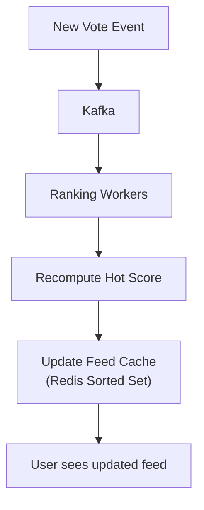

# Reddit: Social News Aggregator

## Overview

Reddit is a social news and discussion platform with 1.7B+ monthly visits and 100K+ active communities (subreddits). Users submit posts, vote (upvote/downvote), comment in nested threads, and browse ranked feeds (Hot, Rising, New, Top). The core design challenges include computing real-time rankings across millions of posts, serving deeply nested comment trees, preventing vote manipulation, and supporting highly variable traffic patterns (front-page posts can see 100x traffic spikes).

## Key Requirements

### Functional
- Create and manage subreddits (communities)
- Submit posts (link, text, image, video, poll)
- Upvote/downvote on posts and comments
- Nested commenting with unlimited depth
- Feed ranking: Hot, Rising, New, Top (hour/day/week/month/all)
- User karma, awards, and flairs
- Search across posts, comments, and subreddits
- Moderation tools (automod, queue, ban, shadowban)

### Non-Functional
| Requirement | Target |
|------------|--------|
| Scale | 1.7B monthly visits, 100K+ subreddits |
| Read QPS | ~500K feed loads/sec |
| Write QPS | ~100K votes/sec, 10K posts/sec |
| Latency | Feed load < 500ms, vote < 100ms |
| Availability | 99.95% |
| Consistency | Eventual for vote counts, strong for post creation |

### Capacity Estimation

```
Daily active users: 50M
Posts per day: 500K
Comments per day: 10M
Votes per day: 200M
Subreddits: 100K (10K active daily)

Storage (posts): 500K/day × 2KB × 365 = ~365 GB/year
Storage (comments): 10M/day × 1KB × 365 = ~3.6 TB/year
Storage (votes): 200M/day × 16B (user_id + direction) = ~29 GB/day → ~10 TB/year

Bandwidth (feed reads): 500K/sec × 10KB = ~5 GB/s
Vote QPS: 200M / 86400 ≈ 2,300/sec (avg), 100K/sec (peak)
```

## High-Level Architecture



## Deep Dive: Ranking Algorithms

Reddit's ranking is its most distinctive feature. The **Hot** ranking algorithm determines what appears on users' home feeds.

### Hot Ranking Formula

Reddit's Hot score decays with time and grows with net upvotes:

```
Hot Score = log10(|net_votes|) + (sign × epoch_seconds) / 45000

Where:
  net_votes = upvotes - downvotes
  sign = +1 if net_votes > 0, -1 if net_votes < 0, 0 otherwise
  epoch_seconds = Unix timestamp of post creation (minus a fixed epoch)
```

**Key properties:**
- Uses logarithmic scaling — a post going from 10 to 100 upvotes has the same impact as 1K to 10K
- Time decay: a post with 1000 upvotes from 24 hours ago ranks lower than a post with 100 upvotes from 1 hour ago
- The `/45000` divisor means scores halve roughly every 4.3 hours

### Rising vs Controversial

- **Rising**: New posts gaining momentum — measured by upvote velocity (votes in the last hour)
- **Controversial**: Posts where upvotes ≈ downvotes — `controversiality = min(upvotes, downvotes) / max(upvotes, downvotes)`



## Deep Dive: Comment Trees

Reddit supports nested comments of arbitrary depth — a post can have comment threads hundreds of levels deep.

**Storage approach:** Each comment stores a `parent_id` and a `path` (materialized path pattern). The path is an array of ancestor comment IDs: `[post_id, comment_1, comment_2, ...]`.

```
Comment {
    comment_id: snowflake_id,
    post_id: int64,
    parent_id: int64 (nullable — null means top-level),
    path: array<int64>,  // materialized path for tree traversal
    author_id: int64,
    body: text,
    upvotes: int32,
    downvotes: int32,
    created_at: timestamp
}
```

**Loading a comment tree:**
1. Fetch all top-level comments for the post (sorted by Hot score)
2. For each visible top-level comment, load its children (1-2 levels deep by default)
3. "Continue this thread" links trigger lazy loading of deeper levels

**Scalability:** Large threads (AMA posts with 50K+ comments) use pagination — only load the top N comments per level, with "load more" buttons.

## Deep Dive: Vote Integrity

Vote manipulation (bot upvoting, vote brigading) is a critical concern.


**Anti-manipulation measures:**
- One vote per user per post (enforced in the vote ledger with `(user_id, post_id)` unique constraint)
- Rate limiting: max N votes per minute per user
- Fuzzing: Reddit adds small random values to displayed vote counts (the actual count is stored accurately)
- Shadowbanning: bots see their votes succeed but their votes are silently discarded
- Account age and karma thresholds for voting in new subreddits

## API Design

| Endpoint | Method | Description |
|----------|--------|-------------|
| `/api/v1/subreddits` | GET | List subreddits (default, popular, subscribed) |
| `/api/v1/subreddits/{name}` | GET | Get subreddit details |
| `/api/v1/posts` | POST | Submit a post to a subreddit |
| `/api/v1/posts/{id}` | GET | Get post with comments |
| `/api/v1/posts/{id}/vote` | POST | Upvote/downvote a post |
| `/api/v1/posts/{id}/comments` | POST | Add a comment |
| `/api/v1/feed/hot` | GET | Get Hot feed (paginated) |
| `/api/v1/feed/rising` | GET | Get Rising feed |
| `/api/v1/search` | GET | Search posts, comments, subreddits |
| `/api/v1/subreddits/{name}/moderate` | POST | Moderation actions |

## Data Model

```sql
CREATE TABLE subreddits (
    subreddit_id  BIGSERIAL PRIMARY KEY,
    name          VARCHAR(50) UNIQUE NOT NULL,
    title         VARCHAR(200) NOT NULL,
    description   TEXT,
    subscriber_count BIGINT DEFAULT 0,
    post_count    BIGINT DEFAULT 0,
    is_nsfw       BOOLEAN DEFAULT FALSE,
    created_at    TIMESTAMPTZ DEFAULT NOW()
);

CREATE TABLE posts (
    post_id       BIGSERIAL PRIMARY KEY,
    subreddit_id  BIGINT NOT NULL,
    author_id     BIGINT NOT NULL,
    title         VARCHAR(300) NOT NULL,
    body          TEXT,
    link_url      TEXT,
    net_votes     INT DEFAULT 0,
    hot_score     DOUBLE PRECISION DEFAULT 0,
    comment_count INT DEFAULT 0,
    created_at    TIMESTAMPTZ DEFAULT NOW()
);

CREATE TABLE votes (
    user_id       BIGINT,
    target_id     BIGINT,
    target_type   ENUM('post', 'comment'),
    direction     SMALLINT, -- +1 or -1
    PRIMARY KEY (user_id, target_id, target_type)
);
```

## Scalability

| Component | Strategy |
|-----------|----------|
| Feed Cache | Redis sorted sets (score = hot_rank), per-subreddit and global |
| Vote Processing | Kafka → async workers update scores, counters, and karma |
| Comment Trees | Cassandra with materialized paths, lazy-load deep levels |
| Ranking Workers | Consumer groups on Kafka, recompute hot scores on each vote |
| Search | Elasticsearch, sharded by subreddit, reindexed near-real-time |
| Media | S3 + CDN for images/videos in posts |

## Trade-Offs

| Decision | Benefit | Cost |
|----------|---------|------|
| Hot ranking with time decay | Fresh content surfaces naturally | Controversial posts can oscillate |
| Materialized paths for comments | Efficient subtree loading | Path array grows with depth |
| Eventual vote counts | High write throughput | Users see slightly stale counts |
| Vote fuzzing | Prevents gaming of displayed scores | Confusing to users |
| Cassandra for votes | Handles massive write volume | No ad-hoc queries |

## Interview Tips

1. **Lead with the ranking problem** — "Reddit's core challenge is ranking millions of posts by relevance and recency."
2. **Explain the Hot formula** — logarithmic upvotes plus time decay is elegant and worth deriving on a whiteboard.
3. **Discuss comment trees** — materialized path vs nested sets vs adjacency list.
4. **Address vote manipulation** — deduplication, rate limiting, shadowbanning, fuzzing.
5. **Mention traffic spikes** — front-page posts cause 100x traffic; use CDN and aggressive caching.
6. **Compare feed strategies** — Reddit pre-computes feeds per subreddit (simpler than Twitter's per-user feed).

## Interview Questions

1. Design Reddit's Hot ranking algorithm — how does it balance upvotes and time?
2. How would you store and render nested comment trees at arbitrary depth?
3. How does Reddit prevent vote manipulation and bot upvoting at scale?
4. What happens when a post hits the front page and gets 100x traffic spike?
5. How would you implement subreddit search and post search efficiently?
6. Design the moderation system — how do mods review reported content at scale?
7. How would you shard the vote ledger for 200M+ daily votes?
8. What's the difference between Reddit's feed generation and Twitter's?
9. How would you implement "Best" comment sorting (which uses Wilson score confidence interval)?
10. Design Reddit Gold/Premium — how do you track and gate premium features?

## Key Takeaways

- Reddit's Hot ranking uses logarithmic vote scaling with linear time decay to surface fresh, popular content.
- Comment trees use materialized paths for efficient subtree loading with lazy loading of deep levels.
- Vote integrity is enforced through deduplication, rate limiting, fuzzing, and shadowbanning.
- Feed generation is per-subreddit (not per-user like Twitter), making fanout simpler.
- Kafka-driven async processing handles the high write volume of votes and comments.

## Cross-References

- [Twitter](./twitter.md) — Comparison of feed generation strategies
- [News Feed](./news-feed.md) — Fanout patterns
- [Distributed Cache](./distributed-cache.md) — Caching ranked feeds
- [Notification System](./notification-system.md) — Reply and mention notifications

## References

- Reddit Blog: "How Reddit Ranking Algorithms Work"
- Amplitude Blog: "Understanding Reddit's Recommendation System"
- Huffman, "The Evolution of Reddit's Ranking Algorithm"
