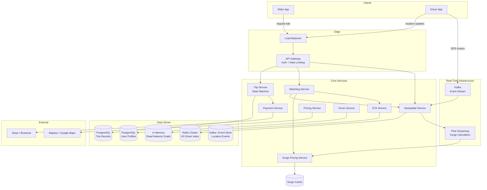
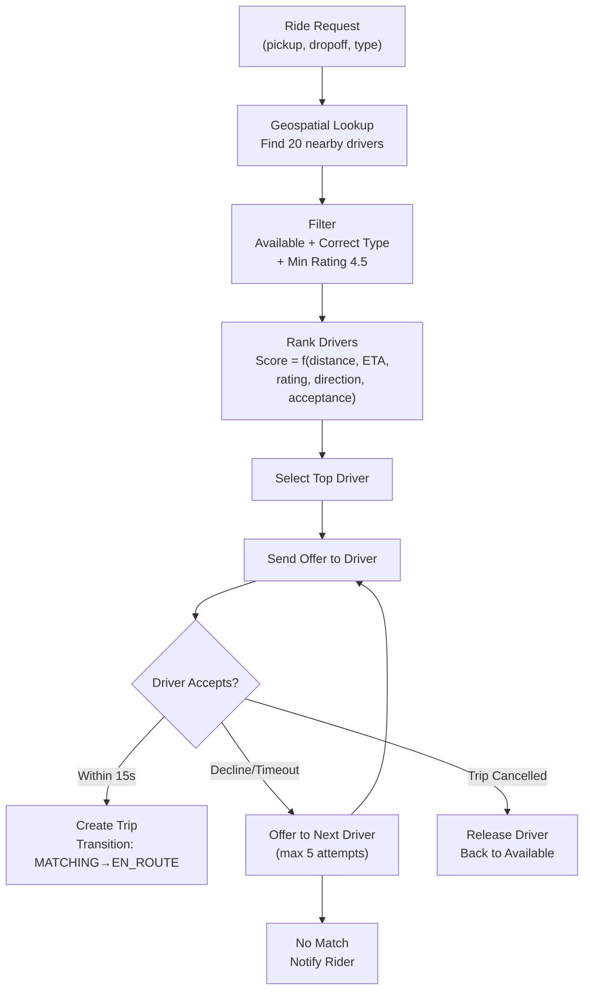
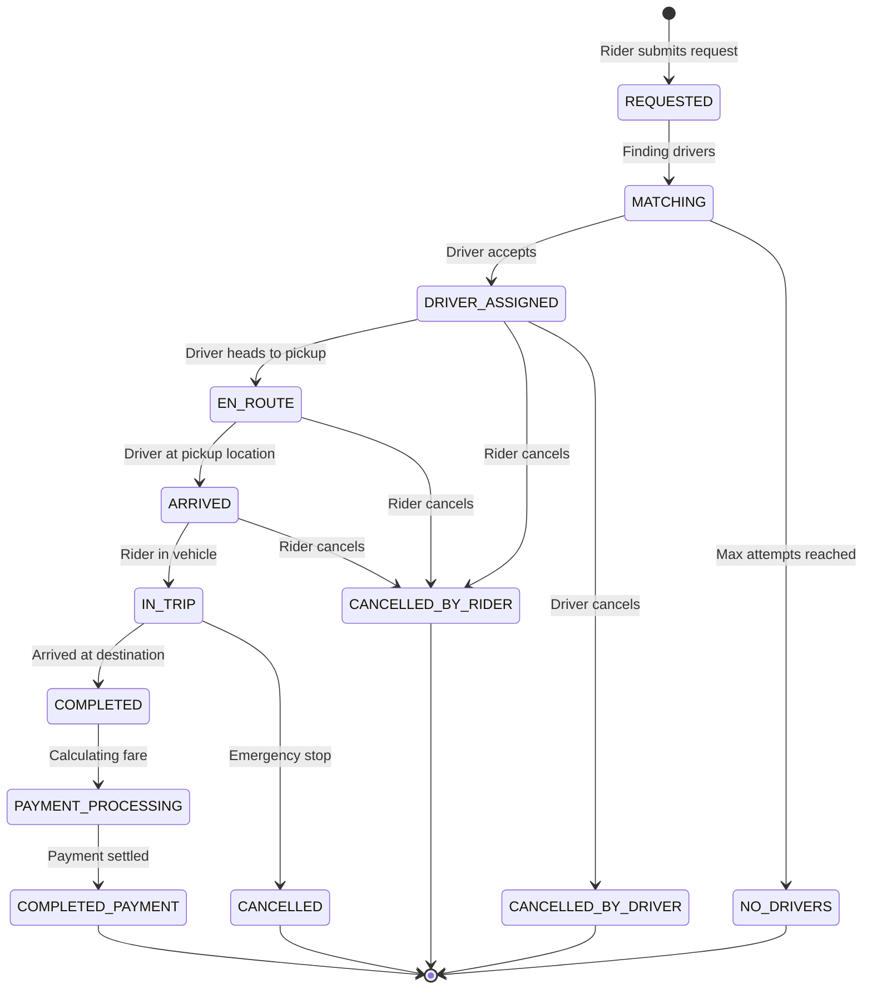

# Ride-Hailing System Case Study: Lyft/Uber

## Overview

A ride-hailing platform connects millions of riders with drivers in real-time, requiring sub-second driver matching, continuous GPS tracking, dynamic pricing, and reliable payment processing. This case study focuses on production engineering challenges distinct from consumer mapping: geospatial indexing at scale (finding the nearest available driver among millions), the matching algorithm with supply-demand balancing, surge pricing via real-time stream processing, and the state machine governing trip lifecycle with eventual consistency guarantees.

## Key Requirements

### Functional
- Rider requests a ride with pickup/dropoff location
- Match rider with nearest available driver within 30 seconds
- Real-time driver GPS tracking (update every 4 seconds)
- Dynamic surge pricing based on real-time supply/demand per zone
- ETA estimation for pickup and dropoff
- Trip lifecycle management: request → match → en-route → pickup → in-trip → complete → payment
- Support multiple ride types (economy, premium, shared/pool)
- Driver earnings calculation and payout

### Non-Functional
| Requirement | Target |
|-------------|--------|
| Driver matching latency | < 5 seconds |
| Location update throughput | 300K updates/sec |
| Trip state consistency | Strongly consistent (money involved) |
| ETA accuracy | ±2 minutes for pickup |
| Availability | 99.99% |
| Peak concurrent trips | 500K |

### Capacity Estimation

```
Daily trips: 25M
Peak trips per second: ~1,500
Drivers: 5M total, 2M online at any time

Location updates: 2M drivers × 1 update/4sec = 500K updates/sec
Location event size: ~50 bytes (driver_id, lat, lng, timestamp, speed, heading)
Location bandwidth: 500K × 50B = 25 MB/s
Location daily storage: 500K × 86400 × 50B = ~2 TB/day (raw events)

Trip storage: 25M trips × 1KB = ~25 GB/day
Payment transactions: 25M × 500B = ~12.5 GB/day

Geospatial index size: 2M active drivers × 100B each = ~200 MB (in-memory)
Surge pricing zones: ~500 zones per major city, 10 major cities
```

## High-Level Architecture



## Deep Dive: Geospatial Indexing with H3

Finding the nearest available driver among 2M online drivers is the system's defining computational challenge. Uber's H3 hexagonal grid partitions the world into hierarchical hex cells, enabling O(1) lookup per cell and O(K²) neighbor search.

### H3 Index Design

```
H3 Resolution Levels:
  Level 8: hex edge ~870m (city zones for surge pricing)
  Level 9: hex edge ~174m (driver indexing)
  Level 10: hex edge ~35m (precise pickup matching)
  Level 12: hex edge ~3m (not used — too fine-grained)

Driver index structure (Redis):
  HSET driver:{driver_id} {
    "h3_index": "891e3...",
    "lat": 37.7749,
    "lng": -122.4194,
    "heading": 180,
    "speed_kmh": 45,
    "status": "available",
    "vehicle_type": "economy",
    "rating": 4.8,
    "last_update": 1704067200
  }

  Inverted index: HSET h3:891e3...:drivers { driver_id_1: "1", driver_id_2: "1" }
  TTL: 60 seconds (stale drivers auto-removed)
```

### Finding Nearby Drivers

```python
def find_nearby_drivers(pickup_lat, pickup_lng, radius_km=3, limit=10):
    # Step 1: Convert pickup location to H3 index (resolution 9)
    pickup_hex = h3.geo_to_h3(pickup_lat, pickup_lng, 9)

    # Step 2: Get K-ring neighbors within radius
    # k=2 covers ~1.5km, k=3 covers ~3km
    hexes = h3.k_ring(pickup_hex, k=3)

    # Step 3: Collect drivers from all hex cells
    candidates = []
    for hex_id in hexes:
        driver_ids = redis.hgetall(f"h3:{hex_id}:drivers")
        for driver_id in driver_ids:
            driver = redis.hgetall(f"driver:{driver_id}")
            if driver["status"] == "available":
                candidates.append(driver)

    # Step 4: Sort by actual haversine distance (H3 is approximate)
    candidates.sort(key=lambda d: haversine(pickup_lat, pickup_lng,
                                            d["lat"], d["lng"]))

    return candidates[:limit]
```

**H3 vs Alternatives:**

| Approach | Lookup Complexity | Even Distance | Implementation |
|----------|-----------------|---------------|----------------|
| H3 hex grid | O(K²) per ring | Yes (hexagons) | Redis hash map + K-ring |
| Quadtree | O(log N) depth | No (squares) | Custom tree structure |
| Geohash | O(1) per hash | No (rectangle) | Sorted set by hash prefix |
| PostGIS (R-tree) | O(log N) | Yes | Database query (slow at scale) |

H3 is preferred because hexagons have uniform neighbor distances (unlike squares, where diagonal neighbors are √2× farther), and the K-ring lookup is deterministic and fast.

## Deep Dive: Matching Algorithm

The matching service orchestrates driver selection through a multi-stage pipeline:



**Ranking function:**
```
driver_score = w1 × (1 / distance_km)          # Closer is better
             + w2 × (1 / eta_seconds)          # Faster ETA is better
             + w3 × driver_rating              # Higher rating is better
             + w4 × direction_match           # Heading toward pickup
             + w5 × acceptance_rate            # Driver with higher accept rate
             + w6 × surge_eligibility          # Whether driver accepts surge
```

**Timeout and escalation:** Each driver has 15 seconds to accept. If declined or timed out, the system offers to the next-ranked driver (up to 5 attempts). After 5 failed attempts, the rider is notified that no drivers are available.

## Deep Dive: Surge Pricing via Stream Processing

Surge pricing dynamically adjusts fares when demand exceeds supply in a geographic zone.

```mermaid
graph LR
    subgraph "Inputs"
        RideRequests["Ride Requests<br/>(Kafka)"]
        DriverLocations["Driver Availability<br/>(H3 Index)"]
    end

    subgraph "Stream Processing (Flink)"
        Aggregate["Aggregate per H3 zone<br/>10-second windows"]
        Compare["Compare to baseline<br/>(historical supply/demand ratio)"]
        Compute["Compute surge multiplier<br/>smoothed, capped at 3.0x"]
    end

    subgraph "Output"
        SurgeCache[(Redis<br/>surge:{h3_hex})]
        PricingSvc[Pricing Service<br/>Reads surge at request time]
    end

    RideRequests --> Aggregate
    DriverLocations --> Aggregate
    Aggregate --> Compare
    Compare --> Compute
    Compute --> SurgeCache
    PricingSvc --> SurgeCache
```

**Surge computation:**
```
For each H3 hex zone (resolution 8, ~870m edge):
  demand_count = ride_requests in last 10 minutes
  supply_count = available drivers currently in hex + adjacent hexes
  demand_ratio = demand_count / max(supply_count, 1)

  If demand_ratio > 1.5:
    surge_multiplier = min(1 + 0.25 × (demand_ratio - 1.5), 3.0)

  Smoothing: exponential moving average to prevent flicker
    smoothed_surge = 0.7 × current_surge + 0.3 × previous_surge

Price lock: surge multiplier is locked at the time of ride request
  (not at the time of driver match or trip start)
```

## Deep Dive: Trip State Machine

Trip lifecycle is managed as a strongly consistent state machine. Since money is involved, every state transition is persisted to PostgreSQL before acknowledgment.



**State transitions are persisted:**
```sql
CREATE TABLE trips (
    trip_id          UUID PRIMARY KEY,
    rider_id         BIGINT NOT NULL,
    driver_id        BIGINT,
    status          VARCHAR(30) NOT NULL,
    pickup_location  POINT NOT NULL,
    dropoff_location POINT NOT NULL,
    fare_cents       INT,
    surge_multiplier DECIMAL(4,2),
    created_at       TIMESTAMPTZ DEFAULT NOW(),
    updated_at       TIMESTAMPTZ DEFAULT NOW()
);

CREATE TABLE trip_events (
    event_id   BIGSERIAL PRIMARY KEY,
    trip_id    UUID REFERENCES trips(trip_id),
    from_state VARCHAR(30),
    to_state   VARCHAR(30),
    timestamp  TIMESTAMPTZ DEFAULT NOW()
);
```

## Scalability

| Component | Strategy |
|-----------|---------|
| Geospatial Index | Redis cluster, H3 hex grid, TTL-based cleanup |
| Location Stream | Kafka (500K events/sec), Flink for aggregation |
| Matching Service | Stateless, partitioned by city, 50+ instances |
| Trip Service | PostgreSQL with connection pooling, partitioned by date |
| ETA Service | In-memory road graph (~10 GB per major city) |
| Surge Pricing | Flink streaming, 10-second windows, Redis cache |
| Payment | ACID database + external payment gateway |

## Trade-Offs

| Decision | Benefit | Cost |
|----------|---------|------|
| H3 hex grid | O(1) cell lookup, uniform neighbor distance | Approximate boundaries (hex cells) |
| 4-second GPS updates | Near real-time tracking | 500K writes/sec to Kafka/Redis |
| PostgreSQL for trips | Strong consistency (money involved) | Horizontal scaling limit |
| Redis for driver index | Sub-millisecond driver lookup | Memory-bound, TTL-based staleness |
| Flink for surge | Real-time supply/demand computation | Complex stream processing pipeline |

## Interview Tips

1. **Lead with geospatial indexing** — "The core problem is finding the nearest available driver among millions in sub-second time"
2. **Explain H3 in depth** — hexagonal grid with K-ring neighbor lookup, Redis-backed index
3. **Discuss the matching pipeline** — geospatial lookup → filter → rank → offer → accept/timeout
4. **Mention surge pricing** — Flink streaming computes supply/demand ratio per hex zone every 10 seconds
5. **Highlight the state machine** — trip lifecycle with strong consistency (PostgreSQL) since money is involved
6. **Estimate location throughput** — 2M drivers × 4-sec updates = 500K events/sec

## Key Takeaways

- H3 hexagonal grid enables O(1) driver lookup per cell with O(K²) neighbor search via Redis.
- Matching pipeline: geospatial lookup → filter (type, rating) → rank (distance, ETA, rating) → offer → accept.
- Surge pricing uses Flink streaming on 10-second windows to compute supply/demand per hex zone.
- Trip state machine requires strong consistency (PostgreSQL) because money is involved.
- Location updates: 500K events/sec through Kafka into Redis-backed H3 index with 60-second TTL.

## Cross-References

- [How Uber Works](./uber.md) — Focused Uber architecture deep dive
- [Google Maps](../google-maps.md) — Mapping and routing
- [Payment System](../payment.md) — Payment processing patterns
- [Rate Limiter](../rate-limiter.md) — Protecting against abuse
