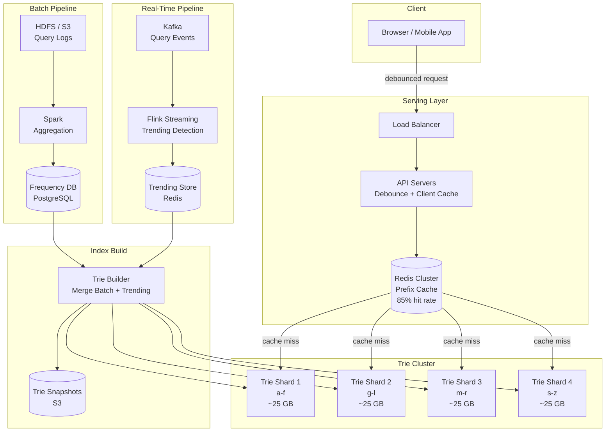

# Search Autocomplete Case Study

## Overview

Search autocomplete (typeahead) is the system behind the suggestions dropdown that appears as users type in a search box. Google handles 8.5 billion searches per day, each triggering multiple autocomplete requests as users type character by character. The system must return suggestions in under 50ms while ranking billions of possible completions by relevance, recency, personalization, and trending velocity. This case study covers the trie-based serving layer, real-time trending detection, personalization at scale, and the offline data pipeline that builds and deploys suggestion indexes.

## Key Requirements

### Functional
- Show top 10 suggestions after each keystroke with prefix matching
- Support multiple suggestion types: queries, entities (people, places, products), actions
- Personalize suggestions based on user search history, location, and preferences
- Detect and boost trending queries in real-time
- Handle misspellings and fuzzy matching (optional enhancement)
- Support multiple languages and locales with region-specific trending
- Cache popular prefixes aggressively for sub-10ms response times

### Non-Functional
| Requirement | Target |
|-------------|--------|
| Latency (p99) | < 50ms from keystroke to suggestions |
| Scale | 8.5B searches/day → ~100K autocomplete requests/sec |
| Suggestion freshness | Trending queries updated within 60 seconds |
| Index freshness | Daily suggestions rebuilt every 6 hours |
| Availability | 99.99% |

### Capacity Estimation

```
Searches: 8.5B/day
Average keystrokes per search: 8
Autocomplete requests: 8.5B × 8 = 68B requests/day
Peak QPS: ~1M requests/sec

Unique queries in index: 10B historical queries
Average query length: 15 characters
Trie nodes (with shared prefixes): ~500M nodes
Memory per node: ~200 bytes (children map + top-10 suggestions with scores)
Total trie memory: 500M × 200B = ~100 GB
With 3 replicas: ~300 GB

Cache hit rate target: 85% (top prefixes cached in Redis)
Cache misses: 1M × 0.15 = 150K QPS hitting trie servers
```

## High-Level Architecture



## Deep Dive: Trie Data Structure with Top-K Suggestions

The core data structure is a trie (prefix tree) where each node stores the pre-computed top-10 suggestions for its prefix. This transforms O(K) traversal into O(1) lookup.

```
Trie node structure:
  children: HashMap<char, TrieNode>
  top_suggestions: [(query, score)]  # Sorted, max 10 entries

Example trie for "apple", "application", "apply":
        (root)
        /    \
       a      ...
       |
       p
       |
       p
      / \
     l   p
     |   |
     e   l
     |   |
  apple  i
         |
      application, apply

Node at "app" has top_suggestions:
  [("apple", 95), ("application", 82), ("apple store", 78), ("apple music", 65), ...]
```

**Trie construction algorithm:**
```python
def build_trie(queries_with_scores, max_k=10):
    root = TrieNode()
    for query, score in queries_with_scores:
        node = root
        for char in query:
            if char not in node.children:
                node.children[char] = TrieNode()
            node = node.children[char]
            # Insert maintaining sorted order, cap at max_k
            node.top_suggestions.append((query, score))
            node.top_suggestions.sort(key=lambda x: -x[1])
            if len(node.top_suggestions) > max_k:
                node.top_suggestions.pop()
    return root
```

**Lookup is O(1):** Given prefix "app", traverse 3 nodes (O(prefix_length)), then return `top_suggestions` directly. For an average prefix of 5 characters, lookup is effectively O(1).

**Memory optimization:** Instead of storing query strings at every node, store integer references to a shared string pool. This reduces memory per suggestion from ~50 bytes to ~16 bytes.

## Deep Dive: Personalization Layer

The base trie provides globally popular suggestions. Personalization adjusts rankings based on individual user context without modifying the shared trie.

```mermaid
graph LR
    subgraph "Request"
        User[User types "san"]
    end

    subgraph "Base Suggestions"
        Trie["Trie: san →<br/>san francisco (90)<br/>samsung (85)<br/>sandy hook (80)<br/>san diego (78)"]
    end

    subgraph "Personalization"
        History[User Search History<br/>samsung galaxy, san jose]
        Location[User Location<br/>San Jose, CA]
        Context[Time/Device<br/>Mobile, 9am]
    end

    subgraph "Reranking"
        Reranker[Score Adjuster<br/>+20 for search history<br/>+15 for local<br/>+5 for mobile context]
    end

    subgraph "Output"
        Result["1. san jose (95*)<br/>2. san francisco (90)<br/>3. samsung (85*)<br/>4. san diego (93*)<br/>5. samsung galaxy (75*)"]
    end

    User --> Trie
    Trie --> Reranker
    History --> Reranker
    Location --> Reranker
    Context --> Reranker
    Reranker --> Result
```

**Personalization signals:**

| Signal | Weight | Source |
|--------|--------|--------|
| User search history | +20 | Redis, per-user recent queries (last 30 days) |
| Geographic proximity | +15 | GeoIP + user profile location |
| Device context | +5 | User-agent parsing |
| Time of day | +3 | Current hour |

**Implementation:** The API server fetches the user's personalization profile (cached in Redis, ~2KB per user) in parallel with the trie lookup. Both results are available within ~5ms, and reranking is a simple score adjustment that takes ~1ms.

## Deep Dive: Real-Time Trending Detection

Trending queries spike suddenly and must appear in suggestions within minutes. A Flink-based streaming pipeline detects trending queries in real-time.

```
Trending detection algorithm (Flink):

1. Sliding window: 10-minute windows with 2-minute slide
2. For each window:
   a. Count query frequencies per (query, region) pair
   b. Compare to historical baseline (rolling 7-day average for same hour)
   c. Compute trending score: trending_score = current_freq / baseline_freq
   d. If score > 3.0 (3x above baseline): flag as trending
   e. If score > 10.0: flag as "breaking" (highest priority)

3. Publish trending queries to Redis:
   key: trending:{region}
   value: sorted set of (query, trending_score)
   TTL: 10 minutes (auto-expire)

4. Trie servers poll trending Redis keys every 30 seconds
   Boost trending queries in top_suggestions by +trending_score
```

**Example trending behavior:**
- Earthquake hits San Francisco at 10:03 AM
- By 10:04 AM, "earthquake san francisco" query count spikes to 50K/min (baseline: 100/min)
- Trending score: 500x → immediately flagged as "breaking"
- By 10:05 AM, "earthquake" appears as top suggestion for anyone typing "e" or "ea" in the SF region

## API Design

```
GET /api/v1/suggest?q=san&locale=en-US&session_id=abc123
Response: {
  "suggestions": [
    { "text": "san jose", "type": "query", "score": 95 },
    { "text": "san francisco", "type": "query", "score": 90 },
    { "text": "samsung galaxy s24", "type": "product", "score": 85 }
  ],
  "metadata": { "cache_hit": true, "latency_ms": 12 }
}

Client-side behavior:
  1. User types "s" → debounce 100ms → fetch suggestions
  2. User types "sa" → debounce 100ms → fetch suggestions
  3. Client caches results by prefix
  4. If user backspaces to previously fetched prefix → serve from client cache
```

## Scalability

| Component | Strategy |
|-----------|---------|
| Trie Cluster | 4 shards (by first letter range), 3 replicas each |
| Redis Cache | Clustered, 85% cache hit rate, LRU eviction |
| API Servers | 200+ stateless instances |
| Flink Streaming | 20 task managers, 10-minute sliding windows |
| Spark Batch | Daily job on 1TB query logs |
| Trie Builder | Builds new trie snapshot in ~30 minutes, rolling deploy |

## Trade-Offs

| Decision | Benefit | Cost |
|----------|---------|------|
| Top-K at each trie node | O(1) lookup per prefix | Higher memory (~100 GB) |
| Batch trie rebuild | Consistent, tested snapshots | Up to 6 hours of staleness |
| Real-time trending overlay | Fresh suggestions for breaking events | Separate pipeline, Redis polling |
| Client-side debounce | 100ms reduction in API calls | Slight perceived delay |
| Personalization via reranking | No per-user trie needed | Extra Redis lookup per request |

## Interview Tips

1. **Lead with latency** — "50ms budget means we need O(1) lookup, which is why we store top-K at each trie node"
2. **Explain the trie** — prefix tree with pre-computed suggestions eliminates traversal to leaves
3. **Discuss the data pipeline** — batch (Spark) for baseline + real-time (Flink) for trending
4. **Mention personalization** — reranking layer that adjusts global suggestions per user
5. **Estimate memory** — 500M nodes × 200B = 100 GB, sharded across 4 machines
6. **Don't forget client-side** — debouncing and client caching reduce server load by 40%

## Key Takeaways

- Autocomplete uses a trie with pre-computed top-K suggestions at each node for O(1) per-prefix lookup.
- 100 GB memory for 500M trie nodes, sharded by first letter range across 4 machines.
- Real-time trending via Flink sliding windows detects sudden query spikes within minutes.
- Personalization is a lightweight reranking layer — no per-user trie needed.
- Client-side debouncing (100ms) and caching reduce server load by ~40%.

## Cross-References

- [Typeahead Design](../typeahead.md) — Interview-format overview
- [Search Engine](../search.md) — Full-text search design
- [Caching Strategy](../hld/caching-strategy.md) — Multi-layer caching patterns
- [Estimation](../estimation.md) — Capacity planning techniques
