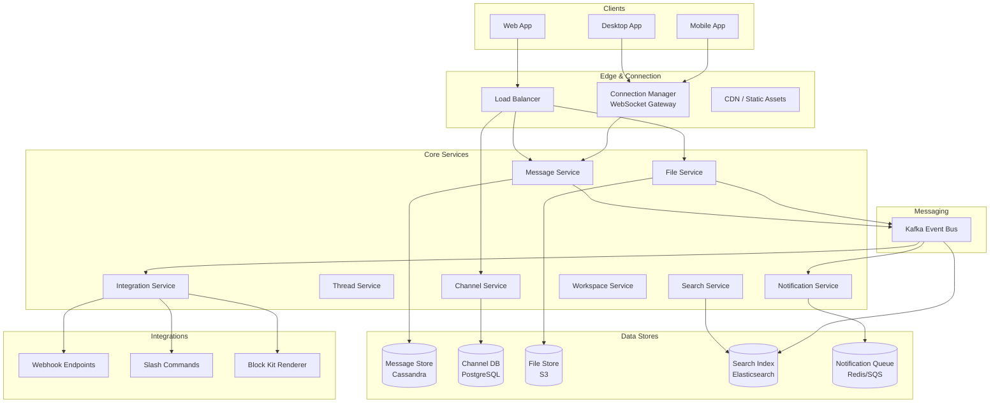

# Slack: Team Messaging Platform

## Overview

Slack is a workplace messaging platform with 32M+ daily active users across 750K+ organizations. It organizes communication into workspaces, channels (public/private), direct messages, and threads. The core design challenges include real-time message delivery via WebSocket, message persistence with search, file storage and preview, rich notification routing, and third-party integrations (webhooks, Slack Apps, and the Block Kit framework).

## Key Requirements

### Functional
- Workspaces and channels (public, private, shared across orgs)
- Real-time messaging (DMs, channels, threads)
- Message reactions, edits, deletions, and formatting (Markdown, Block Kit)
- File sharing with preview generation (images, PDFs, code)
- Search across messages, files, and channels
- Notifications (desktop, mobile push, email digest)
- Integrations: webhooks, slash commands, interactive components
- Message threading (replies under a parent message)

### Non-Functional
| Requirement | Target |
|------------|--------|
| Scale | 32M DAU, 750K+ workspaces |
| Message throughput | 100K+ messages/sec |
| Latency | Message delivery < 100ms |
| Availability | 99.99% |
| Message durability | No message loss |
| Search latency | < 500ms across workspace history |

### Capacity Estimation

```
Daily active users: 32M
Messages per day: 2B (avg 62 messages/user/day)
Peak message QPS: ~100K/sec
Files uploaded per day: 50M
Workspaces: 750K (avg 50 users/workspace)
Channels per workspace: 100 (avg)

Storage (messages): 2B/day × 500B = ~1 TB/day → ~365 TB/year
Storage (files): 50M/day × 500KB = ~25 TB/day → ~9 PB/year
Storage (search index): ~1.5x message storage = ~550 TB/year

WebSocket connections: 32M DAU × 1.2 connections (multi-device) = ~38M concurrent
```

## High-Level Architecture



## Deep Dive: WebSocket Connection Management

Slack maintains persistent WebSocket connections for real-time delivery. With 38M concurrent connections, this is the largest scaling challenge.

```mermaid
sequenceDiagram
    participant Client
    participant ConnMgr[Connection Manager]
    participant Registry[Connection Registry<br/>Redis]
    participant MsgSvc[Message Service]

    Client->>ConnMgr: WebSocket connect
    ConnMgr->>Registry: Register (user_id → connection_id)
    ConnMgr-->>Client: Connected

    Note over MsgSvc: User B sends message
    MsgSvc->>Registry: Lookup user A's connections
    Registry-->>MsgSvc: [conn_1, conn_2]
    MsgSvc->>ConnMgr: Push message to conn_1
    ConnMgr->>Client: Message delivered
    MsgSvc->>ConnMgr: Push message to conn_2
```

**Connection management strategy:**
- Multiple Connection Manager instances behind a load balancer
- A **Connection Registry** (Redis hash) maps `user_id → [connection_ids]`
- When a message is sent, the Message Service looks up all active connections for recipients
- If a recipient is offline, the message is stored in the Message Store and delivered on next connect
- **Heartbeat pings** every 30 seconds detect dead connections
- **Reconnection** is handled client-side with exponential backoff and message gap recovery

## Deep Dive: Message Storage and Threading

Slack messages are stored in Cassandra, partitioned by `channel_id` and ordered by timestamp.

**Thread model:** Each channel message can have a thread of replies.

```
Message {
    message_id:  snowflake_id (time-ordered),
    channel_id:  int64,
    parent_id:   int64 (null for top-level, set for thread replies),
    user_id:     int64,
    text:        text,
    reactions:   map<string, [user_ids]>,  // emoji → who reacted
    edited_at:   timestamp (null if never edited),
    deleted:     boolean,
    created_at:  timestamp
}
```

**Loading a channel:**
1. Fetch latest 100 top-level messages from Cassandra (ordered by message_id descending)
2. For each message, fetch reply count and first 3 thread replies
3. Full thread loaded on-demand when user clicks into it

**Search:** Messages are indexed in Elasticsearch within seconds via Kafka. Search supports Boolean operators, channel/user filters, date ranges, and file type filters.

## Deep Dive: Notification Routing

Slack's notification system must route notifications through the correct channel (desktop, mobile push, email) based on user preferences.

```mermaid
graph TB
    Mention["User @mentioned"] --> NotifySvc[Notification Service]
    NotifySvc --> PrefCheck[User Preferences<br/>per channel/workspace]
    PrefCheck --> Desktop[Desktop Notification]
    PrefCheck --> Mobile[Mobile Push<br/>FCM/APNs]
    PrefCheck --> Email[Email Digest<br/>(batched)]
    PrefCheck --> DND[Do Not Disturb Check]
    PrefCheck --> Mute[Muted Channel Check]
```

**Notification modes per channel:**
- **All messages** — notify on every message
- **@mentions & keywords** — notify only when mentioned or keyword appears
- **Nothing** — completely muted
- **Do Not Disturb** — suppress all notifications during configured hours

## Deep Dive: Integrations

Slack's integration ecosystem (webhooks, slash commands, Block Kit) is a key differentiator.

- **Incoming Webhooks**: External services POST to a URL to post messages to a channel
- **Outgoing Webhooks**: Messages matching a pattern trigger an HTTP call to an external service
- **Slash Commands**: `/deploy staging` triggers an HTTP call and returns a response
- **Interactive Components**: Buttons, dropdowns, date pickers in messages that POST payloads back to the app

## API Design

| Endpoint | Method | Description |
|----------|--------|-------------|
| `/api/conversations.create` | POST | Create a channel |
| `/api/conversations.history` | GET | Get messages in a channel |
| `/api/chat.postMessage` | POST | Send a message |
| `/api/chat.update` | POST | Edit a message |
| `/api/files.upload` | POST | Upload a file |
| `/api/search.messages` | GET | Search messages |
| `/api/reactions.add` | POST | Add a reaction |
| `/api/users.profile.set` | POST | Update user profile |
| `/api/conversations.members` | GET | List channel members |

## Data Model

```sql
CREATE TABLE workspaces (
    workspace_id  BIGSERIAL PRIMARY KEY,
    name          VARCHAR(100) NOT NULL,
    domain        VARCHAR(50) UNIQUE NOT NULL,
    plan          ENUM('free','pro','business+') DEFAULT 'free',
    member_count  INT DEFAULT 0,
    created_at    TIMESTAMPTZ DEFAULT NOW()
);

CREATE TABLE channels (
    channel_id    BIGSERIAL PRIMARY KEY,
    workspace_id  BIGINT NOT NULL,
    name          VARCHAR(80) NOT NULL,
    is_private    BOOLEAN DEFAULT FALSE,
    creator_id    BIGINT NOT NULL,
    member_count  INT DEFAULT 0,
    created_at    TIMESTAMPTZ DEFAULT NOW(),
    UNIQUE (workspace_id, name)
);

CREATE TABLE workspace_members (
    workspace_id  BIGINT,
    user_id       BIGINT,
    role          ENUM('member','admin','owner') DEFAULT 'member',
    PRIMARY KEY (workspace_id, user_id)
);
```

## Scalability

| Component | Strategy |
|-----------|----------|
| WebSocket connections | Connection Manager cluster, Redis registry |
| Message Store | Cassandra, partitioned by channel_id |
| Search | Elasticsearch, sharded by workspace |
| File Storage | S3 + CloudFront CDN |
| Notifications | Kafka → async workers → FCM/APNs/email |
| Integrations | Stateless workers, rate-limited per app |

## Trade-Offs

| Decision | Benefit | Cost |
|----------|---------|------|
| Cassandra for messages | Scales writes, time-ordered | No JOINs, no ad-hoc queries |
| WebSocket for real-time | Instant delivery | 38M persistent connections to manage |
| Elasticsearch for search | Full-text search with filters | Indexing lag (~seconds) |
| Kafka for event bus | Decouples services, replayable | Operational complexity |
| Thread-on-demand | Fast channel load | Extra round-trip to load full thread |

## Interview Tips

1. **Lead with the connection management problem** — "38M persistent WebSocket connections is the biggest challenge."
2. **Explain the connection registry** — Redis mapping user_id to active connection_ids.
3. **Discuss message threading** — top-level messages loaded eagerly, thread replies lazily.
4. **Mention offline delivery** — messages stored in DB, delivered on reconnect with gap recovery.
5. **Talk about search** — Kafka → Elasticsearch for near-real-time message search.
6. **Don't forget integrations** — webhooks and slash commands are what make Slack a platform.

## Interview Questions

1. How would you manage 38M concurrent WebSocket connections?
2. How does Slack handle message ordering guarantees in a distributed system?
3. Design the notification routing system with per-channel user preferences.
4. How would you implement message search across billions of messages?
5. What happens when a user has 10K unread messages and opens the app?
6. Design Slack's file sharing pipeline: upload, preview generation, and delivery.
7. How would you implement the integration platform (webhooks, slash commands, interactive components)?
8. How does Slack ensure no message loss during network partitions?
9. Design a system to detect and handle abusive or spam messages in Slack.
10. How would you implement shared channels across different organizations?

## Key Takeaways

- Connection management (38M persistent WebSockets) is Slack's biggest scaling challenge, solved with a Connection Manager cluster and Redis registry.
- Messages are stored in Cassandra partitioned by channel_id, with threads loaded on-demand.
- Kafka decouples message delivery from indexing, notifications, and integrations.
- Elasticsearch powers near-real-time search across billions of messages.
- Notification routing respects per-channel user preferences, DND schedules, and mute settings.

## Cross-References

- [Chat System](./chat-system.md) — Real-time messaging fundamentals
- [Notification System](./notification-system.md) — Notification delivery patterns
- [WhatsApp](./whatsapp.md) — Comparison: consumer vs enterprise messaging
- [Telegram](./telegram.md) — Cloud-synced messaging approach

## References

- Slack Engineering Blog: "How Slack Works: WebSockets"
- Slack Engineering: "Scaling Slack's Message Storage"
- Slack API Documentation: "Conversations API, Chat API"
