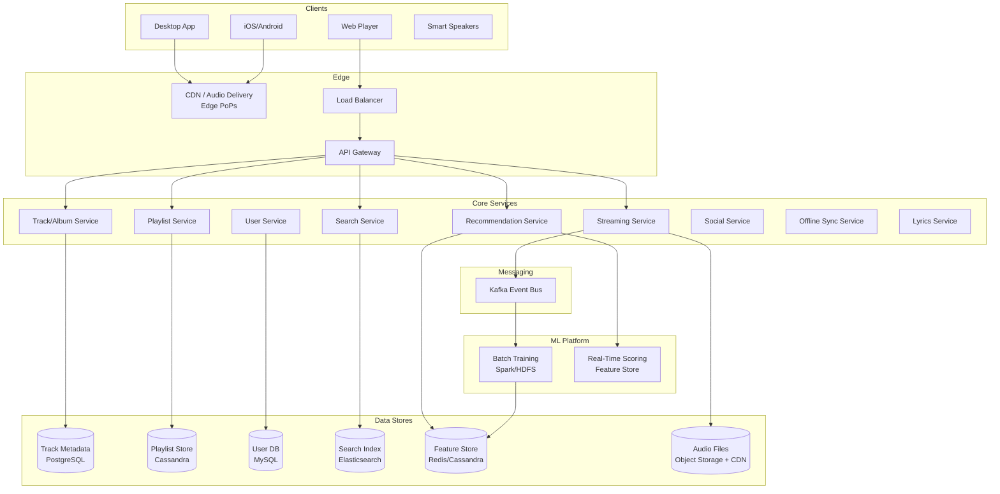
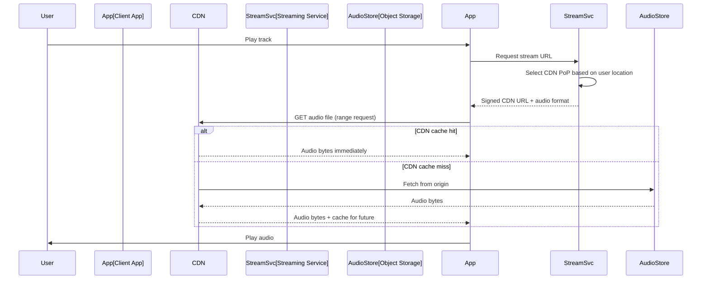
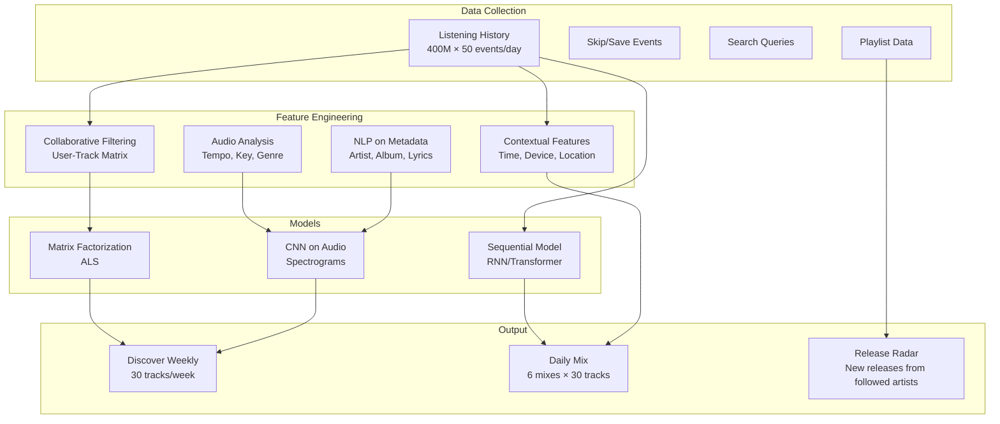
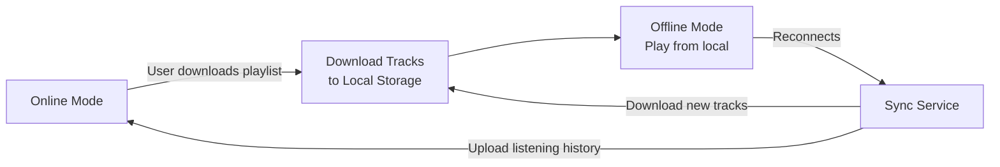

# Spotify: Music Streaming Platform

## Overview

Spotify is the world's largest music streaming service with 600M+ users and 220M+ premium subscribers across 180+ markets. The platform streams 100M+ tracks, hosts 5B+ playlists, and generates personalized recommendations for every user. Core design challenges include low-latency audio streaming, a recommendation engine trained on billions of listening events, playlist curation at scale, and seamless offline playback with sync.

## Key Requirements

### Functional
- Stream 100M+ tracks (audio on demand)
- Create, share, and collaborate on playlists
- Personalized recommendations (Discover Weekly, Release Radar, Daily Mix)
- Artist pages, albums, and podcast hosting
- Social features: follow artists, share tracks, collaborative playlists
- Offline mode: download playlists for playback without network
- Search across tracks, artists, albums, and podcasts
- Lyrics display synchronized with playback

### Non-Functional
| Requirement | Target |
|------------|--------|
| Scale | 600M+ users, 220M+ paid subscribers |
| Stream QPS | 10M+ concurrent streams |
| Start latency | < 200ms to first audio byte |
| Availability | 99.99% |
| Audio quality | 128/160/320 kbps (Ogg Vorbis), lossless options |
| Offline sync | Seamless transition between online/offline |

### Capacity Estimation

```
Monthly active users: 600M
Daily active users: 400M
Concurrent streams (peak): 10M
Average listening time: 2.5 hours/day
Total streaming hours/day: 400M × 2.5 = 1B hours/day

Bandwidth (at 320kbps): 10M × 320kbps = 3.2 Tbps
Audio storage: 100M tracks × 30MB (avg) = ~3 PB

Recommendation events: 400M users × 50 listens/day × 10 features = 200B features/day
Playlist count: 5B playlists (most auto-generated)
```

## High-Level Architecture



## Deep Dive: Audio Streaming Pipeline

Spotify streams audio via a global CDN with edge caching. The goal is < 200ms to first audio byte.



**Key optimizations:**
- **Range requests** — client requests byte ranges, enabling seek without downloading the full file
- **CDN edge caching** — popular tracks are cached at 200+ PoPs globally
- **Adaptive bitrate** — client switches between 128/160/320 kbps based on network conditions
- **Pre-fetching** — the next track in a playlist is pre-fetched while the current track plays

## Deep Dive: Recommendation Engine

Spotify's recommendation system is the product's core differentiator. It combines collaborative filtering, content-based analysis, and deep learning.



**Discover Weekly pipeline:**
1. Build a user-track interaction matrix (implicit feedback: play count, skip, save)
2. Run matrix factorization (ALS) to generate user and track embeddings
3. For each user, find tracks with similar embeddings to their profile
4. Filter out already-played tracks, apply diversity constraints
5. Cache the 30-track playlist; refresh weekly

## Deep Dive: Offline Mode



**Offline sync challenges:**
- Track which songs were played offline → upload listening history on reconnect
- Handle track removals (song removed from catalog while offline)
- Encrypt downloaded audio to prevent piracy (FairPlay / Widevine DRM)
- Storage management: let user control how much space offline mode uses

## API Design

| Endpoint | Method | Description |
|----------|--------|-------------|
| `/v1/tracks/{id}` | GET | Get track metadata |
| `/v1/tracks/{id}/stream` | GET | Get streaming URL |
| `/v1/playlists` | POST | Create playlist |
| `/v1/playlists/{id}/tracks` | POST | Add tracks to playlist |
| `/v1/recommendations` | GET | Get personalized recommendations |
| `/v1/search` | GET | Search tracks, artists, albums |
| `/v1/me/top/tracks` | GET | Get user's top tracks |
| `/v1/me/player/play` | PUT | Start/resume playback |
| `/v1/me/player/recently-played` | GET | Get recently played tracks |
| `/v1/lyrics/{track_id}` | GET | Get synchronized lyrics |

## Data Model

```sql
CREATE TABLE tracks (
    track_id     BIGSERIAL PRIMARY KEY,
    title        VARCHAR(500) NOT NULL,
    artist_id    BIGINT NOT NULL,
    album_id     BIGINT,
    duration_ms  INT NOT NULL,
    audio_url    TEXT NOT NULL,
    isrc         VARCHAR(12) UNIQUE,  -- International Standard Recording Code
    popularity   SMALLINT DEFAULT 0,
    released_at  DATE
);

CREATE TABLE playlists (
    playlist_id  BIGSERIAL PRIMARY KEY,
    owner_id     BIGINT NOT NULL,
    name         VARCHAR(200) NOT NULL,
    is_collab    BOOLEAN DEFAULT FALSE,
    track_count  INT DEFAULT 0,
    followers    INT DEFAULT 0,
    created_at   TIMESTAMPTZ DEFAULT NOW()
);

CREATE TABLE playlist_tracks (
    playlist_id  BIGINT,
    track_id     BIGINT,
    position     INT NOT NULL,
    added_by     BIGINT,
    added_at     TIMESTAMPTZ DEFAULT NOW(),
    PRIMARY KEY (playlist_id, position)
);

CREATE TABLE listening_history (
    user_id      BIGINT,
    track_id     BIGINT,
    played_at    TIMESTAMPTZ DEFAULT NOW(),
    play_duration_ms INT,
    PRIMARY KEY (user_id, played_at)
) PARTITION BY RANGE (played_at);
```

## Scalability

| Component | Strategy |
|-----------|----------|
| Audio delivery | Global CDN (200+ PoPs), object storage origin |
| Track metadata | PostgreSQL with read replicas |
| Playlists | Cassandra, partitioned by playlist_id |
| Listening history | Cassandra, partitioned by user_id, time-partitioned |
| Recommendations | Batch (Spark) for weekly lists, real-time for "now playing" |
| Search | Elasticsearch, sharded by geography |
| Offline sync | Client-side SQLite + encrypted storage |

## Trade-Offs

| Decision | Benefit | Cost |
|----------|---------|------|
| CDN for audio | < 200ms start latency | High CDN egress costs |
| Batch recommendations (weekly) | High quality, pre-computed | Stale for rapidly changing tastes |
| Ogg Vorbis over MP3 | Better quality at same bitrate | Less universal support |
| DRM on offline files | Anti-piracy | Complex key management |
| Cassandra for history | Handles billions of daily events | No complex queries |

## Interview Tips

1. **Lead with the streaming pipeline** — "The core challenge is delivering audio to 10M concurrent users with < 200ms latency."
2. **Explain the CDN strategy** — edge caching, range requests, adaptive bitrate.
3. **Discuss recommendations in depth** — this is Spotify's moat; mention Discover Weekly's pipeline.
4. **Mention offline mode** — sync strategy, DRM, and storage management.
5. **Talk about bandwidth** — 10M concurrent streams at 320kbps = 3.2 Tbps.
6. **Compare with Netflix** — both stream media but Netflix uses adaptive bitrate (HLS/DASH) while Spotify streams audio (simpler but requires gapless playback).

## Interview Questions

1. How does Spotify deliver audio with < 200ms start latency to 10M concurrent users?
2. Design the Discover Weekly recommendation pipeline from data collection to delivery.
3. How would you implement collaborative filtering for 600M users and 100M tracks?
4. Design the offline mode system — how do you handle sync, DRM, and storage?
5. How would you implement gapless playback between tracks in a playlist?
6. Design Spotify's search: how do you handle misspellings and "songs like this" queries?
7. How would you build the social features (follow, share, collaborative playlists)?
8. What's the difference between Spotify's streaming architecture and Netflix's video streaming?
9. How would you implement real-time listening analytics for artists?
10. Design the podcast hosting system — how is it different from music streaming?

## Key Takeaways

- Audio streaming relies on a global CDN with edge caching for < 200ms start latency; range requests enable seeking.
- The recommendation engine combines collaborative filtering (ALS), audio analysis (CNN on spectrograms), and sequential models.
- Discover Weekly is pre-computed weekly using matrix factorization on the user-track interaction matrix.
- Offline mode uses encrypted local storage with sync-on-reconnect for listening history.
- 10M concurrent streams at 320kbps require 3.2 Tbps of bandwidth — CDN is non-negotiable.

## Cross-References

- [Netflix](./netflix.md) — Comparison of media streaming architectures
- [YouTube](./youtube.md) — Video streaming with adaptive bitrate
- [Distributed Cache](./distributed-cache.md) — Caching recommendations
- [Streaming Pipeline](./streaming-pipeline.md) — Event processing for listening data

## References

- Spotify Engineering Blog: "How Spotify's Algorithm Knows Exactly What You Want to Listen To"
- Serrano et al., "Off the Beaten Path: Music Recommendation with Collaborative Filtering on Implicit Feedback" (Spotify Research)
- Spotify API Documentation: Web API Reference
