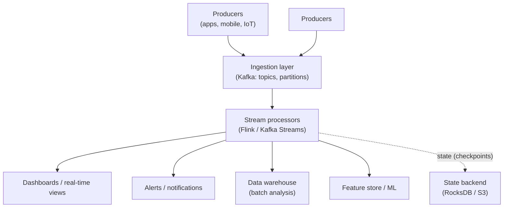
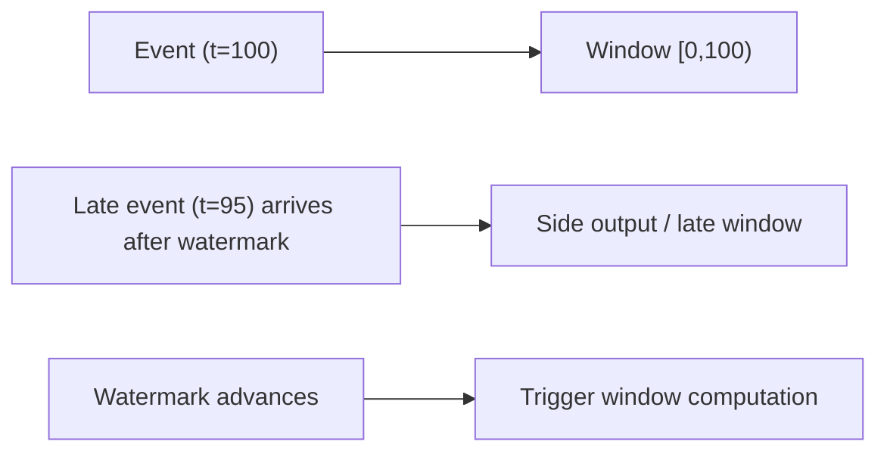
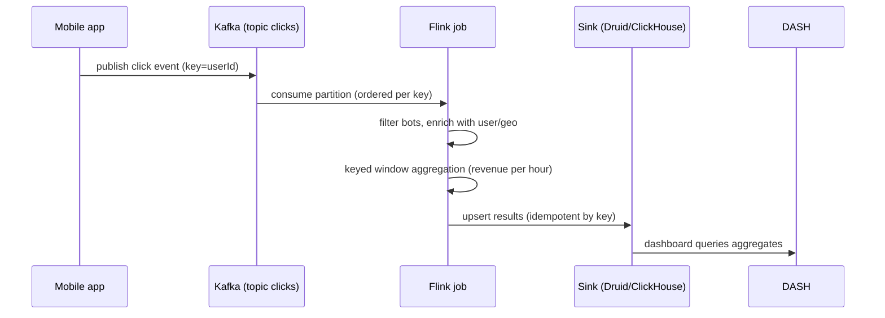

# Design a Streaming Analytics Pipeline

## Requirements

### Functional Requirements
- Ingest events (clicks, orders, sensor readings) from producers in real time
- Process events with transformations (filter, enrich, aggregate)
- Compute **windowed aggregations** (e.g., clicks per minute, revenue per hour)
- Deliver results to consumers (dashboards, alerts, data warehouse)
- Support replay of historical data

### Non-Functional Requirements
- **Low latency**: event → result in seconds (not minutes)
- **High throughput**: millions of events/sec
- **Exactly-once or at-least-once semantics** with idempotent consumers
- **Fault tolerance**: no data loss on broker/processor failure
- **Ordering**: events for the same key processed in order
- **Scalability**: handle spikes via partitioning and autoscaling

## High-Level Design

The pipeline has three layers:

1. **Ingestion** — Kafka (or Kinesis/Pub/Sub) holds the event log: ordered per partition, replayable, durable.
2. **Processing** — a stream processor (Flink, Kafka Streams, Spark Streaming) consumes, transforms, aggregates, and writes results. Stateful ops (windows, joins) checkpoint to a state backend.
3. **Sinks** — results fan out to dashboards, alerts, warehouses (via CDC/batch), feature stores.

## Key Design Decisions

### 1. Choosing the ingestion layer

| Option | Pros | Cons |
|---|---|---|
| **Kafka** | Durable log, replay, partitioning, huge ecosystem | Operate ZooKeeper/KRaft cluster |
| **Kinesis** | Managed, shards, exactly-once w/ Lambda | AWS lock-in, shard limits |
| **Pub/Sub** | Managed, exactly-once, pull/push | GCP lock-in |

Choose **Kafka** unless you're single-cloud: it's the default answer and the log model (retention, replay, partitioning) is what stream processing builds on. See [Kafka](../../../distributed/messaging/kafka.md).

### 2. Event schema and keying

- **Schema**: Avro/Protobuf with a schema registry (evolution-safe); JSON is simple but hard to evolve.
- **Partition key**: events for the same entity (user, order, device) must go to the same partition to preserve per-key ordering and enable stateful per-key processing. Key by business entity, not by timestamp (hot-key problem!).

### 3. Processing semantics

| Semantics | Meaning | How achieved |
|---|---|---|
| At-most-once | No duplicates, may lose events | No retries |
| At-least-once | No loss, may duplicate | Retries + acks |
| **Exactly-once** | No loss, no duplicates | Idempotent sinks + transactional output + checkpointing |

Real systems: **at-least-once delivery + idempotent consumers** is the pragmatic "effectively once" — process using upserts/dedup keys so duplicates converge (see [Idempotency](../../../backend/patterns/idempotency.md)). Flink achieves true exactly-once via checkpointing + two-phase commit sinks (Kafka transactions).

### 4. Time handling: event time vs processing time

- **Event time** — when the event *happened* (embedded timestamp). Correct for analytics but out-of-order.
- **Processing time** — when the processor *sees* it. Simple but wrong under lag.
- **Watermarks** — estimate "no more events with time < W will arrive" to bound window computation and handle late events (with allowed lateness / side outputs).

### 5. Windowing strategies

| Window | Use case |
|---|---|
| **Tumbling** | Fixed non-overlapping (per minute) |
| **Sliding** | Overlapping (last 5 min, slide 1 min) |
| **Session** | Gap-based (user activity session) |

### 6. State and fault tolerance

- Stateful operators (windows, aggregations, joins) keep state; checkpoint it to a durable backend (RocksDB locally + snapshot to S3).
- **Checkpointing** gives exactly-once recovery: on failure, restart from the last checkpoint and reprocess the uncommitted range.
- Sinks must be **idempotent** (upsert by key) so reprocessing converges.

### 7. Scaling and backpressure

- Scale **partitions** in ingestion and **parallelism** in processors independently.
- **Backpressure**: if a processor is slower than ingestion, either buffer (Kafka retention absorbs bursts) or apply flow control — don't drop events silently.
- Autoscale consumers with consumer-group rebalancing (see [Autoscaling](../../../cloud/autoscaling.md)).

## Deep Dive: Clickstream → Revenue-per-hour dashboard

Bottlenecks to probe in the interview:

- **Hot partition** — one user generates huge traffic → skewed partition. Mitigate: two-level keying (key + shard) or salting.
- **Late data** — mobile events arrive out of order; watermarks + allowed lateness handle it; too-late events go to a side output for offline reconciliation.
- **State growth** — per-key state grows unboundedly; use TTL/state TTL and compaction.
- **Sink contention** — high-frequency upserts to a warehouse; buffer writes or use a real-time store (Druid/ClickHouse) for the hot path, batch load for analytics.

## Interview Questions

### Q: How do you guarantee events aren't lost in a streaming pipeline?

Three layers: (1) **broker durability** — Kafka acks + replication ensure the log survives broker failure; (2) **processing fault tolerance** — checkpointing lets the processor resume from the last checkpoint and reprocess; (3) **idempotent sinks** — since reprocessing can replay events, sinks must dedupe (upsert by key). Together these give effectively-once semantics.

### Q: What are watermarks and why do you need them?

Watermarks estimate "no more events with event-time < W will arrive," letting windowed aggregations fire on time instead of waiting forever for stragglers. They handle **out-of-order data**: events below the watermark are late and go to late-data handling (allowed lateness window or side output). Without watermarks, windows either never close or produce wrong results under real-world latency.

### Q: How do you handle a hot partition key?

A single entity (e.g., a viral user) can skew one partition, starving others. Options: (a) **two-level keying** — hash the key with a shard suffix to spread load while keeping a sub-order; (b) **salting** for aggregations that tolerate it; (c) repartition downstream by a different key. The trade-off: splitting a key breaks per-key ordering/state, so the mitigation must match the semantics needed.

### Q: What's the difference between event time and processing time?

Event time is when the event occurred (from its embedded timestamp) — correct for analytics but requires handling disorder. Processing time is when the processor sees it — simple but skewed by lag/backlog. Stream processors let you choose; analytics pipelines use event time with watermarks and late-data handling so results reflect reality, not processing delay.

### Q: How would you scale this pipeline to 10× the event rate?

Scale each layer independently: more Kafka partitions + more consumers per group (rebalancing), higher processor parallelism with re-keying if needed, and more sink capacity (sharding the real-time store). Watch for backpressure and hot keys as throughput rises. Autoscale consumers based on lag (see [Autoscaling](../../../cloud/autoscaling.md)). Verify with a load test (see [Backend Testing](../../../backend/testing.md)).

## References

- Apache Kafka documentation — https://kafka.apache.org/documentation/
- Apache Flink docs: Event Time, Watermarks, Checkpointing — https://nightlies.apache.org/flink/flink-docs-stable/docs/concepts/time/
- Jay Kreps: *The Log: What every software engineer should know about real-time data's unifying abstraction* — https://engineering.linkedin.com/distributed-systems/log-what-every-software-engineer-should-know-about-real-time-datas-unifying
- Confluent: Exactly-once semantics in Kafka — https://kafka.apache.org/documentation/#semantics

## Related Topics

- [Kafka](../../../distributed/messaging/kafka.md) — the ingestion layer
- [Stream Processing](../../../distributed/mapreduce/streaming.md) — Flink/Kafka Streams internals
- [MapReduce and Batch](../../../distributed/mapreduce/README.md) — batch vs stream
- [Idempotency](../../../backend/patterns/idempotency.md) — consumer dedup
- [Autoscaling](../../../cloud/autoscaling.md) — scaling consumers
- [Backend Testing](../../../backend/testing.md) — load-testing the pipeline
