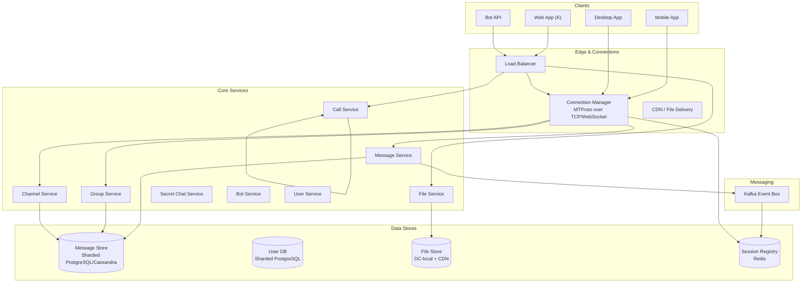
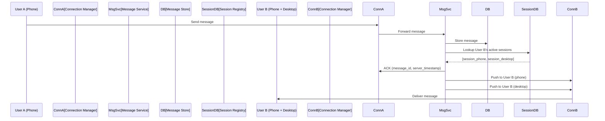
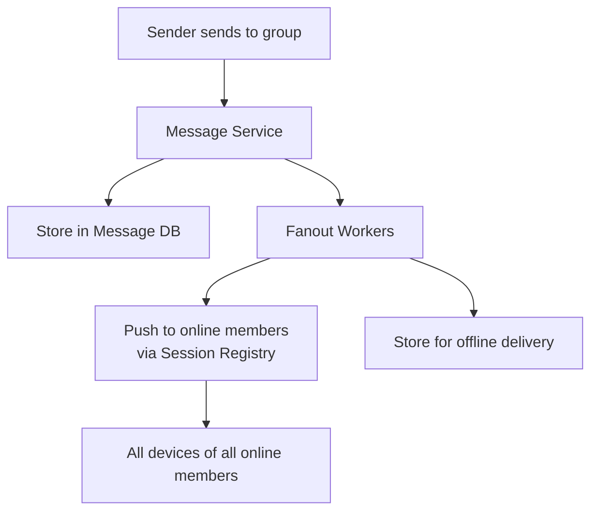
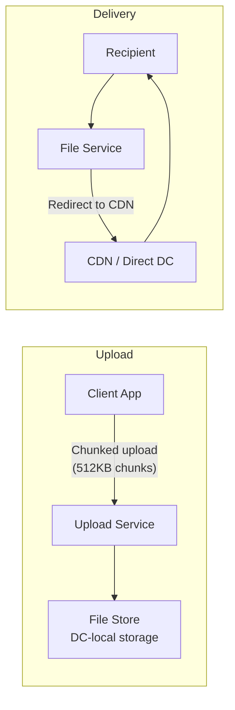

# Telegram: Cloud-Synced Instant Messaging

## Overview

Telegram is a cloud-based instant messaging platform with 900M+ monthly active users. Unlike WhatsApp's device-tethered storage, Telegram stores all messages in the cloud, enabling seamless multi-device access without backup/restore. The platform supports one-on-one chats, groups (up to 200K members), channels (unlimited subscribers), file sharing (up to 2GB per file), voice/video calls, and optional end-to-end encrypted Secret Chats.

## Key Requirements

### Functional
- Cloud-synced messaging across all devices simultaneously
- Groups (up to 200K members) with admin tools
- Channels (broadcast to unlimited subscribers)
- File sharing up to 2GB per file
- Voice and video calls (P2P with relay fallback)
- Secret Chats (device-specific, end-to-end encrypted)
- Bots platform (inline queries, commands, payments)
- Message editing, deletion (for all), and self-destructing messages

### Non-Functional
| Requirement | Target |
|------------|--------|
| Scale | 900M+ MAU, 200K+ member groups |
| Message throughput | 100K+ messages/sec |
| Latency | Message delivery < 100ms |
| Availability | 99.99% |
| Multi-device sync | Real-time across all connected devices |
| File delivery | Up to 2GB per file |

### Capacity Estimation

```
Daily active users: 500M
Messages per day: 15B (avg 30 messages/user/day)
Peak message QPS: ~100K/sec
Files per day: 500M (avg 5MB) = ~2.5 PB/day
Groups: 5M+ (10K with 100K+ members)
Channels: 1M+ (100K with 1M+ subscribers)

Storage (messages): 15B/day × 200B = ~3 TB/day → ~1 PB/year
Storage (files): 2.5 PB/day → ~900 PB/year
Concurrent WebSocket connections: 500M × 1.5 devices = 750M
```

## High-Level Architecture



## Deep Dive: Cloud Sync Architecture

Telegram's defining feature is cloud-based message storage. Every message is stored on Telegram's servers and pushed to all of a user's connected devices.



**Session management:**
- Each device establishes a persistent TCP connection with an auth key (MTProto encryption)
- The Session Registry (Redis) maps `user_id → [active_session_ids]`
- When a message arrives, the Message Service looks up all active sessions and pushes to each
- If a device is offline, the message is stored and delivered when it reconnects (using `pts` — persistent timestamp sequence numbers for gap detection)

**MTProto protocol:** Telegram uses its custom MTProto protocol over TCP. Each connection is encrypted with a 256-bit auth key established during authentication. The protocol supports: encrypted payload, message acknowledgment, and gap recovery.

## Deep Dive: Large Groups and Channels

Telegram supports groups up to 200K members — orders of magnitude larger than WhatsApp (1K) or Slack.



**Fanout strategy for 200K-member groups:**
- Look up which group members are currently online via Session Registry
- Push message to all online members' active connections
- For offline members, store the message; deliver on next connect
- Use Kafka partitions for parallel fanout across members
- **Slow mode**: admins can limit members to one message per N seconds to reduce fanout load

**Channels** (broadcast-only) follow the same pattern but with no replies from subscribers. Popular channels (millions of subscribers) use the same fanout approach.

## Deep Dive: File Sharing (up to 2GB)

Telegram allows file uploads up to 2GB — far larger than most messaging platforms.



**Upload flow:** Files are uploaded in 512KB chunks with resumable support. Files are stored in Telegram's own data centers (not a cloud provider). For delivery, recipients receive a CDN URL that may route through the nearest Telegram DC or a CDN edge node.

**Bot file hosting:** Bots can store files up to 20MB on Telegram's servers; larger files must use external hosting.

## API Design

| Endpoint | Method | Description |
|----------|--------|-------------|
| `messages.sendMessage` | POST | Send a message to chat/user |
| `messages.getHistory` | GET | Get chat message history |
| `messages.editMessage` | POST | Edit a sent message |
| `messages.deleteMessages` | POST | Delete messages (for all or self) |
| `upload.saveBigFilePart` | POST | Upload file chunk |
| `channels.create` | POST | Create a channel |
| `channels.getMessages` | GET | Get channel messages |
| `phone.call` | POST | Initiate a voice/video call |
| `messages.createSecretChat` | POST | Create end-to-end encrypted chat |

## Data Model

```sql
CREATE TABLE users (
    user_id     BIGINT PRIMARY KEY,
    username    VARCHAR(50) UNIQUE,
    first_name  VARCHAR(100) NOT NULL,
    last_name   VARCHAR(100),
    phone       VARCHAR(20) UNIQUE,
    is_bot      BOOLEAN DEFAULT FALSE,
    created_at  TIMESTAMPTZ DEFAULT NOW()
);

CREATE TABLE chats (
    chat_id     BIGINT PRIMARY KEY,
    chat_type   ENUM('private','group','channel','secret') NOT NULL,
    title       VARCHAR(255),
    member_count INT DEFAULT 0,
    created_at  TIMESTAMPTZ DEFAULT NOW()
);

CREATE TABLE messages (
    message_id  BIGINT,  -- Server-assigned, globally unique
    chat_id     BIGINT NOT NULL,
    sender_id   BIGINT NOT NULL,
    text        TEXT,
    media_id    BIGINT,
    reply_to    BIGINT,
    edit_date   TIMESTAMPTZ,
    created_at  TIMESTAMPTZ DEFAULT NOW(),
    PRIMARY KEY (chat_id, message_id)
);
```

## Scalability

| Component | Strategy |
|-----------|----------|
| Connections | Multiple DCs, connection per TCP worker |
| Message Store | Sharded by chat_id, time-partitioned |
| Session Registry | Redis cluster, partitioned by user_id |
| Fanout | Kafka consumer groups, parallel per-member |
| File Storage | DC-local storage + CDN for delivery |
| Calls | P2P (WebRTC) with TURN relay fallback |

## Trade-Offs

| Decision | Benefit | Cost |
|----------|---------|------|
| Cloud storage (vs device-only) | Seamless multi-device sync | Privacy concerns, server storage cost |
| Custom MTProto protocol | Optimized for messaging, efficient | No standard tooling |
| 2GB file limit | Best-in-class file sharing | High storage and bandwidth costs |
| No E2E by default (only Secret Chats) | Cloud features (search, multi-device) | Privacy trade-off |
| Own data centers | Full control, no vendor lock-in | Capital expense |

## Interview Tips

1. **Lead with the cloud sync model** — "Telegram stores all messages server-side, unlike WhatsApp which stores on-device."
2. **Explain MTProto** — custom binary protocol with per-connection encryption and gap recovery.
3. **Discuss the fanout problem for 200K-member groups** — session lookup + parallel push via Kafka.
4. **Address the privacy trade-off** — cloud storage enables features but Secret Chats offer E2E as an opt-in.
5. **Mention file sharing** — 2GB files with chunked upload and CDN delivery.
6. **Compare with WhatsApp** — same category, fundamentally different storage model.

## Interview Questions

1. How does Telegram's cloud sync model differ from WhatsApp's device-tethered model?
2. Design the fanout system for a 200K-member group receiving 100 messages/second.
3. How does Telegram's MTProto protocol handle message ordering and gap recovery?
4. How would you implement file upload and delivery for 2GB files at scale?
5. Design the Secret Chat system — how is end-to-end encryption implemented differently from the default?
6. How does Telegram handle multi-device message delivery and read receipts?
7. Design the Telegram Bot platform — how do bots receive and respond to messages?
8. How would you implement message search across a user's entire chat history?
9. Design the voice/video calling system — P2P with relay fallback.
10. How would Telegram handle GDPR compliance and data deletion requests at scale?

## Key Takeaways

- Telegram's cloud-sync model stores all messages server-side, enabling seamless multi-device access without backups.
- MTProto is a custom binary protocol with per-connection encryption, message acknowledgment, and gap recovery.
- Fanout for 200K-member groups uses session registry lookup + parallel push via Kafka consumer groups.
- File sharing supports up to 2GB via chunked upload, DC-local storage, and CDN delivery.
- Secret Chats provide optional end-to-end encryption using a separate key exchange protocol.

## Cross-References

- [WhatsApp](./whatsapp.md) — Device-tethered messaging comparison
- [Chat System](./chat-system.md) — Real-time messaging fundamentals
- [Slack](./slack.md) — Workspace messaging comparison
- [Notification System](./notification-system.md) — Push notification delivery

## References

- Telegram MTProto Documentation: "Telegram API: MTProto Protocol"
- Telegram FAQ: "How are Cloud Chats and Secret Chats different?"
- Telegram Open Network: Technical Whitepaper
