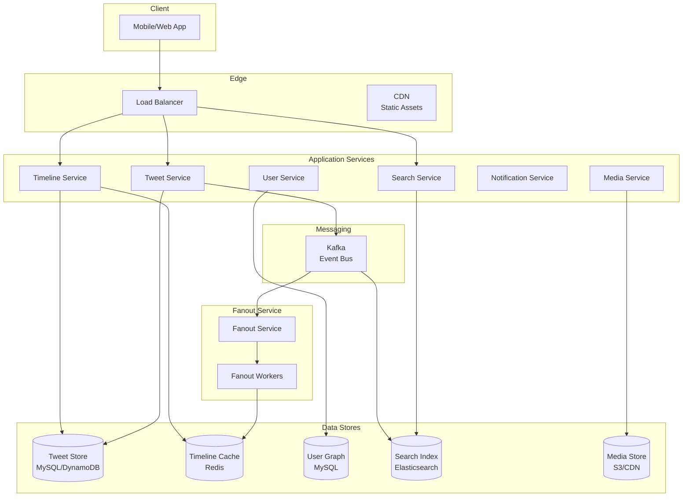
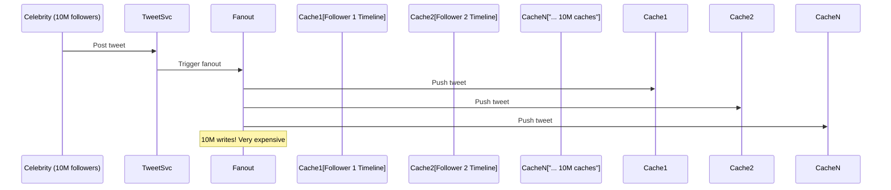
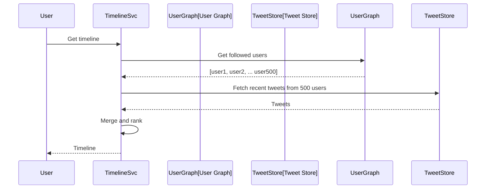
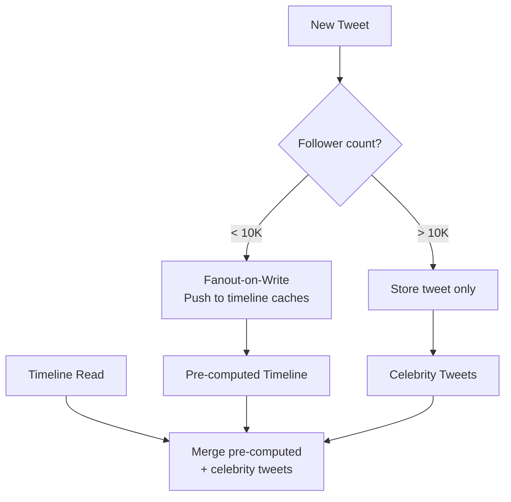
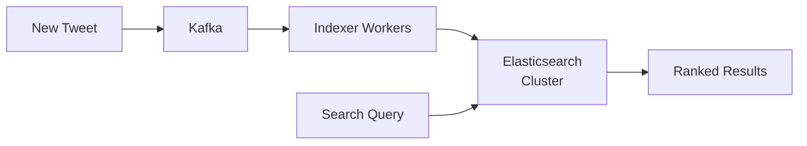
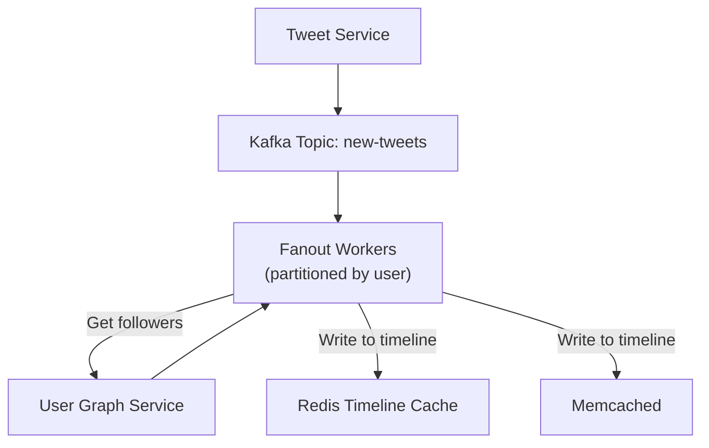

# How Twitter Works

## Overview

Twitter (now X) is a real-time social media platform where users post short messages (tweets) and consume a personalized timeline. The core challenge is delivering a real-time, personalized feed to 500M+ monthly active users with extreme read amplification — each timeline read fans out to thousands of tweets.

## Key Requirements

### Functional
- Post tweets (280 characters, images, videos)
- Follow other users
- Read a personalized timeline (Home Timeline)
- Search tweets in real-time
- Like, retweet, reply to tweets
- Trending topics and hashtags
- Notifications

### Non-Functional
- **Scale**: 500M+ MAU, 200M+ DAU
- **Write QPS**: ~6,000 tweets/second (peak ~15K)
- **Read QPS**: ~300K timeline requests/second (peak ~1M)
- **Latency**: Timeline load < 200ms
- **Availability**: 99.99%

## High-Level Architecture



## Deep Dive: The Timeline Problem

Twitter's core challenge is the **read amplification problem**:
- A user with 10M followers tweets → 10M timelines must be updated
- Timeline reads must be fast (< 200ms) despite following thousands of users

### Two Approaches

#### 1. Fanout-on-Write (Push Model)

When a user tweets, immediately write it to all followers' timelines.



**Pros:** Read is fast (pre-computed timeline)
**Cons:** Write amplification for celebrity tweets (10M writes per tweet)

#### 2. Fanout-on-Read (Pull Model)

When a user reads their timeline, fetch tweets from all followed users and merge.



**Pros:** No write amplification
**Cons:** Slow reads (must fetch and merge on every read)

### Twitter's Hybrid Approach

Twitter uses a **hybrid model**:
- **Regular users (< 10K followers)**: Fanout-on-write (push to followers' timeline caches)
- **Celebrities (> 10K followers)**: Fanout-on-read (merge at read time)



This means:
- Reading a timeline is fast (most tweets are pre-computed)
- Celebrity tweets are fetched and merged at read time
- The system handles both regular users and celebrities efficiently

## Deep Dive: Tweet Storage

### Tweet Data Model
```
Tweet {
    tweet_id: snowflake_id (64-bit, time-ordered)
    user_id: int64
    text: varchar(280)
    media_urls: array<string>
    reply_to: tweet_id (nullable)
    retweet_of: tweet_id (nullable)
    created_at: timestamp
    metrics: {likes, retweets, replies}
}
```

### Storage Layer
- **Primary store**: MySQL (sharded by user_id) or DynamoDB
- **Cache**: Redis for hot tweets and timelines
- **Search**: Elasticsearch for full-text search
- **Media**: S3 + CDN for images and videos

### Snowflake ID Generation
Twitter invented Snowflake for distributed ID generation:
```
| 1 bit (unused) | 41 bits (timestamp) | 10 bits (machine) | 12 bits (sequence) |
```
- 41 bits of timestamp = ~69 years of milliseconds
- 10 bits of machine ID = 1024 machines
- 12 bits of sequence = 4096 IDs per millisecond per machine
- Total: ~4 million unique IDs per second globally

## Deep Dive: Search

Twitter's search is real-time — tweets must be searchable within seconds of posting.



**Key challenges:**
- Indexing ~6,000 tweets/second in real-time
- Full-text search across billions of tweets
- Ranking by relevance, recency, and engagement
- Handling trending topics (sudden spikes in volume)

## Deep Dive: Fanout Service



**Fanout flow:**
1. Tweet published to Kafka
2. Fanout workers consume tweets
3. For each tweet, fetch follower list from User Graph
4. For each follower (except celebrity followers), push tweet_id to their timeline cache
5. Timeline cache is a Redis sorted set (score = tweet_id, which is time-ordered)

**Optimization:**
- Fanout is done **asynchronously** — tweet is visible to the author immediately, followers see it within seconds
- Fanout workers are **partitioned by user_id** to avoid race conditions
- Timeline cache stores only **tweet_ids** (not full tweets) — tweets fetched in batch at read time

## Scalability

| Component | Scaling Strategy |
|-----------|-----------------|
| Tweet Service | Horizontal, stateless |
| Timeline Cache | Redis cluster, sharded by user_id |
| Fanout Workers | Kafka consumer groups, partitioned |
| Tweet Store | Sharded MySQL by user_id, or DynamoDB |
| Search | Elasticsearch cluster, sharded by time |
| Media | S3 + multi-region CDN |

## Trade-Offs

| Decision | Benefit | Cost |
|----------|---------|------|
| Hybrid fanout | Fast reads for most users | Complexity of two paths |
| Snowflake IDs | Time-ordered, distributed | Clock dependency |
| Timeline as tweet_ids | Small cache footprint | Batch fetch at read time |
| Celebrity-on-read | No write amplification | Slightly slower reads for celebrity-heavy feeds |
| Kafka for events | Reliable, ordered, replayable | Operational overhead |

## Interview Tips

1. **Lead with the read amplification problem** — "Twitter's core challenge is that a celebrity's tweet must reach 10M followers"
2. **Explain the hybrid fanout model** — push for regular users, pull for celebrities
3. **Mention Snowflake** — distributed ID generation is a common follow-up question
4. **Discuss the timeline data structure** — Redis sorted sets of tweet_ids
5. **Don't forget search** — real-time indexing with Elasticsearch
6. **Talk about Kafka** — the event bus that connects everything

## Key Takeaways

- Twitter's core challenge is read amplification: one tweet fans out to millions of timelines.
- Hybrid approach: fanout-on-write for regular users, fanout-on-read for celebrities.
- Timeline is stored as a Redis sorted set of tweet_ids; full tweets fetched at read time.
- Snowflake generates time-ordered, globally unique 64-bit IDs.
- Kafka serves as the event bus connecting tweet creation to fanout, search, and notifications.
- Elasticsearch provides real-time full-text search across billions of tweets.

## Cross-References

- [News Feed](../news-feed.md)
- [Social Graph](../social-graph.md)
- [Rate Limiter](../rate-limiter.md)
- [Fanout & Messaging](../hld/messaging-systems.md)
- [Caching Strategy](../hld/caching-strategy.md)
