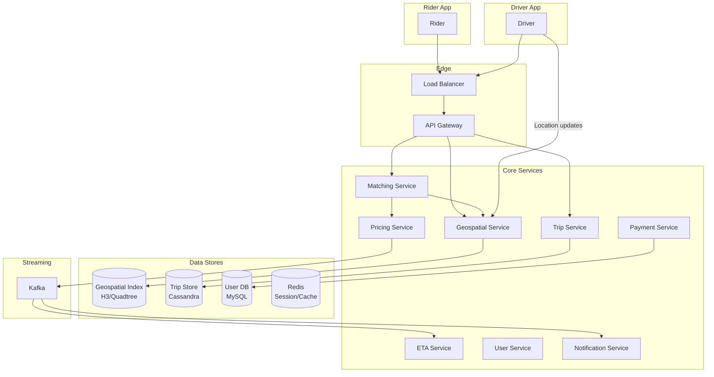
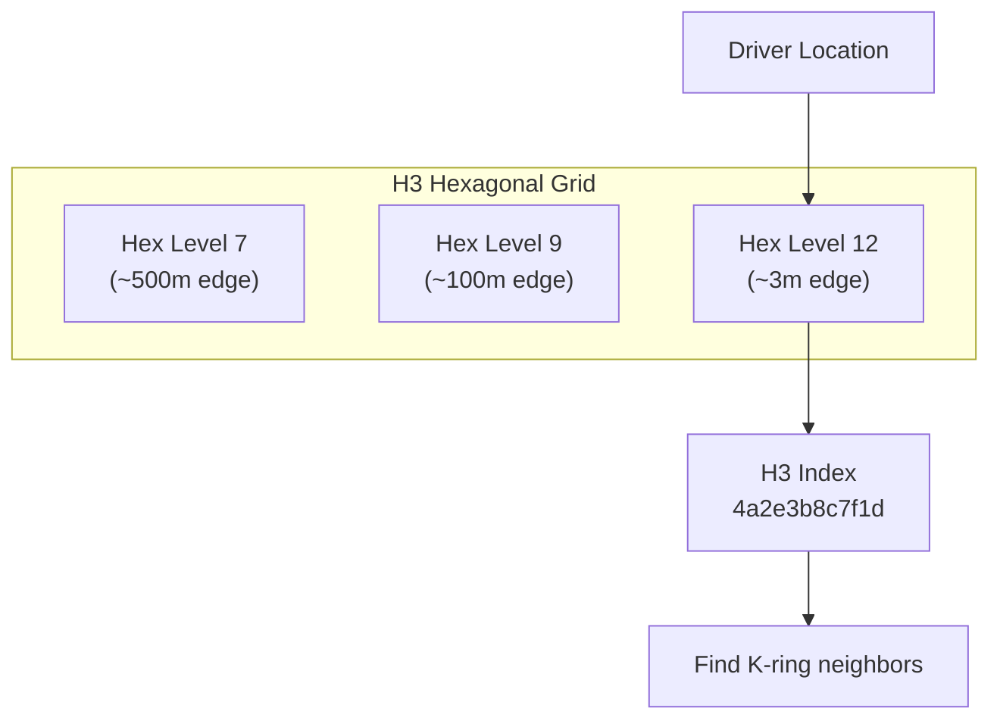
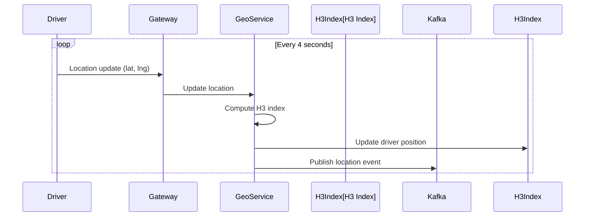
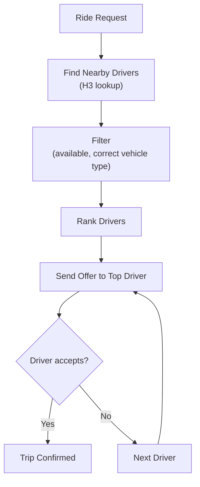
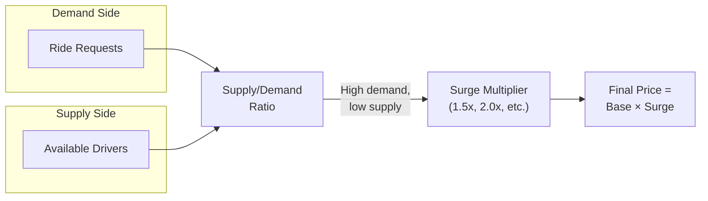
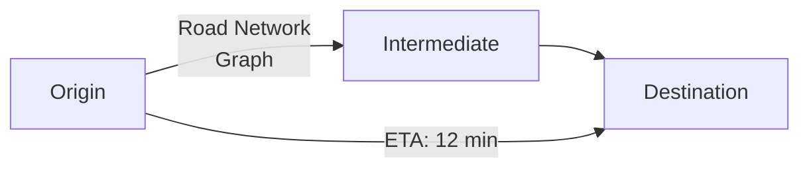
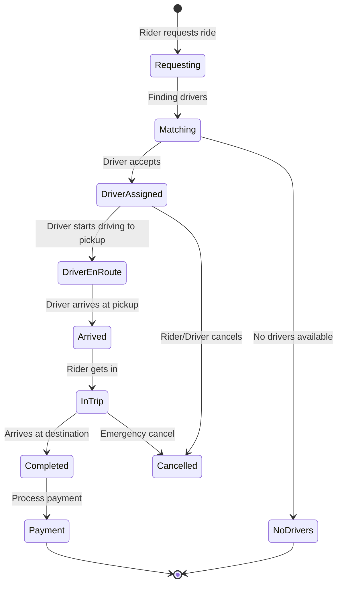

# How Uber Works

## Overview

Uber is a ride-hailing platform that connects riders with drivers in real-time. The core challenges are real-time geospatial indexing, dynamic pricing (surge pricing), ETA estimation, and matching riders with nearby drivers — all at massive scale with strict latency requirements.

## Key Requirements

### Functional
- Rider requests a ride (pickup location → destination)
- Match rider with nearest available driver
- Real-time driver tracking on the map
- Dynamic pricing based on supply/demand
- ETA estimation for pickup and dropoff
- Payment processing
- Trip history and receipts

### Non-Functional
- **Scale**: 25M+ daily trips, 150M+ monthly active users
- **Latency**: Driver matching < 30 seconds, ETA < 100ms
- **Availability**: 99.99%
- **Geospatial**: Real-time location updates for millions of drivers
- **Consistency**: Payment must be strongly consistent

## High-Level Architecture



## Deep Dive: Geospatial Indexing

The core challenge: given a rider's location, find the nearest available driver among millions.

### H3 Hexagonal Grid (Uber's Approach)

Uber uses Uber's **H3** — a hexagonal hierarchical spatial index:



**How H3 works:**
1. Divide the world into hexagonal cells at multiple resolutions
2. Each location maps to a hex cell ID (64-bit integer)
3. To find nearby drivers, look up the current hex + K-ring neighbors
4. Store drivers in a hash map: `hex_id → [driver_ids]`

**Advantages over traditional approaches:**
- **Hexagons** have uniform neighbor distances (squares don't)
- **Hierarchical**: Can query at different resolutions
- **Fast lookup**: O(1) hash map lookup per hex cell
- **K-ring**: Get all neighbors within K rings in O(K²)

### Driver Location Updates



**Challenges:**
- Millions of drivers sending location every 4 seconds = ~250K updates/second
- Must update index atomically (remove from old hex, add to new hex)
- Handle GPS jitter (driver bouncing between hex cells)

### Finding Nearby Drivers

```python
def find_nearby_drivers(lat, lng, radius_km=5, max_drivers=10):
    # Get the hex cell for the rider's location
    rider_hex = h3.geo_to_h3(lat, lng, resolution=9)
    
    # Get all hex cells within the radius (K-ring)
    nearby_hexes = h3.k_ring(rider_hex, k=5)
    
    # Collect drivers from all nearby hexes
    candidates = []
    for hex_id in nearby_hexes:
        drivers = driver_index.get(hex_id, [])
        candidates.extend(drivers)
    
    # Sort by actual distance (H3 is approximate)
    candidates.sort(key=lambda d: haversine(lat, lng, d.lat, d.lng))
    
    return candidates[:max_drivers]
```

## Deep Dive: Matching Algorithm

The matching service pairs riders with the best available driver.



**Ranking factors:**
- Distance to pickup
- ETA to pickup
- Driver rating
- Driver's current direction of travel
- Supply/demand in the area

## Deep Dive: Dynamic Pricing (Surge Pricing)

Surge pricing increases fares when demand exceeds supply in an area.



**How surge works:**
1. Divide city into hexagonal zones (H3)
2. For each zone, calculate: `demand_ratio = pending_requests / available_drivers`
3. If ratio exceeds threshold → apply surge multiplier
4. Surge is recalculated every few minutes
5. Prices are locked when ride is requested (not when it starts)

**Implementation:**
- Use **Kafka + Flink** for real-time stream processing
- Aggregate ride requests and driver locations per H3 hex
- Compute surge multiplier per hex
- Store in Redis for fast lookup

## Deep Dive: ETA Estimation

ETA (Estimated Time of Arrival) is critical for user experience.



**Approaches:**
1. **Graph-based routing**: Use road network graph (OpenStreetMap), Dijkstra/A* for shortest path
2. **ML-based ETA**: Train models on historical trip data
   - Features: distance, time of day, traffic, weather, road type
   - Uber uses deep learning (Graph Neural Networks) for ETA prediction
3. **Real-time traffic**: Incorporate live traffic data from drivers' GPS traces

**Architecture:**
- Road network stored as a graph in memory (~10GB for a major city)
- Pre-computed routing tables for common origin-destination pairs
- ML model adjusts for real-time conditions

## Deep Dive: Trip Lifecycle



## Scalability

| Component | Strategy |
|-----------|---------|
| Geospatial index | H3 hex grid, Redis cluster |
| Location updates | Kafka (250K+ events/sec), Flink |
| Trip storage | Cassandra (partitioned by city) |
| Matching | Stateless services, partitioned by city |
| ETA | In-memory road graph, ML models |
| Payments | Strongly consistent (ACID database) |
| Surge pricing | Real-time stream processing (Flink) |

## Trade-Offs

| Decision | Benefit | Cost |
|----------|---------|------|
| H3 hex grid | Fast spatial lookup | Approximate (hex boundaries) |
| 4-second location updates | Near real-time tracking | High write throughput |
| Cassandra for trips | Scales globally, high write throughput | Eventual consistency |
| ML-based ETA | More accurate | Requires training data, complex |
| Surge pricing | Balances supply/demand | User frustration |

## Interview Tips

1. **Start with geospatial** — "The core challenge is finding nearby drivers among millions"
2. **Explain H3** — hexagonal grid with K-ring neighbor lookup
3. **Discuss matching** — nearby drivers → filter → rank → offer
4. **Mention surge pricing** — real-time supply/demand ratio per hex zone
5. **Talk about ETA** — graph-based routing + ML models + real-time traffic
6. **Don't forget payment** — strong consistency, fraud detection
7. **Location update frequency** — every 4 seconds, 250K+ updates/sec globally

## Key Takeaways

- Uber's core challenge is real-time geospatial indexing at scale.
- H3 (hexagonal hierarchical spatial index) enables fast "find nearby" queries.
- Matching algorithm: find nearby (H3) → filter → rank → offer to driver.
- Surge pricing uses real-time stream processing to compute supply/demand per hex zone.
- ETA estimation combines graph-based routing with ML models trained on historical data.
- Location updates from millions of drivers create massive write throughput (Kafka + Flink).
- Trip lifecycle: request → match → pickup → ride → payment.

## Cross-References

- [Google Maps](../google-maps.md)
- [Notification System](../notifications.md)
- [Payment System](../payment.md)
- [Rate Limiter](../rate-limiter.md)
- [Real-Time Location](../search.md)
