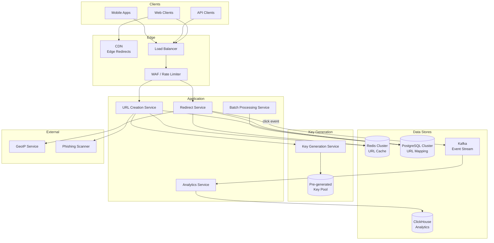
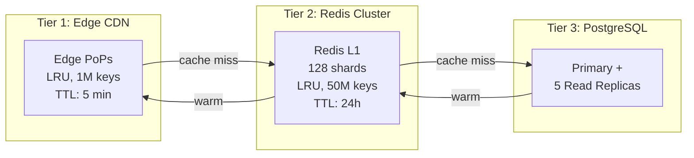

# URL Shortener Case Study: bit.ly

## Overview

bit.ly is one of the most widely used URL shortening services, processing over 1 billion links per month. It transforms long, unwieldy URLs into compact, shareable aliases while providing rich analytics on click traffic. This case study explores the production engineering behind a URL shortener operating at massive scale — focusing on distributed key generation, collision resolution, multi-layer caching, and real-time analytics pipelines.

## Key Requirements

### Functional
- Shorten URLs to 7-character aliases using Base62 encoding
- Redirect shortened URLs to original destinations with sub-50ms latency
- Support custom aliases for premium users (e.g., `brand.co/launch`)
- Provide real-time analytics: clicks by geography, referrer, device, time
- Support batch shortening (up to 10,000 URLs per request)
- Detect and block malicious/phishing URLs

### Non-Functional
| Requirement | Target |
|-------------|--------|
| Throughput (reads) | 500K redirects/sec at peak |
| Throughput (writes) | 5K URLs created/sec |
| Redirect latency (p99) | < 50ms |
| Availability | 99.99% |
| URL durability | Never lose a mapping |
| Analytics freshness | < 5 seconds |

### Capacity Estimation

```
Write QPS: 5K/sec (average), 15K/sec (peak)
Read QPS:  500K/sec (average), 1.5M/sec (peak)
Read:Write ratio: ~100:1

Daily new URLs: 5K × 86400 = 432M/day
Yearly storage: 432M × 500 bytes × 365 = ~78 TB/year
5-year storage: ~390 TB

Bandwidth (reads): 500K × 200B (cache value) = 100 MB/s
Bandwidth (writes): 5K × 500B = 2.5 MB/s

Analytics events: 500K clicks × 100B metadata = 50 MB/s
Daily analytics: 43.2B events/day = ~4.3 TB/day
```

## High-Level Architecture



## Deep Dive: Distributed Key Generation

The most critical design choice is how short codes are generated. Three approaches were evaluated:

### Approach Comparison

| Approach | Collision Risk | Throughput | Predictability | Complexity |
|----------|---------------|------------|----------------|------------|
| MD5/SHA hash + truncate | High | Very high | Non-predictable | Low |
| Base62(auto-increment ID) | Zero | Medium | Predictable (security risk) | Medium |
| Pre-generated key pool | Zero | Very high | Non-predictable | High |

bit.ly uses the **pre-generated key pool** approach. A dedicated Key Generation Service runs in the background, producing millions of random 7-character Base62 keys (`[0-9a-zA-Z]^7 = 3.5 trillion` combinations) and storing them in a key pool database. When the URL Creation Service needs a key, it atomically claims a batch of keys from the pool.

```
Key Pool Table:
┌─────────────┬─────────┐
│ short_code  │ claimed │
├─────────────┼─────────┤
│ aX9kL2p     │ false   │
│ mQ3nR7w     │ false   │
│ zY1bT5e     │ true    │  ← claimed by server A
│ ...         │ ...     │
└─────────────┴─────────┘

Claim operation (atomic):
UPDATE key_pool SET claimed = true, server_id = 'A'
WHERE short_code IN (SELECT short_code FROM key_pool
WHERE claimed = false ORDER BY random() LIMIT 1000)
```

At 5K URLs/sec and 3.5 trillion combinations, the pool can last for 22,000 years before exhaustion. When the pool drops below 10M keys, the generator spins up additional batches.

## Deep Dive: Multi-Layer Caching for Redirects

Since redirects dominate traffic (100:1 read/write ratio), caching is critical. The system uses a three-tier cache architecture:



**Cache hit rates achieved:**
- Tier 1 (CDN): 60% of all requests served at edge
- Tier 2 (Redis): 35% of remaining requests
- Tier 3 (PostgreSQL): Only 5% hit the database
- Overall: 97% cache hit rate, keeping DB load at ~25K QPS

**Cache warming strategy:** When a URL is first created, it is immediately written to Redis. The CDN layer warms on first access. For viral URLs detected by the analytics pipeline (sudden spike in clicks), the system proactively pushes the mapping to all edge PoPs.

## Deep Dive: Real-Time Analytics Pipeline

Every redirect generates a click event containing the short code, timestamp, IP address, user-agent, referrer, and country (enriched via GeoIP). This data flows through Kafka into ClickHouse for sub-second analytical queries.

```
Click Event Flow:
Redirect Service → Kafka (click-events topic, 64 partitions)
    → ClickHouse Consumer Group (16 workers)
    → ClickHouse cluster (3 shards × 2 replicas)

ClickHouse Table (MergeTree, partitioned by day, ordered by short_code):
CREATE TABLE click_events (
    event_time    DateTime,
    short_code    String,
    ip_address    IPv4,
    country       LowCardinality(String),
    referrer      String,
    user_agent    String,
    device_type   Enum8('mobile'=1, 'desktop'=2, 'tablet'=3)
)
ENGINE = MergeTree()
PARTITION BY toYYYYMMDD(event_time)
ORDER BY (short_code, event_time);

Query example (dashboard):
SELECT country, count() as clicks
FROM click_events
WHERE short_code = 'aX9kL2p'
  AND event_time >= now() - INTERVAL 24 HOUR
GROUP BY country
ORDER BY clicks DESC
LIMIT 10;
```

ClickHouse enables aggregating billions of click events per day with sub-second query latency, supporting real-time dashboards for URL owners.

## API Design

```
POST /v4/shorten
  Body: { "long_url": "https://example.com/very/long/path",
          "domain": "bit.ly",
          "group_guid": "Bk1abc23",
          "title": "My Link" }
  Response: { "link": "https://bit.ly/aX9kL2p",
              "id": "bit.ly/aX9kL2p" }

GET /{short_code}
  Response: 301 Redirect to long_url

GET /v4/clicks?short_code=aX9kL2p&unit=day&units=7
  Response: { "units": [{ "clicks": 1234, "date": "2025-01-01" }, ...] }
```

## Data Model

```sql
CREATE TABLE url_mappings (
    id          BIGSERIAL PRIMARY KEY,
    short_code  VARCHAR(10) UNIQUE NOT NULL,
    long_url    TEXT NOT NULL,
    domain      VARCHAR(50),
    user_id     BIGINT NOT NULL,
    group_id    BIGINT,
    title       VARCHAR(255),
    created_at  TIMESTAMPTZ DEFAULT NOW(),
    expires_at  TIMESTAMPTZ,
    is_custom   BOOLEAN DEFAULT FALSE,
    is_active   BOOLEAN DEFAULT TRUE
) PARTITION BY RANGE (created_at);

CREATE TABLE key_pool (
    short_code  VARCHAR(7) PRIMARY KEY,
    claimed     BOOLEAN DEFAULT FALSE,
    claimed_at  TIMESTAMPTZ,
    server_id   VARCHAR(50)
);
```

## Scalability

| Component | Strategy |
|-----------|---------|
| Redirect Service | Stateless, horizontally scaled to 100+ instances |
| Redis Cluster | 128 shards via hash slot, 50M key capacity |
| PostgreSQL | Partitioned by created_at (monthly), 5 read replicas |
| ClickHouse | 3 shards with 2 replicas each, daily partitions |
| Kafka | 64 partitions, 3-broker cluster |
| CDN | Global edge network, 200+ PoPs |
| Key Generation | Background workers, independent of request path |

## The Multi-Tenant Reality

Everything above describes one tenant on one domain. The commercial product is a platform: thousands of enterprise customers, each with their own branded domain, plan, and quota, sharing one redirect fleet. Three subsystems make that work.

**Custom domains: onboarding, verification, certificates.** A customer wants `brand.co/launch`. Onboarding is a pipeline, not a config field: the customer adds a CNAME (or DNS delegation) pointing `brand.co` (or `go.brand.co`) at the platform's edge; the platform verifies *control of the domain*; then the edge must serve valid TLS for a hostname the platform doesn't own. Verification and certificates are the same problem in disguise — ACME domain-control challenges "provide the server with assurance that an account holder is also the entity that controls an identifier" [2], via options like "Provisioning a DNS record under example.com, or Provisioning an HTTP resource under a well-known URI" [4]. The platform therefore runs an ACME client per customer domain at scale: Let's Encrypt's stated objective — "make it possible to set up an HTTPS server and have it automatically obtain browser-trusted certificates without any human intervention" [4] — is exactly the requirement, since thousands of domains × manual renewal is impossible. Concretely: automated issuance and renewal ("requesting, renewing, and revoking certificates is simple—just send certificate management messages and sign them with the authorized account key pair" [4]), SNI so one edge fleet terminates TLS for tens of thousands of hostnames, and a provisioning state machine that surfaces per-domain status (CNAME seen → challenge passed → cert issued → live) with retries and renewal-failure alerts, because the common failure is silent — a customer edits their DNS zone, the challenge fails, and `https://brand.co/launch` dies with a TLS handshake error rather than a clean 404.

**Plan tiers gate policy, not architecture.** Free, Pro, and Enterprise run on the same services; the tier is a policy layer enforced at specific choke points: link *expiry* (free links expire or are archived after N days; paid links are permanent — enforced as a policy check at creation plus a lifecycle job, never on the redirect path), *branded domains* (gated at onboarding), *analytics retention* (enforced by a retention job that rolls up and prunes old ClickHouse partitions), *team seats and SSO* (enforced at the API/auth layer), *batch sizes and API quotas* (enforced by rate limiting keyed on the tenant's API key). The design rule: every gate must be enforceable off the hot redirect path — the resolver reads a mapping plus a small policy record (active? expiry already materialized at creation?) and nothing else.

**Per-tenant rate isolation.** One customer's misbehaving script (or one viral campaign) must not consume the shared redirect fleet. On the creation API this is classical per-tenant quotas — "make sure one tenant can't starve another" (the book's rate-limiting pattern chapter [3]). The harder, shortener-specific problem is noisy neighbors on the *redirect path*: traffic is driven by the audience, not the customer, so a legitimate enterprise link can pull millions of QPS while its owner sits on a modest plan. Isolation levers, in the order a real system applies them: edge caching absorbs the absolute volume (a hot link is a hot *cache* entry first, a capacity problem second); single-flight/coalescing prevents one hot key from amplifying into origin load (below); per-tenant labels on the event stream (partition by tenant, not just by code) keep one customer's click flood from starving another's analytics consumers; and fair-share admission at the edge (per-tenant concurrency caps) bounds worst-case damage. The rate-limiting machinery — token buckets per key, sharded counters, fairness under contention — is the same as any multi-tenant API; see [Rate Limiting Pattern](../../../backend/patterns/rate-limiting-pattern.md) and the sibling [Rate Limiter](../rate-limiter.md) page.

## What Actually Breaks

**The stampede on one hot key.** The three-tier cache is described above with warm, steady-state hit rates. The failure mode is a *cold or expiring* hot entry: a viral link's mapping expires in Redis and at the CDN edge simultaneously, and for one TTL-generation every request is a miss. The numbers make it vivid (computed): a viral link at 200K QPS with a DB provisioned for the design's ~25K QPS miss budget means one unlucky expiry creates an **8× origin overload** — and because the DB read takes tens of milliseconds under that load, the queue builds while latency SLOs blow through the 50ms p99 target. The standard mechanism is **single-flight / request coalescing**: on miss, one request per key re-fetches while every other request for the same key subscribes to the in-flight result; add TTL jitter so many hot keys don't expire in the same millisecond, and keep the proactive cache-warming path (analytics detects the click spike → push the mapping to all edges) for links that matter. The general machinery is catalogued in [Hot Keys and Sharded Counters](../../../distributed/advanced/hot-keys-and-sharded-counters.md), [Advanced Caching](../../../dbms/caching/advanced-caching.md), and [Caching Strategy](../hld/caching-strategy.md).

**Expired/deleted link contracts.** What a dead link returns is a product decision with trust consequences: 404 Not Found (generic — but users who *own* the link can't tell "expired" from "broken system"), 410 Gone (semantically honest — RFC 9110: "access to the target resource is no longer available at the origin server and that this condition is likely to be permanent," with 404 preferred "if the origin server does not know... whether or not the condition is permanent" [1]), or redirect-to-ad (revenue at the cost of being classified as malware-adjacent by every security product that crawls you). The trust-preserving contract: expired links owned by paying customers serve 410 (or a branded "this link expired" page with renewal CTA); deleted links serve 410; *deactivated-for-abuse* links serve an interstitial warning page; and nothing silently redirects to somewhere the owner didn't configure. Note 410 is heuristically cacheable [1] — which is actually desirable here: it takes load off the resolver for dead links.

**Analytics freshness vs the dashboard SLO.** The requirement says < 5s. That SLO is only honest if you can defend its composition: click event → Kafka (broker queue time, normally < 1s) → consumer aggregation → ClickHouse insert visibility → dashboard query. State it as a percentile and monitor the weakest link: at steady state p95 ≤ 5s is comfortable; during a viral spike the pipeline's input doubles before the cache does, so *consumer lag* is the metric that predicts SLO breach — which is why per-tenant stream partitions matter (above) and why dashboards display "updated Xs ago" computed from event time, not wall-clock render time. Raw-click counters must always be exact-integer-fresh from rollups; unique-click estimates may be minutes stale (HLL merge semantics) — put both on the dashboard so customers don't "reconcile" them.

**Abuse takedown latency vs false positives.** Takedown speed is measured from detection to the mapping going dark; false-positive cost is measured in wrongly-dark legitimate campaigns. These trade directly, and the resolution is staging: reputation-vendor hits on *creation* can block instantly (the false-positive surface is the submitter's own URL); deactivating an *existing* viral link requires a human-approved or high-confidence decision plus an immediate appeal path, because the blast radius of a mistake is the customer's live campaign. The metric to publish internally: time-to-deactivate p50/p95, and false-positive rate per auto-action tier.

**The migration war story: hash-lookup DB → edge-resolved KV.** The class of failure every senior interviewer is probing: you want to move resolution from "Redis → PostgreSQL" to "edge KV" (lower latency, no regional DB dependency), and your own past choices attack you. If short links were served with **301**, browsers have burned old behavior in (301 is heuristically cacheable [1]) — and while you may control the *target*, you no longer control *whether your origin is consulted*: at a 90% browser cache-hit rate, ~90% of clicks never reach any infrastructure you run (computed: an hour of logs showing 20K clicks implies ~200K actual clicks happened). Migrations under 301 are survivable only if the *domain's* identity survives — you must keep the old domain's DNS, certificates, and a resolver running indefinitely, because you can never be sure a cached 301 isn't still pointing wherever it pointed the day it was cached. Under **302/307**, migration is a cache-propagation problem: no browser pinning, only edge TTLs to flush (push the KV before the TTL lapses, dual-lookups with DB-as-source-of-truth during the window, and verify with shadow-traffic comparison). This is the same cost-benefit table as the [design chapter](../url-shortener.md), seen from the operations side — and it is why a service that expects to migrate its redirect infrastructure twice in its life should think hard before ever serving 301, or serve 301 *only* from a layer it can also re-point at will (its own edge, never the browser). KV sizing for the edge-resolved hot set is the sanity check: computed, 100M keys × ~1KB = ~100 GB — trivially replicable to every PoP; the full multi-year mapping store (78 TB/year at this chapter's write rate) must stay behind the edge KV, as a cold tier, not become the edge's problem.

## References

1. RFC 9110, *HTTP Semantics* — Sections 15.4 (Redirection 3xx, heuristically-cacheable clauses for 301/308) and 15.5.11 (410 Gone) — <https://www.rfc-editor.org/rfc/rfc9110> — fetched in full this session; quoted sentences verbatim.
2. RFC 8555, *Automatic Certificate Management Environment (ACME)* — Section 8, Identifier Validation Challenges — <https://www.rfc-editor.org/rfc/rfc8555> — fetched this session; the assurance sentence quoted verbatim.
3. Rate Limiting Pattern chapter (this book), `src/backend/patterns/rate-limiting-pattern.md` — per-tenant fairness framing; quoted phrase verbatim from that chapter.
4. Let's Encrypt, "How It Works" — <https://letsencrypt.org/how-it-works/> — fetched this session; objective, challenge examples, and issuance/renewal sentence quoted verbatim.

## Trade-Offs

| Decision | Benefit | Cost |
|----------|---------|------|
| Pre-generated keys | Zero collisions, non-predictable | Extra service and storage for key pool |
| 302 redirect (not 301) | Accurate analytics on every click | Browser does not cache redirect |
| Three-tier cache | 97% cache hit, low DB load | Cache invalidation complexity |
| ClickHouse for analytics | Sub-second aggregation on billions of events | Operational complexity vs PostgreSQL |
| Async click events (Kafka) | Zero impact on redirect latency | Eventual consistency in analytics (< 5s) |

## Interview Tips

1. **Lead with the read-heavy nature** — "The system is fundamentally a read-heavy caching problem with 100:1 read/write ratio"
2. **Discuss key generation trade-offs** — hash collision vs predictable IDs vs pre-generated pool
3. **Explain the three-tier cache** — CDN → Redis → PostgreSQL with cascading miss rates
4. **Highlight the analytics pipeline** — Kafka + ClickHouse for real-time click analytics at billions of events/day
5. **Mention the edge case** — viral URLs overwhelming the cache and proactive cache warming

## Key Takeaways

- URL shorteners are read-heavy systems; multi-layer caching (CDN → Redis → DB) achieves 97%+ hit rates.
- Pre-generated key pools eliminate collision risk while keeping keys non-predictable.
- Analytics is a first-class concern — Kafka + ClickHouse enables sub-second queries on billions of daily click events.
- 302 (not 301) redirects sacrifice browser caching for accurate analytics on every click.
- Capacity planning: 500K read QPS, 5K write QPS, 78 TB/year storage growth.

## Cross-References

- [URL Shortener Design](../url-shortener.md) — Interview-format version with step-by-step approach (redirect-code cost-benefit table, safety pipeline, analytics side channel)
- [ID Generation](../hld/id-generation.md) — Birthday-bound collision math behind the 7-character code space
- [Caching Strategy](../hld/caching-strategy.md) — Cache invalidation and warming patterns
- [Hot Keys and Sharded Counters](../../../distributed/advanced/hot-keys-and-sharded-counters.md) — Single-flight/coalescing and TTL jitter for the viral-key stampede
- [Advanced Caching](../../../dbms/caching/advanced-caching.md) — Stampede/dogpile mechanisms in depth
- [Rate Limiter](../rate-limiter.md) — Protecting against abuse
- [Rate Limiting Pattern](../../../backend/patterns/rate-limiting-pattern.md) — Per-tenant quotas and fairness (noisy-neighbor isolation)
- [Stream Processing](../../../data-engineering/stream-processing.md) — The click-event pipeline's source paradigm
- [Notifications](../notifications.md) — Durable event fan-out and delivery-guarantee trade-offs
- [Capacity Planning](../hld/capacity-planning.md) — Estimation techniques
