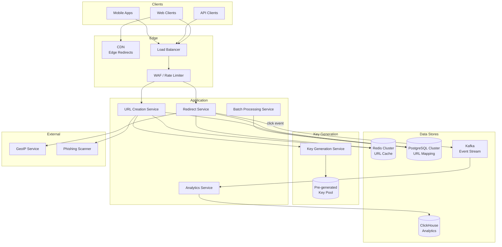
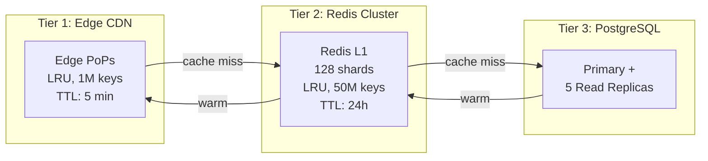

# URL Shortener Case Study: bit.ly

## Overview

bit.ly is one of the most widely used URL shortening services, processing over 1 billion links per month. It transforms long, unwieldy URLs into compact, shareable aliases while providing rich analytics on click traffic. This case study explores the production engineering behind a URL shortener operating at massive scale — focusing on distributed key generation, collision resolution, multi-layer caching, and real-time analytics pipelines.

## Key Requirements

### Functional
- Shorten URLs to 7-character aliases using Base62 encoding
- Redirect shortened URLs to original destinations with sub-50ms latency
- Support custom aliases for premium users (e.g., `brand.co/launch`)
- Provide real-time analytics: clicks by geography, referrer, device, time
- Support batch shortening (up to 10,000 URLs per request)
- Detect and block malicious/phishing URLs

### Non-Functional
| Requirement | Target |
|-------------|--------|
| Throughput (reads) | 500K redirects/sec at peak |
| Throughput (writes) | 5K URLs created/sec |
| Redirect latency (p99) | < 50ms |
| Availability | 99.99% |
| URL durability | Never lose a mapping |
| Analytics freshness | < 5 seconds |

### Capacity Estimation

```
Write QPS: 5K/sec (average), 15K/sec (peak)
Read QPS:  500K/sec (average), 1.5M/sec (peak)
Read:Write ratio: ~100:1

Daily new URLs: 5K × 86400 = 432M/day
Yearly storage: 432M × 500 bytes × 365 = ~78 TB/year
5-year storage: ~390 TB

Bandwidth (reads): 500K × 200B (cache value) = 100 MB/s
Bandwidth (writes): 5K × 500B = 2.5 MB/s

Analytics events: 500K clicks × 100B metadata = 50 MB/s
Daily analytics: 43.2B events/day = ~4.3 TB/day
```

## High-Level Architecture



## Deep Dive: Distributed Key Generation

The most critical design choice is how short codes are generated. Three approaches were evaluated:

### Approach Comparison

| Approach | Collision Risk | Throughput | Predictability | Complexity |
|----------|---------------|------------|----------------|------------|
| MD5/SHA hash + truncate | High | Very high | Non-predictable | Low |
| Base62(auto-increment ID) | Zero | Medium | Predictable (security risk) | Medium |
| Pre-generated key pool | Zero | Very high | Non-predictable | High |

bit.ly uses the **pre-generated key pool** approach. A dedicated Key Generation Service runs in the background, producing millions of random 7-character Base62 keys (`[0-9a-zA-Z]^7 = 3.5 trillion` combinations) and storing them in a key pool database. When the URL Creation Service needs a key, it atomically claims a batch of keys from the pool.

```
Key Pool Table:
┌─────────────┬─────────┐
│ short_code  │ claimed │
├─────────────┼─────────┤
│ aX9kL2p     │ false   │
│ mQ3nR7w     │ false   │
│ zY1bT5e     │ true    │  ← claimed by server A
│ ...         │ ...     │
└─────────────┴─────────┘

Claim operation (atomic):
UPDATE key_pool SET claimed = true, server_id = 'A'
WHERE short_code IN (SELECT short_code FROM key_pool
WHERE claimed = false ORDER BY random() LIMIT 1000)
```

At 5K URLs/sec and 3.5 trillion combinations, the pool can last for 22,000 years before exhaustion. When the pool drops below 10M keys, the generator spins up additional batches.

## Deep Dive: Multi-Layer Caching for Redirects

Since redirects dominate traffic (100:1 read/write ratio), caching is critical. The system uses a three-tier cache architecture:



**Cache hit rates achieved:**
- Tier 1 (CDN): 60% of all requests served at edge
- Tier 2 (Redis): 35% of remaining requests
- Tier 3 (PostgreSQL): Only 5% hit the database
- Overall: 97% cache hit rate, keeping DB load at ~25K QPS

**Cache warming strategy:** When a URL is first created, it is immediately written to Redis. The CDN layer warms on first access. For viral URLs detected by the analytics pipeline (sudden spike in clicks), the system proactively pushes the mapping to all edge PoPs.

## Deep Dive: Real-Time Analytics Pipeline

Every redirect generates a click event containing the short code, timestamp, IP address, user-agent, referrer, and country (enriched via GeoIP). This data flows through Kafka into ClickHouse for sub-second analytical queries.

```
Click Event Flow:
Redirect Service → Kafka (click-events topic, 64 partitions)
    → ClickHouse Consumer Group (16 workers)
    → ClickHouse cluster (3 shards × 2 replicas)

ClickHouse Table (MergeTree, partitioned by day, ordered by short_code):
CREATE TABLE click_events (
    event_time    DateTime,
    short_code    String,
    ip_address    IPv4,
    country       LowCardinality(String),
    referrer      String,
    user_agent    String,
    device_type   Enum8('mobile'=1, 'desktop'=2, 'tablet'=3)
)
ENGINE = MergeTree()
PARTITION BY toYYYYMMDD(event_time)
ORDER BY (short_code, event_time);

Query example (dashboard):
SELECT country, count() as clicks
FROM click_events
WHERE short_code = 'aX9kL2p'
  AND event_time >= now() - INTERVAL 24 HOUR
GROUP BY country
ORDER BY clicks DESC
LIMIT 10;
```

ClickHouse enables aggregating billions of click events per day with sub-second query latency, supporting real-time dashboards for URL owners.

## API Design

```
POST /v4/shorten
  Body: { "long_url": "https://example.com/very/long/path",
          "domain": "bit.ly",
          "group_guid": "Bk1abc23",
          "title": "My Link" }
  Response: { "link": "https://bit.ly/aX9kL2p",
              "id": "bit.ly/aX9kL2p" }

GET /{short_code}
  Response: 301 Redirect to long_url

GET /v4/clicks?short_code=aX9kL2p&unit=day&units=7
  Response: { "units": [{ "clicks": 1234, "date": "2025-01-01" }, ...] }
```

## Data Model

```sql
CREATE TABLE url_mappings (
    id          BIGSERIAL PRIMARY KEY,
    short_code  VARCHAR(10) UNIQUE NOT NULL,
    long_url    TEXT NOT NULL,
    domain      VARCHAR(50),
    user_id     BIGINT NOT NULL,
    group_id    BIGINT,
    title       VARCHAR(255),
    created_at  TIMESTAMPTZ DEFAULT NOW(),
    expires_at  TIMESTAMPTZ,
    is_custom   BOOLEAN DEFAULT FALSE,
    is_active   BOOLEAN DEFAULT TRUE
) PARTITION BY RANGE (created_at);

CREATE TABLE key_pool (
    short_code  VARCHAR(7) PRIMARY KEY,
    claimed     BOOLEAN DEFAULT FALSE,
    claimed_at  TIMESTAMPTZ,
    server_id   VARCHAR(50)
);
```

## Scalability

| Component | Strategy |
|-----------|---------|
| Redirect Service | Stateless, horizontally scaled to 100+ instances |
| Redis Cluster | 128 shards via hash slot, 50M key capacity |
| PostgreSQL | Partitioned by created_at (monthly), 5 read replicas |
| ClickHouse | 3 shards with 2 replicas each, daily partitions |
| Kafka | 64 partitions, 3-broker cluster |
| CDN | Global edge network, 200+ PoPs |
| Key Generation | Background workers, independent of request path |

## Trade-Offs

| Decision | Benefit | Cost |
|----------|---------|------|
| Pre-generated keys | Zero collisions, non-predictable | Extra service and storage for key pool |
| 302 redirect (not 301) | Accurate analytics on every click | Browser does not cache redirect |
| Three-tier cache | 97% cache hit, low DB load | Cache invalidation complexity |
| ClickHouse for analytics | Sub-second aggregation on billions of events | Operational complexity vs PostgreSQL |
| Async click events (Kafka) | Zero impact on redirect latency | Eventual consistency in analytics (< 5s) |

## Interview Tips

1. **Lead with the read-heavy nature** — "The system is fundamentally a read-heavy caching problem with 100:1 read/write ratio"
2. **Discuss key generation trade-offs** — hash collision vs predictable IDs vs pre-generated pool
3. **Explain the three-tier cache** — CDN → Redis → PostgreSQL with cascading miss rates
4. **Highlight the analytics pipeline** — Kafka + ClickHouse for real-time click analytics at billions of events/day
5. **Mention the edge case** — viral URLs overwhelming the cache and proactive cache warming

## Key Takeaways

- URL shorteners are read-heavy systems; multi-layer caching (CDN → Redis → DB) achieves 97%+ hit rates.
- Pre-generated key pools eliminate collision risk while keeping keys non-predictable.
- Analytics is a first-class concern — Kafka + ClickHouse enables sub-second queries on billions of daily click events.
- 302 (not 301) redirects sacrifice browser caching for accurate analytics on every click.
- Capacity planning: 500K read QPS, 5K write QPS, 78 TB/year storage growth.

## Cross-References

- [URL Shortener Design](../url-shortener.md) — Interview-format version with step-by-step approach
- [Caching Strategy](../hld/caching-strategy.md) — Cache invalidation and warming patterns
- [Rate Limiter](../rate-limiter.md) — Protecting against abuse
- [Capacity Planning](../hld/capacity-planning.md) — Estimation techniques
