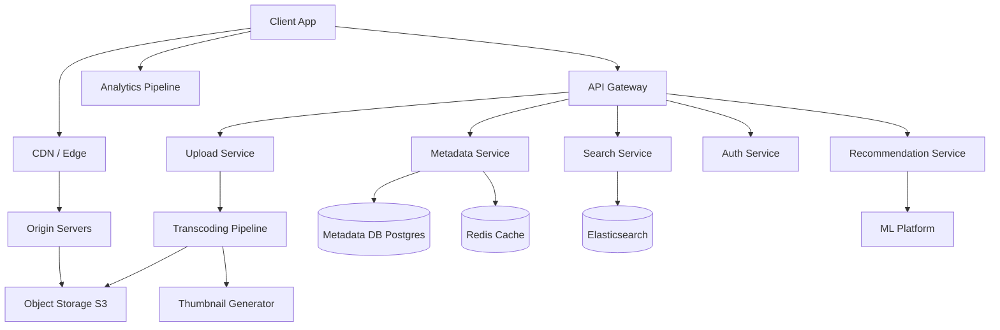
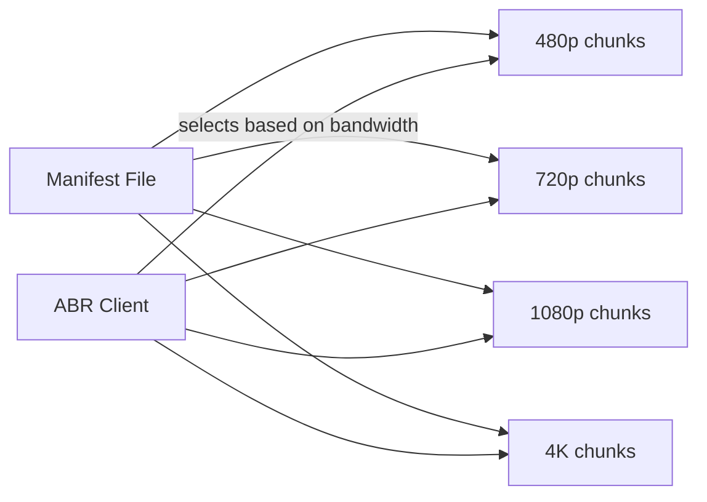

# System Design: Video Streaming Platform (Netflix/YouTube-like)

## Problem Statement

Design a video streaming platform where users can browse, search, and watch videos. The system must handle millions of concurrent viewers with low latency.

---

## Functional Requirements

1. Users can browse and search for videos
2. Users can stream videos with adaptive quality
3. Users can upload videos (creators)
4. Support for multiple resolutions (480p, 720p, 1080p, 4K)
5. Video recommendations
6. Video metadata (title, description, thumbnails, likes, comments)
7. Subscriptions/following creators

## Non-Functional Requirements

| Requirement | Target |
------------|--------|
| Concurrent viewers | 10M+ |
| Start latency | < 2 seconds |
| Rebuffering | < 0.1% of sessions |
| Availability | 99.99% |
| Upload processing | < 1 hour for 4K |
| Global delivery | Multi-region |

---

## Capacity Estimation

- **Users:** 100M MAU, 10M DAU
- **Videos:** 50M total, 100K new/day
- **Storage:** 50M videos × 1GB average = 50PB raw
- **Bandwidth:** 10M concurrent × 5 Mbps = 50 Gbps sustained
- **Upload:** 100K videos × 1GB = 100TB/day new content

---

## High-Level Architecture

---

## Key Deep Dives

### Video Transcoding Pipeline

Raw uploads must be converted to multiple formats and resolutions:

1. **Ingestion:** Accept uploaded video (resumable uploads via chunked transfer)
2. **Transcoding:** Convert to HLS/DASH format at multiple bitrates
3. **Thumbnails:** Generate at multiple timestamps
4. **Storage:** Store all versions in object storage
5. **Metadata:** Update database with video info, CDN URLs

The transcoding pipeline should use a message queue (SQS/Kafka) with workers pulling transcoding jobs. For efficiency, use GPU-accelerated transcoding (NVENC, FFmpeg + hardware encoding).

### Adaptive Bitrate Streaming (ABR)

- **HLS (HTTP Live Streaming):** Apple's protocol, segments video into 2-10 second chunks
- **DASH (MPEG-DASH):** Open standard, similar approach
- **Client-side logic:** Monitor download speed, buffer level, and switch between quality levels

### Content Delivery Network (CDN)

CDN is critical for video streaming:
- Edge servers cache popular video segments
- Reduces origin load by 90%+ for popular content
- Multi-CDN strategy for redundancy
- P2P-assisted delivery (WebRTC DataChannel) for very popular live content

### Search Architecture

- Elasticsearch cluster for full-text search
- Index: video title, description, tags, creator name
- Autocomplete: trie-based prefix matching on popular queries
- Personalized search results based on watch history

---

## Data Model

| Table | Key Fields |
|-------|-----------|
| videos | id, title, description, creator_id, duration, views, created_at |
| video_files | video_id, resolution, format, url, file_size |
| users | id, name, email, created_at |
| subscriptions | user_id, creator_id, created_at |
| watch_history | user_id, video_id, watched_at, progress_seconds |
| thumbnails | video_id, url, timestamp |

---

## Scalability Discussion

- **Upload scaling:** Use pre-signed URLs for direct-to-S3 upload, offload transcoding to queue workers
- **Storage scaling:** Object storage scales to petabytes; use lifecycle policies for cold storage
- **Global delivery:** Multi-region CDN with origin shield
- **Analytics:** Kafka → Flink/Spark streaming for real-time, batch processing for recommendations

---

## Live vs VOD: Two Different Machines

VOD is a batch product with a CDN in front of it; live is a real-time system that reuses the same CDN vocabulary. Both ship "segments + manifests," but the constraints are inverted: VOD tolerates hours of processing latency and serves immutable bytes; live has zero latency tolerance and serves a manifest that is never the same file twice.

### Live Ingest and the Near-Real-Time Ladder

A contributor pushes one high-quality feed to an ingest edge over **RTMP** (TCP-based; the de-facto encoder interface) or **SRT** (UDP-based with retransmission/encryption, built for lossy internet contribution). The ingest tier transcodes that single input into the same kind of ladder a VOD title gets (240p → 1080p+), but each rung must exist *seconds* after the input does — and segments are cut live: the live media playlist is a **sliding window** whose tail grows as content is encoded and whose head is deleted. RFC 8216 formalizes the bookkeeping [1]: removals must be in playlist order, each removal increments `EXT-X-MEDIA-SEQUENCE`, and a live server "MUST NOT remove a Media Segment from a Playlist file without an EXT-X-ENDLIST tag if that would produce a Playlist whose duration is less than three times the target duration. Doing so can trigger playback stalls."

**Glass-to-glass latency** (event → viewer) sums ingest + transcode + packaging + CDN propagation + player buffering. Conventional HLS/DASH live sits around 5–20 seconds; low-latency variants (LL-HLS partial segments / blocking playlist reloads, LL-DASH CMAF chunks) push toward 2–5 seconds at a real cost: tiny segments forfeit the codec-efficiency argument in the HLD page's segment-sizing section, and CDN caching gets less efficient. DASH-IF maintains a dedicated IOP part for exactly this problem — Part 4 "provides details on live service offerings, including low-latency services," with a published spec on "Low-Latency Modes for DASH" [2].

**The DVR window is a retention feature.** How many minutes of segments the live playlist retains is how far back a viewer can seek — join-mid-event viewers can rewind instead of churning. It is also a correctness contract: RFC 8216 requires that once the server removes a segment from the playlist, "the corresponding Media Segment MUST remain available to clients for a period of time equal to the duration of the segment plus the duration of the longest Playlist file distributed by the server containing that segment" — removing it earlier "can interrupt in-progress playback" — and if segments will expire, HTTP responses "SHOULD... contain an Expires header that reflects the planned time-to-live" [1]. In CDN terms: live segments get a TTL ≈ their remaining DVR lifetime, not infinity.

**Live sidecar jobs.** The same segments feed near-real-time consumers: live captioning (ASR or stenographer text, packaged as subtitle renditions), thumbnail/sprite generation for scrub bars, and the DVR-to-VOD conversion that publishes the recording when the event ends — batch-style job graphs running against a firehose, unlike VOD's one-shot DAG.

### VOD Contrast Table

| Dimension | Live | VOD |
|---|---|---|
| Manifest lifetime | Sliding window; same URL, different bytes every few seconds | Immutable after publish |
| Segment cacheability | TTL ≈ DVR window remainder | Effectively infinite |
| Latency budget | Seconds (glass-to-glass) | Minutes–hours after upload |
| Transcode | Near-real-time ladder, continuously | Async batch DAG, once per title |
| Capacity shape | Synchronized flash crowd at event start | Zipf-skewed, steady demand |
| Canonical failure | Falling behind real time (unrecoverable) | A late title is merely invisible |
| Storage | Live window + post-event recording | The whole ladder, forever |

(Twitch- and YouTube Live-specific numbers are deliberately omitted: no public figures were fetchable this session to verify them against.)

## What Actually Fails: A Reliability Tour

**Rebuffering is the #1 complaint.** A stall is unskippable dead time; a lower-resolution picture is merely cosmetic — which is why stalls dominate user sentiment and why the buffer-based ABR paper (BOLA, SIGCOMM 2014 [4]) is built on the premise that *avoiding stalls* is the primary objective of rate adaptation, above average quality. Operators accordingly carry a first-class **rebuffer ratio** (stall time / play time, or sessions-with-a-stall / sessions) alongside join time and average bitrate. The plumbing: the player SDK emits per-segment events (startup time, stall durations, delivered bitrate), a sessionization layer aggregates per session/region/CDN, and **the metric gates experiments** — a change that improves engagement but degrades rebuffer ratio beyond its threshold does not ship, the same gate discipline as any [experimentation platform](experimentation-platform.md). (Netflix's public QoE-instrumentation posts were HTTP-403 to fetchers this session; [4] is the verifiable anchor for the stall-avoidance-first objective.)

**Origin flash crowd at live premieres.** A scheduled premiere is a synchronized join: the audience arrives at t=0 and requests the manifest plus the first segments within seconds — a stampede aimed precisely at the one part of the path (origin) that is warmest for VOD but coldest for a brand-new live event. The fix is **admission control before capacity**: a waiting room meters new joins and smooths the ramp. Cloudflare's waiting-room documentation describes the pattern directly: "Cloudflare Waiting Room allows you to route excess users of your website to a customized waiting room, helping preserve customer experience and protect origin servers from being overwhelmed with requests" [3]. Waiting rooms pair with the balancing machinery in [Load Balancing Design](../hld/load-balancing-design.md) (GSLB, health checks, draining) and with the edge/origin shield tier described on the HLD page — the CDN absorbs the segment bytes; the origin only sees playlist refreshes and the residual misses.

**CDN failover.** With multi-CDN delivery, an individual CDN *will* have a bad night. Failover has to be faster than DNS: players retry a segment against a second CDN's base URL (alternate URLs shipped in the manifest), telemetry-driven steering shifts regions on sustained degradation, and failure drills verify that a full CDN outage costs a join-time bump, not a stream-down.

**DRM license service outage.** Playback cannot start without a license key, so the license service is a hard dependency — but *total playback loss* is the wrong failure mode for most subscribers. The production pattern is a grace window: licenses already issued keep decrypting for a bounded period (an outage mid-session is invisible), clients cache licenses within their contractual validity, and only *new* sessions fail-closed. This is [graceful degradation](../../../backend/patterns/graceful-degradation.md) applied to the license path — fail-open for existing entitlements, fail-closed only where content value requires it.

**Edge cache poisoning of manifests.** Segments are immutable; manifests are not — and on live they change every few seconds. That asymmetry is where the nastiest failures live: a CDN node that caches a live playlist too long freezes the stream edge at an old window; a cache key that ignores query-string auth tokens can serve one user's tokenized manifest to another; a stale manifest after a publish points at segments that were never packaged. Symptoms look like playback bugs ("stream starts 30s behind," "404 on a segment that exists"), not infrastructure bugs — which is why they take hours to diagnose. Mitigations: per-path cache policies (manifests: short TTL, cache keys normalized to exclude auth tokens; segments: immutable, long TTL), origin-signed manifests, and versioned manifest URLs so a bad publish rolls back like a bad deploy.

---

## Trade-offs

| Decision | Alternative | Trade-off |
|----------|-----------|------------|
| HLS over DASH | DASH | HLS has better Apple support; DASH is open standard |
| CDN caching | P2P delivery | CDN is reliable; P2P is cheaper for live |
| Synchronous transcoding | Async queue | Async is more scalable but adds delay |
| Elasticsearch | PostgreSQL full-text | ES scales better but adds operational complexity |

---

## Interview Questions

1. **How would you handle live streaming?** Add ingest servers, RTMP/SRT protocols, segment live video in real-time, use separate live CDN configuration with lower cache TTL.

2. **How do you prevent piracy?** Digital rights management (DRM) with Widevine/FairPlay, watermarking (forensic tracking), geo-blocking.

3. **How do you handle copyright strikes?** Content ID system using audio/video fingerprinting (LSH-based), automated takedown pipeline.

---

## References

- [Apple HLS Documentation](https://developer.apple.com/streaming/) — fetched this session (HTTP 200), but the page renders as a navigation shell with no quotable body; Apple's deeper authoring-spec pages returned 404 to fetchers this session. Kept as a pointer only.
- [DASH Industry Forum](https://dashif.org/) — official site; the IOP v5 guidelines page ([dash-industry-forum.github.io/guidelines/iop-v5/](https://dash-industry-forum.github.io/guidelines/iop-v5/)) was fetched in full this session [2].
- Netflix Engineering Blog — HTTP 403 to automated fetchers this session; per this book's verification policy it is **not** quoted or cited, and no claims below rest on it.

Numbered sources cited above:

1. Pantos, R. (Ed.); May, W. "HTTP Live Streaming" (HLS), RFC 8216, August 2017 — <https://www.rfc-editor.org/rfc/rfc8216.txt> — fetched in full this session; all quoted sentences (live-playlist removal rules, three-times-target-duration minimum, segment-availability and Expires guidance) are verbatim from the fetched text.
2. DASH Industry Forum, "DASH-IF Interoperability Points, V5.0 (IOP V5)" — <https://dash-industry-forum.github.io/guidelines/iop-v5/> — fetched this session; Part 4 ("Live and low-latency services") and the "Low-Latency Modes for DASH" prepublished spec are quoted from the fetched page.
3. Cloudflare, "Cloudflare Waiting Room" (docs) — <https://developers.cloudflare.com/waiting-room/> — fetched this session (HTTP 200); the quoted sentence is verbatim from the fetched page.
4. Huang, T.-Y.; Johari, R.; McKeown, N.; Trunnell, M.; Watson, M. "A buffer-based approach to rate adaptation." *Proc. ACM SIGCOMM 2014*. DOI: [10.1145/2619239.2626296](https://doi.org/10.1145/2619239.2626296) — Crossref-verified this session (title + authors + venue + year at api.crossref.org).

## Cross-References

- [Video Streaming (HLD design walkthrough)](../video-streaming.md) — the sibling design page: requirements, capacity math, ABR control loop, storage/CDN math, transcoding fleet
- [How Netflix Works](netflix.md) — Netflix case study: Open Connect CDN, pipeline, resilience
- [Caching Strategy Design](../hld/caching-strategy.md) — CDN caching layers and invalidation behind every section above
- [Code Hosting and Delivery](code-hosting.md) — real-world companion: serving a large read-mostly catalog through a CDN
- [Load Balancing Design](../hld/load-balancing-design.md) — GSLB, health checks, and connection draining for admission control and failover
- [Graceful Degradation and Fallback Patterns](../../../backend/patterns/graceful-degradation.md) — the breaker/flag/stale-cache machinery behind the DRM-outage play