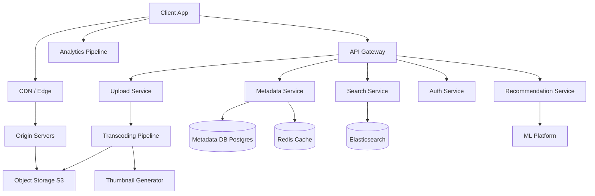
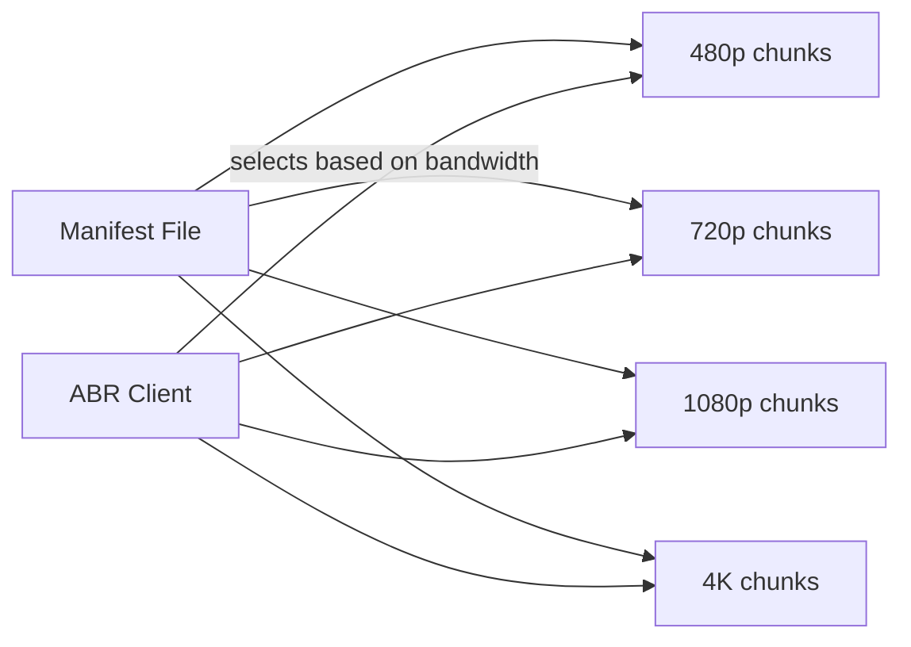

# System Design: Video Streaming Platform (Netflix/YouTube-like)

## Problem Statement

Design a video streaming platform where users can browse, search, and watch videos. The system must handle millions of concurrent viewers with low latency.

---

## Functional Requirements

1. Users can browse and search for videos
2. Users can stream videos with adaptive quality
3. Users can upload videos (creators)
4. Support for multiple resolutions (480p, 720p, 1080p, 4K)
5. Video recommendations
6. Video metadata (title, description, thumbnails, likes, comments)
7. Subscriptions/following creators

## Non-Functional Requirements

| Requirement | Target |
------------|--------|
| Concurrent viewers | 10M+ |
| Start latency | < 2 seconds |
| Rebuffering | < 0.1% of sessions |
| Availability | 99.99% |
| Upload processing | < 1 hour for 4K |
| Global delivery | Multi-region |

---

## Capacity Estimation

- **Users:** 100M MAU, 10M DAU
- **Videos:** 50M total, 100K new/day
- **Storage:** 50M videos × 1GB average = 50PB raw
- **Bandwidth:** 10M concurrent × 5 Mbps = 50 Gbps sustained
- **Upload:** 100K videos × 1GB = 100TB/day new content

---

## High-Level Architecture

---

## Key Deep Dives

### Video Transcoding Pipeline

Raw uploads must be converted to multiple formats and resolutions:

1. **Ingestion:** Accept uploaded video (resumable uploads via chunked transfer)
2. **Transcoding:** Convert to HLS/DASH format at multiple bitrates
3. **Thumbnails:** Generate at multiple timestamps
4. **Storage:** Store all versions in object storage
5. **Metadata:** Update database with video info, CDN URLs

The transcoding pipeline should use a message queue (SQS/Kafka) with workers pulling transcoding jobs. For efficiency, use GPU-accelerated transcoding (NVENC, FFmpeg + hardware encoding).

### Adaptive Bitrate Streaming (ABR)

- **HLS (HTTP Live Streaming):** Apple's protocol, segments video into 2-10 second chunks
- **DASH (MPEG-DASH):** Open standard, similar approach
- **Client-side logic:** Monitor download speed, buffer level, and switch between quality levels

### Content Delivery Network (CDN)

CDN is critical for video streaming:
- Edge servers cache popular video segments
- Reduces origin load by 90%+ for popular content
- Multi-CDN strategy for redundancy
- P2P-assisted delivery (WebRTC DataChannel) for very popular live content

### Search Architecture

- Elasticsearch cluster for full-text search
- Index: video title, description, tags, creator name
- Autocomplete: trie-based prefix matching on popular queries
- Personalized search results based on watch history

---

## Data Model

| Table | Key Fields |
|-------|-----------|
| videos | id, title, description, creator_id, duration, views, created_at |
| video_files | video_id, resolution, format, url, file_size |
| users | id, name, email, created_at |
| subscriptions | user_id, creator_id, created_at |
| watch_history | user_id, video_id, watched_at, progress_seconds |
| thumbnails | video_id, url, timestamp |

---

## Scalability Discussion

- **Upload scaling:** Use pre-signed URLs for direct-to-S3 upload, offload transcoding to queue workers
- **Storage scaling:** Object storage scales to petabytes; use lifecycle policies for cold storage
- **Global delivery:** Multi-region CDN with origin shield
- **Analytics:** Kafka → Flink/Spark streaming for real-time, batch processing for recommendations

---

## Trade-offs

| Decision | Alternative | Trade-off |
|----------|-----------|------------|
| HLS over DASH | DASH | HLS has better Apple support; DASH is open standard |
| CDN caching | P2P delivery | CDN is reliable; P2P is cheaper for live |
| Synchronous transcoding | Async queue | Async is more scalable but adds delay |
| Elasticsearch | PostgreSQL full-text | ES scales better but adds operational complexity |

---

## Interview Questions

1. **How would you handle live streaming?** Add ingest servers, RTMP/SRT protocols, segment live video in real-time, use separate live CDN configuration with lower cache TTL.

2. **How do you prevent piracy?** Digital rights management (DRM) with Widevine/FairPlay, watermarking (forensic tracking), geo-blocking.

3. **How do you handle copyright strikes?** Content ID system using audio/video fingerprinting (LSH-based), automated takedown pipeline.

---

## References

- [Apple HLS Documentation](https://developer.apple.com/streaming/)
- [DASH Industry Forum](https://dashif.org/)
- Netflix Engineering Blog