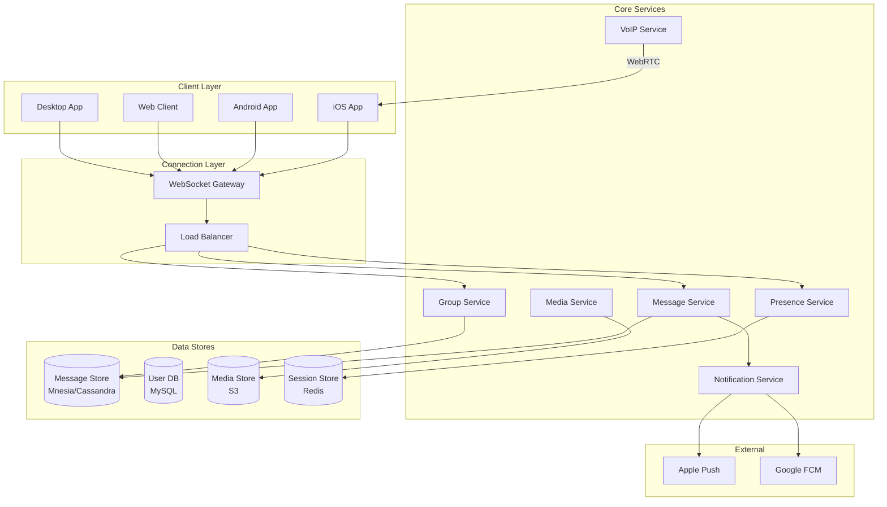
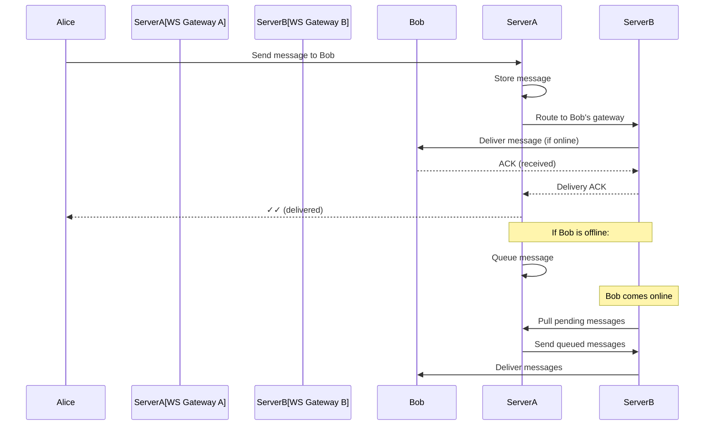
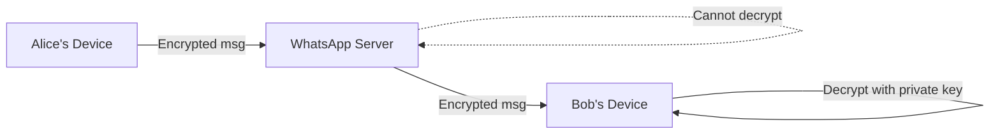
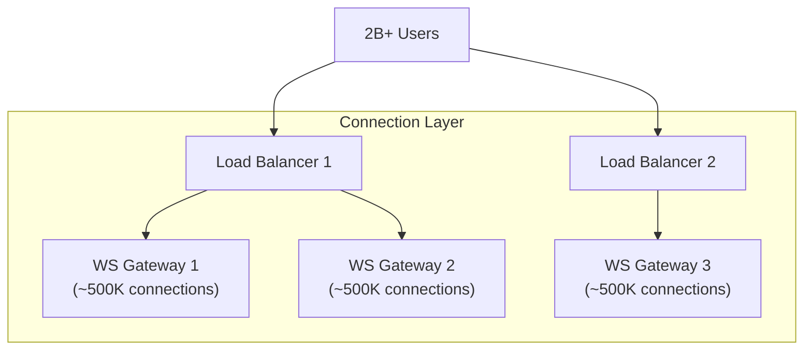
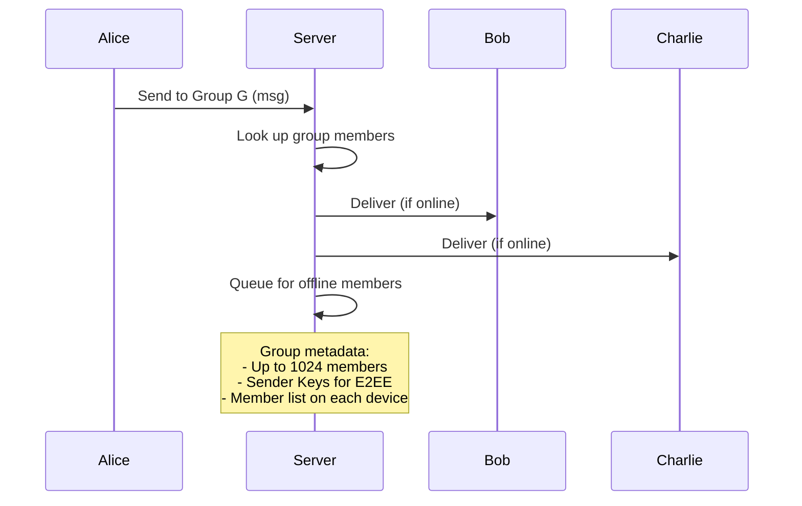
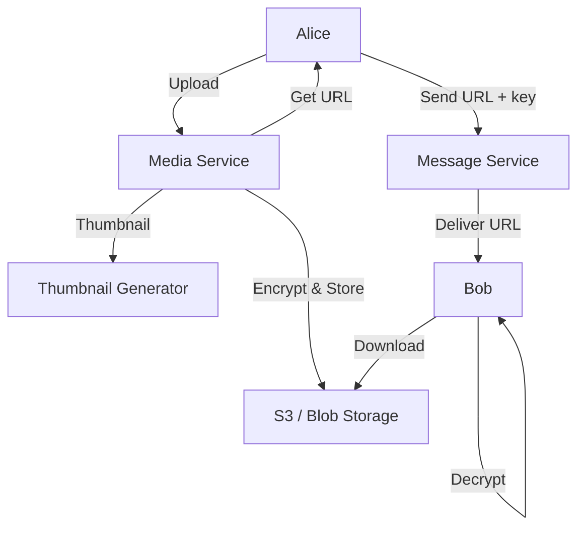
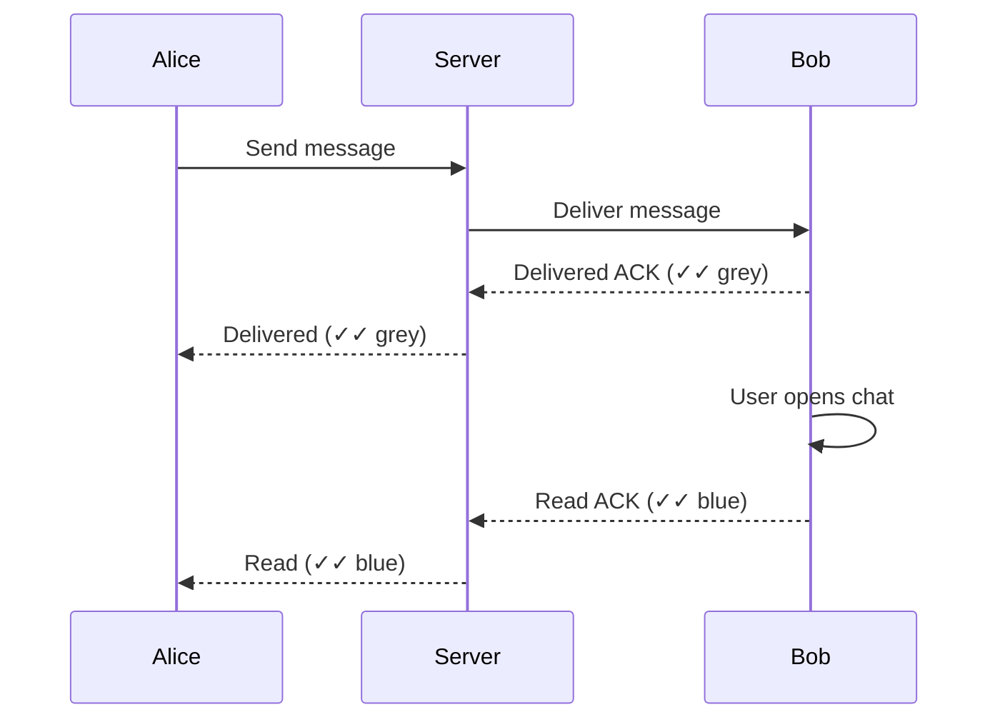

# How WhatsApp Works

## Overview

WhatsApp is a messaging platform serving 2+ billion users across 180+ countries. It handles 100+ billion messages per day with end-to-end encryption. The architecture prioritizes simplicity, reliability, and minimal resource usage — famously, WhatsApp handled 900M users with only 50 engineers.

## Key Requirements

### Functional
- One-to-one messaging
- Group messaging (up to 1,024 participants)
- Media sharing (images, videos, documents)
- Voice and video calls
- End-to-end encryption (E2EE)
- Message delivery receipts (sent, delivered, read)
- Online/offline status
- Message persistence (store-and-forward for offline users)

### Non-Functional
- **Scale**: 2+ billion users, 100+ billion messages/day
- **Latency**: Message delivery < 200ms (between online users)
- **Availability**: 99.99%
- **Reliability**: No message loss, ever
- **Efficiency**: Minimal bandwidth and battery usage
- **Privacy**: End-to-end encryption for all messages

## High-Level Architecture

## Deep Dive: Message Delivery

WhatsApp uses a **store-and-forward** model with persistent connections.

### One-to-One Message Flow

### Key Design Decisions

1. **WebSocket connections**: Persistent, bidirectional connection between client and server
2. **No message stored on server after delivery**: Messages are deleted from server once delivered (E2EE)
3. **Store-and-forward**: Messages for offline users are queued until they come online
4. **Client-side storage**: Messages are stored on the user's device, not on WhatsApp servers

## Deep Dive: End-to-End Encryption

WhatsApp uses the **Signal Protocol** for E2EE.

**How it works:**
1. Each device generates a **key pair** (public + private)
2. Public keys are registered with WhatsApp servers
3. When Alice sends a message to Bob:
   - Alice fetches Bob's public key from the server
   - Alice encrypts the message with Bob's public key + her private key
   - Server sees only encrypted ciphertext
   - Bob decrypts with his private key + Alice's public key

**Signal Protocol components:**
- **X3DH** (Extended Triple Diffie-Hellman): Key agreement protocol
- **Double Ratchet**: Generates new encryption keys for each message (forward secrecy)
- **Sender Keys**: For group messaging — each member has a unique key

**Group E2EE:**
- Sender encrypts message once with a **Sender Key**
- Sender Key is distributed to all group members via pairwise encrypted channels
- This avoids O(N²) encryption for N group members

## Deep Dive: Connection Management

WhatsApp maintains persistent WebSocket connections for all online users.

**Connection stats:**
- Each gateway server handles ~500K concurrent WebSocket connections
- WhatsApp runs ~2,000+ gateway servers for 2B users
- Connections use **heartbeats** (ping/pong every ~30 seconds) to detect disconnections
- Mobile clients use **push notifications** (APNs/FCM) to wake up when app is in background

## Deep Dive: Group Messaging

**Group message delivery:**
1. Sender encrypts once with Sender Key
2. Server forwards to all group members' gateways
3. Each gateway delivers to the member's device
4. For offline members, message is queued

## Deep Dive: Media Sharing

**Flow:**
1. Alice uploads media → encrypted and stored in S3
2. Alice receives a URL + encryption key
3. Alice sends the URL + key as a regular message to Bob
4. Bob downloads and decrypts the media
5. Media is deleted from server after delivery (typically after 30 days)

## Deep Dive: Presence & Read Receipts

### Online Status
- Client sends presence updates to the server on connect/disconnect
- Server notifies subscribed users (those who have the chat open)
- **Privacy setting**: Users can hide "last seen" and "online" status

### Read Receipts (Blue Ticks)

## Scalability

| Component | Strategy |
|-----------|---------|
| WebSocket connections | Horizontal scaling, ~500K per server |
| Message routing | Partition by user_id, consistent hashing |
| Message storage | Erlang Mnesia (early), Cassandra (later) |
| Media | S3 + CDN |
| Presence | Redis (in-memory, pub/sub) |
| Push notifications | APNs (iOS), FCM (Android) |
| Group messaging | Server-side fanout to group members |

## Trade-Offs

| Decision | Benefit | Cost |
|----------|---------|------|
| E2EE | Privacy, no server-side data | Server can't index/search messages |
| Store-and-forward | Reliable delivery | Server must queue for offline users |
| WebSocket | Low latency, bidirectional | High connection count, battery usage |
| Erlang/OTP | Handles millions of connections per node | Smaller talent pool |
| No cloud backups (default) | Privacy | User data loss risk |
| Minimal metadata | Privacy | Less analytics capability |

## Interview Tips

1. **Start with the scale** — 2B users, 100B messages/day, 50 engineers
2. **Emphasize E2EE** — Signal Protocol, server can't read messages, Sender Keys for groups
3. **Explain store-and-forward** — messages queued for offline users, delivered on reconnect
4. **Discuss WebSocket management** — persistent connections, heartbeat, reconnection
5. **Mention Erlang/OTP** — WhatsApp's secret weapon for handling millions of connections per node
6. **Talk about media** — upload → encrypt → store in S3 → send URL as message
7. **Don't forget push notifications** — APNs/FCM to wake up backgrounded apps

## Key Takeaways

- WhatsApp handles 100B+ messages/day with ~50 engineers using Erlang/OTP.
- End-to-end encryption (Signal Protocol) means the server never sees plaintext messages.
- Store-and-forward: messages are queued for offline users and delivered on reconnect.
- Persistent WebSocket connections (~500K per server) with heartbeat-based health checks.
- Group messaging uses Sender Keys to avoid O(N²) encryption overhead.
- Media is encrypted and stored in S3; only URLs and keys are sent as messages.
- Client-side storage — messages live on devices, not on WhatsApp servers.
