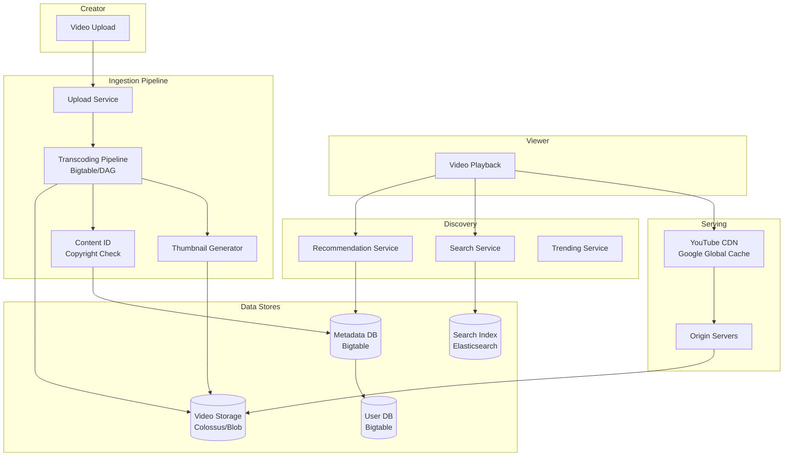
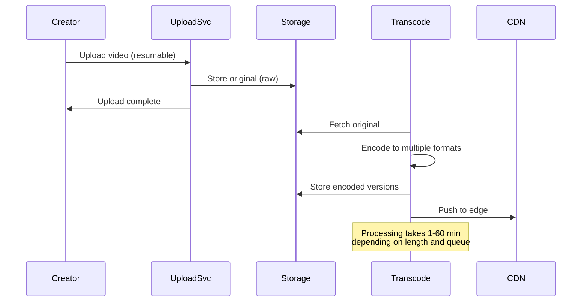
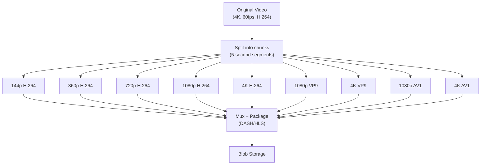
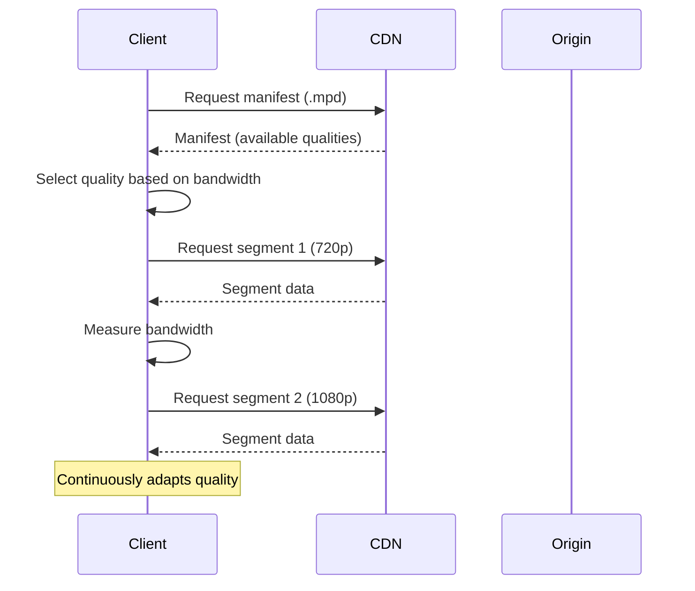
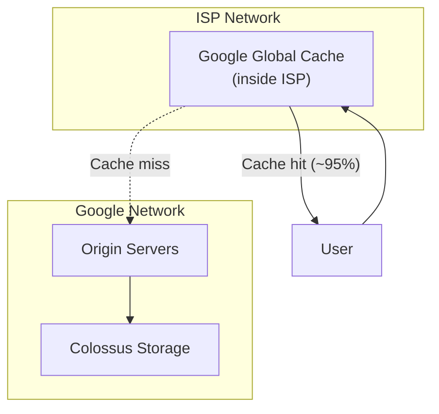
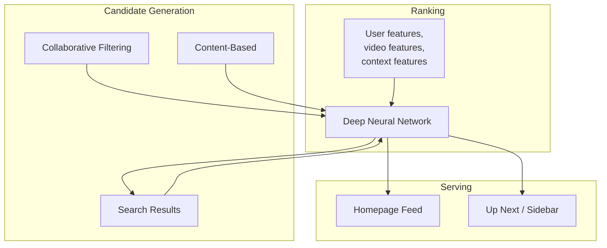
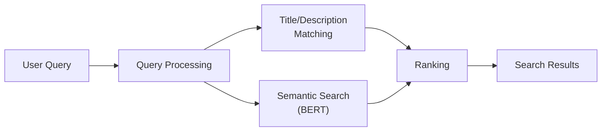

# How YouTube Works

## Overview

YouTube is the world's largest video platform, serving 2+ billion monthly active users who watch over 1 billion hours of video daily. It handles massive video uploads (500+ hours of video uploaded every minute), transcoding, storage, and delivery — making it one of the most bandwidth-intensive applications on the internet.

## Key Requirements

### Functional
- Upload videos (any format, up to 256 GB or 12 hours)
- Stream videos on any device with adaptive bitrate
- Search and discover videos (recommendations, trending, subscriptions)
- Comments, likes, shares, playlists
- Live streaming
- Monetization (ads, Super Chat, memberships)
- Content moderation and copyright detection (Content ID)

### Non-Functional
- **Scale**: 2+ billion MAU, 1+ billion hours watched daily
- **Storage**: 800+ petabytes of video (growing ~500 hours/minute)
- **Bandwidth**: Peak of 25+ Tbps outbound
- **Latency**: Video start < 2 seconds
- **Availability**: 99.99%

## High-Level Architecture

## Deep Dive: Video Upload & Processing

### Upload Flow

### Transcoding Pipeline

YouTube transcodes each video into **~30+ different versions**:

**Why so many versions:**
- Different resolutions (144p to 8K) for different bandwidths
- Different codecs (H.264, VP9, AV1) for different device support
- Different bitrates within each resolution for adaptive streaming
- Segmented for DASH/HLS streaming

**YouTube's DAG-based transcoding:**
- Uses a **Directed Acyclic Graph (DAG)** to model the transcoding pipeline
- Each step (decode → filter → encode → package) is a node in the DAG
- Enables parallel processing and automatic retries
- Built on Google's internal infrastructure (Borg)

## Deep Dive: Video Delivery

### Adaptive Bitrate Streaming (DASH)

### CDN Architecture

YouTube uses **Google Global Cache (GGC)** — Google's CDN:

- GGC servers are placed **inside ISPs** (like Netflix Open Connect)
- Serves ~95% of video traffic from ISP-local cache
- Reduces backbone bandwidth and improves start time

## Deep Dive: Recommendations

YouTube's recommendation system drives **70%+ of watch time**.

**Two-stage approach:**
1. **Candidate Generation**: Narrow millions of videos to hundreds using collaborative filtering
2. **Ranking**: Score candidates using a deep neural network with features like:
   - Watch history, search history, demographics
   - Video freshness, engagement metrics (likes, comments, watch time)
   - User context (device, time of day, location)

## Deep Dive: Search

**Ranking factors:**
- Title and description match
- Watch time and engagement
- Channel authority
- Freshness
- User's watch history

## Scalability

| Component | Strategy |
|-----------|---------|
| Video storage | Colossus (Google's distributed file system), ~800+ PB |
| Transcoding | DAG-based parallel processing on Borg (thousands of machines) |
| CDN | Google Global Cache inside ISPs |
| Metadata | Bigtable (wide-column store) |
| Search | Inverted index on Bigtable |
| Recommendations | Pre-computed offline, served from cache |
| Live streaming | Low-latency DASH, origin push to CDN |

## Trade-Offs

| Decision | Benefit | Cost |
|----------|---------|------|
| Multiple codec versions | Optimal quality per device | 30x storage and encoding cost |
| DAG-based transcoding | Parallel, fault-tolerant | Complex pipeline management |
| GGC (ISP-local CDN) | Low latency, reduced backbone | Infrastructure investment |
| AV1 codec | 30% better compression than VP9 | Higher encoding cost, slower |
| Recommendation ML | 70%+ watch time from recs | Filter bubble, diversity concerns |

## Interview Tips

1. **Start with the numbers** — 2B MAU, 500 hours uploaded/minute, 1B hours watched/day
2. **Explain the transcoding pipeline** — DAG-based, parallel, 30+ versions per video
3. **Discuss adaptive bitrate streaming** — DASH/HLS, client-side quality switching
4. **Mention the CDN** — Google Global Cache inside ISPs for low-latency delivery
5. **Talk about recommendations** — 70% of watch time, two-stage (candidate gen + ranking)
6. **Don't forget Content ID** — copyright detection at upload time
7. **Mention codec evolution** — H.264 → VP9 → AV1 for better compression

## Key Takeaways

- YouTube processes 500+ hours of video uploaded every minute through a DAG-based transcoding pipeline.
- Each video is transcoded into 30+ versions (different resolutions, codecs, bitrates) for adaptive streaming.
- Google Global Cache (GGC) serves ~95% of video traffic from ISP-local servers.
- Recommendations drive 70%+ of watch time using collaborative filtering + deep learning.
- Video storage exceeds 800 PB, growing rapidly, stored on Google's Colossus distributed file system.
- Content ID automatically detects copyrighted material at upload time.
- The codec evolution (H.264 → VP9 → AV1) reduces bandwidth costs by 30% with each generation.

## Cross-References

- [Video Streaming](../video-streaming.md)
- [Search Engine](../search.md)
- [Recommendation](../../../ml/system-design/recommendation.md)
- [Object Storage](../../../storage/object-storage.md)
- [CDN & Caching](../hld/caching-strategy.md)

