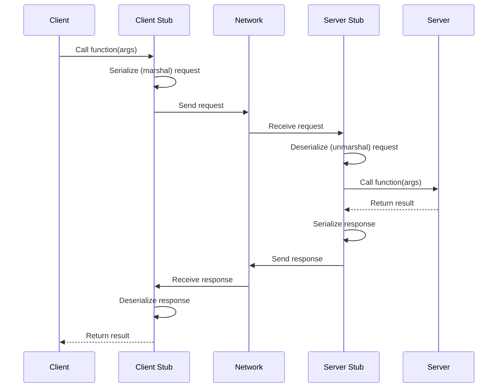
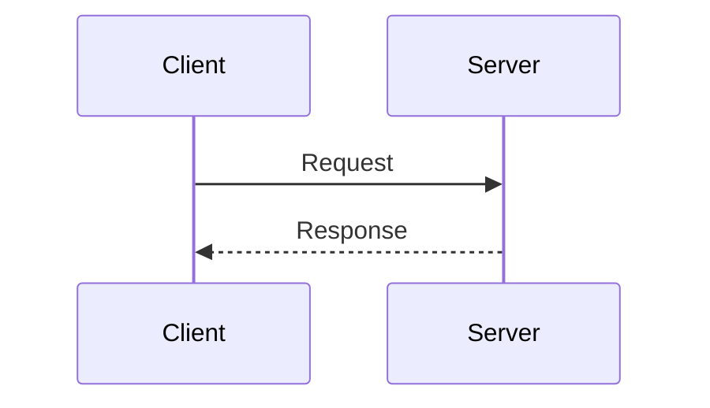
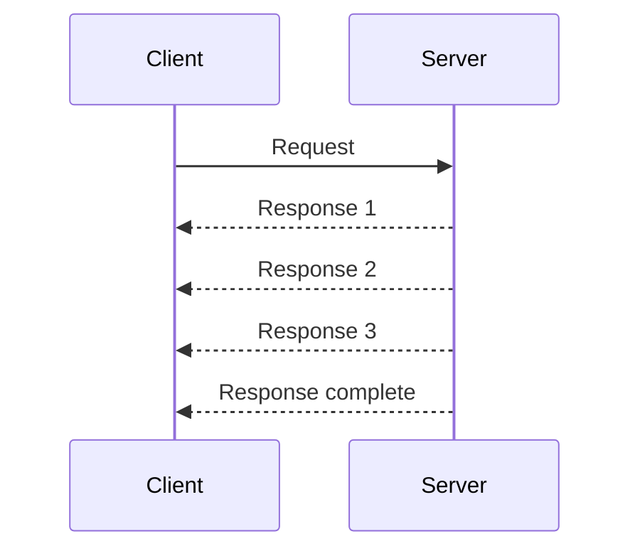
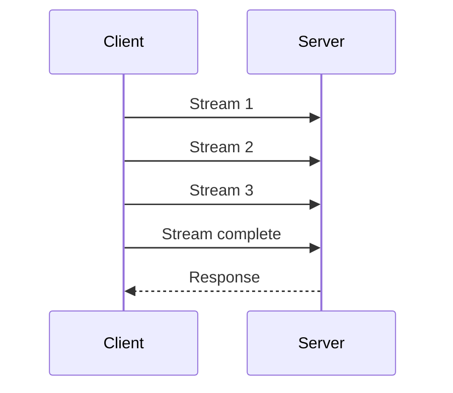
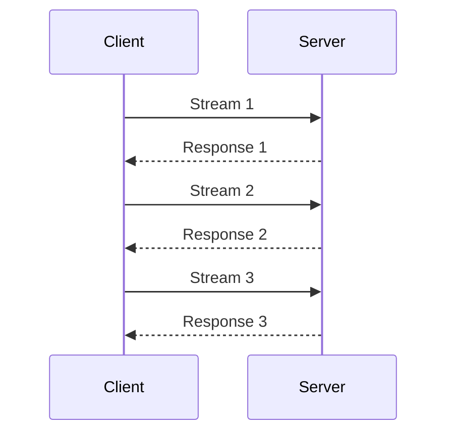

# Remote Procedure Calls (RPC)

## Overview

Remote Procedure Calls (RPC) allow a program to execute a procedure on a remote server as if it were a local function call. RPC frameworks handle serialization, networking, and error handling transparently. Understanding RPC is essential for system design interviews because microservices communicate primarily via RPC or messaging.

## How RPC Works



## Major RPC Frameworks

### gRPC (Google)

**Protocol:** HTTP/2 + Protocol Buffers (protobuf)

**Key Features:**
- **Binary serialization** via Protocol Buffers — compact and fast
- **HTTP/2** — multiplexing, header compression, server push
- **Streaming** — unary, server-streaming, client-streaming, bidirectional
- **Code generation** — generates client/server stubs from `.proto` files
- **Deadlines/timeouts** — built-in propagation across call chains
- **Load balancing** — client-side and proxy-based

**Proto Definition:**
```protobuf
syntax = "proto3";

service UserService {
  rpc GetUser (GetUserRequest) returns (User);
  rpc ListUsers (ListUsersRequest) returns (stream User);
}

message GetUserRequest {
  string user_id = 1;
}

message User {
  string id = 1;
  string name = 2;
  string email = 3;
}
```

**Client Usage:**
```python
import grpc
import user_service_pb2_grpc
import user_service_pb2

channel = grpc.insecure_channel('localhost:50051')
stub = user_service_pb2_grpc.UserServiceStub(channel)

user = stub.GetUser(user_service_pb2.GetUserRequest(user_id="123"))
print(user.name)
```

### Apache Thrift (Facebook)

**Protocol:** Custom binary protocol over TCP

**Key Features:**
- **Language-agnostic** — supports 20+ languages
- **Pluggable protocols** — binary, compact, JSON
- **Pluggable transports** — raw TCP, HTTP, framed
- **Lightweight** — minimal overhead

**Thrift IDL:**
```thrift
struct User {
  1: string id,
  2: string name,
  3: string email,
}

service UserService {
  User getUser(1: string userId),
  list<User> listUsers(1: i32 limit),
}
```

### Other Notable RPC Frameworks

| Framework | Company | Protocol | Key Feature |
|-----------|---------|----------|-------------|
| **gRPC** | Google | HTTP/2 + Protobuf | Streaming, codegen |
| **Thrift** | Facebook | Custom TCP | Language-agnostic |
| **Cap'n Proto** | — | Zero-copy | Zero serialization |
| **Avro** | Apache | JSON/Binary | Schema evolution |
| **JSON-RPC** | — | HTTP + JSON | Simple, human-readable |
| **XML-RPC** | — | HTTP + XML | Legacy systems |

## RPC vs REST

| Aspect | RPC (gRPC) | REST |
|--------|------------|------|
| **Protocol** | HTTP/2 (binary) | HTTP/1.1+ (text) |
| **Data Format** | Protobuf (binary) | JSON (text) |
| **Contract** | `.proto` file (strict) | OpenAPI/Swagger (optional) |
| **Code Generation** | Built-in | Manual or optional |
| **Streaming** | Native (bidirectional) | Not native (WebSocket needed) |
| **Performance** | 2-10x faster (binary) | Slower (JSON parsing) |
| **Browser Support** | Requires gRPC-Web proxy | Native |
| **Discoverability** | Low (binary) | High (URLs, HTTP verbs) |
| **Caching** | Hard (custom protocol) | Easy (HTTP caching) |
| **Coupling** | Tight (shared schema) | Loose (HATEOAS possible) |

### When to Use RPC (gRPC)
- Internal microservice communication (service-to-service)
- High-throughput, low-latency requirements
- Streaming data (real-time updates, logs)
- Polyglot environments (many languages)
- Strong typing and contract enforcement

### When to Use REST
- Public APIs (browser-friendly, cacheable)
- When discoverability matters (URL-based)
- When HTTP semantics are important (caching, status codes)
- When simplicity is valued over performance
- When you need human-readable payloads for debugging

## RPC Patterns

### Unary RPC


### Server Streaming RPC

Use case: Fetching a list of results, log tailing

### Client Streaming RPC

Use case: Uploading a large file, batch insert

### Bidirectional Streaming RPC

Use case: Chat applications, real-time collaboration

## Error Handling in RPC

gRPC defines standard status codes:

| Code | Meaning | HTTP Equivalent |
|------|---------|----------------|
| OK | Success | 200 |
| CANCELLED | Client cancelled | 499 |
| INVALID_ARGUMENT | Bad input | 400 |
| NOT_FOUND | Resource missing | 404 |
| ALREADY_EXISTS | Duplicate | 409 |
| PERMISSION_DENIED | Auth failure | 403 |
| RESOURCE_EXHAUSTED | Rate limited | 429 |
| UNIMPLEMENTED | Not supported | 501 |
| UNAVAILABLE | Service down | 503 |
| DEADLINE_EXCEEDED | Timeout | 504 |

## Performance Comparison

Benchmark (10KB payload, localhost):

| Metric | gRPC (Protobuf) | REST (JSON) | Thrift (Binary) |
|--------|-----------------|-------------|-----------------|
| Latency (p50) | 0.3ms | 1.2ms | 0.4ms |
| Throughput | 180K req/s | 45K req/s | 160K req/s |
| Payload size | 5KB | 10KB | 5.5KB |
| CPU usage | Low | High (JSON parse) | Low |

*Numbers are approximate and vary by hardware and configuration.*

## Trade-Offs

| Aspect | Benefit | Cost |
|--------|---------|------|
| Binary protocol (protobuf) | Fast, compact | Not human-readable, harder debugging |
| HTTP/2 multiplexing | Single connection, no head-of-line blocking | More complex than HTTP/1.1 |
| Code generation | Type safety, consistency | Build step required, coupling |
| Streaming | Real-time, efficient | More complex error handling |
| Strict contracts | Fewer runtime errors | Schema evolution needed |

## Interview Tips

1. **Know the RPC vs REST trade-off** — internal services → gRPC; public APIs → REST
2. **Mention gRPC for microservices** — it's the industry standard for service-to-service communication
3. **Explain why binary protocols are faster** — smaller payloads, no JSON parsing overhead
4. **Discuss streaming** — bidirectional streaming for real-time features (chat, live updates)
5. **Address browser limitations** — gRPC-Web or REST gateway for browser clients
6. **Talk about service mesh** — Istio/Envoy can handle gRPC load balancing and observability
7. **Mention deadline propagation** — gRPC propagates timeouts across call chains, preventing cascading timeouts

## Key Takeaways

- RPC lets you call remote functions as if they were local. gRPC (Google) is the dominant modern framework.
- gRPC uses HTTP/2 + Protobuf for high performance: 2-10x faster than REST/JSON.
- Use RPC for internal microservice communication; REST for public APIs.
- Streaming (server, client, bidirectional) is a key gRPC advantage.
- Error handling uses standard status codes similar to HTTP but more granular.
- Code generation from `.proto` files ensures type safety across languages.

## Cross-References

- [API Design](./hld/api-design.md)
- [Consistency Patterns](./consistency-patterns.md)
- [Messaging Systems](./hld/messaging-systems.md)
- [Cloud Networking](../../cloud/aws/vpc.md)
