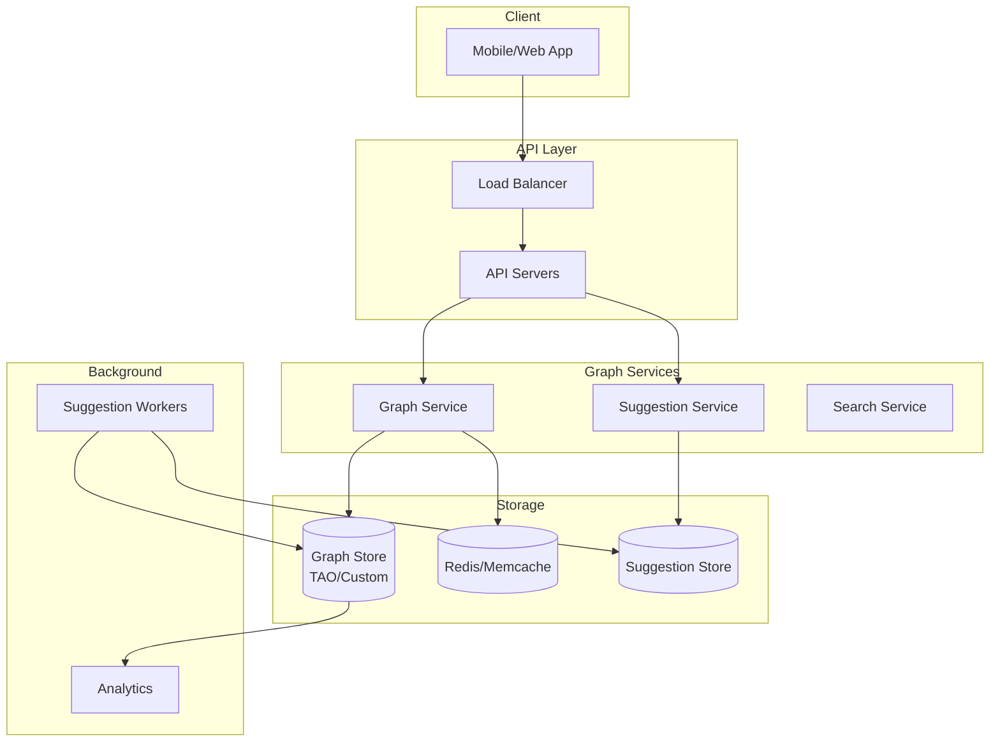
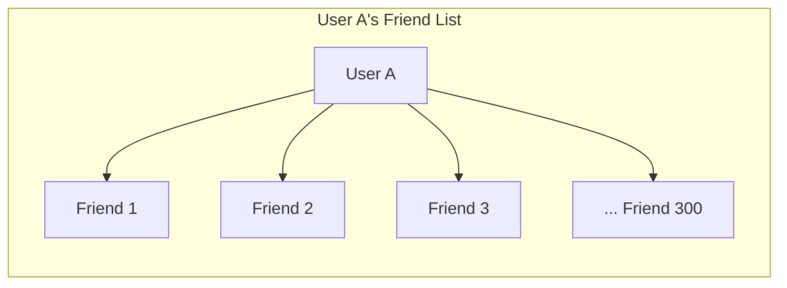
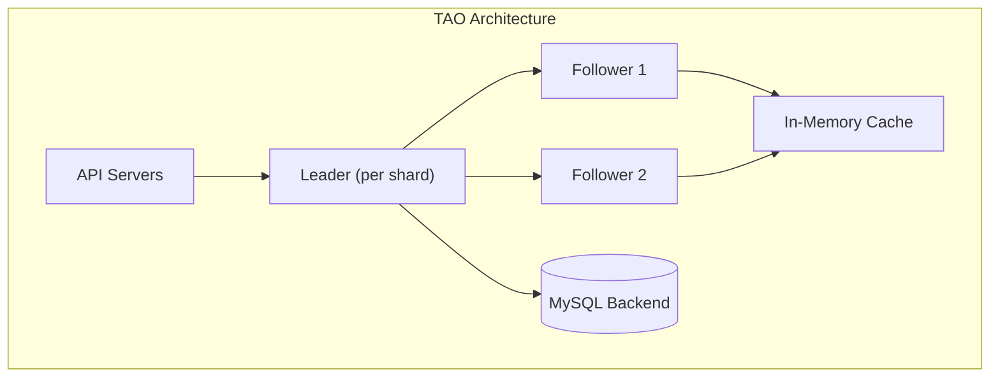
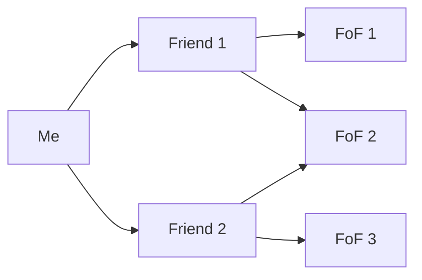
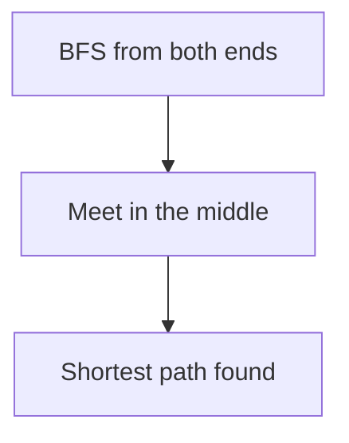
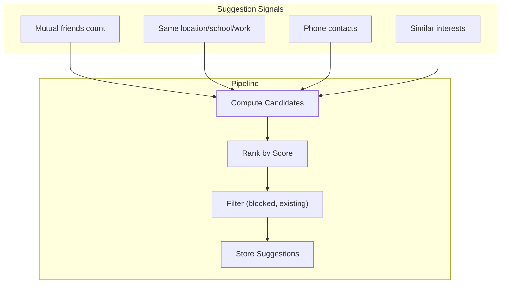
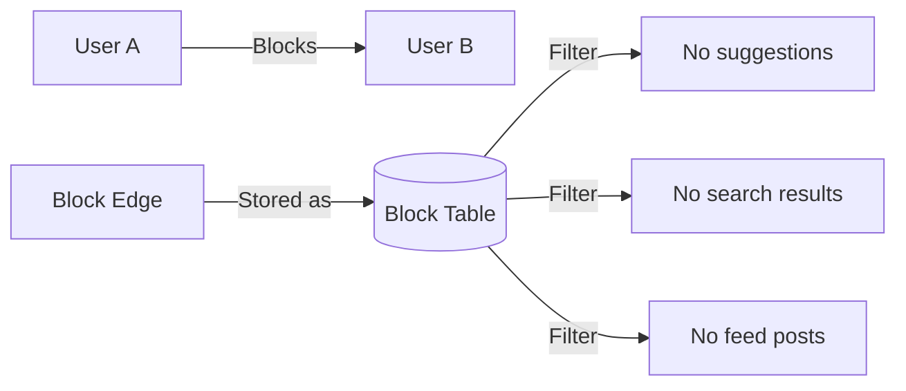

# Design a Social Graph

## Overview

A social graph represents relationships between users (friends, followers, connections). It's the backbone of social networks like Facebook, LinkedIn, and Twitter. The core challenges are storing billions of relationships, answering graph queries efficiently (friends of friends, shortest path), and handling real-time updates.

## Requirements

### Functional
- Add/remove relationships (friend, follow, block)
- Get a user's friends/followers
- Get mutual friends between two users
- Get friends of friends (2nd-degree connections)
- Suggest friends (people you may know)
- Check if two users are connected (and degree of separation)

### Non-Functional
- **Scale**: 2+ billion users, 1+ trillion edges (relationships)
- **Latency**: Friend list < 50ms, 2nd-degree < 200ms
- **Availability**: 99.99%
- **Consistency**: Eventual consistency for friend lists (OK if a new friend takes a few seconds to appear)
- **Throughput**: 100K+ edge writes/sec, 1M+ edge reads/sec

## Capacity Estimation

```
Users: 2 billion
Average friends per user: 300
Total edges: 2B × 300 / 2 = 300 billion (undirected)
Total edges (directed): 600 billion
Edge storage: 16 bytes per edge (8 bytes user_id × 2)
Total storage: 600B × 16 bytes = ~9.6 TB
With replication (3x): ~29 TB
```

## Architecture



## Deep Dive: Graph Storage

### Adjacency List (Primary Approach)

Store each user's friends as a sorted list:



**Storage format (per user):**
```
user_id: 12345
friends: [111, 222, 333, 444, ...]  // sorted list of friend IDs
```

**Database choice:**
- **TAO (Facebook)**: Custom graph store built on MySQL
- **Neo4j**: Native graph database (good for complex traversals)
- **Cassandra**: Wide-column store, partition by user_id
- **Redis**: Adjacency sets (SADD, SMEMBERS)

### TAO (The Associations and Objects)

Facebook's social graph store:



**TAO primitives:**
- **Objects**: Users, posts, comments (nodes in the graph)
- **Associations**: Friendships, likes, follows (edges in the graph)
- **Operations**: `addAssociation`, `deleteAssociation`, `getFriends`, `getCounters`

### Redis Graph Sets

```python
# Add friend
redis.sadd("friends:12345", "67890")
redis.sadd("friends:67890", "12345")  # bidirectional

# Get friends
friends = redis.smembers("friends:12345")

# Get mutual friends
mutual = redis.sinter("friends:12345", "friends:67890")

# Get friends of friends
friends = redis.smembers("friends:12345")
fof = set()
for friend in friends:
    fof.update(redis.smembers(f"friends:{friend}"))
fof -= friends  # remove direct friends
fof.discard("12345")  # remove self
```

## Deep Dive: Graph Queries

### Get Friends (1st Degree)

```sql
-- MySQL (TAO-style)
SELECT friend_id FROM friendships WHERE user_id = 12345;
```

Time complexity: O(K) where K = number of friends

### Get Friends of Friends (2nd Degree)



```python
def get_friends_of_friends(user_id):
    friends = get_friends(user_id)
    fof = {}
    for friend_id in friends:
        for fof_id in get_friends(friend_id):
            if fof_id != user_id and fof_id not in friends:
                fof[fof_id] = fof.get(fof_id, 0) + 1
    return sorted(fof.items(), key=lambda x: -x[1])
```

Time complexity: O(K²) — can be expensive for users with many friends

### Mutual Friends

```python
def get_mutual_friends(user_a, user_b):
    friends_a = set(get_friends(user_a))
    friends_b = set(get_friends(user_b))
    return friends_a & friends_b  # set intersection
```

### Shortest Path (Degree of Separation)



**Bidirectional BFS:**
- Start BFS from both users simultaneously
- Expand the smaller frontier each step
- When frontiers intersect, path is found
- Much faster than single-direction BFS for sparse graphs

## Deep Dive: Friend Suggestions



**Suggestion algorithm:**
1. For each user, find 2nd-degree connections (friends of friends)
2. Rank by: number of mutual friends, shared demographics, activity overlap
3. Filter out: existing friends, blocked users, deactivated accounts
4. Store top-N suggestions for fast retrieval
5. Refresh periodically (batch job)

## Deep Dive: Blocking



**Blocking implications:**
- Blocked user cannot see blocker's profile, posts, or friend list
- Blocked user is excluded from suggestions
- Block is stored separately from friend/follow edges
- Must be checked in all read paths

## Scalability

| Component | Strategy |
|-----------|---------|
| Graph storage | Sharded by user_id, TAO-style |
| Cache | Redis/Memcache for hot user friend lists |
| Friend suggestions | Batch computation, cached results |
| Mutual friends | Set intersection on cached friend lists |
| Shortest path | Bidirectional BFS with depth limit |
| Analytics | Offline processing on graph snapshots |

## Trade-Offs

| Decision | Benefit | Cost |
|----------|---------|------|
| Adjacency list | Simple, fast friend lookups | FoF requires multiple queries |
| TAO (custom store) | Optimized for social graph | Complex infrastructure |
| Redis sets | Fast set operations | Memory-intensive for large graphs |
| Batch suggestions | Pre-computed, fast serving | Stale suggestions |
| Bidirectional BFS | Faster shortest path | More complex implementation |

## Interview Tips

1. **Start with scale** — 2B users, 1T edges
2. **Explain adjacency list** — each user has a sorted list of friend IDs
3. **Discuss storage choice** — TAO (Facebook), Redis sets, or graph DB
4. **Mention FoF queries** — O(K²) complexity, need caching
5. **Talk about friend suggestions** — mutual friends count, batch computation
6. **Don't forget blocking** — separate block edges, filter in all read paths
7. **Discuss bidirectional BFS** — for shortest path / degree of separation

## Key Takeaways

- Social graph stores billions of user relationships as adjacency lists.
- TAO (Facebook's custom store) uses MySQL backend + in-memory cache for fast graph queries.
- Friends of friends (FoF) is O(K²) — must be cached or pre-computed.
- Friend suggestions: rank 2nd-degree connections by mutual friends count.
- Bidirectional BFS finds shortest path between two users efficiently.
- Blocking is stored as separate edges and filtered in all read paths.
- Redis sets enable fast set operations (intersection for mutual friends, union for FoF).
