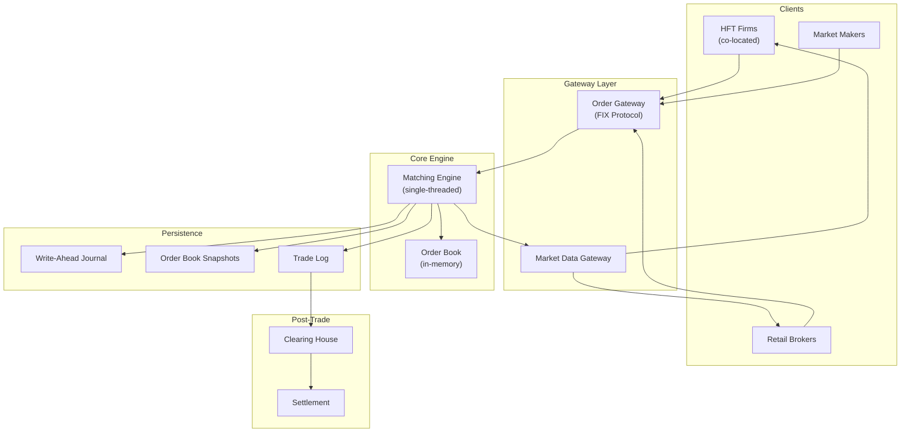
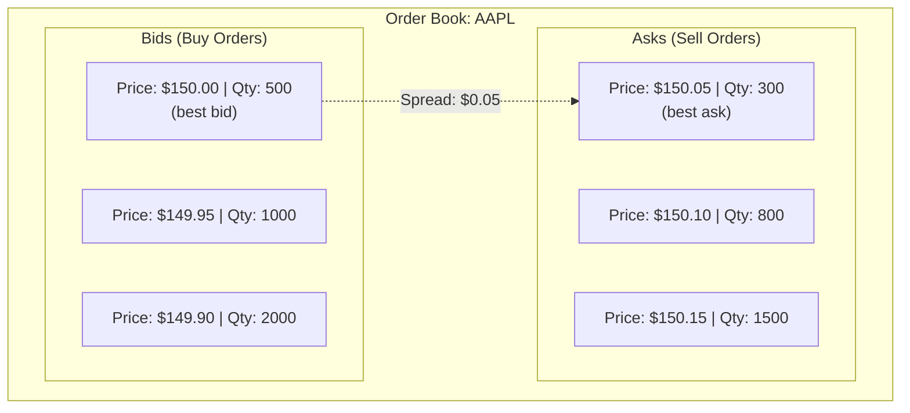
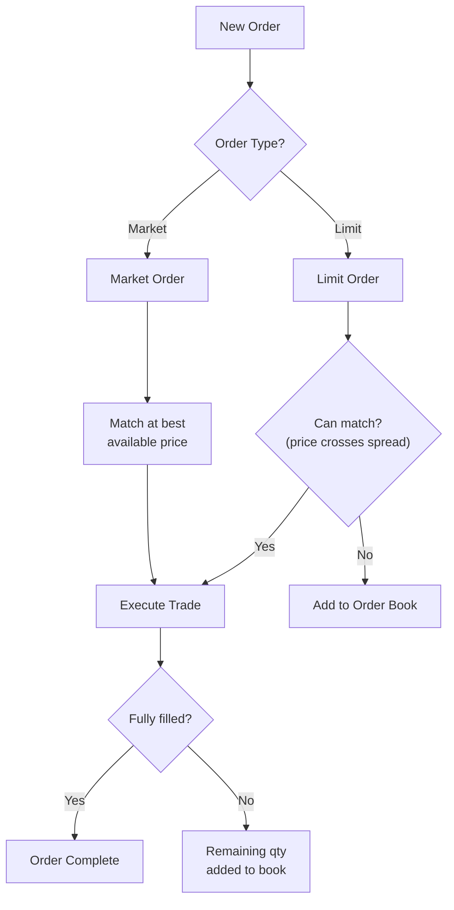
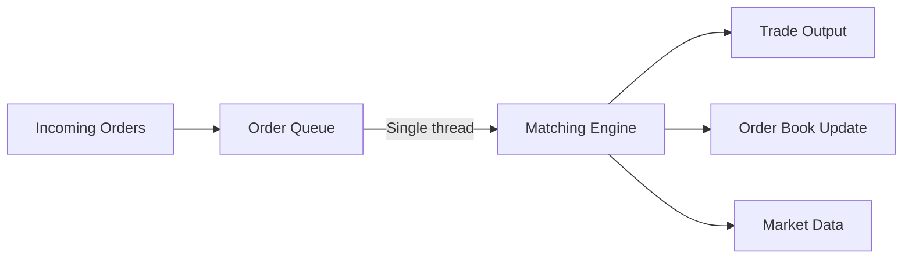
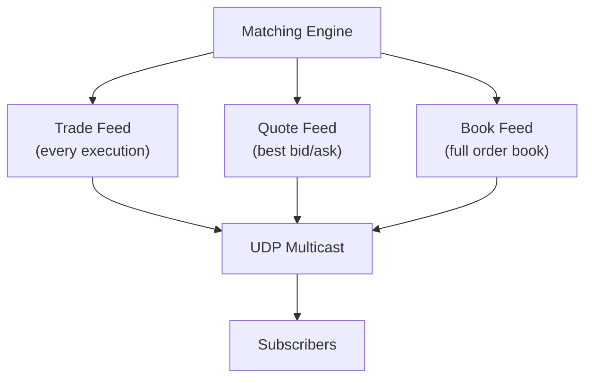
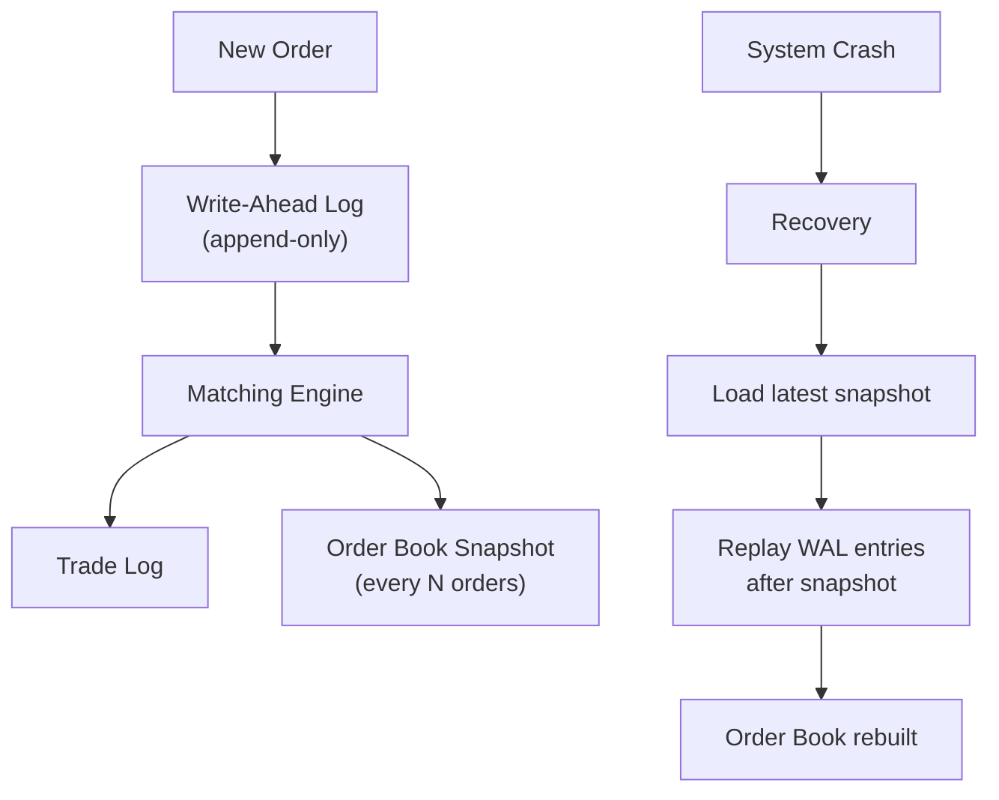

# Design a Stock Exchange

## Overview

A stock exchange matches buy and sell orders for financial securities with extreme precision and low latency. Systems like NYSE, NASDAQ, and Binance process millions of orders per second with microsecond-level latency. The core challenges are maintaining a fair order book, ensuring price-time priority, and handling massive throughput with zero data loss.

## Requirements

### Functional
- Submit limit orders (buy/sell at a specific price)
- Submit market orders (buy/sell at best available price)
- Cancel orders
- Order matching engine (price-time priority)
- Real-time market data feed (trades, quotes, order book)
- Order book display (bid/ask levels)
- Trade settlement (T+1 or T+2)

### Non-Functional
- **Latency**: Order matching < 10 microseconds (HFT), < 1ms (retail)
- **Throughput**: 1M+ orders/second
- **Consistency**: Exactly-once order processing, no double executions
- **Availability**: 99.999% (downtime = massive financial impact)
- **Fairness**: Price-time priority strictly enforced
- **Durability**: Zero order loss (every order must be persisted)

## Architecture



## Deep Dive: Order Book

The order book is the core data structure — it maintains all outstanding buy and sell orders.



**Order book data structures:**

```python
from sortedcontainers import SortedDict

class OrderBook:
    def __init__(self):
        # Bids: price → list of orders (sorted descending by price)
        self.bids = SortedDict(lambda x: -x)
        # Asks: price → list of orders (sorted ascending by price)
        self.asks = SortedDict()
    
    def add_bid(self, price, quantity, order_id, timestamp):
        if price not in self.bids:
            self.bids[price] = []
        self.bids[price].append({
            'order_id': order_id,
            'quantity': quantity,
            'timestamp': timestamp
        })
    
    def get_best_bid(self):
        if self.bids:
            price = self.bids.peekitem(0)[0]
            return price, self.bids[price][0]
        return None, None
    
    def get_best_ask(self):
        if self.asks:
            price = self.asks.peekitem(0)[0]
            return price, self.asks[price][0]
        return None, None
```

## Deep Dive: Matching Engine

The matching engine is the heart of the exchange. It processes orders in price-time priority.

### Matching Algorithm



**Price-time priority:**
1. **Price priority**: Best price matches first (highest bid, lowest ask)
2. **Time priority**: Among orders at the same price, earliest order matches first

**Matching example:**

```
Existing order book:
  Bids: $100 (qty 100, time 10:00:00), $99 (qty 200, time 10:00:01)
  Asks: $101 (qty 150, time 10:00:02), $102 (qty 300, time 10:00:03)

New order: Buy 200 shares at $101 (marketable limit)

Step 1: Match against best ask ($101, qty 150)
  → Execute 150 shares at $101
  → Remaining: 50 shares

Step 2: Match against next ask ($102, qty 300)
  → Execute 50 shares at $102
  → Remaining: 0 (fully filled)

Result: Bought 150 @ $101 + 50 @ $102
```

### Single-Threaded Design

Many exchanges use a **single-threaded matching engine**:



**Why single-threaded?**
- Eliminates concurrency issues (no locks, no race conditions)
- Ensures strict ordering of events
- Deterministic behavior (critical for fairness)
- Modern CPUs can process millions of orders/second on a single core

## Deep Dive: Market Data Feed



**Market data types:**
- **Level 1**: Best bid/ask, last trade (real-time)
- **Level 2**: Top 5-10 bid/ask levels with quantities
- **Level 3**: Full order book (institutional only)

**Protocol**: UDP multicast for lowest latency (no TCP overhead)

## Deep Dive: Persistence & Recovery



**Recovery process:**
1. Load latest order book snapshot
2. Replay all WAL entries after the snapshot
3. Order book is fully reconstructed
4. Resume processing new orders

## Deep Dive: FIX Protocol

Financial Information eXchange (FIX) is the standard protocol for order submission:

```
# New Order
8=FIX.4.4|35=D|49=SENDER|56=TARGET|11=ORDER123|55=AAPL|
44=150.00|38=100|54=1|40=2|

# Execution Report
8=FIX.4.4|35=8|49=TARGET|56=SENDER|11=ORDER123|17=EXEC456|
150=2|39=2|55=AAPL|44=150.00|38=100|14=100|
```

## Scalability

### Per-Exchange Scaling

```mermaid
graph TB
    subgraph "Sharded by Symbol"
        Engine1["Matching Engine 1<br/>(A-F symbols)"]
        Engine2["Matching Engine 2<br/>(G-M symbols)"]
        Engine3["Matching Engine 3<br/>(N-S symbols)"]
        Engine4["Matching Engine 4<br/">(T-Z symbols)"]
    end
    
    Gateway["Order Gateway"] --> Router["Symbol Router"]
    Router --> Engine1
    Router --> Engine2
    Router --> Engine3
    Router --> Engine4
```

**Sharding strategy:**
- Partition by stock symbol (each symbol has its own order book)
- Each matching engine handles a subset of symbols
- No cross-symbol dependencies

### Co-Location

HFT firms pay to place their servers in the same data center as the exchange:
- Reduces network latency from milliseconds to microseconds
- Cross-connect: direct fiber link between firm's server and exchange
- Regulatory concern: fairness for non-co-located participants

## Trade-Offs

| Decision | Benefit | Cost |
|----------|---------|------|
| Single-threaded matching | Deterministic, no locks | Can't scale vertically |
| In-memory order book | Ultra-fast matching | Must persist for durability |
| UDP multicast market data | Lowest latency | No delivery guarantee |
| WAL for persistence | Zero data loss | Write latency overhead |
| Sharding by symbol | Independent order books | Can't match across symbols |

## Interview Tips

1. **Start with latency** — "Stock exchanges need microsecond-level matching latency"
2. **Explain the order book** — bids sorted descending, asks sorted ascending
3. **Discuss matching algorithm** — price-time priority, limit vs market orders
4. **Mention single-threaded design** — deterministic, no race conditions
5. **Talk about persistence** — WAL + snapshots for crash recovery
6. **Don't forget market data** — UDP multicast, Level 1/2/3 feeds
7. **Discuss sharding** — by stock symbol for independent order books

## Key Takeaways

- Stock exchanges use in-memory order books with single-threaded matching engines for deterministic, ultra-fast processing.
- Price-time priority: best price first, then earliest order at that price.
- Matching: limit orders match against opposite side of book; market orders take best available price.
- Persistence: Write-Ahead Log (WAL) + periodic snapshots for crash recovery.
- Market data: UDP multicast for lowest latency (Level 1: best bid/ask, Level 2: top-N levels).
- Sharding: by stock symbol — each symbol has an independent order book.
- FIX protocol is the standard for order submission in financial markets.
