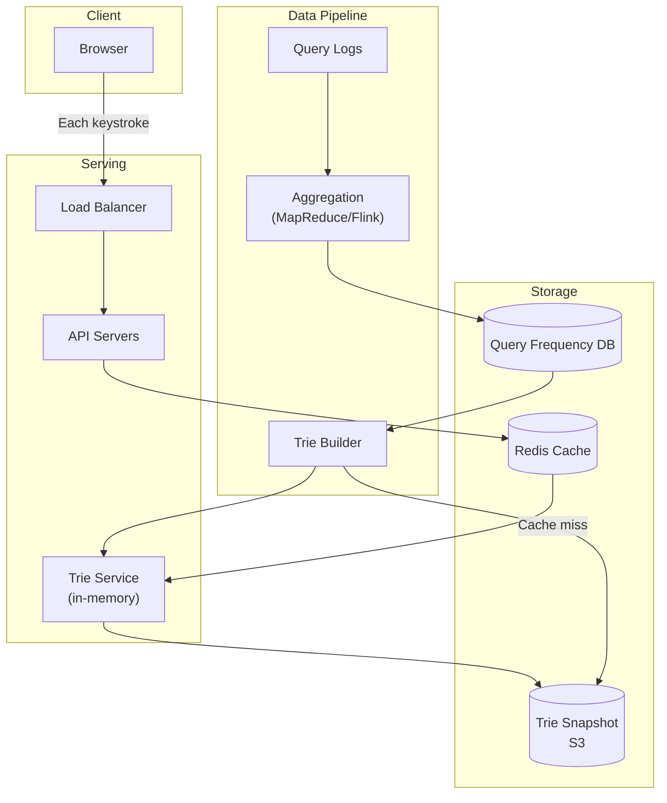
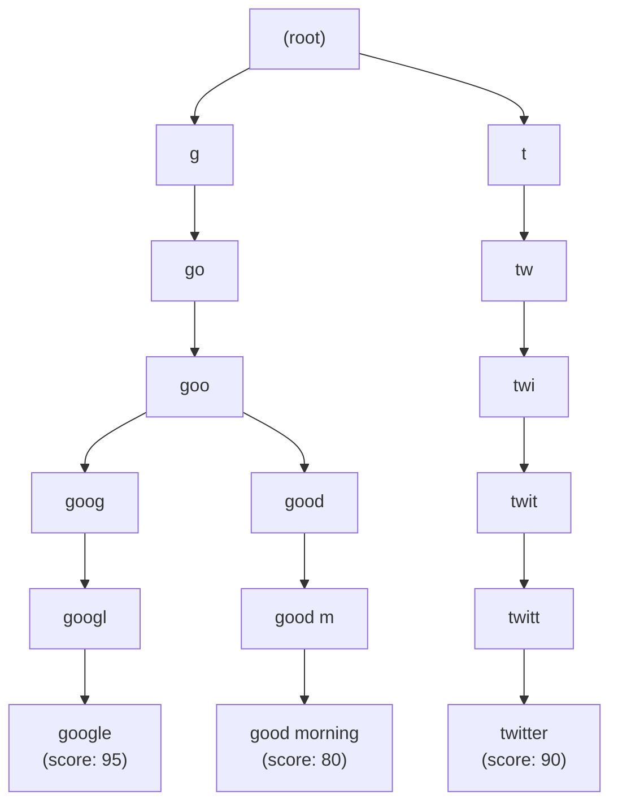
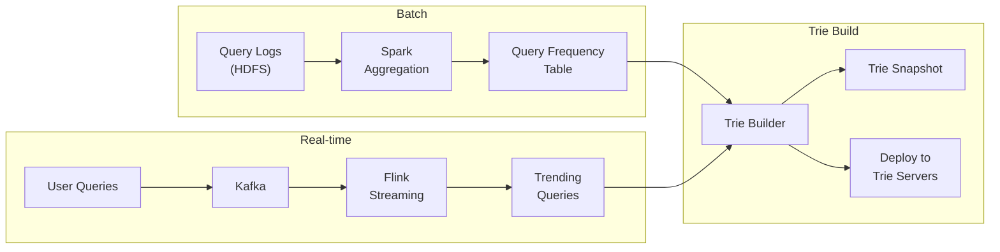
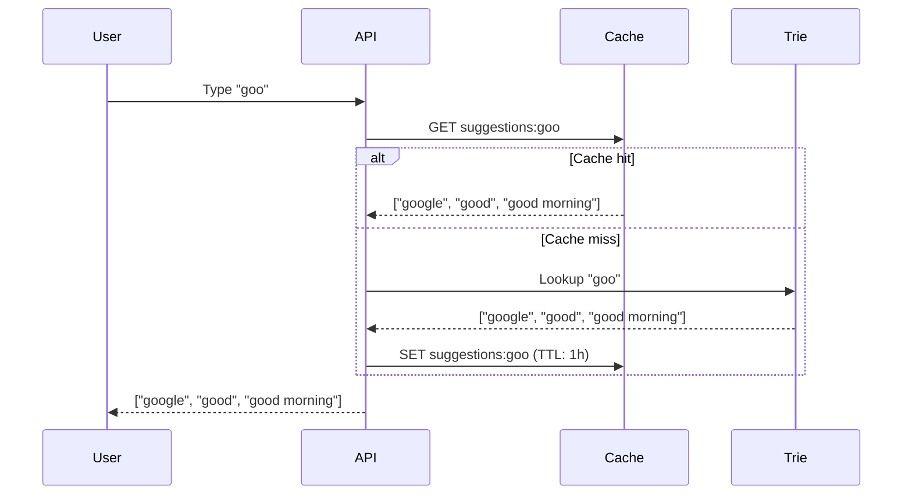
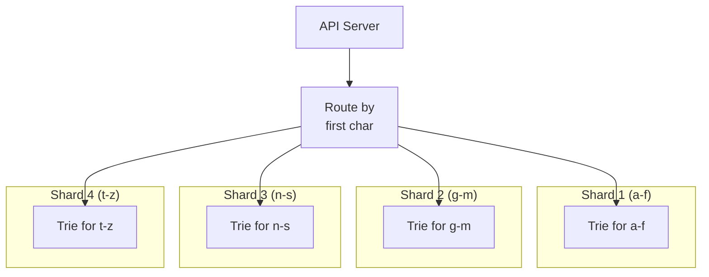

# Design Typeahead / Autocomplete

## Overview

Typeahead (autocomplete) suggests completions as users type in a search box. Google's autocomplete handles 5+ billion searches per day, suggesting queries after each keystroke. The core challenges are ultra-low latency (< 50ms), handling billions of possible suggestions, and ranking suggestions by relevance.

## Requirements

### Functional
- Show top 5-10 suggestions as user types each character
- Suggestions ranked by relevance (popularity, personalization)
- Support prefix matching ("goo" → "google", "good morning")
- Handle typos and fuzzy matching (optional)
- Update suggestions as trending topics change

### Non-Functional
- **Latency**: < 50ms per keystroke
- **Scale**: 5+ billion queries/day, millions of unique suggestions
- **Availability**: 99.99%
- **Freshness**: Trending suggestions updated within minutes

## Architecture



## Deep Dive: Trie Data Structure

The core data structure for prefix matching is a **trie** (prefix tree).



**Trie node:**
```python
class TrieNode:
    def __init__(self):
        self.children = {}      # char -> TrieNode
        self.suggestions = []   # top-K suggestions at this prefix
        self.is_end = False
```

### Optimized Trie: Storing Top-K at Each Node

Instead of traversing to leaf nodes, store the top-K suggestions **at each node**:

```python
class TrieNode:
    def __init__(self):
        self.children = {}
        # Pre-computed top 10 suggestions for this prefix
        self.top_suggestions = [
            ("google", 95),
            ("google maps", 85),
            ("google translate", 80),
        ]
```

This means looking up suggestions for prefix "goo" is O(1) — just read `top_suggestions` from the node.

## Deep Dive: Data Pipeline



**Pipeline:**
1. **Log collection**: Every user query is logged with timestamp
2. **Batch aggregation**: Spark aggregates query frequencies (daily/weekly)
3. **Real-time trending**: Flink detects trending queries in real-time
4. **Trie construction**: Build trie from aggregated frequencies + trending
5. **Deployment**: Push trie snapshot to serving nodes

### Trie Construction

```python
def build_trie(queries_with_scores, max_suggestions=10):
    root = TrieNode()
    
    for query, score in queries_with_scores:
        node = root
        for char in query:
            if char not in node.children:
                node.children[char] = TrieNode()
            node = node.children[char]
            # Update top-K at this prefix
            node.top_suggestions.append((query, score))
            node.top_suggestions.sort(key=lambda x: -x[1])
            node.top_suggestions = node.top_suggestions[:max_suggestions]
        node.is_end = True
    
    return root
```

## Deep Dive: Serving



**Client-side optimization:**
```javascript
// Debounce: only send request after user pauses typing
let debounceTimer;
input.addEventListener('keyup', (e) => {
    clearTimeout(debounceTimer);
    debounceTimer = setTimeout(() => {
        fetchSuggestions(input.value);
    }, 100);  // 100ms debounce
});

// Cache on client: don't re-request "goo" if user already typed "goog
const clientCache = {};
async function fetchSuggestions(prefix) {
    if (clientCache[prefix]) {
        displaySuggestions(clientCache[prefix]);
        return;
    }
    const results = await api.get(`/suggest?q=${prefix}`);
    clientCache[prefix] = results;
    displaySuggestions(results);
}
```

**Server-side optimizations:**
- Cache popular prefixes in Redis (80%+ cache hit rate)
- Trie nodes for common prefixes ("g", "go", "goo") are always in memory
- Shard trie by first character or first two characters

## Deep Dive: Ranking

Suggestions are ranked by:

| Signal | Weight | Description |
|--------|--------|-------------|
| Query frequency | High | How often users search this query |
| Trending score | Medium | Real-time trend detection |
| Personalization | Medium | User's search history |
| Freshness | Low | Recency of query |
| Diversity | Low | Avoid showing 5 similar suggestions |

**Scoring formula:**
```
score = α × frequency + β × trending + γ × personalization + δ × freshness
```

## Deep Dive: Scaling

### Sharding Strategy



**Sharding options:**
1. **By first character**: Simple but uneven (more words start with 's' than 'x')
2. **By first two characters**: Better distribution
3. **By hash of prefix**: Most even distribution

### Memory Estimation

```
Unique queries: 5 billion
Average query length: 20 characters
Trie nodes: ~500 million (shared prefixes reduce nodes)
Memory per node: ~200 bytes (children map + top-K suggestions)
Total memory: 500M × 200 bytes = 100 GB
With replication: 300 GB
```

100 GB fits comfortably in memory across a few machines.

## Trade-Offs

| Decision | Benefit | Cost |
|----------|---------|------|
| Trie with pre-computed top-K | O(1) lookup | Memory-heavy |
| Client-side debouncing | Reduces API calls | Slight delay in suggestions |
| Server-side caching | Fast responses for popular prefixes | Stale suggestions risk |
| Batch trie rebuild | Consistent, tested | Minutes of staleness |
| Real-time trending | Fresh suggestions | Complex pipeline |

## Interview Tips

1. **Start with latency** — "Users expect suggestions within 50ms of each keystroke"
2. **Explain the trie** — prefix tree with top-K suggestions stored at each node
3. **Discuss the data pipeline** — batch aggregation + real-time trending → trie construction
4. **Mention client-side optimization** — debouncing, client-side caching
5. **Talk about sharding** — by first character or hash of prefix
6. **Don't forget ranking** — frequency, trending, personalization
7. **Estimate memory** — 500M trie nodes × 200 bytes = 100GB

## Key Takeaways

- Typeahead uses a trie (prefix tree) with pre-computed top-K suggestions at each node for O(1) lookup.
- Data pipeline: query logs → batch aggregation (Spark) + real-time trending (Flink) → trie construction.
- Client-side: debounce keystrokes (100ms), cache previous results.
- Server-side: Redis cache for popular prefixes, in-memory trie for all lookups.
- Sharding: by first character or hash of prefix for even distribution.
- Ranking: frequency + trending + personalization + freshness.
- Memory: ~100GB for 5 billion unique queries (shared prefixes reduce node count).

## Cross-References

- [Search Engine](./search.md)
- [Trie Data Structure](../coding/data-structures.md)
- [Caching Strategy](./hld/caching-strategy.md)
- [Estimation](./estimation.md)
- [ML Search Ranking](../../ml/system-design/search-ranking.md)
