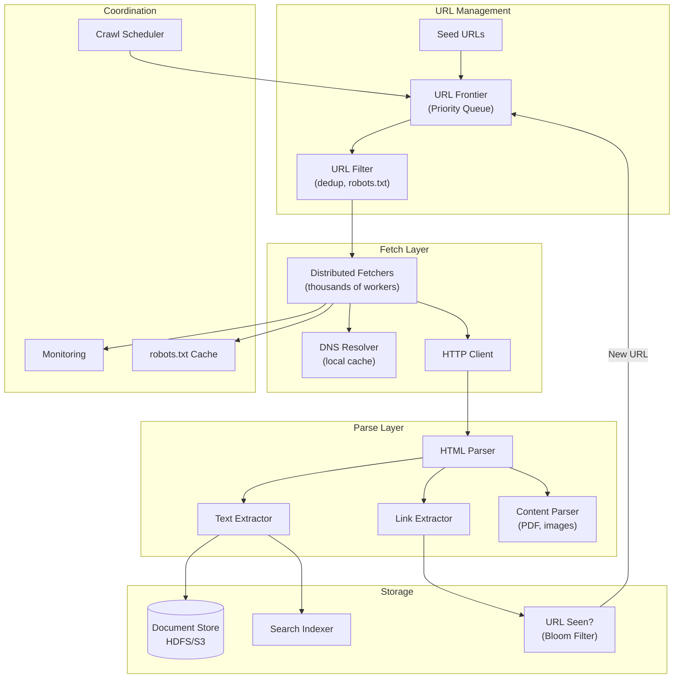
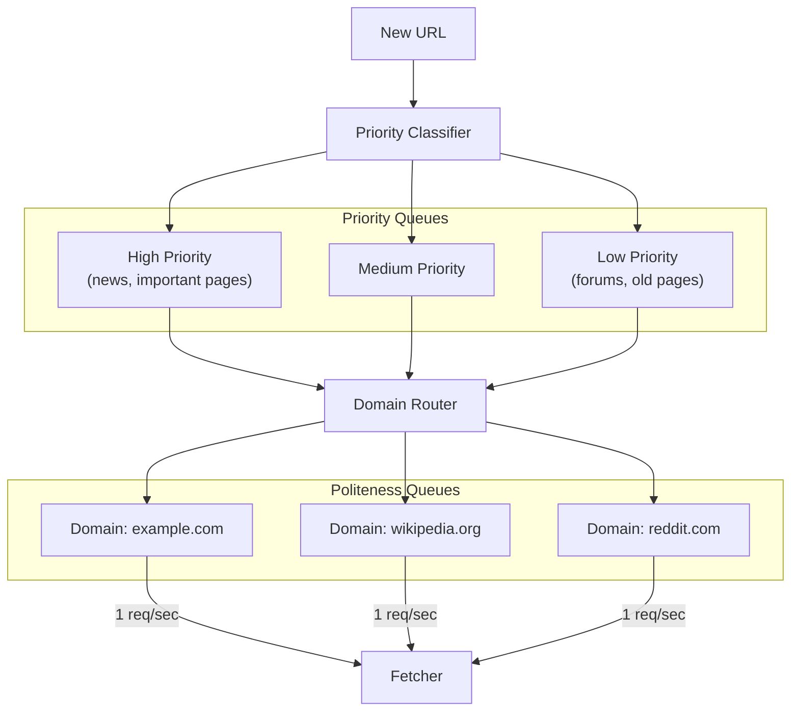
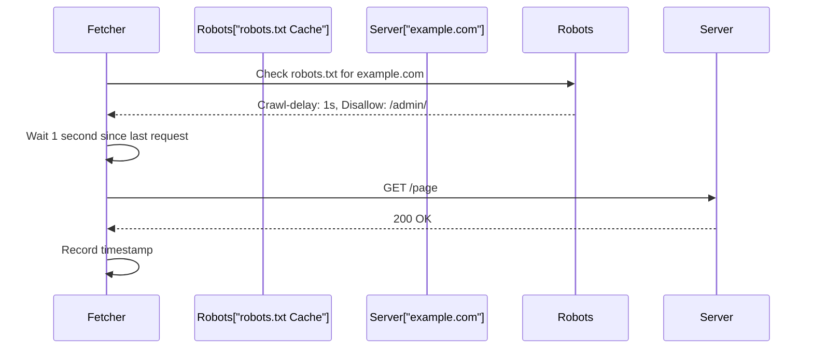
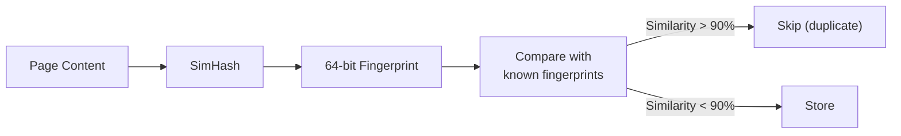
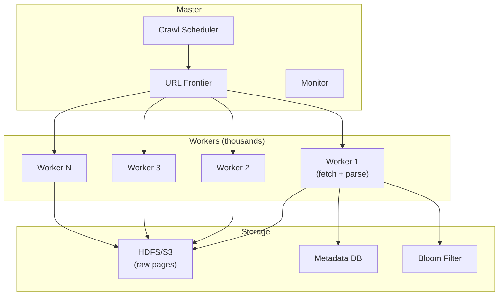

# Design a Web Crawler

## Overview

A web crawler (also called a spider or bot) systematically browses the web to discover and download pages for indexing. Google's crawler (Googlebot) discovers billions of pages. The key challenges are politeness (not overwhelming servers), deduplication, URL frontier management, and distributed coordination.

## Requirements

### Functional
- Crawl billions of web pages starting from seed URLs
- Parse HTML to extract text, links, and metadata
- Respect robots.txt and crawl rate limits
- Handle different content types (HTML, PDF, images)
- Detect and skip duplicate/near-duplicate content
- Re-crawl pages based on change frequency

### Non-Functional
- **Scale**: Billions of pages, ~1 billion pages in the initial crawl
- **Politeness**: Respect per-domain rate limits (1 request/second per domain)
- **Freshness**: Re-crawl important pages frequently
- **Robustness**: Handle malformed HTML, timeouts, server errors
- **Distributed**: Run across thousands of machines
- **Storage**: Petabytes of crawled content

## Architecture



## Deep Dive: URL Frontier

The URL frontier is a priority queue that determines which URLs to crawl next.



**URL frontier design:**
1. **Priority queues**: Rank URLs by importance (PageRank, freshness, domain authority)
2. **Politeness queues**: One queue per domain, rate-limited (1 request/second)
3. **Back queue**: Persistent storage for URLs to crawl later
4. **Seen filter**: Bloom filter to avoid re-adding known URLs

## Deep Dive: Politeness



**Politeness rules:**
- Fetch and cache `robots.txt` per domain (re-fetch every 24h)
- Respect `Crawl-delay` directive
- Limit to 1 concurrent request per domain
- Back off on 429 (Too Many Requests) and 503 (Service Unavailable)
- Exponential backoff on errors

## Deep Dive: Deduplication

### URL Deduplication
- **Bloom filter**: Probabilistic data structure to check if a URL was seen before
- Space-efficient: 1 billion URLs with 1% false positive rate ≈ 1.2 GB
- Used as a first pass; confirmed with a persistent store

### Content Deduplication
- **SimHash / MinHash**: Generate fingerprints of page content
- Compare fingerprints to detect near-duplicate pages
- Threshold: pages with >90% similarity are considered duplicates



## Deep Dive: Distributed Architecture



**Distribution strategy:**
- URL frontier is partitioned by domain hash
- Each worker pulls URLs from its partition
- Workers are stateless (all state in frontier and storage)
- Failed URLs are retried with exponential backoff

## Handling Challenges

### JavaScript-Rendered Pages
- Use headless Chromium (Puppeteer/Playwright) for SPAs
- Expensive: ~10x slower than simple HTTP fetch
- Only used for known JS-heavy sites

### Traps and Spam
- **Spider traps**: URLs that generate infinite pages (calendar pages, session IDs in URLs)
- **Detection**: URL depth limit, duplicate content detection
- **Malware**: Don't execute downloaded JavaScript

### Politeness vs Coverage Trade-off
- More aggressive crawling = more pages discovered
- But risks being blocked by servers
- Solution: dynamic rate adjustment based on server response times

## Storage Estimates

```
Pages to crawl: 1 billion
Average page size: 100 KB (compressed)
Raw storage: 1B × 100 KB = 100 TB
Metadata (URLs, timestamps, hashes): ~10 TB
Total: ~110 TB (replicated 3x = 330 TB)
```

## Trade-Offs

| Decision | Benefit | Cost |
|----------|---------|------|
| Bloom filter for URL dedup | Memory-efficient | False positives (tunable) |
| BFS vs DFS crawling | Better coverage of important pages | May miss deep pages |
| Headless browser for JS | Captures SPA content | 10x slower, resource-intensive |
| SimHash for content dedup | Detects near-duplicates | Computation overhead |
| Distributed frontier | Scales horizontally | Coordination complexity |

## Interview Tips

1. **Start with scale** — billions of pages, petabytes of data
2. **Explain the URL frontier** — priority queues + politeness queues
3. **Discuss politeness** — robots.txt, rate limiting, exponential backoff
4. **Mention deduplication** — Bloom filter for URLs, SimHash for content
5. **Talk about distribution** — partition by domain, stateless workers
6. **Don't forget challenges** — JS rendering, spider traps, re-crawl scheduling
7. **Estimate storage** — 1B pages × 100KB = 100TB raw

## Key Takeaways

- URL frontier uses priority queues (by importance) and politeness queues (by domain) to manage crawling order.
- Politeness: respect robots.txt, limit to 1 request/second per domain, exponential backoff on errors.
- Deduplication: Bloom filter for URLs (space-efficient), SimHash for content (near-duplicate detection).
- Distributed architecture: partition frontier by domain, stateless workers, master coordinates.
- JavaScript-rendered pages require headless browsers (expensive, used selectively).
- Re-crawl scheduling based on page change frequency and importance.
- Storage: ~100TB raw for 1B pages, replicated 3x for durability.

## Cross-References

- [Search Engine](./search.md)
- [Distributed File System](./dfs.md)
- [BFS / Graph Traversal](../coding/patterns.md)
- [Robots.txt & Ethics](./hld/security-design.md)
- [Object Storage](../../storage/object-storage.md)

