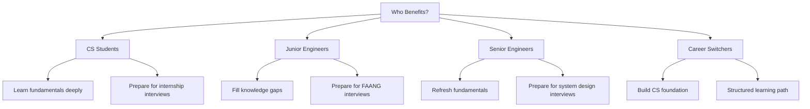

# Placement Preparation Knowledge Base

Welcome to the most comprehensive placement preparation resource for Software Engineering interviews.

## What This Covers

This knowledge base is designed to be an encyclopedia-quality resource covering every major topic you'll encounter in software engineering interviews:

| Domain | Topics | Depth |
|--------|--------|-------|
| **Operating Systems** | Processes, threads, scheduling, memory management, file systems, synchronization | University-level |
| **Database Management Systems** | SQL, normalization, transactions, indexing, query optimization, distributed databases | Production-level |
| **Computer Networks** | OSI model, TCP/IP, HTTP, DNS, routing, security, modern protocols | Network engineer-level |
| **Computer Architecture** | CPU design, pipelining, cache hierarchy, memory systems, modern architectures | Hardware interview-level |
| **Distributed Systems** | Consensus, replication, partitioning, MapReduce, messaging | FAANG system design-level |
| **Storage Systems** | HDD, SSD, NVMe, distributed storage | Infrastructure engineer-level |
| **Concurrency** | Threads, locks, lock-free algorithms, async programming | Senior engineer-level |
| **Cloud & DevOps** | Virtualization, AWS, Kubernetes, CI/CD | Production operations-level |
| **Backend Engineering** | API design, messaging, containers, observability, auth | Full-stack backend-level |
| **Interview Preparation** | System design, coding patterns, behavioral questions, company-specific topics | Interview-ready |

## Who This Is For



## How to Use This Book

### 1. Learning Path (First Read)

If you're learning these topics for the first time, follow this order:

| Phase | Topics | Duration |
|-------|--------|----------|
| **Foundation** | OS fundamentals, Networks basics, Architecture basics | 2-3 weeks |
| **Core** | DBMS, Concurrency, OS advanced topics | 2-3 weeks |
| **Advanced** | Distributed Systems, Storage Systems, Cloud & DevOps | 2-3 weeks |
| **Interview Prep** | System Design, Coding Patterns, Behavioral | 2-3 weeks |

### 2. Revision Path (Before Interviews)

Use the cheat sheets and revision notes for quick review:

- **[Revision Notes](./revision/os.md)** — One-page summaries of every topic
- **Interview Questions** — Each topic includes questions at multiple difficulty levels
- **Quick Reference Tables** — Comparison tables for rapid recall

### 3. Reference Path (During Work)

Look up specific topics as needed:

- Each page is self-contained with cross-references
- Use the search functionality to find specific concepts
- Follow cross-references to related topics

## Structure of Each Page

Every concept page follows a consistent structure:

```
┌─────────────────────────────────────┐
│  1. Overview & Motivation           │
│     Why does this matter?           │
├─────────────────────────────────────┤
│  2. Core Concepts                   │
│     Detailed explanation with       │
│     diagrams and examples           │
├─────────────────────────────────────┤
│  3. Visual Diagrams                 │
│     Mermaid diagrams, ASCII art,    │
│     and comparison tables           │
├─────────────────────────────────────┤
│  4. Real-World Examples             │
│     Linux, production systems,      │
│     and industry practices          │
├─────────────────────────────────────┤
│  5. Interview Questions             │
│     Beginner → FAANG-level          │
│     With detailed answers           │
├─────────────────────────────────────┤
│  6. Common Mistakes                 │
│     Pitfalls and misconceptions     │
├─────────────────────────────────────┤
│  7. Cross References                │
│     Links to related topics         │
├─────────────────────────────────────┤
│  8. References                      │
│     Books, papers, official docs    │
└─────────────────────────────────────┘
```

## Difficulty Levels

Content is tagged by difficulty:

| Level | Target Audience | Examples |
|-------|----------------|----------|
| 🟢 **Beginner** | CS students, career switchers | What is a process? What is TCP? |
| 🟡 **Intermediate** | Junior engineers | How does virtual memory work? Explain TCP handshake |
| 🔴 **Advanced** | Senior engineers, FAANG interviews | Design a distributed cache, explain Raft consensus |
| ⚫ **Expert** | Staff+ engineers, research | Byzantine fault tolerance, CRDTs, formal verification |

## Interview Preparation Strategy

### For Coding Interviews

1. Study the [Coding Patterns](./interview/coding/README.md) section
2. Practice on LeetCode using the patterns
3. Focus on time/space complexity analysis
4. Practice explaining your thought process aloud

### For System Design Interviews

1. Study the [System Design](./interview/system-design/README.md) section
2. Learn the building blocks (databases, caches, queues, load balancers)
3. Practice with real-world systems (URL shortener, Twitter, Netflix)
4. Focus on trade-off analysis, not just the "right" answer

### For Behavioral Interviews

1. Prepare 8-10 stories using the [STAR Method](./interview/behavioral/README.md)
2. Tailor stories to the company's values (Amazon LPs, Googleyness)
3. Quantify your impact with specific numbers
4. Practice aloud — silent rehearsal doesn't build fluency

### For OS/Network/DBMS Fundamentals

1. Read each section sequentially for deep understanding
2. Focus on "why" not just "what" — interviewers test understanding
3. Connect concepts to real-world systems (Linux kernel, PostgreSQL, etc.)
4. Review the interview questions at the end of each topic

## Contributing

This is a living knowledge base. Content is continuously researched, verified, and expanded.

## Topics at a Glance

```mermaid
graph TD
    ROOT[Placement Prep] --> OS[Operating Systems]
    ROOT --> DB[Database Management]
    ROOT --> NET[Computer Networks]
    ROOT --> ARCH[Computer Architecture]
    ROOT --> DIST[Distributed Systems]
    ROOT --> CONC[Concurrency]
    ROOT --> CLOUD[Cloud & DevOps]
    ROOT --> BE[Backend Engineering]
    ROOT --> INT[Interview Prep]

    OS --> OS1[Processes & Threads]
    OS --> OS2[Memory Management]
    OS --> OS3[File Systems]
    OS --> OS4[I/O Systems]
    OS --> OS5[Synchronization]

    DB --> DB1[SQL & Normalization]
    DB --> DB2[Transactions & ACID]
    DB --> DB3[Indexing & B-Trees]
    DB --> DB4[Distributed Databases]

    NET --> NET1[OSI & TCP/IP]
    NET --> NET2[HTTP & DNS]
    NET --> NET3[Security & TLS]
    NET --> NET4[Modern Protocols]

    DIST --> DIST1[CAP & Consensus]
    DIST --> DIST2[Replication]
    DIST --> DIST3[MapReduce]
    DIST --> DIST4[Messaging]

    INT --> INT1[System Design]
    INT --> INT2[Coding Patterns]
    INT --> INT3[Behavioral]
    INT --> INT4[Company-Specific]
```



## Quick Links

| If You Need... | Go To |
|----------------|-------|
| Quick revision before interview | [Revision Notes](./revision/os.md) |
| System design practice | [System Design](./interview/system-design/README.md) |
| Behavioral interview prep | [Behavioral](./interview/behavioral/README.md) |
| Company-specific tips | [Companies](./interview/companies/README.md) |
| OS fundamentals | [Operating Systems](./os/overview.md) |
| Database internals | [DBMS](./dbms/overview.md) |
| Network protocols | [Networks](./networks/overview.md) |
| Distributed systems | [Distributed Systems](./distributed/overview.md) |
