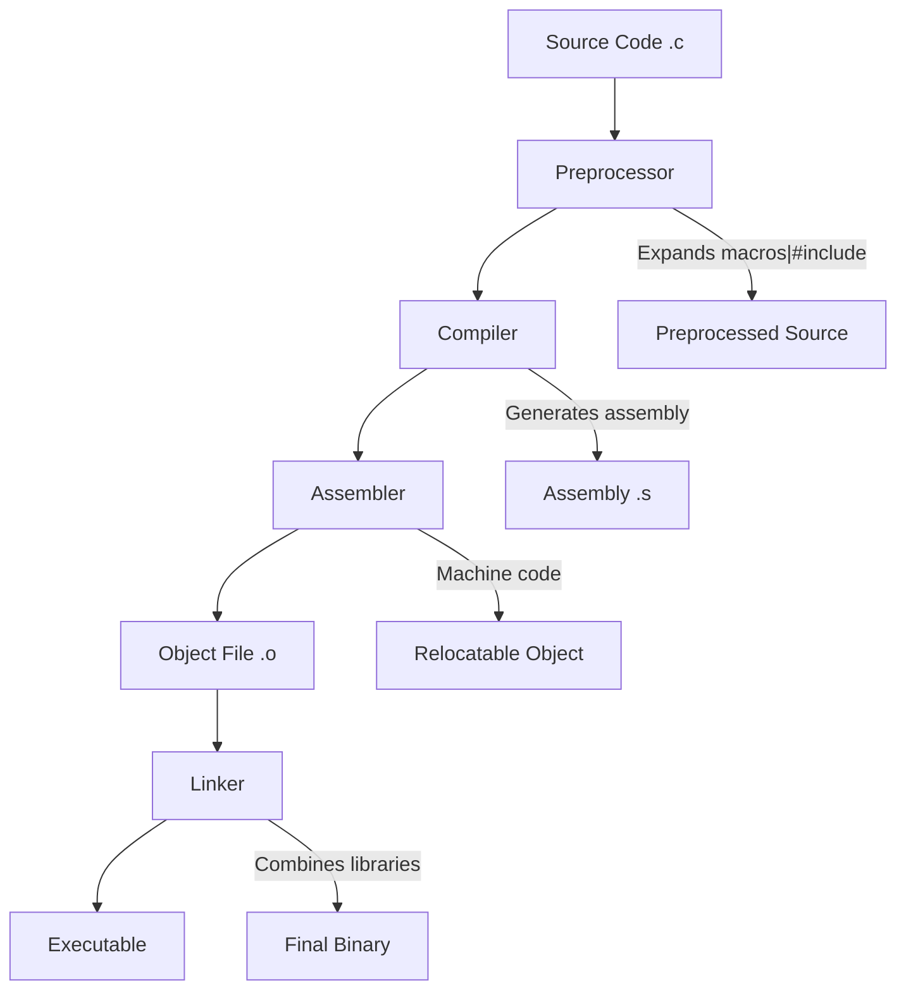

# C Programming Language

## Overview

C is a general-purpose, procedural programming language created by **Dennis Ritchie** at **Bell Labs** in **1972**. Originally developed to rewrite the Unix operating system, C has become one of the most influential and widely-used programming languages in history.

C is often called the "mother of all languages" because many modern languages — C++, Java, Python, Go, Rust — borrow syntax, semantics, or both from C. Understanding C is foundational to understanding how computers actually work.

## History and Evolution

| Year | Milestone | Significance |
|------|-----------|--------------|
| 1972 | C created at Bell Labs | Dennis Ritchie develops C for Unix development |
| 1978 | K&R C ("The C Programming Language") | First informal specification by Kernighan & Ritchie |
| 1989 | ANSI C (C89/C90) | First standardized version (ANSI X3.159-1989) |
| 1999 | C99 | Added `long long`, inline functions, variable-length arrays, `//` comments |
| 2011 | C11 | Added `_Generic`, `_Atomic`, `_Static_assert`, threads support |
| 2018 | C17 | Bug fix release of C11 |
| 2023 | C23 | Added `nullptr`, `constexpr`, `typeof`, binary literals, `#embed` |

## Why C Matters for Interviews

### 1. Tests Fundamental Understanding

C forces you to understand what happens "under the hood":

- **Memory management** — You allocate and free memory manually
- **Pointers** — Direct memory address manipulation
- **No garbage collector** — You are responsible for every byte
- **No runtime type checking** — Type safety is your job

### 2. Reveals Problem-Solving Depth

Interviewers use C questions to assess:

- Can you reason about memory layout?
- Do you understand stack vs. heap?
- Can you debug pointer-related bugs?
- Do you know what undefined behavior looks like?

### 3. Universal Relevance

C knowledge transfers directly to:

- **Systems programming** — OS kernels, device drivers, embedded systems
- **Performance-critical code** — Game engines, databases, compilers
- **Other languages** — Understanding C helps with C++, Rust, Go
- **Interview questions** — Many coding rounds allow or prefer C

## C vs. Other Languages

| Feature | C | C++ | Java | Python |
|---------|---|-----|------|--------|
| Memory Management | Manual | Manual (RAII) | Garbage Collected | Garbage Collected |
| Pointers | Yes | Yes | No (references) | No |
| OOP Support | No | Yes | Yes | Yes |
| Performance | Excellent | Excellent | Good | Slow |
| Abstraction Level | Low | Medium-High | Medium | High |
| Standard Library | Minimal | Extensive (STL) | Extensive | Extensive |
| Compilation | Compiled | Compiled | Compiled to bytecode | Interpreted |

## Core Features of C

### Procedural Programming

C follows a procedural paradigm — programs are structured as sequences of imperative statements organized into functions:

```c
#include <stdio.h>

// Functions are the primary unit of abstraction
int factorial(int n) {
    if (n <= 1) return 1;
    return n * factorial(n - 1);
}

int main() {
    int result = factorial(5);
    printf("5! = %d\n", result);  // Output: 5! = 120
    return 0;
}
```

### Static Typing

All variables must be declared with their type before use. Types are checked at compile time:

```c
int x = 42;          // Integer
double pi = 3.14159; // Floating-point
char c = 'A';        // Single character
char *str = "hello"; // String (pointer to char)
```

### Low-Level Access

C provides direct access to memory through pointers and allows inline assembly:

```c
#include <stdio.h>

int main() {
    int x = 10;
    int *p = &x;        // Get address of x
    
    printf("Value: %d\n", *p);     // Dereference: 10
    printf("Address: %p\n", (void*)p);  // Memory address
    
    // Modify x through pointer
    *p = 20;
    printf("New value: %d\n", x);  // 20
    
    return 0;
}
```

### Minimal Runtime

C has a very small runtime library. The language itself provides:

- Basic data types (`int`, `char`, `float`, `double`, `void`)
- Operators (arithmetic, bitwise, logical, relational)
- Control flow (`if/else`, `for`, `while`, `switch`, `goto`)
- Functions (no methods, no classes)
- Pointers (the heart of C)
- Structures and unions
- Preprocessor directives

## The C Compilation Pipeline



## Key Interview Topics in C

1. **Pointers and Arrays** — The most frequently tested topic
2. **Memory Management** — malloc, free, memory leaks
3. **String Manipulation** — Null-terminated strings, buffer overflows
4. **Data Structures** — Linked lists, trees, hash tables in C
5. **Bit Manipulation** — Bitwise operators, flags, masking
6. **Storage Classes** — `auto`, `static`, `extern`, `register`
7. **Undefined Behavior** — What NOT to do in C
8. **Preprocessor** — Macros, conditional compilation, include guards

## Common Mistakes Beginners Make

1. **Forgetting to free dynamically allocated memory** — causes memory leaks
2. **Using dangling pointers** — accessing memory after it's freed
3. **Buffer overflows** — writing past array boundaries
4. **Confusing `=` with `==`** — assignment vs. comparison
5. **Not checking `malloc` return value** — could be NULL
6. **Using `scanf` unsafely** — buffer overflows with strings
7. **Forgetting the null terminator** — strings must end with `\0`
8. **Integer overflow** — signed integer overflow is undefined behavior

## Related Topics

- [Memory Management](./memory-management.md) — Deep dive into C memory handling
- [Pointers](./pointers.md) — Comprehensive pointer guide
- [Undefined Behavior](./undefined-behavior.md) — Common pitfalls and how to avoid them
- [Compilation](./compilation.md) — How C programs are built
- [POSIX](./posix.md) — System-level C programming
- [Performance](./performance.md) — Writing efficient C code
- [Interview Questions](./interview-questions.md) — Practice problems

## Interview Questions Preview

1. What is the difference between `malloc` and `calloc`?
2. Explain the difference between `char *s = "hello"` and `char s[] = "hello"`.
3. What is a dangling pointer? How do you avoid it?
4. What does `volatile` mean in C?
5. Explain the difference between `struct` and `union`.

See the full list in [Interview Questions](./interview-questions.md).
