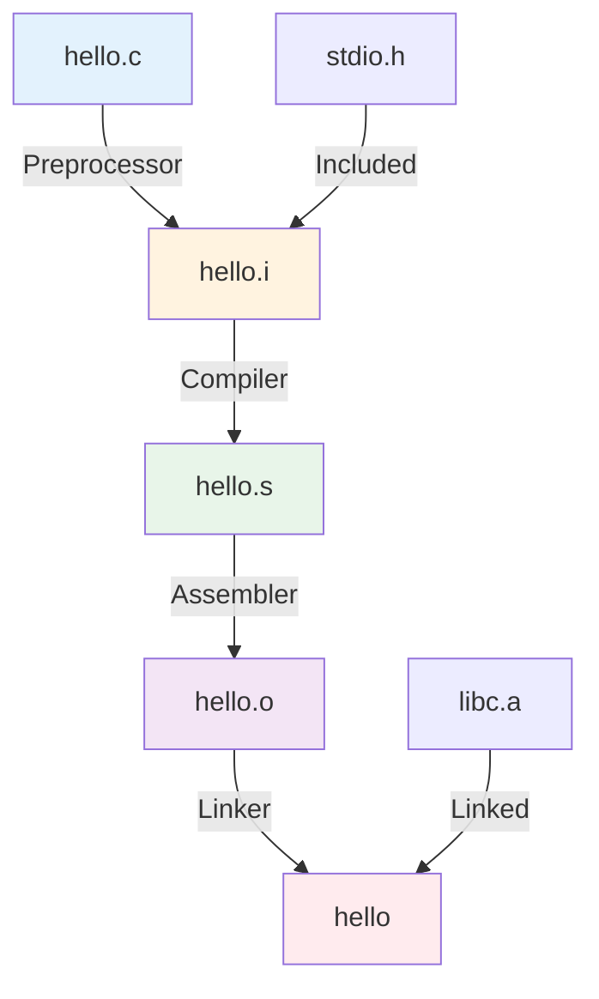
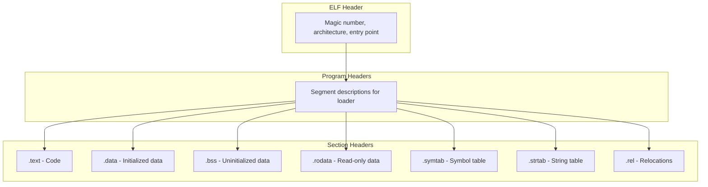
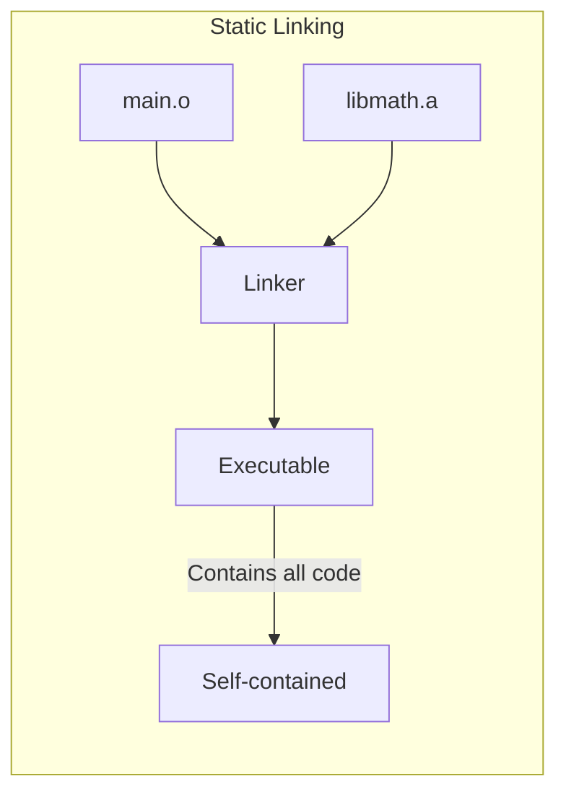
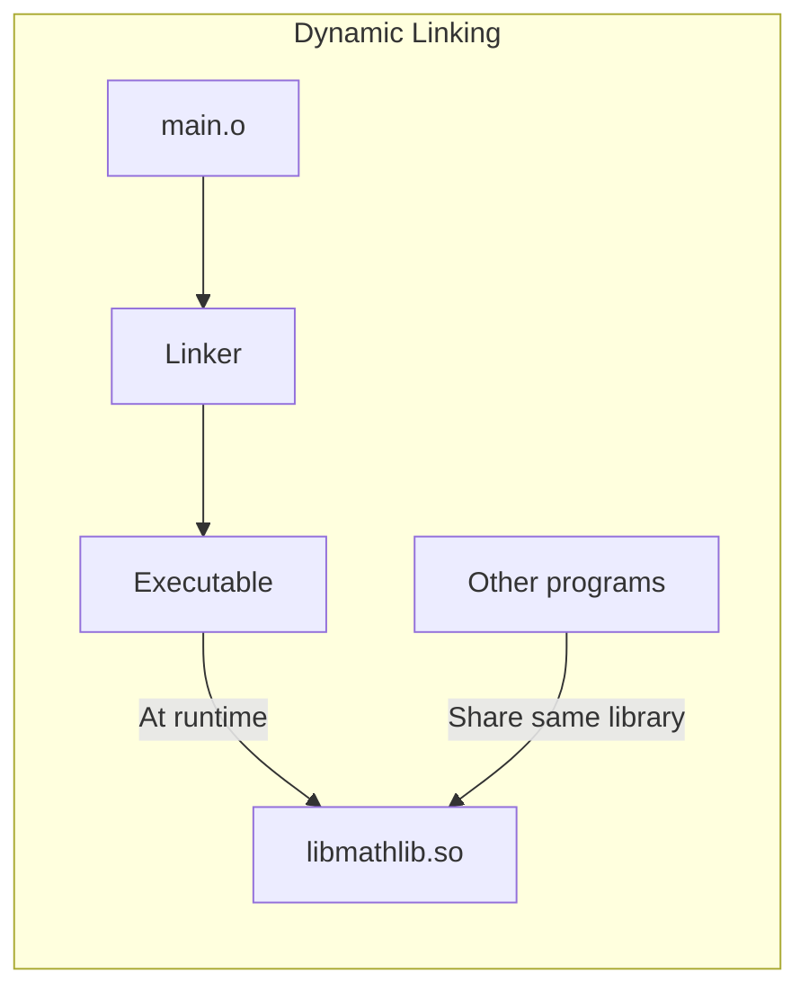

# C Compilation Pipeline

## Overview

Understanding how a C program goes from source code to executable is essential for debugging, optimizing, and writing correct code. The compilation process involves multiple stages, each transforming the code into a lower-level representation.

Modern compilers like GCC and Clang perform this process in four main stages: **preprocessing**, **compilation**, **assembly**, and **linking**.

## The Four Stages



### Stage 1: Preprocessing

The preprocessor handles directives starting with `#`:

```bash
# Run only the preprocessor
gcc -E hello.c -o hello.i
```

```c
// hello.c
#include <stdio.h>
#define MAX_SIZE 100
#define SQUARE(x) ((x) * (x))

#ifdef DEBUG
    #define LOG(msg) printf("DEBUG: %s\n", msg)
#else
    #define LOG(msg)
#endif

int main() {
    int arr[MAX_SIZE];
    int result = SQUARE(5);
    LOG("Starting program");
    printf("Result: %d\n", result);
    return 0;
}
```

After preprocessing, the output (`hello.i`) contains:

```c
// Thousands of lines from stdio.h are inserted here
// ...
int main() {
    int arr[100];           // MAX_SIZE replaced
    int result = ((5) * (5));  // SQUARE macro expanded
    // LOG line removed (DEBUG not defined)
    printf("Result: %d\n", result);
    return 0;
}
```

### Preprocessor Directives

| Directive | Purpose | Example |
|-----------|---------|---------|
| `#include` | Insert file contents | `#include <stdio.h>` |
| `#define` | Define macro | `#define PI 3.14159` |
| `#undef` | Undefine macro | `#undef PI` |
| `#ifdef` | Conditional: if defined | `#ifdef DEBUG` |
| `#ifndef` | Conditional: if not defined | `#ifndef HEADER_H` |
| `#if` | Conditional expression | `#if VERSION > 2` |
| `#elif` | Else if | `#elif defined(LINUX)` |
| `#else` | Else | `#else` |
| `#endif` | End conditional | `#endif` |
| `#pragma` | Compiler-specific instructions | `#pragma once` |
| `#error` | Generate error | `#error "Not supported"` |
| `#warning` | Generate warning | `#warning "Deprecated"` |

### Macro Pitfalls

```c
// DANGEROUS: Macro with side effects
#define SQUARE(x) ((x) * (x))

int a = 5;
int b = SQUARE(a++);  // Expands to ((a++) * (a++))
// a is incremented TWICE — undefined behavior!

// FIX: Use inline function instead
static inline int square(int x) {
    return x * x;
}

// DANGEROUS: Missing parentheses
#define DOUBLE(x) x + x
int c = 2 * DOUBLE(3);  // Expands to 2 * 3 + 3 = 9, not 12!

// FIX: Always parenthesize macro parameters and result
#define DOUBLE_SAFE(x) ((x) + (x))
```

### Stage 2: Compilation

The compiler translates preprocessed C code into assembly language:

```bash
# Run only compilation (to assembly)
gcc -S hello.i -o hello.s
```

```asm
; hello.s (x86-64 assembly, simplified)
    .section    __TEXT,__text
    .globl  _main
_main:
    pushq   %rbp
    movq    %rsp, %rbp
    subq    $416, %rsp
    leaq    L_.str(%rip), %rdi
    movl    $25, %esi
    callq   _printf
    xorl    %eax, %eax
    popq    %rbp
    retq

    .section    __TEXT,__cstring
L_.str:
    .asciz  "Result: %d\n"
```

### Compiler Optimizations

```bash
# Optimization levels
gcc -O0 hello.c -o hello_O0    # No optimization (default, debug-friendly)
gcc -O1 hello.c -o hello_O1    # Basic optimizations
gcc -O2 hello.c -o hello_O2    # More optimizations (recommended for production)
gcc -O3 hello.c -o hello_O3    # Aggressive optimizations (may increase code size)
gcc -Os hello.c -o hello_Os    # Optimize for size
gcc -Ofast hello.c -o hello_Ofast  # Fastest (may break IEEE compliance)
```

| Level | Description | Use Case |
|-------|-------------|----------|
| `-O0` | No optimization | Debugging |
| `-O1` | Basic optimizations | General development |
| `-O2` | Recommended optimizations | Production builds |
| `-O3` | Aggressive (vectorization, inlining) | Performance-critical code |
| `-Os` | Size optimization | Embedded systems |
| `-Ofast` | Fastest (may break standards) | Benchmarks, HPC |

### Stage 3: Assembly

The assembler converts assembly code into machine code (object files):

```bash
# Run only assembly
gcc -c hello.s -o hello.o
```

### Object File Format (ELF on Linux)

```bash
# Examine object file
gcc -c hello.c
file hello.o
# hello.o: ELF 64-bit LSB relocatable, x86-64

# View sections
objdump -h hello.o
# Sections:
#   .text     — executable code
#   .data     — initialized global variables
#   .bss      — uninitialized global variables
#   .rodata   — read-only data (string literals)
#   .symtab   — symbol table
#   .rel.text — relocation entries

# View symbols
nm hello.o
# 0000000000000000 T main
#                  U printf

# View disassembly
objdump -d hello.o
```

### ELF File Structure



### Stage 4: Linking

The linker combines object files and libraries into a final executable:

```bash
# Link object files
gcc hello.o -o hello

# Link with libraries
gcc hello.o -lm -lpthread -o hello
```

### What the Linker Does

1. **Symbol Resolution** — Matches function/variable references to definitions
2. **Relocation** — Adjusts addresses for the final memory layout
3. **Library Linking** — Includes code from static/shared libraries

```c
// main.c
extern int add(int a, int b);  // Defined elsewhere
int result = add(3, 4);         // Reference to 'add'

// math.c
int add(int a, int b) {         // Definition of 'add'
    return a + b;
}

// Linker resolves: main.c's reference to add → math.c's definition
```

## Static vs Dynamic Linking

### Static Linking

Library code is copied into the executable at link time:

```bash
# Create static library
gcc -c mathlib.c -o mathlib.o
ar rcs libmathlib.a mathlib.o

# Link statically
gcc main.c -L. -lmathlib -static -o main_static
```



### Dynamic Linking

Library code is loaded at runtime:

```bash
# Create shared library
gcc -shared -fPIC -o libmathlib.so mathlib.c

# Link dynamically (default)
gcc main.c -L. -lmathlib -o main_dynamic

# Run (need to set library path)
export LD_LIBRARY_PATH=.:$LD_LIBRARY_PATH
./main_dynamic
```



### Comparison Table

| Aspect | Static | Dynamic |
|--------|--------|---------|
| File size | Larger | Smaller |
| Deployment | Single file | Need libraries |
| Updates | Recompile needed | Replace .so file |
| Memory usage | Each process has copy | Shared in memory |
| Load time | Faster | Slower (linking at load) |
| Compatibility | Self-contained | ABI compatibility needed |

## Include Guards

Prevent multiple inclusion of header files:

```c
// myheader.h
#ifndef MYHEADER_H
#define MYHEADER_H

// Header contents here
typedef struct {
    int x, y;
} Point;

Point make_point(int x, int y);

#endif // MYHEADER_H

// Modern alternative (non-standard but widely supported)
#pragma once
```

## Conditional Compilation

```c
// Platform-specific code
#ifdef _WIN32
    #include <windows.h>
    void sleep_ms(int ms) { Sleep(ms); }
#elif defined(__linux__)
    #include <unistd.h>
    void sleep_ms(int ms) { usleep(ms * 1000); }
#elif defined(__APPLE__)
    #include <unistd.h>
    void sleep_ms(int ms) { usleep(ms * 1000); }
#else
    #error "Unsupported platform"
#endif

// Debug vs Release
#ifdef NDEBUG
    #define DEBUG_LOG(msg)
#else
    #define DEBUG_LOG(msg) fprintf(stderr, "[DEBUG] %s:%d: %s\n", \
                                   __FILE__, __LINE__, msg)
#endif

// Feature flags
#if FEATURE_LEVEL >= 2
    void advanced_feature(void);
#endif
```

## Build Systems

### Makefile

```makefile
CC = gcc
CFLAGS = -Wall -Wextra -O2
LDFLAGS = -lm

SRCS = main.c utils.c math.c
OBJS = $(SRCS:.c=.o)
TARGET = program

all: $(TARGET)

$(TARGET): $(OBJS)
	$(CC) $(OBJS) $(LDFLAGS) -o $@

%.o: %.c
	$(CC) $(CFLAGS) -c $< -o $@

clean:
	rm -f $(OBJS) $(TARGET)

.PHONY: all clean
```

### CMake

```cmake
cmake_minimum_required(VERSION 3.10)
project(MyProject C)

set(CMAKE_C_STANDARD 11)
set(CMAKE_C_FLAGS "-Wall -Wextra -O2")

add_executable(program main.c utils.c math.c)
target_link_libraries(program m)
```

## Common Mistakes

| Mistake | Consequence | Fix |
|---------|-------------|-----|
| Missing include guard | Multiple definition errors | Use `#ifndef`/`#define`/`#endif` |
| Macro side effects | Undefined behavior | Use inline functions |
| Forgetting `-lm` | Linker error for math functions | Add `-lm` to link flags |
| Circular `#include` | Infinite recursion | Forward declarations |
| Mixing `-O0` and `-O3` code | Subtle bugs | Consistent build flags |
| Not using `-Wall -Wextra` | Missed warnings | Always enable warnings |

## Interview Questions

1. **What are the stages of C compilation?**
   - Preprocessing, compilation, assembly, linking.

2. **What is the difference between static and dynamic linking?**
   - Static links code into executable at build time. Dynamic loads libraries at runtime.

3. **What is an object file?**
   - Contains machine code and metadata (symbols, relocations) but isn't yet a complete executable.

4. **What does the preprocessor do?**
   - Handles `#include`, `#define`, `#ifdef` etc. Text substitution before compilation.

5. **What is a linker and what does it do?**
   - Combines object files, resolves symbols, and produces the final executable.

## Related Topics

- [Performance](./performance.md) — How compilation flags affect performance
- [POSIX](./posix.md) — System calls and linking with POSIX libraries
- [Undefined Behavior](./undefined-behavior.md) — How compilers exploit UB for optimization
