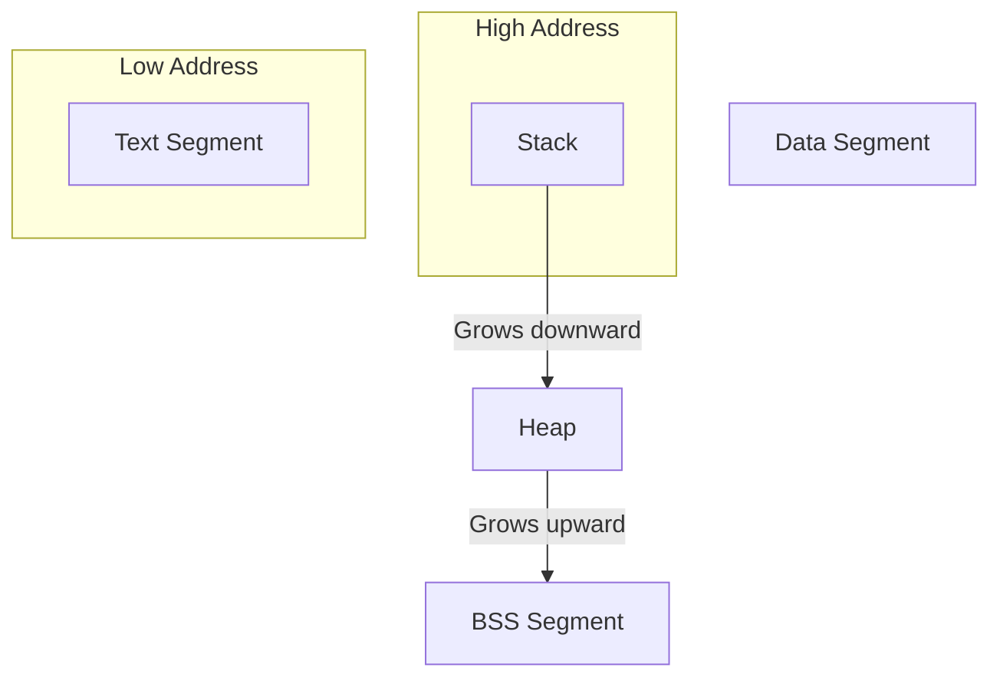
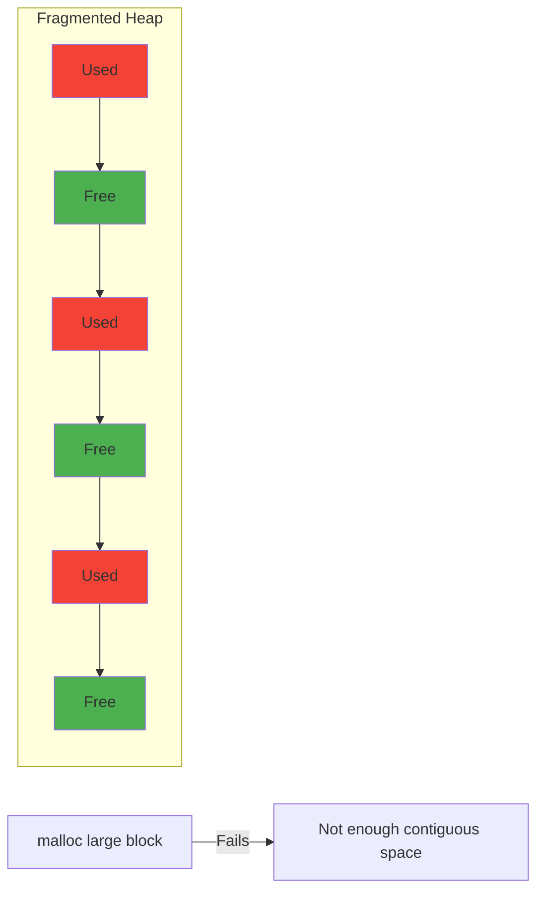
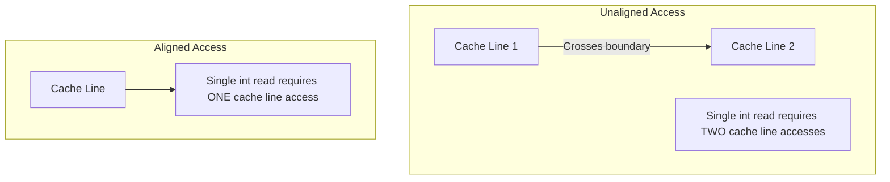

# Memory Management in C

## Overview

Memory management is one of the most critical skills for any C programmer. Unlike languages with garbage collectors (Java, Python, Go), C requires you to manually allocate, use, and free memory. This gives you maximum control and performance but also maximum responsibility.

Understanding memory management is essential for interviews because it demonstrates:
- How well you understand computer architecture
- Whether you can write safe, leak-free code
- Your ability to reason about program state and lifetimes

## Memory Layout of a C Program

When a C program runs, its memory is organized into distinct segments:



| Segment | Contents | Managed By | Lifetime |
|---------|----------|------------|----------|
| **Text** | Executable code (read-only) | OS | Entire program |
| **Data** | Initialized global/static variables | OS | Entire program |
| **BSS** | Uninitialized global/static variables | OS | Entire program |
| **Heap** | Dynamically allocated memory | Programmer | Until `free()` |
| **Stack** | Local variables, function parameters, return addresses | Compiler/Runtime | Function scope |

## The Stack

The stack is a LIFO (Last In, First Out) data structure managed automatically by the compiler:

```c
#include <stdio.h>

void function_b() {
    int z = 30;  // Pushed onto stack
    printf("z = %d at %p\n", z, (void*)&z);
}  // z is popped off the stack

void function_a() {
    int y = 20;  // Pushed onto stack
    printf("y = %d at %p\n", y, (void*)&y);
    function_b();
}  // y is popped off the stack

int main() {
    int x = 10;  // Pushed onto stack
    printf("x = %d at %p\n", x, (void*)&x);
    function_a();
    return 0;
}
// Notice: stack addresses decrease as functions nest deeper
```

### Stack Characteristics

- **Fast allocation** — Just moves the stack pointer
- **Automatic deallocation** — Variables destroyed when function returns
- **Limited size** — Typically 1-8 MB (can cause stack overflow)
- **No fragmentation** — Always contiguous

### Stack Overflow

```c
// DANGER: Infinite recursion causes stack overflow
void infinite_recursion() {
    int large_array[1000];  // Each call consumes stack space
    infinite_recursion();   // Eventually crashes
}

// DANGER: Large array on stack
void large_stack_allocation() {
    int huge[10000000];  // ~40 MB — will overflow typical stack
}
```

## The Heap

The heap is used for dynamic memory allocation — memory that persists beyond function scope:

```c
#include <stdio.h>
#include <stdlib.h>

int* create_int(int value) {
    int *p = malloc(sizeof(int));  // Allocate on heap
    if (p == NULL) {
        fprintf(stderr, "Allocation failed\n");
        exit(1);
    }
    *p = value;
    return p;  // Safe to return — heap memory persists
}

int main() {
    int *num = create_int(42);
    printf("Value: %d\n", *num);  // 42
    free(num);  // Must free when done
    num = NULL; // Good practice: avoid dangling pointer
    return 0;
}
```

## Dynamic Allocation Functions

### malloc — Memory Allocation

Allocates a block of uninitialized memory:

```c
#include <stdlib.h>

// Allocate space for 10 integers
int *arr = malloc(10 * sizeof(int));

if (arr == NULL) {
    // Handle allocation failure
    perror("malloc failed");
    return -1;
}

// Memory contains garbage values — must initialize
for (int i = 0; i < 10; i++) {
    arr[i] = i * 10;
}

free(arr);
```

### calloc — Contiguous Allocation

Allocates memory and initializes all bytes to zero:

```c
#include <stdlib.h>

// Allocate space for 10 integers, all initialized to 0
int *arr = calloc(10, sizeof(int));

if (arr == NULL) {
    perror("calloc failed");
    return -1;
}

// All values are already 0
printf("arr[0] = %d\n", arr[0]);  // 0
printf("arr[5] = %d\n", arr[5]);  // 0

free(arr);
```

### realloc — Reallocation

Changes the size of a previously allocated block:

```c
#include <stdio.h>
#include <stdlib.h>

int main() {
    // Start with space for 5 integers
    int *arr = malloc(5 * sizeof(int));
    for (int i = 0; i < 5; i++) arr[i] = i;
    
    // Need more space — grow to 10 integers
    int *temp = realloc(arr, 10 * sizeof(int));
    if (temp == NULL) {
        // Original arr is still valid if realloc fails
        free(arr);
        return -1;
    }
    arr = temp;
    
    // Initialize new elements
    for (int i = 5; i < 10; i++) arr[i] = i;
    
    // Can also shrink
    temp = realloc(arr, 3 * sizeof(int));
    if (temp != NULL) arr = temp;
    // Only first 3 elements preserved
    
    free(arr);
    return 0;
}
```

### Comparison Table

| Function | Initializes Memory | Arguments | Use Case |
|----------|-------------------|-----------|----------|
| `malloc` | No (garbage values) | `malloc(size)` | General allocation |
| `calloc` | Yes (all zeros) | `calloc(n, size)` | When zero-init needed |
| `realloc` | Preserves existing | `realloc(ptr, new_size)` | Resizing buffers |

## Memory Leaks

A memory leak occurs when you allocate memory but never free it:

```c
#include <stdlib.h>
#include <string.h>

// Caller-owned: returns heap memory the caller must free
char* create_greeting(const char *name) {
    char *greeting = malloc(100);
    if (greeting == NULL) return NULL;
    sprintf(greeting, "Hello, %s!", name);
    return greeting;
    // Caller must free(greeting)!
}

// LEAK: Overwriting pointer without freeing
void leak_example() {
    char *p = malloc(100);
    p = malloc(200);  // First 100 bytes leaked!
    free(p);           // Only frees second allocation
}

// LEAK: Early return without cleanup
int process_data(int *data, int size) {
    int *buffer = malloc(size * sizeof(int));
    if (buffer == NULL) return -1;
    
    if (size <= 0) {
        return -1;  // LEAK: buffer not freed!
    }
    
    // Process...
    free(buffer);
    return 0;
}

// FIX: Always clean up before returning
int process_data_fixed(int *data, int size) {
    int *buffer = malloc(size * sizeof(int));
    if (buffer == NULL) return -1;
    
    int result = 0;
    if (size <= 0) {
        result = -1;
        goto cleanup;  // Use goto for cleanup
    }
    
    // Process...
    result = 0;

cleanup:
    free(buffer);
    return result;
}
```

## Detecting Memory Leaks with Valgrind

Valgrind is an essential tool for finding memory errors:

```bash
# Compile with debug symbols
gcc -g -o program program.c

# Run with memcheck (default tool)
valgrind --leak-check=full --show-leak-kinds=all ./program

# Common output:
# ==1234== HEAP SUMMARY:
# ==1234==     in use at exit: 100 bytes in 1 blocks
# ==1234==   total heap usage: 2 allocs, 1 frees, 200 bytes allocated
# ==1234== 
# ==1234== 100 bytes in 1 blocks are definitely lost in loss record 1 of 1
# ==1234==    at 0x4C2AB80: malloc (in ...)
# ==1234==    by 0x4005D7: main (program.c:5)
```

### Valgrind Error Types

| Error | Description | Common Cause |
|-------|-------------|--------------|
| **Invalid read/write** | Accessing freed or unallocated memory | Use-after-free, buffer overflow |
| **Definitely lost** | No pointer to the block exists | Memory leak |
| **Indirectly lost** | Lost because parent block was lost | Linked structure leak |
| **Still reachable** | Pointer exists at exit | Missing `free()` before exit |
| **Invalid free** | Calling `free()` on bad pointer | Double free, wrong pointer |

## Common Memory Errors

### 1. Double Free

```c
int *p = malloc(sizeof(int));
free(p);
free(p);  // ERROR: Double free — undefined behavior!

// Fix: Set pointer to NULL after freeing
free(p);
p = NULL;
free(p);  // Safe — free(NULL) is a no-op
```

### 2. Use After Free

```c
int *p = malloc(sizeof(int));
*p = 42;
free(p);
printf("%d\n", *p);  // ERROR: Use after free — undefined behavior!

// Fix: Don't use pointer after freeing
*p = 100;  // Dangling pointer — the memory may be reused
```

### 3. Buffer Overflow

```c
int *arr = malloc(5 * sizeof(int));
for (int i = 0; i <= 5; i++) {  // BUG: should be i < 5
    arr[i] = i;  // ERROR: arr[5] is out of bounds!
}
free(arr);
```

### 4. Freeing Stack Memory

```c
void bad_function() {
    int x = 42;
    int *p = &x;
    free(p);  // ERROR: Cannot free stack memory!
}
```

### 5. Memory Fragmentation



## Memory Alignment

Memory alignment refers to how data is arranged in memory. Most architectures require or prefer data to be aligned to certain boundaries:

```c
#include <stdio.h>
#include <stddef.h>

// Demonstrating alignment
struct Unaligned {
    char a;     // 1 byte + 3 bytes padding
    int b;      // 4 bytes
    char c;     // 1 byte + 3 bytes padding
};  // Total: 12 bytes (not 6!)

struct Aligned {
    int b;      // 4 bytes
    char a;     // 1 byte
    char c;     // 1 byte + 2 bytes padding
};  // Total: 8 bytes

int main() {
    printf("sizeof(Unaligned) = %zu\n", sizeof(struct Unaligned));
    printf("sizeof(Aligned) = %zu\n", sizeof(struct Aligned));
    printf("offsetof(Unaligned, b) = %zu\n", offsetof(struct Unaligned, b));
    return 0;
}
```

### Why Alignment Matters

- **Performance** — Aligned access is faster on most CPUs
- **Correctness** — Some architectures fault on unaligned access
- **Cache efficiency** — Properly aligned data fits better in cache lines



## Best Practices

1. **Always check allocation return values** — `malloc` can return `NULL`
2. **Free memory when done** — Every `malloc` needs a matching `free`
3. **Set pointers to NULL after freeing** — Prevents use-after-free
4. **Use Valgrind regularly** — Catch leaks early in development
5. **Prefer stack allocation when possible** — Faster and automatic cleanup
6. **Keep allocation and deallocation close together** — Easier to reason about
7. **Use `sizeof` on the variable, not the type** — `sizeof(*ptr)` is safer than `sizeof(int)`
8. **Consider `calloc` when zero-initialization matters** — Avoids bugs from garbage values

## Common Mistakes

| Mistake | Consequence | Fix |
|---------|-------------|-----|
| Forgetting `free()` | Memory leak | Use tools like Valgrind |
| Double `free()` | Undefined behavior | Set pointer to NULL after free |
| Use after free | Undefined behavior / security hole | Don't reference freed memory |
| Buffer overflow | Corruption / security hole | Always check bounds |
| Not checking `malloc` return | Crash on NULL dereference | Always check for NULL |
| `sizeof` wrong type | Wrong allocation size | Use `sizeof(*ptr)` pattern |
| Freeing stack memory | Crash | Only free heap memory |
| Casting `malloc` return | Hides missing `#include` | Don't cast in C (OK in C++) |

## Interview Questions

1. **What is the difference between stack and heap memory?**
   - Stack: automatic, fast, limited size, LIFO. Heap: manual, larger, more flexible.

2. **What happens if you `free()` a NULL pointer?**
   - Nothing — `free(NULL)` is defined behavior and is a no-op.

3. **What is a memory leak? How do you detect them?**
   - Memory allocated but never freed. Detect with Valgrind, AddressSanitizer, or custom allocators.

4. **Explain the difference between `malloc`, `calloc`, and `realloc`.**
   - `malloc`: uninitialized, `calloc`: zero-initialized, `realloc`: resize existing block.

5. **What is memory alignment and why does it matter?**
   - Data at addresses that are multiples of the data size. Affects performance and correctness.

## Related Topics

- [Pointers](./pointers.md) — How pointers interact with dynamic memory
- [Undefined Behavior](./undefined-behavior.md) — Memory-related UB cases
- [Performance](./performance.md) — Cache-friendly memory access patterns
- [POSIX](./posix.md) — System-level memory mapping (`mmap`)
