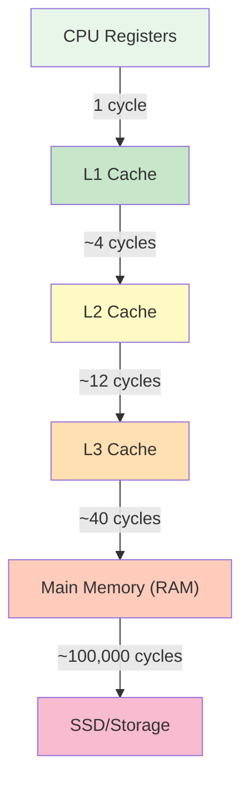

# Performance Optimization in C

## Overview

C is one of the fastest programming languages because it gives you direct control over hardware resources. However, writing fast C code requires understanding how modern CPUs, caches, and memory systems work. This guide covers the key techniques for writing high-performance C code.

Performance optimization is a frequent interview topic because it tests:
- Understanding of computer architecture
- Ability to reason about algorithmic vs. constant factors
- Knowledge of hardware constraints (cache, memory bandwidth, branch prediction)

## Cache-Friendly Code

Modern CPUs have a multi-level cache hierarchy. Accessing data in cache is 10-100x faster than accessing main memory:



### Cache Lines

Data is loaded from memory to cache in fixed-size blocks called **cache lines** (typically 64 bytes):

```c
#include <stdio.h>
#include <stdlib.h>
#include <time.h>

#define SIZE 10000
#define ITERATIONS 1000

// Cache-unfriendly: column-major access of row-major array
int sum_column_major(int matrix[SIZE][SIZE]) {
    int sum = 0;
    for (int j = 0; j < SIZE; j++) {
        for (int i = 0; i < SIZE; i++) {
            sum += matrix[i][j];  // Accesses memory with stride of SIZE
        }
    }
    return sum;
}

// Cache-friendly: row-major access
int sum_row_major(int matrix[SIZE][SIZE]) {
    int sum = 0;
    for (int i = 0; i < SIZE; i++) {
        for (int j = 0; j < SIZE; j++) {
            sum += matrix[i][j];  // Sequential memory access
        }
    }
    return sum;
}

int main() {
    int (*matrix)[SIZE] = malloc(SIZE * sizeof(*matrix));
    
    // Initialize
    for (int i = 0; i < SIZE; i++)
        for (int j = 0; j < SIZE; j++)
            matrix[i][j] = 1;
    
    clock_t start, end;
    
    start = clock();
    int s1 = sum_row_major(matrix);
    end = clock();
    printf("Row-major: %d, Time: %.3f sec\n", s1, 
           (double)(end - start) / CLOCKS_PER_SEC);
    
    start = clock();
    int s2 = sum_column_major(matrix);
    end = clock();
    printf("Column-major: %d, Time: %.3f sec\n", s2,
           (double)(end - start) / CLOCKS_PER_SEC);
    
    free(matrix);
    return 0;
}
// Row-major access is typically 2-10x faster due to cache behavior
```

### Data Locality

```c
#include <stdlib.h>

// BAD: Array of Structures (AoS) — poor cache utilization for single-field access
typedef struct {
    float x, y, z;  // Position
    float r, g, b;  // Color
    float nx, ny, nz; // Normal
} Vertex;

float sum_positions_aos(Vertex *vertices, int count) {
    float sum = 0;
    for (int i = 0; i < count; i++) {
        sum += vertices[i].x;  // Only reading x, but loading y, z, r, g, b too
    }
    return sum;
}

// GOOD: Structure of Arrays (SoA) — cache-friendly for single-field access
typedef struct {
    float *x, *y, *z;  // Position arrays
    float *r, *g, *b;  // Color arrays
    float *nx, *ny, *nz; // Normal arrays
} Vertices;

float sum_positions_soa(Vertices *v, int count) {
    float sum = 0;
    for (int i = 0; i < count; i++) {
        sum += v->x[i];  // Sequential access to x values
    }
    return sum;
}
```

### Cache Associativity and Conflict Misses

```c
// DANGER: Power-of-2 stride can cause cache conflicts
#define CACHE_LINE_SIZE 64
#define NUM_LINES 8  // Typical L1 cache is 8-way associative

// Accessing arrays with stride that's a power of 2
// can cause all accesses to map to the same cache set
void conflict_example(int *arr, int n) {
    int stride = CACHE_LINE_SIZE / sizeof(int);  // 16 for 4-byte ints
    for (int i = 0; i < n; i += stride) {
        arr[i] = i;  // All accesses might conflict in cache
    }
}

// FIX: Add padding to avoid cache conflicts
typedef struct {
    int data[16];
    int padding[16];  // Pad to avoid conflicts
} PaddedItem;
```

## Branch Prediction

Modern CPUs use branch prediction to speculatively execute code. Mispredicted branches cost 10-20 cycles:

```c
#include <stdio.h>
#include <stdlib.h>
#include <time.h>

#define SIZE 10000000

// Unsorted data — branch predictor fails ~50% of the time
int sum_unsorted(int *data, int n, int threshold) {
    int sum = 0;
    for (int i = 0; i < n; i++) {
        if (data[i] > threshold) {  // Unpredictable branch
            sum += data[i];
        }
    }
    return sum;
}

// Sorted data — branch predictor succeeds almost always
int sum_sorted(int *data, int n, int threshold) {
    int sum = 0;
    for (int i = 0; i < n; i++) {
        if (data[i] > threshold) {  // Predictable pattern
            sum += data[i];
        }
    }
    return sum;
}

// Branchless version — no branch at all
int sum_branchless(int *data, int n, int threshold) {
    int sum = 0;
    for (int i = 0; i < n; i++) {
        int mask = -(data[i] > threshold);  // All 1s or all 0s
        sum += data[i] & mask;              // Conditional add without branch
    }
    return sum;
}

int compare(const void *a, const void *b) {
    return (*(int*)a - *(int*)b);
}

int main() {
    int *data = malloc(SIZE * sizeof(int));
    for (int i = 0; i < SIZE; i++) data[i] = rand() % 100;
    
    clock_t start, end;
    int threshold = 50;
    
    // Unsorted — slow due to branch mispredictions
    start = clock();
    int s1 = sum_unsorted(data, SIZE, threshold);
    end = clock();
    printf("Unsorted: %d, Time: %.4f sec\n", s1, (double)(end-start)/CLOCKS_PER_SEC);
    
    // Sorted — fast due to branch prediction
    qsort(data, SIZE, sizeof(int), compare);
    start = clock();
    int s2 = sum_sorted(data, SIZE, threshold);
    end = clock();
    printf("Sorted: %d, Time: %.4f sec\n", s2, (double)(end-start)/CLOCKS_PER_SEC);
    
    // Branchless — consistently fast regardless of data order
    // (data is sorted here, but branchless is fast even unsorted)
    start = clock();
    int s3 = sum_branchless(data, SIZE, threshold);
    end = clock();
    printf("Branchless: %d, Time: %.4f sec\n", s3, (double)(end-start)/CLOCKS_PER_SEC);
    
    free(data);
    return 0;
}
```

### Branchless Techniques

```c
// Traditional branching
int abs_branch(int x) {
    if (x < 0) return -x;
    return x;
}

// Branchless (using two's complement)
int abs_branchless(int x) {
    int mask = x >> 31;  // Arithmetic shift: all 1s if negative, all 0s if positive
    return (x ^ mask) - mask;
}

// Conditional move (compiler may generate cmov instruction)
int max_branchless(int a, int b) {
    return a > b ? a : b;  // Compiler often generates branchless code
}

// Min/Max using bit tricks
int min(int a, int b) { return b ^ ((a ^ b) & -(a < b)); }
int max(int a, int b) { return a ^ ((a ^ b) & -(a < b)); }
```

## SIMD Intrinsics

SIMD (Single Instruction, Multiple Data) processes multiple data elements simultaneously:

```c
#include <immintrin.h>
#include <stdio.h>
#include <stdlib.h>
#include <time.h>

#define SIZE 10000000

// Scalar addition
void add_scalar(float *a, float *b, float *c, int n) {
    for (int i = 0; i < n; i++) {
        c[i] = a[i] + b[i];
    }
}

// SIMD addition using AVX (8 floats at a time)
void add_avx(float *a, float *b, float *c, int n) {
    int i;
    for (i = 0; i <= n - 8; i += 8) {
        __m256 va = _mm256_loadu_ps(&a[i]);
        __m256 vb = _mm256_loadu_ps(&b[i]);
        __m256 vc = _mm256_add_ps(va, vb);
        _mm256_storeu_ps(&c[i], vc);
    }
    // Handle remaining elements
    for (; i < n; i++) {
        c[i] = a[i] + b[i];
    }
}

// Dot product using SIMD
float dot_product_avx(float *a, float *b, int n) {
    __m256 sum = _mm256_setzero_ps();
    int i;
    for (i = 0; i <= n - 8; i += 8) {
        __m256 va = _mm256_loadu_ps(&a[i]);
        __m256 vb = _mm256_loadu_ps(&b[i]);
        sum = _mm256_fmadd_ps(va, vb, sum);  // Fused multiply-add
    }
    // Horizontal sum
    float result[8];
    _mm256_storeu_ps(result, sum);
    float total = 0;
    for (int j = 0; j < 8; j++) total += result[j];
    for (; i < n; i++) total += a[i] * b[i];
    return total;
}

int main() {
    float *a = aligned_alloc(32, SIZE * sizeof(float));
    float *b = aligned_alloc(32, SIZE * sizeof(float));
    float *c = aligned_alloc(32, SIZE * sizeof(float));
    
    for (int i = 0; i < SIZE; i++) {
        a[i] = (float)rand() / RAND_MAX;
        b[i] = (float)rand() / RAND_MAX;
    }
    
    clock_t start, end;
    
    start = clock();
    add_scalar(a, b, c, SIZE);
    end = clock();
    printf("Scalar: %.4f sec\n", (double)(end-start)/CLOCKS_PER_SEC);
    
    start = clock();
    add_avx(a, b, c, SIZE);
    end = clock();
    printf("AVX: %.4f sec\n", (double)(end-start)/CLOCKS_PER_SEC);
    
    free(a); free(b); free(c);
    return 0;
}
```

## Compiler Optimization Hints

```c
#include <stdlib.h>

// Likely/Unlikely hints (GCC/Clang)
#define likely(x)   __builtin_expect(!!(x), 1)
#define unlikely(x) __builtin_expect(!!(x), 0)

int process(int *data, int n) {
    int count = 0;
    for (int i = 0; i < n; i++) {
        if (unlikely(data[i] < 0)) {  // Error case — rarely happens
            // Handle error
            continue;
        }
        if (likely(data[i] > 0)) {    // Normal case — usually true
            count++;
        }
    }
    return count;
}

// Restrict pointer — tells compiler no aliasing
void add_arrays(float *restrict a, float *restrict b, 
                float *restrict c, int n) {
    for (int i = 0; i < n; i++) {
        c[i] = a[i] + b[i];  // Compiler can vectorize more aggressively
    }
}

// Alignment hints
void aligned_access(float *a, float *b, float *c, int n) {
    // Tell compiler pointers are aligned to 32 bytes
    float *pa = __builtin_assume_aligned(a, 32);
    float *pb = __builtin_assume_aligned(b, 32);
    float *pc = __builtin_assume_aligned(c, 32);
    
    for (int i = 0; i < n; i++) {
        pc[i] = pa[i] + pb[i];
    }
}
```

## Profiling

### Using gprof

```bash
# Compile with profiling
gcc -pg -O2 -o program program.c

# Run program (creates gmon.out)
./program

# Analyze profile
gprof program gmon.out > profile.txt
```

### Using perf (Linux)

```bash
# Record performance data
perf record -g ./program

# View report
perf report

# Specific metrics
perf stat -e cache-misses,cache-references,branch-misses ./program
```

### Using Valgrind (Callgrind)

```bash
# Profile with callgrind
valgrind --tool=callgrind ./program

# Analyze with KCachegrind
kcachegrind callgrind.out.12345
```

## Optimization Levels Revisited

```c
// What different optimization levels do:

// -O0: No optimization
// - Every variable is read from/written to memory
// - No inlining
// - Easy to debug

// -O1: Basic optimizations
// - Dead code elimination
// - Basic inlining
// - Constant folding

// -O2: Recommended
// - Loop optimizations (unrolling, vectorization)
// - Function inlining
// - Instruction scheduling
// - Register allocation

// -O3: Aggressive
// - More aggressive inlining
// - Loop vectorization
// - Interprocedural optimizations
// - May increase code size

// -Ofast: Fastest
// - Everything in -O3
// - Fast math (may break IEEE compliance)
// - No errno setting for math functions
```

## Memory Allocation Performance

```c
#include <stdlib.h>
#include <time.h>

// Custom allocator for fixed-size objects
typedef struct Pool {
    void *memory;
    size_t object_size;
    size_t capacity;
    size_t used;
    void **free_list;
    size_t free_count;
} Pool;

Pool* pool_create(size_t object_size, size_t capacity) {
    Pool *pool = malloc(sizeof(Pool));
    pool->object_size = object_size;
    pool->capacity = capacity;
    pool->used = 0;
    pool->memory = malloc(object_size * capacity);
    pool->free_list = malloc(sizeof(void*) * capacity);
    pool->free_count = 0;
    return pool;
}

void* pool_alloc(Pool *pool) {
    if (pool->free_count > 0) {
        return pool->free_list[--pool->free_count];
    }
    if (pool->used >= pool->capacity) return NULL;
    return (char*)pool->memory + (pool->used++ * pool->object_size);
}

void pool_free(Pool *pool, void *ptr) {
    pool->free_list[pool->free_count++] = ptr;
}

void pool_destroy(Pool *pool) {
    free(pool->memory);
    free(pool->free_list);
    free(pool);
}
```

## Common Performance Pitfalls

| Pitfall | Impact | Fix |
|---------|--------|-----|
| Column-major access | Cache misses | Access row-major |
| Frequent `malloc`/`free` | Allocator overhead | Pool allocator, batch allocation |
| Unnecessary memory copies | Bandwidth waste | Pass pointers, use `restrict` |
| Not using `const` | Missed optimizations | Mark immutable data `const` |
| Branch in hot loop | Branch mispredictions | Branchless techniques |
| String operations in loop | Slow | Use integer operations when possible |
| `printf` in hot path | I/O bottleneck | Use buffered output, remove in production |
| Not aligned memory | Slower SIMD | Use `aligned_alloc` |

## Common Mistakes

| Mistake | Why It Hurts | Fix |
|---------|-------------|-----|
| Premature optimization | Wastes time, adds complexity | Profile first |
| Ignoring cache effects | 10-100x slowdown | Design for cache locality |
| Not enabling optimizations | Leaving performance on table | Use `-O2` or `-O3` |
| Optimizing wrong code | Minimal benefit | Profile to find bottlenecks |
| Over-optimizing | Unreadable code, diminishing returns | Balance readability and performance |

## Interview Questions

1. **What is a cache line and why does it matter?**
   - A 64-byte block loaded from memory. Accessing sequential data is faster because it's already in the cache line.

2. **Explain the difference between AoS and SoA.**
   - AoS (Array of Structures): `struct {x,y} arr[N]` — interleaved fields. SoA (Structure of Arrays): `struct {x[N], y[N]}` — separate arrays. SoA is better for SIMD and when accessing one field.

3. **How does branch prediction affect performance?**
   - CPUs predict which branch will be taken. Correct predictions allow speculative execution. Mispredictions cost 10-20 cycles to flush the pipeline.

4. **What is SIMD and when would you use it?**
   - Single Instruction, Multiple Data. Processes multiple values with one instruction. Use for vector math, image processing, audio processing.

5. **How do you profile a C program?**
   - gprof (function-level), perf (hardware counters), Valgrind/Callgrind (detailed), perf stat (cache misses, branch mispredictions).

## Related Topics

- [Memory Management](./memory-management.md) — Allocation strategies
- [Compilation](./compilation.md) — Optimization flags
- [Pointers](./pointers.md) — Efficient pointer usage
- [Undefined Behavior](./undefined-behavior.md) — Why UB enables optimizations
