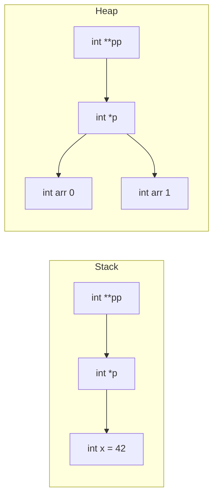

# Pointers in C

## Overview

Pointers are the most powerful and most dangerous feature of C. A pointer is a variable that stores the **memory address** of another variable. Pointers enable:

- Dynamic memory allocation
- Efficient data structures (linked lists, trees, graphs)
- Pass-by-reference semantics
- Direct hardware/memory access
- Function callbacks

Mastering pointers is non-negotiable for C interviews. They are the single most tested topic.

## Pointer Basics

### Declaration and Initialization

```c
#include <stdio.h>

int main() {
    int x = 42;
    int *p = &x;    // p stores the address of x
    
    printf("Value of x: %d\n", x);           // 42
    printf("Address of x: %p\n", (void*)&x); // e.g., 0x7ffd5e8a3b4c
    printf("Value of p: %p\n", (void*)p);     // Same address
    printf("Value pointed to by p: %d\n", *p); // 42 (dereferencing)
    
    // Modifying through pointer
    *p = 100;
    printf("New value of x: %d\n", x);  // 100
    
    return 0;
}
```

### Pointer Syntax Summary

| Expression | Meaning |
|-----------|---------|
| `int *p` | Declare pointer to int |
| `&x` | Address-of operator — get address of x |
| `*p` | Dereference operator — get value at address p |
| `p->member` | Access struct member through pointer (same as `(*p).member`) |

## Pointer Arithmetic

Pointers support arithmetic operations. The size of the increment depends on the data type:

```c
#include <stdio.h>

int main() {
    int arr[] = {10, 20, 30, 40, 50};
    int *p = arr;  // Points to first element
    
    printf("*p = %d\n", *p);         // 10
    printf("*(p+1) = %d\n", *(p+1)); // 20
    printf("*(p+2) = %d\n", *(p+2)); // 30
    
    // Pointer arithmetic: p+1 moves by sizeof(int) bytes
    printf("p   = %p\n", (void*)p);
    printf("p+1 = %p\n", (void*)(p+1));  // 4 bytes further (on most systems)
    
    // Increment/Decrement
    p++;
    printf("*p after p++ = %d\n", *p);  // 20
    
    // Pointer difference
    int *start = &arr[0];
    int *end = &arr[4];
    printf("Distance: %ld\n", end - start);  // 4 (number of elements, not bytes)
    
    return 0;
}
```

### Pointer Arithmetic Rules

| Operation | Meaning | Result Type |
|-----------|---------|-------------|
| `p + n` | Advance n elements | Same pointer type |
| `p - n` | Go back n elements | Same pointer type |
| `p++` | Advance 1 element | Same pointer type |
| `p - q` | Distance between pointers | `ptrdiff_t` (integer) |
| `p < q` | Comparison | `int` (boolean) |

## Arrays and Pointers

Arrays and pointers are closely related but NOT identical:

```c
#include <stdio.h>

void print_array(int *arr, int size) {
    // arr decays to pointer when passed to function
    for (int i = 0; i < size; i++) {
        printf("%d ", arr[i]);  // arr[i] is *(arr + i)
    }
    printf("\n");
}

int main() {
    int arr[] = {1, 2, 3, 4, 5};
    
    // Array name decays to pointer to first element
    int *p = arr;
    
    // These are equivalent:
    printf("arr[0] = %d\n", arr[0]);
    printf("*arr = %d\n", *arr);
    printf("*p = %d\n", *p);
    printf("p[0] = %d\n", p[0]);
    
    // But: sizeof(arr) != sizeof(p)
    printf("sizeof(arr) = %zu\n", sizeof(arr));  // 20 (5 * 4 bytes)
    printf("sizeof(p) = %zu\n", sizeof(p));       // 8 (pointer size)
    
    // Array is NOT a pointer — it decays to one in most contexts
    // sizeof knows the array size, but sizeof doesn't know pointer target size
    
    return 0;
}
```

### Key Differences

| Property | Array | Pointer |
|----------|-------|---------|
| `sizeof` | Total array size | Pointer size (4 or 8 bytes) |
| Assignment | Cannot reassign | Can point to different addresses |
| Storage | Allocates elements | Stores one address |
| `&arr` | Address of array (same value, different type) | — |

## Function Pointers

Function pointers store the address of a function and enable callbacks:

```c
#include <stdio.h>
#include <stdlib.h>

// Function pointer syntax
int add(int a, int b) { return a + b; }
int subtract(int a, int b) { return a - b; }
int multiply(int a, int b) { return a * b; }

// Using function pointer as parameter (callback)
int compute(int a, int b, int (*operation)(int, int)) {
    return operation(a, b);
}

// Typedef for cleaner syntax
typedef int (*MathFunc)(int, int);

int main() {
    // Direct function pointer
    int (*func_ptr)(int, int) = add;
    printf("add(3, 4) = %d\n", func_ptr(3, 4));  // 7
    
    // Array of function pointers
    MathFunc operations[] = {add, subtract, multiply};
    const char *names[] = {"add", "subtract", "multiply"};
    
    for (int i = 0; i < 3; i++) {
        printf("%s(10, 3) = %d\n", names[i], operations[i](10, 3));
    }
    
    // Callback pattern
    int result = compute(5, 3, multiply);
    printf("5 * 3 = %d\n", result);  // 15
    
    // qsort uses function pointers for comparison
    int arr[] = {5, 2, 8, 1, 9};
    // qsort(arr, 5, sizeof(int), compare_func);
    
    return 0;
}
```

### Function Pointer Syntax Cheat Sheet

```c
// Declare
int (*fp)(int, int);

// Assign
fp = &add;    // or just fp = add;

// Call
int result = fp(3, 4);  // or (*fp)(3, 4);

// Typedef
typedef int (*BinaryOp)(int, int);
BinaryOp op = add;
```

## Void Pointers

`void *` is a generic pointer that can point to any data type:

```c
#include <stdio.h>
#include <stdlib.h>
#include <string.h>

// Generic swap function using void pointers
void generic_swap(void *a, void *b, size_t size) {
    void *temp = malloc(size);
    if (temp == NULL) return;
    
    memcpy(temp, a, size);
    memcpy(a, b, size);
    memcpy(b, temp, size);
    
    free(temp);
}

// Generic print function
void print_value(void *ptr, char type) {
    switch (type) {
        case 'i': printf("%d\n", *(int*)ptr); break;
        case 'f': printf("%f\n", *(float*)ptr); break;
        case 'c': printf("%c\n", *(char*)ptr); break;
        case 's': printf("%s\n", *(char**)ptr); break;
    }
}

int main() {
    int x = 10, y = 20;
    printf("Before swap: x=%d, y=%d\n", x, y);
    generic_swap(&x, &y, sizeof(int));
    printf("After swap: x=%d, y=%d\n", x, y);
    
    double a = 3.14, b = 2.71;
    printf("Before swap: a=%.2f, b=%.2f\n", a, b);
    generic_swap(&a, &b, sizeof(double));
    printf("After swap: a=%.2f, b=%.2f\n", a, b);
    
    return 0;
}
```

### Rules for void Pointers

1. **Can be assigned** from any pointer type without casting (in C)
2. **Cannot be dereferenced** directly — must cast first
3. **Cannot do arithmetic** — `void*` has no size
4. **In C++**, must be explicitly cast: `int *p = (int*)void_ptr;`

## Dangling Pointers

A dangling pointer points to memory that has been freed or is no longer valid:

```c
#include <stdio.h>
#include <stdlib.h>

int* create_dangling() {
    int x = 42;
    return &x;  // DANGER: x is destroyed when function returns
}

int* create_safe() {
    int *p = malloc(sizeof(int));
    *p = 42;
    return p;  // OK: heap memory persists
}

int main() {
    // Case 1: Returning address of local variable
    int *p1 = create_dangling();
    printf("Dangling: %d\n", *p1);  // Undefined behavior!
    
    // Case 2: Using after free
    int *p2 = malloc(sizeof(int));
    *p2 = 100;
    free(p2);
    printf("Use after free: %d\n", *p2);  // Undefined behavior!
    
    // Case 3: Overwriting pointer
    int *p3 = malloc(sizeof(int));
    *p3 = 200;
    p3 = NULL;  // Original memory leaked, p3 is now NULL (not dangling)
    
    // FIX: Always set to NULL after freeing
    int *p4 = malloc(sizeof(int));
    free(p4);
    p4 = NULL;  // Now safe — dereferencing NULL will crash obviously
    
    return 0;
}
```

### Types of Dangling Pointers

| Cause | Example | Fix |
|-------|---------|-----|
| Free then use | `free(p); *p = 5;` | Set `p = NULL` after free |
| Return local address | `int x; return &x;` | Return heap-allocated memory or use static |
| Out of scope | Block-scoped variable | Don't reference after block ends |
| Reallocation | `p = realloc(p, size);` if fails | Use temp pointer |

## Null Pointers

A null pointer doesn't point to any valid memory:

```c
#include <stdio.h>
#include <stdlib.h>

int main() {
    int *p = NULL;  // Null pointer
    
    // Dereferencing NULL is undefined behavior (usually segfault)
    // printf("%d\n", *p);  // CRASH
    
    // Always check before dereferencing
    if (p != NULL) {
        printf("%d\n", *p);
    } else {
        printf("Pointer is NULL\n");
    }
    
    // malloc returns NULL on failure
    int *arr = malloc(1000000000 * sizeof(int));
    if (arr == NULL) {
        printf("Allocation failed!\n");
        return -1;
    }
    
    free(arr);
    return 0;
}
```

### NULL vs Uninitialized Pointer

```c
int *p1;           // Uninitialized — points to random address (DANGEROUS)
int *p2 = NULL;    // Null pointer — explicitly points to nothing (SAFE to check)
int *p3 = 0;       // Same as NULL
```

## Pointer to Pointer (Double Pointer)

A pointer that stores the address of another pointer:

```c
#include <stdio.h>
#include <stdlib.h>
#include <string.h>

// Modifying a pointer through a double pointer
void allocate_string(char **str, const char *value) {
    *str = malloc(strlen(value) + 1);
    if (*str != NULL) {
        strcpy(*str, value);
    }
}

// 2D array using double pointer
int** create_2d_array(int rows, int cols) {
    int **arr = malloc(rows * sizeof(int*));
    for (int i = 0; i < rows; i++) {
        arr[i] = malloc(cols * sizeof(int));
    }
    return arr;
}

void free_2d_array(int **arr, int rows) {
    for (int i = 0; i < rows; i++) {
        free(arr[i]);
    }
    free(arr);
}

int main() {
    // Double pointer example
    char *str = NULL;
    allocate_string(&str, "Hello, World!");
    printf("%s\n", str);  // "Hello, World!"
    free(str);
    
    // 2D array example
    int **matrix = create_2d_array(3, 4);
    for (int i = 0; i < 3; i++) {
        for (int j = 0; j < 4; j++) {
            matrix[i][j] = i * 4 + j;
        }
    }
    
    printf("matrix[1][2] = %d\n", matrix[1][2]);  // 6
    free_2d_array(matrix, 3);
    
    return 0;
}
```

### Double Pointer Diagram



## Restrict Pointers (C99)

The `restrict` keyword tells the compiler that a pointer is the only way to access the memory it points to:

```c
#include <string.h>

// Without restrict — compiler must assume overlap is possible
void copy(int *dst, const int *src, size_t n) {
    for (size_t i = 0; i < n; i++) {
        dst[i] = src[i];
    }
}

// With restrict — compiler can optimize more aggressively
void copy_restrict(int *restrict dst, const int *restrict src, size_t n) {
    for (size_t i = 0; i < n; i++) {
        dst[i] = src[i];
    }
}
// memcpy uses restrict; memmove does not (handles overlap)
```

## Common Pointer Patterns

### Linked List Node

```c
typedef struct Node {
    int data;
    struct Node *next;
} Node;

Node* create_node(int data) {
    Node *node = malloc(sizeof(Node));
    if (node == NULL) return NULL;
    node->data = data;
    node->next = NULL;
    return node;
}

void push_front(Node **head, int data) {
    Node *new_node = create_node(data);
    if (new_node == NULL) return;
    new_node->next = *head;
    *head = new_node;
}
```

### Opaque Pointers (Information Hiding)

```c
// header.h
typedef struct Database Database;  // Forward declaration, no details
Database* db_create(const char *path);
void db_destroy(Database *db);
int db_query(Database *db, const char *sql);

// implementation.c
struct Database {
    FILE *file;
    char *path;
    int is_open;
};

Database* db_create(const char *path) {
    Database *db = malloc(sizeof(Database));
    // ... implementation hidden from user
    return db;
}
```

## Common Mistakes

| Mistake | Example | Fix |
|---------|---------|-----|
| Dereferencing NULL | `*NULL` | Always check for NULL first |
| Dangling pointer | `free(p); *p = 5;` | Set `p = NULL` after free |
| Pointer arithmetic on wrong type | `char *p; p += 4;` moves 4 bytes, not 4 ints | Be aware of type size |
| Forgetting to allocate | `char *s; strcpy(s, "hello");` | Allocate first: `s = malloc(...)` |
| Memory leak | `p = malloc(...); p = other;` | Free before reassigning |
| Array vs pointer confusion | `sizeof(arr)` vs `sizeof(ptr)` | Arrays decay to pointers in expressions |

## Interview Questions

1. **What is the difference between `int *p` and `int **p`?**
   - `int *p` is a pointer to int. `int **p` is a pointer to a pointer to int.

2. **What happens when you increment a `void *` pointer?**
   - It's undefined behavior in C. `void` has no size, so the compiler doesn't know how far to advance.

3. **Explain `const int *p` vs `int * const p` vs `const int * const p`.**
   - `const int *p`: pointer to constant int (can't modify `*p`)
   - `int * const p`: constant pointer to int (can't modify `p`)
   - `const int * const p`: constant pointer to constant int

4. **What is a function pointer and when would you use it?**
   - A variable that stores a function's address. Used for callbacks, strategy pattern, event handlers.

5. **Why is `void *` useful?**
   - Enables generic programming. `malloc` returns `void *`. Used in callbacks that need to work with any type.

## Related Topics

- [Memory Management](./memory-management.md) — How pointers interact with heap allocation
- [Undefined Behavior](./undefined-behavior.md) — Pointer-related UB
- [Data Structures](./interview-questions.md) — Implementing linked lists, trees with pointers
- [POSIX](./posix.md) — System calls that use pointers
